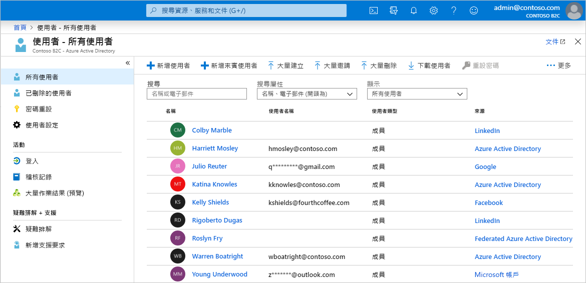
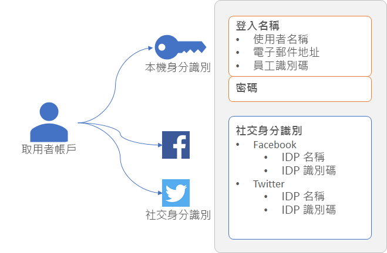
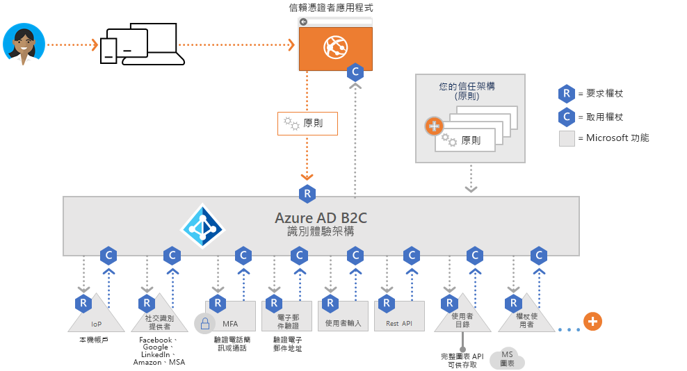
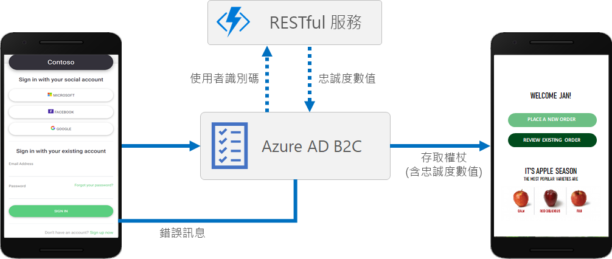
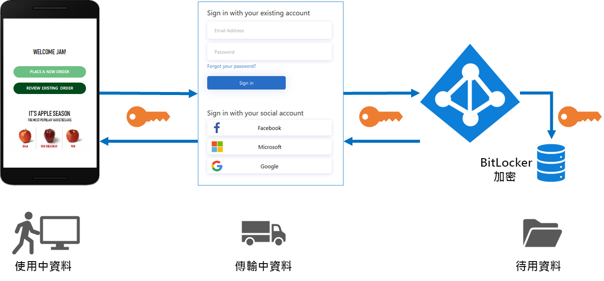
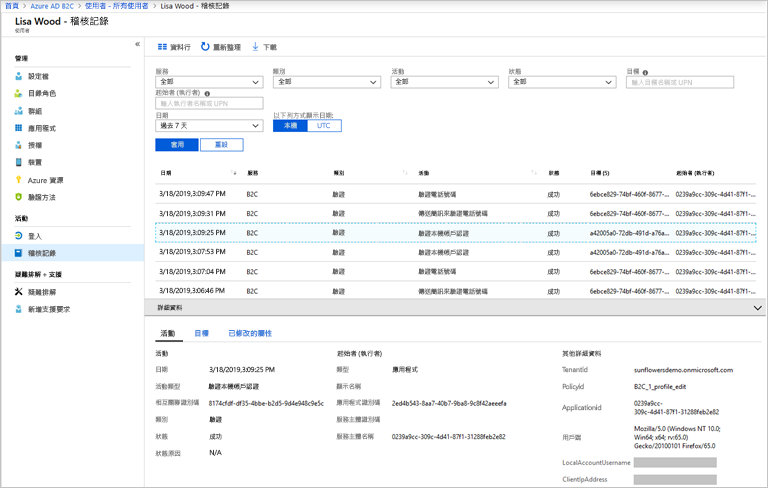

# Azure Active Directory B2C 的技術和功能概觀

本文與[關於 Azure Active Directory B2C](overview.md) 搭配，可提供更深入的服務介紹。 這裡會討論您在服務中使用的主要資源、其功能，以及這些項目如何讓您在應用程式中為客戶提供完整的自訂身分識別體驗。

## Azure AD B2C 租用戶

在 Azure Active Directory B2C (Azure AD B2C) 中，「租用戶」  代表您的組織，而實際上是一個使用者目錄。 每個 Azure AD B2C 租用戶都不相同，並與其他 Azure AD B2C 租用戶分開。 Azure AD B2C 租用戶與 Azure Active Directory 租用戶不同 (您可能已有後者)。

您在 Azure AD B2C 租用戶中使用的主要資源包括：

* **目錄** -「目錄」  是 Azure AD B2C 儲存使用者認證和設定檔資料，以及您的應用程式註冊的位置。
* **應用程式註冊** - 您向 Azure AD B2C 註冊 Web、行動和原生應用程式，以啟用身分識別管理。 還有，您想要使用 Azure AD B2C 保護的任何 API。
* **使用者流程**和**自訂原則**- 您應用程式的內建 (使用者流程) 並可完全自訂 (自訂原則) 的身分識別體驗。
  * 使用「使用者流程」  來快速設定和啟用常見身分識別工作，例如註冊、登入和設定檔編輯。
  * 使用「自訂原則」  來啟用使用者體驗，不僅適於常見身分識別工作，還能為貴組織、客戶、員工、合作夥伴和公民獨有的複雜身分識別工作流程提供特別支援。
* **身分識別提供者** - 同盟設定適用於：
  * 您想要在應用程式中支援的「社交」  識別提供者，例如 Facebook、LinkedIn 或 Twitter。
  * 可支援標準身分識別通訊協定的「外部」  識別提供者，例如 OAuth 2.0、OpenID Connect 等等。
  * 可讓使用者以使用者名稱 (或電子郵件地址或其他識別碼) 和密碼進行註冊和登入的「本機」  帳戶。
* **金鑰** - 新增及管理用於簽署和驗證權杖的加密金鑰。

Azure AD B2C 租用戶是開始使用 Azure AD B2C 所需建立的第一個資源。 了解方法，請參閱[教學課程：建立 Azure Active Directory B2C 租用戶](tutorial-create-tenant.md)。

## Azure AD B2C 中的帳戶

Azure AD B2C 定義數種類型的使用者帳戶。 Azure Active Directory、Azure Active Directory B2B 和 Azure Active Directory B2C 會共用這些帳戶類型。

* **公司帳戶** - 具有公司帳戶的使用者可管理租用戶中的資源，而具有系統管理員角色的使用者也可管理租用戶。 具有工作帳戶的使用者可以建立新的取用者帳戶、重設密碼、封鎖/解除封鎖帳戶，以及設定權限或將帳戶指派給安全性群組。
* **來賓帳戶**- 您邀請以來賓身分使用租用戶的外部使用者。 將來賓使用者邀請到 Azure AD B2C 租用戶的典型案例是為了分擔管理責任。
* **取用者帳戶** - 取用者帳戶是當使用者在您於租用戶中註冊的應用程式中完成註冊使用者旅程圖時，在 Azure AD B2C 目錄中建立的帳戶。

 *圖：Azure 入口網站中 Azure AD B2C 租用戶內的使用者目錄*

### 取用者帳戶

使用「取用者」  帳戶，使用者可以登入您使用 Azure AD B2C 保護的應用程式。 不過，具有取用者帳戶的使用者無法存取 Azure 資源，例如 Azure 入口網站。

取用者帳戶可與下列身分識別類型產生關聯：

* **本機**身分識別，其使用者名稱和密碼儲存在本機的 Azure AD B2C 目錄中。 我們通常會將這些身分識別稱為「本機帳戶」。
* **社交**或**企業**身分識別，其中使用者的身分識別是由 Facebook、Microsoft、ADFS 或 Salesforce 等同盟識別提供者所管理。

具有取用者帳戶的使用者可使用多種身分識別進行登入，例如使用者名稱、電子郵件、員工識別碼、政府識別碼等等。 單一帳戶可以有多個身分識別，包括本機和社交。

 *圖：Azure AD B2C 中具有多個身分識別的單一取用者帳戶*

Azure AD B2C 可讓您管理取用者帳戶設定檔的一般屬性，例如顯示名稱、姓氏、名字、城市等等。 您也可以擴充 Azure AD 結構描述，以儲存使用者的其他資訊。 例如，其國家或住處、慣用語言和喜好設定，像是是否想要訂閱電子報或啟用多重要素驗證。

在 [Azure Active Directory B2C 中的使用者帳戶概觀](user-overview.md)中深入了解 Azure AD B2C 中的使用者帳戶類型。

## 外部識別提供者

您可以設定 Azure AD B2C，允許使用者使用來自外部社交或企業識別提供者 (IdP) 的認證來登入您的應用程式。 Azure AD B2C 支援外部識別提供者，例如 Facebook、Microsoft 帳戶、Google、Twitter，以及任何支援 OAuth 1.0、OAuth 2.0、OpenID Connect、SAML 或 WS-同盟通訊協定的識別提供者。

透過外部識別提供者同盟，您可讓取用者能夠使用其現有的社交或企業帳戶登入，而不需為您的應用程式建立新的帳戶。

在註冊或登入頁面上，Azure AD B2C 會顯示使用者可選擇用於登入的外部識別提供者清單。 一旦選取其中一個外部識別提供者，系統就會將他們重新導向到所選提供者的網站，以完成登入程序。 使用者成功登入之後，便會回到 Azure AD B2C，以在您的應用程式中驗證帳戶。

若要了解如何在 Azure AD B2C 中新增識別提供者，請參閱[教學課程：在 Azure Active Directory B2C 中將識別提供者新增至您的應用程式](tutorial-add-identity-providers.md)。

## 身分識別體驗：使用者流程或自訂原則

Azure AD B2C 的可延伸原則架構是其核心優點。 原則可描述使用者的身分識別體驗，例如註冊、登入或設定檔編輯。

在 Azure AD B2C 中，您可採用兩個主要途徑來提供這些身分識別體驗：使用者流程和自訂原則。

* **使用者流程**是預先定義的內建、可設定原則，可讓您在短短幾分鐘內建立註冊、登入和原則編輯體驗。

* **自訂原則**可讓您建立自己的使用者旅程圖，以進行複雜的身分識別體驗案例。

使用者流程和自訂原則都是由 Identity Experience Framework  支援，這是 Azure AD B2C 的原則協調流程引擎。

### 使用者流程

為了協助您快速設定最常見的身分識別工作，Azure 入口網站包含數個預先定義且可設定的原則，稱之為「使用者流程」  。

您可以設定如下所示的使用者流程設定，以控制應用程式中的身分識別體驗行為：

* 用於登入的帳戶類型，例如 Facebook 之類的社交帳戶，或使用電子郵件地址和密碼進行登入的本機帳戶
* 要向取用者收集的屬性，例如名字、郵遞區號或所在國家/地區
* Azure Multi-Factor Authentication (MFA)
* 使用者介面的自訂
* 在使用者完成使用者流程之後，您的應用程式所收到權杖中的一組宣告
* 工作階段管理
* 等等。

大部分的行動、Web 和單頁應用程式最常見的身分識別案例，都可以透過使用者流程有效地定義和實作。 建議您使用內建的使用者流程，除非您有需要完整自訂原則彈性的複雜使用者旅程圖案例。

在 [Azure Active Directory B2C 中的使用者流程](user-flow-overview.md)中深入了解使用者流程。

### 自訂原則

自訂原則可將 Identity Experience Framework (IEF) 協調流程引擎的完整功能存取解除鎖定。 透過自訂原則，您可以利用 IEF 建立幾乎任何您可想像的驗證、使用者註冊或設定檔編輯體驗。

Identity Experience Framework 可讓您利用任何步驟組合來建立使用者旅程圖。 例如：

* 與其他識別提供者同盟
* 第一方和第三方多重要素驗證 (MFA) 挑戰
* 收集任何使用者輸入
* 使用 REST API 通訊與外部系統整合

每個這類使用者旅程圖都是由原則所定義，而您可建立所需數量的原則，為您的組織提供最佳使用者體驗。

自訂原則是由數個 XML 檔案所定義，各檔案在階層鏈中彼此參考。 XML 元素會定義宣告結構描述、宣告轉換、內容定義、宣告提供者、技術設定檔、使用者旅程圖協調流程步驟，以及身分識別體驗的其他層面。

當您需要建立複雜的身分識別案例時，自訂原則的強大彈性最合適。 設定自訂原則的開發人員必須仔細定義信任關係，以包含中繼資料端點、精確的宣告交換定義，並設定每個識別提供者所需的祕密、金鑰和憑證。

在 [Azure Active Directory B2C 中的自訂原則](custom-policy-overview.md)中深入了解自訂原則。

## 通訊協定和權杖

Azure AD B2C 支援在使用者旅程圖中使用 [OpenID Connect 和 OAuth 2.0 通訊協定](protocols-overview.md)。 在 Azure AD B2C 的 OpenID Connect 實作中，您的應用程式會向 Azure AD B2C 發出驗證要求，以起始使用者旅程圖。

提出 Azure AD B2C 的要求後會產生安全性權杖，例如[識別碼權杖或存取權杖](tokens-overview.md)。 此安全性權杖會定義使用者的身分識別。 權杖接收自 Azure AD B2C 端點，像是 `/token` 或 `/authorize` 端點。 利用這些權杖，您可以存取可用來驗證身分識別和允許存取安全資源的宣告。

針對外部身分識別，Azure AD B2C 支援與任何 OAuth 1.0、OAuth 2.0、OpenID Connect、SAML 和 WS-同盟識別提供者同盟。

上圖顯示 Azure AD B2C 如何使用相同驗證流程內的各種不同通訊協定來進行通訊：

1. 信賴憑證者應用程式會使用 OpenID Connect 起始對 Azure AD B2C 的授權要求。
1. 當應用程式的使用者選擇使用採用 SAML 通訊協定的外部識別提供者登入時，Azure AD B2C 會叫用 SAML 通訊協定來與該識別提供者進行通訊。
1. 使用者完成使用外部識別提供者的登入作業之後，Azure AD B2C 會接著使用 OpenID Connect 將權杖傳回給信賴憑證者應用程式。

## 應用程式整合

當使用者想要登入您的應用程式時，無論是 Web、行動、傳統型或單頁應用程式 (SPA)，應用程式都會對使用者流程或自訂原則提供的端點起始授權要求。 使用者流程或自訂原則會定義和控制使用者的體驗。 當他們完成使用者流程 (例如「註冊或登入」  流程) 時，Azure AD B2C 會產生權杖，然後將使用者重新導向回您的應用程式。

多個應用程式可使用相同的使用者流程或自訂原則。 單一應用程式可使用多個使用者流程或自訂原則。

例如，若要登入應用程式，應用程式會使用「註冊或登入」  使用者流程。 使用者登入之後，他們可以編輯其設定檔，因此應用程式會起始另一個授權要求，這次使用「設定檔編輯」  使用者流程。

## 流暢的使用者體驗

在 Azure AD B2C 中，您可以製作使用者的身分識別體驗，讓他們所看見的頁面與您品牌的外觀和操作方式緊密結合。 當使用者繼續進行應用程式的身分識別旅程時，您幾乎可完全掌控向使用者呈現的 HTML 和 CSS 內容。 利用此彈性，您可以維護應用程式與 Azure AD B2C 之間的品牌和視覺一致性。

如需 UI 自訂相關資訊，請參閱[關於 Azure Active Directory B2C 中的使用者介面自訂](customize-ui-overview.md)。

## 當地語系化

Azure AD B2C 中的語言自訂可讓您適應不同的語言，以符合您客戶的需求。 Microsoft 提供 36 種語言的翻譯，但您也可以針對任何語言提供自己的的翻譯。 即使您的體驗僅提供單一語言，您也可以自訂頁面上的任何文字。

若要了解當地語系化的運作方式，請參閱 [Azure Active Directory B2C 中的語言自訂](user-flow-language-customization.md)。

## 新增您自己的商務邏輯

如果您選擇使用自訂原則，可以在使用者旅程圖中與 RESTful API 整合，將您自己的商務邏輯新增至旅程圖。 例如，Azure AD B2C 可與 RESTful 服務交換資料，以進行下列動作：

* 顯示自訂的使用者易記錯誤訊息。
* 驗證使用者輸入，防止將格式不正確的資料保存在您的使用者目錄中。 例如，您可以修改使用者所輸入的資料，例如，如果他們以全小寫輸入其名字，則將其名字變成大寫。
* 進一步與貴公司的特定商務應用程式整合，讓使用者資料更豐富。
* 利用 RESTful 呼叫，您可以傳送推播通知、更新公司資料庫、執行使用者移轉程序、管理權限、稽核資料庫等等。

忠誠度方案是 Azure AD B2C 支援呼叫 REST API 而啟用的另一個案例。 例如，您的 RESTful 服務可以接收使用者的電子郵件地址、查詢客戶資料庫，然後將使用者的忠誠度號碼傳回給 Azure AD B2C。 傳回的資料可以存放在 Azure AD B2C 中使用者的目錄帳戶中，然後在原則的後續步驟中進一步評估，或包含在存取權杖中。

您可以在自訂原則所定義的使用者旅程圖中，於任何步驟新增 REST API 呼叫。 例如，您可以呼叫 REST API：

* 在登入期間，就在 Azure AD B2C 驗證認證之前
* 緊接在登入之後
* Azure AD B2C 在目錄中建立新帳戶之前
* Azure AD B2C 在目錄中建立新帳戶之後
* Azure AD B2C 發出存取權杖之前

若要瞭解如何在 Azure AD B2C 中使用自訂原則來整合 RESTful API，請參閱[在 Azure AD B2C 使用者旅程圖中整合 REST API 宣告交換](rest-api-claims-exchange-dotnet.md)。

## 保護客戶身分識別

Azure AD B2C 符合 [Microsoft Azure 信任中心](https://www.microsoft.com/trustcenter/cloudservices/azure)中所述的安全性、隱私權和其他承諾。

工作階段會模型化為加密的資料，其解密金鑰只有 Azure AD B2C 安全性權杖服務才知道。 使用強式加密演算法 (AES-192)。 所有通訊路徑都會使用 TLS 來保護，以提供機密性和完整性。 我們的安全性權杖服務會使用 TLS 的擴充功能驗證 (EV) 憑證。 一般來說，安全性權杖服務不會藉由轉譯不受信任的輸入，減輕跨網站指令碼 (XSS) 攻擊。

### 存取使用者資料

Azure AD B2C 租用戶會與用於員工和合作夥伴的企業 Azure Active Directory 租用戶共用許多特性。 共用層面包括可用於檢視系統管理角色、指派角色和稽核活動的機制。

您可以指派角色來控制誰可以在 Azure AD B2C 中執行特定系統管理動作，包括：

* 建立及管理使用者流程的所有層面
* 建立及管理所有使用者流程可用的屬性結構描述
* 設定要用於直接同盟的識別提供者
* 在 Identity Experience Framework 中建立和管理信任架構原則 (自訂原則)
* 在 Identity Experience Framework 中管理用於同盟和加密的密碼 (自訂原則)

如需 Azure AD 角色 (包括 Azure AD B2C 系統管理角色支援) 的詳細資訊，請參閱 [Azure Active Directory 中的管理員角色權限](../active-directory/users-groups-roles/directory-assign-admin-roles.md)。

### 多重要素驗證 (MFA)

Azure AD B2C 多重要素驗證 (MFA) 有助於保護對資料與應用程式的存取，同時讓使用者能夠方便使用。 它藉由要求第二種形式的驗證來提供額外的安全性，並藉由提供一系列易於使用的驗證方法來提供強式驗證。 因您可以管理員身分所做的設定決定不同，使用者不一定會通過 MFA。

請參閱[在 Azure Active Directory B2C 中啟用多重要素驗證](custom-policy-multi-factor-authentication.md)，了解如何在使用者流程中啟用 MFA。

### 智慧帳戶鎖定

為了避免暴力密碼破解猜測嘗試，Azure AD B2C 根據要求的 IP、輸入的密碼及其他幾個因素，使用複雜的策略來鎖定帳戶。 鎖定的持續時間會根據風險和嘗試次數自動增加。

如需管理密碼保護設定的詳細資訊，請參閱[管理對 Azure Active Directory B2C 中的資源與資料的威脅](threat-management.md)。

### 密碼複雜度

在註冊期間或密碼重設期間，使用者必須提供符合複雜度規則的密碼。 根據預設，Azure AD B2C 會強制執行強式密碼原則。 Azure AD B2C 也會提供設定選項，以便指定客戶所用密碼的複雜度需求。

您可以在[使用者流程](user-flow-password-complexity.md)和[自訂原則](custom-policy-password-complexity.md)中設定密碼複雜度需求。

## 稽核和記錄

Azure AD B2C 會發出稽核記錄，其中包含有關其資源、發行的權杖和系統管理員存取的活動資訊。 您可以使用這些稽核記錄來了解平台活動和診斷問題。 在產生事件的活動發生之後，很快就可取得稽核記錄項目。

在可供您的 Azure AD B2C 租用戶或特定使用者使用的稽核記錄中，您可以找到下列資訊：

* 有關授權使用者存取 B2C 資源的活動 (例如，系統管理員存取 B2C 原則清單)
* 當系統管理員使用 Azure 入口網站登入時，所擷取目錄屬性的相關活動
* B2C 應用程式上的建立、讀取、更新和刪除 (CRUD) 作業
* B2C 金鑰容器所儲存金鑰上的 CRUD 作業
* B2C 資源 (例如，原則和身分識別提供者) 上的 CRUD 作業
* 使用者認證和權杖發行的驗證

如需稽核記錄的其他詳細資訊，請參閱[存取 Azure AD B2C 稽核記錄](view-audit-logs.md)。

### 使用見解

Azure AD B2C 可讓您探索人員何時註冊或登入您的 Web 應用程式，使用者的所在位置，以及他們使用何種瀏覽器與作業系統。 藉由使用自訂原則將 Azure Application Insights 整合到 Azure AD B2C，您可深入了解人員如何註冊、登入、重設其密碼，或編輯其設定檔。 您可以透過了解這些來制定近期開發週期的資料導向決策。

在[使用 Application Insights 在 Azure Active Directory B2C 中追蹤使用者行為](analytics-with-application-insights.md)中深入了解使用情況分析。

## 後續步驟

您現在已深入了解 Azure Active Directory B2C 的功能和技術層面，請建立 B2C 租使用者以開始使用服務：

> [!div class="nextstepaction"]
> [教學課程：建立 Azure Active Directory B2C 租用戶 >](tutorial-create-tenant.md)