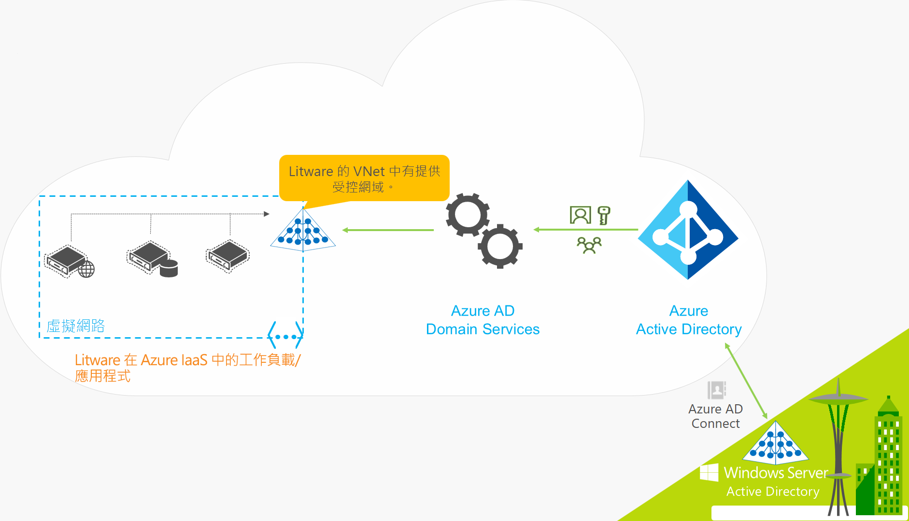

# Azure Active Directory Domain Services 的常見使用案例和案例

Azure Active Directory Domain Services (Azure AD DS) 提供受控網域服務，例如，網域加入、群組原則、輕量型目錄存取通訊協定 (LDAP) 與 Kerberos / NTLM 驗證。 Azure AD DS 與您現有的 Azure AD 租用戶整合，讓使用者能夠使用其現有認證登入。 您可以使用這些網域服務，而不需要在雲端中部署、管理和修補網域控制站，以提供將內部部署資源更順暢的隨即轉移至 Azure。

本文概述 Azure AD DS 提供價值並符合這些需求的一些常見商務案例。

## 在雲端提供身分識別解決方案的常見方式

當您將現有的工作負載移轉至雲端時，目錄感知應用程式可能會將 LDAP 用於內部部署 AD DS 目錄的讀取或寫入存取權。 在 Windows Server 上執行的應用程式通常都會部署在已加入網域的虛擬機器 (VM) 上，因此只要使用群組原則就能安全地加以管理。 若要驗證終端使用者，應用程式也可以依賴 Windows 整合式驗證，例如 Kerberos 或 NTLM 驗證。

IT 系統管理員通常會使用下列其中一個解決方案，將識別服務提供給在 Azure 中執行的應用程式：

* 在於 Azure 中和內部部署 AD DS 環境中執行的工作負載之間設定站對站 VPN 連線。
    * 然後內部部署網域控制站會透過 VPN 連線提供驗證。
* 使用 Azure 虛擬機器 (VM) 建立複本網域控制站，從內部部署環境延伸 AD DS 網域 / 樹系。
    * 在 Azure VM 上執行的網域控制站會提供驗證，並複寫內部部署 AD DS 環境之間的目錄資訊。
* 使用在 Azure VM 上執行的網域控制站，在 Azure 中部署獨立 AD DS 環境。
    * 在 Azure VM 上執行的網域控制站會提供驗證，但不會從內部部署 AD DS 環境複寫任何目錄資訊。

使用這些方法，連線到內部部署目錄的 VPN 連線，會讓應用程式容易受暫時性網路問題或中斷影響。 如果您在 Azure 中使用 VM 部署網域控制站，則 IT 小組必須管理 VM，然後保護、修補、監視及備份網域控制站，以及對其進行疑難排解。

Azure AD DS 提供的替代方案適用於建立連線回內部部署 AD DS 環境的 VPN 連線，或在 Azure 中執行及管理 VM 以提供識別服務的需求。 因為 Azure AD DS 是受控服務，所以可降低為混合式和僅限雲端環境建立整合式身分識別解決方案的複雜性。

> [!div class="nextstepaction"]
> [比較 Azure AD DS 與 Azure VM 或內部部署上的 Azure AD 和自我管理 AD DS][compare]

## 混合式組織的 Azure AD DS

許多組織都執行包含雲端與內部部署應用程式工作負載的混合式基礎結構。 隸屬於隨即轉移策略且移轉至 Azure 的繼承應用程式，可使用傳統 LDAP 連線來提供身分識別資訊。 為了支援此混合式基礎結構，來自內部部署 AD DS 環境的身分識別資訊可同步至 Azure AD 租用戶。 Azure AD DS 接著可以使用身分識別來源在 Azure 中提供這些繼承應用程式，而不需要設定及管理對內部部署目錄服務的應用程式連線能力。

讓我們看看 Litware Corporation 的範例，此混合式組織執行內部部署與 Azure 資源：

* 需要網域服務的應用程式與伺服器工作負載會部署在 Azure 中的虛擬網路中。
    * 這可能包含作為隨即轉移策略一部分移轉至 Azure 的繼承應用程式。
* 為了從其內部部署目錄同步身分識別資訊到其 Azure AD 租用戶，Litware Corporation 部署了 [Azure AD Connect][azure-ad-connect]。
    * 同步的身分識別資訊包括使用者帳戶與群組成員資格。
* Litware 的 IT 小組為在此 (或對等的) 虛擬網路中的 Azure AD 租用戶啟用 Azure AD DS。
* 部署在 Azure 虛擬網路中的應用程式與 VM 之後可以使用網域加入、LDAP 讀取、LDAP 繫結、NTLM 與 Kerberos 驗證，以及群組原則等 Azure AD DS 功能。

> [!IMPORTANT]
> Azure AD Connect 應該只會為了與內部部署 AD DS 環境同步處理而安裝和設定。 不支援在此受控網域中安裝 Azure AD Connect，以將物件同步處理回 Azure AD。

## 僅限雲端的組織的 Azure AD DS

僅限雲端的 Azure AD 租用戶沒有內部部署身分識別來源。 例如，使用者帳戶與群組成員資格都可直接在 Azure AD 中建立和管理。

現在，讓我們看 Contoso 的範例，此僅限雲端的組織會使用 Azure AD 來進行身分識別驗證。 所有使用者身分識別、其認證與群組成員資格都是在 Azure AD 中建立及管理的。 不需要進行任何額外的 Azure AD Connect 設定，就能從內部部署目錄同步任何身分識別資訊。

* 需要網域服務的應用程式與伺服器工作負載會部署在 Azure 中的虛擬網路中。
* Contoso 的 IT 小組為在此 (或對等的) 虛擬網路中的 Azure AD 租用戶啟用 Azure AD DS。
* 部署在 Azure 虛擬網路中的應用程式與 VM 之後可以使用網域加入、LDAP 讀取、LDAP 繫結、NTLM 與 Kerberos 驗證，以及群組原則等 Azure AD DS 功能。

## Azure 虛擬機器的安全管理

為了讓您使用一組 AD 認證， (Vm) 的 Azure 虛擬機器可聯結至 Azure AD DS 受控網域。 這種方法可減少認證管理問題，例如維護每個 VM 上的本機系統管理員帳戶，或在環境之間個別的帳戶和密碼。

也可以使用群組原則來管理和保護已加入受控網域的 Vm。 必要的安全性基準可以套用至 Vm，以根據公司的安全性指導方針將其鎖定。 例如，您可以使用群組原則管理功能來限制可在 VM 上啟動的應用程式類型。

讓我們看看一個常見的範例案例。 當伺服器和其他基礎結構達到生命週期結束時，Contoso 想要將目前裝載于內部部署的應用程式移至雲端。 其目前的 IT 標準規定，裝載公司應用程式的伺服器必須已加入網域，並使用群組原則進行管理。

Contoso 的 IT 系統管理員想要在 Azure 中部署加入網域的 Vm，讓系統管理更容易，因為使用者可以使用其公司認證登入。 加入網域時，也可以使用群組原則物件 (Gpo) ，將 Vm 設定為符合必要的安全性基準。 Contoso 不想要在 Azure 中部署、監視及管理自己的網域控制站。

Azure AD DS 非常適合此使用案例。 受控網域可讓您將 Vm 加入網域、使用一組認證，以及套用群組原則。 由於它是一個受控網域，因此您不必自行設定及維護網域控制站。

### 部署注意事項

下列部署考慮適用于此範例使用案例：

* 受控網域預設會使用單一的平面組織單位 (OU) 結構。 所有已加入網域的 Vm 都在單一 OU 中。 如有需要，您可以建立 [自訂 ou][custom-ou]。
* Azure AD DS 會使用每個使用者和電腦容器的內建 GPO。 若要進行其他控制，您可以 [建立自訂 gpo][create-gpo] ，並將其目標設為自訂 ou。
* Azure AD DS 支援基礎 AD 電腦物件架構。 您無法擴充電腦物件的架構。

## 使用 LDAP bind 驗證的隨即轉移內部部署應用程式

作為範例案例，Contoso 有許多年前從 ISV 購買的內部部署應用程式。 ISV 的應用程式目前處於維護模式，而要求應用程式的變更成本相當高。 此應用程式的 web 架構前端會使用 web 表單來收集使用者認證，然後藉由對內部部署 AD DS 環境執行 LDAP 系結來驗證使用者。

Contoso 想要將此應用程式遷移至 Azure。 應用程式應該可以繼續正常運作，而不需要進行任何變更。 此外，使用者應該能夠使用其現有的公司認證進行驗證，而不需要進行其他訓練。 對執行應用程式的使用者而言，它應該是透明的。

在此案例中，Azure AD DS 可讓應用程式在驗證過程中執行 LDAP 系結。 舊版內部部署應用程式可以隨即轉移至 Azure，並繼續順暢地驗證使用者，而不會變更設定或使用者體驗。

### 部署注意事項

下列部署考慮適用于此範例使用案例：

* 請確定應用程式不需要修改/寫入目錄。 不支援受控網域的 LDAP 寫入存取權。
* 您無法直接變更受控網域的密碼。 終端使用者可以使用 [Azure AD 的自助式密碼變更機制][sspr] 或針對內部部署目錄來變更其密碼。 這些變更接著會自動同步處理，並可在受控網域中使用。

## 隨即轉移使用 LDAP 讀取來存取目錄的內部部署應用程式

如同先前的範例案例，讓我們假設 Contoso 有一種內部部署企業營運 (LOB) 應用程式，其開發時間幾乎是十年前。 此應用程式為目錄感知，其設計目的是要使用 LDAP 從 AD DS 讀取有關使用者的資訊/屬性。 應用程式不會修改屬性，或以其他方式寫入目錄。

Contoso 想要將此應用程式遷移至 Azure，並淘汰目前裝載此應用程式的過時內部部署硬體。 應用程式無法重寫為使用新式目錄 Api，例如 REST 型 Microsoft Graph API。 您可以使用隨即轉移選項，將應用程式遷移至雲端執行，而不需修改程式碼或重寫應用程式。

為協助進行此案例，Azure AD DS 可讓應用程式對受控網域執行 LDAP 讀取，以取得所需的屬性資訊。 應用程式不需要重寫，因此隨即轉移至 Azure 可讓使用者繼續使用應用程式，而不會發現其執行所在的位置有變更。

### 部署注意事項

下列部署考慮適用于此範例使用案例：

* 請確定應用程式不需要修改/寫入目錄。 不支援受控網域的 LDAP 寫入存取權。
* 請確定應用程式不需要自訂/擴充的 Active Directory 架構。 Azure AD DS 不支援架構延伸。

## 將內部部署服務或 daemon 應用程式遷移至 Azure

某些應用程式包含多層，其中一個層級需要對後端層執行已驗證的呼叫，例如資料庫。 AD 服務帳戶通常用於這些案例中。 當您將應用程式隨即轉移到 Azure 時，Azure AD DS 可讓您以相同的方式繼續使用服務帳戶。 您可以選擇使用從內部部署目錄同步處理的相同服務帳戶來 Azure AD 或建立自訂 OU，然後在該 OU 中建立個別的服務帳戶。 使用任一種方法，應用程式會繼續以相同方式運作，以對其他層和服務進行已驗證的呼叫。

在此範例案例中，Contoso 有一個自訂的軟體保存庫應用程式，其中包含 web 前端、SQL server 和後端 FTP 伺服器。 使用服務帳戶的 Windows 整合式驗證會驗證 FTP 伺服器的 web 前端。 並設定 Web 前端以服務帳戶的身分執行。 後端伺服器則設定為從服務帳戶授權對 Web 前端的存取權。 Contoso 不想要在雲端中部署及管理自己的網域控制站 Vm，以將此應用程式移至 Azure。

在此案例中，裝載 web 前端、SQL server 和 FTP 伺服器的伺服器可遷移至 Azure Vm，並加入受控網域。 然後，Vm 可在其內部部署目錄中使用相同的服務帳戶，以進行應用程式的驗證，並使用 Azure AD Connect 透過 Azure AD 同步處理。

### 部署注意事項

下列部署考慮適用于此範例使用案例：

* 請確定應用程式使用使用者名稱和密碼進行驗證。 Azure AD DS 不支援憑證或以智慧卡為基礎的驗證。
* 您無法直接變更受控網域的密碼。 終端使用者可以使用 [Azure AD 的自助式密碼變更機制][sspr] 或針對內部部署目錄來變更其密碼。 這些變更接著會自動同步處理，並可在受控網域中使用。

## Azure 中的 Windows Server 遠端桌面服務部署

您可以使用 Azure AD DS 為 Azure 中部署的遠端桌面伺服器提供受控網域服務。

如需此部署案例的詳細資訊，請參閱 [如何將 Azure AD Domain Services 與您的 RDS 部署整合][windows-rds]。

## 已加入網域的 HDInsight 叢集

您可以設定已加入受控網域且已啟用 Apache Ranger 的 Azure HDInsight 叢集。 您可以透過 Apache Ranger 建立及套用 Hive 原則，並允許使用者（例如資料科學家）使用 ODBC 工具（例如 Excel 或 Tableau）連接至 Hive。 我們會持續努力將其他工作負載（例如 HBase、Spark 和風暴）新增至已加入網域的 HDInsight。

如需此部署案例的詳細資訊，請參閱[如何設定已加入網域的 HDInsight][hdinsight]叢集

## 後續步驟

若要開始使用，請 [建立並設定 Azure Active Directory Domain Services 受控網域][tutorial-create-instance]。

<!-- INTERNAL LINKS -->
[hdinsight]: ../hdinsight/domain-joined/apache-domain-joined-configure-using-azure-adds.md
[tutorial-create-instance]: tutorial-create-instance.md
[custom-ou]: create-ou.md
[create-gpo]: manage-group-policy.md
[sspr]: ../active-directory/authentication/overview-authentication.md#self-service-password-reset
[compare]: compare-identity-solutions.md
[azure-ad-connect]: ../active-directory/hybrid/whatis-azure-ad-connect.md

<!-- EXTERNAL LINKS -->
[windows-rds]: /windows-server/remote/remote-desktop-services/rds-azure-adds