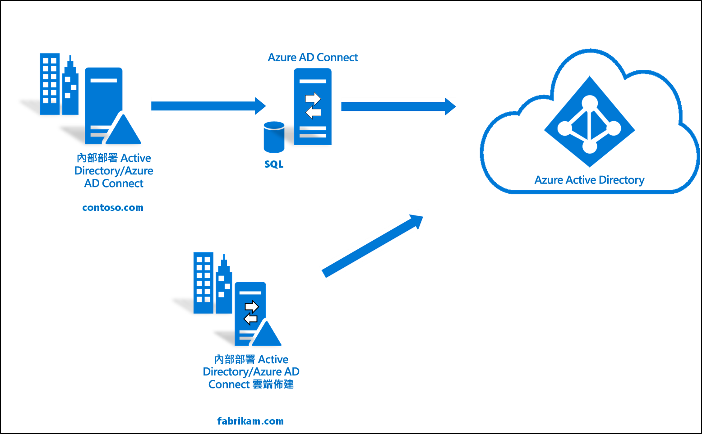
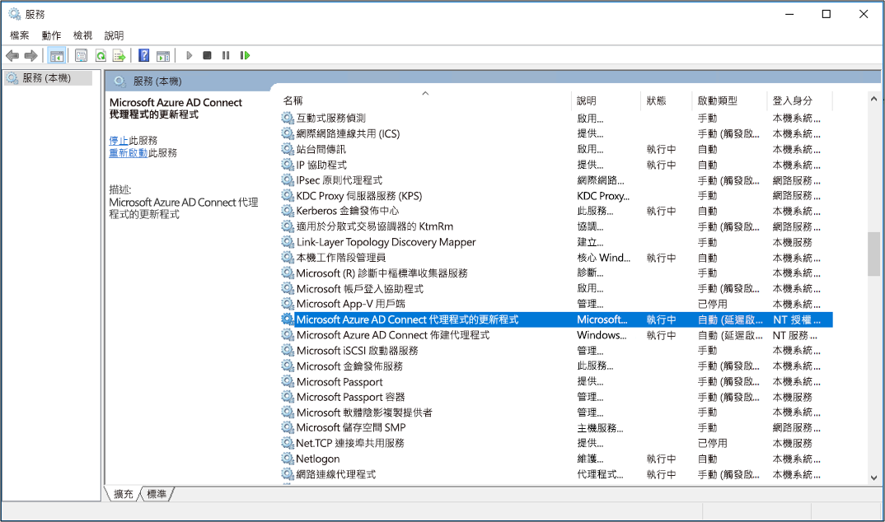

# 將現有及全新樹系與單一 Azure AD 租用戶整合

本教學課程將逐步引導您將雲端佈建新增至現有的混合式身分識別環境。 

您可以將本教學課程中建立的環境用於測試，或進一步熟悉混合式身分識別的運作方式。 

在此案例中，現有的樹系會透過「Azure AD Connect 同步」同步處理至 Azure AD 租用戶。 此外還有一個新樹系，也要同步處理至相同的 Azure AD 租用戶。 您將設定新樹系的雲端佈建。 

## Prerequisites
### 於 Azure Active Directory 管理中心

1. 在 Azure AD 租用戶上建立僅限雲端的全域管理員帳戶。 如此一來，如果您的內部部署服務失敗或無法使用，您便可以管理租用戶組態。 了解如何[新增僅限雲端管理員帳戶](../active-directory-users-create-azure-portal.md)。 這是確保您不會遭租用戶封鎖的關鍵步驟。
2. 將一或多個[自訂網域名稱](../active-directory-domains-add-azure-portal.md)新增至 Azure AD 租用戶。 您的使用者可以使用其中一個網域名稱登入。

### 在內部部署環境中

1. 識別且已加入網域、執行 Windows Server 2012 R2 或更新版本，且至少有 4 GB 的 RAM 和 .NET 4.7.1+ 執行階段的主機伺服器 

2. 如果您的伺服器和 Azure AD 之間有防火牆，請設定下列項目：
   - 確定代理程式可透過下列連接埠對 Azure AD 提出*輸出*要求：

     | 連接埠號碼 | 使用方式 |
     | --- | --- |
     | **80** | 驗證 TLS/SSL 憑證時下載憑證撤銷清單 (CRL) |
     | **443** | 處理所有與服務之間的輸出通訊 |
     | **8080** (選擇性) | 如果無法使用連接埠 443，則代理程式會透過連接埠 8080 每 10 分鐘報告其狀態一次。 此狀態會顯示在 Azure 入口網站上。 |
     
     如果您的防火牆會根據原始使用者強制執行規則，請開啟這些連接埠，讓來自以網路服務形式執行之 Windows 服務的流量得以通行。
   - 如果您的防火牆或 Proxy 允許您指定安全尾碼，請將連線新增至 **\*.msappproxy.net** 和 **\*.servicebus.windows.net**。 如果不允許建立，請允許存取每週更新的 [Azure 資料中心 IP 範圍](https://www.microsoft.com/download/details.aspx?id=41653)。
   - 您的代理程式必須可存取 **login.windows.net** 與 **login.microsoftonline.com**，才能進行初始註冊。 因此也請針對這些 URL 開啟您的防火牆。
   - 為了驗證憑證，請解除封鎖以下 URL：**mscrl.microsoft.com:80**、**crl.microsoft.com:80**、**ocsp.msocsp.com:80** 和 **www\.microsoft.com:80**。 由於這些 URL 會用於其他 Microsoft 產品的憑證驗證，因此您可能已將這些 URL 解除封鎖。

## 安裝 Azure AD Connect 佈建代理程式
1. 登入已加入網域的伺服器。  如果您使用[基本 AD 和 Azure 環境](tutorial-basic-ad-azure.md)教學課程，則會是 DC1。
2. 使用僅限雲端的全域管理員認證登入 Azure 入口網站。
3. 在左側選取 [Azure Active Directory]  ，按一下 [Azure AD Connect]  ，然後在中央選取 [管理佈建 (預覽)]  。 
 
4. 按一下 [下載代理程式]
5. 執行 Azure AD Connect 佈建代理程式
6. 在啟動顯示畫面上**接受**授權條款，然後按一下 [安裝]  。 
 

7. 此作業完成後，就會啟動組態精靈。  以 Azure AD 全域管理員帳戶登入。  請注意，如果您已啟用 IE 增強式安全性，則會封鎖登入。  在此情況下，請關閉安裝，在伺服器管理員中停用 [IE 增強式安全性]，然後按一下 [AAD Connect 佈建代理程式精靈]  以重新開始安裝。
8. 在 [連接 Active Directory]  畫面上，按一下 [新增目錄]  ，然後以您的 Active Directory 網域系統管理員帳戶登入。  注意：網域系統管理員帳戶應該不會有密碼變更需求。 如果密碼過期或變更，您必須使用新的認證重新設定代理程式。 此作業將會新增您的內部部署目錄。  按 [下一步]  。 
 

9. 在 [設定完成]  畫面上，按一下 [確認]  。  此作業將會註冊並重新啟動代理程式。 
 

10. 此作業完成後，您應該會看到一則通知：**已成功驗證您的代理程式設定。**  您可以按一下 [結束]  。 
 
11. 如果您仍看到初始啟動顯示畫面，請按一下 [關閉]  。

## 驗證代理程式安裝
代理程式驗證可在 Azure 入口網站中以及執行代理程式的本機伺服器上進行。

### Azure 入口網站代理程式驗證
若要確認 Azure 可看到代理程式，請遵循下列步驟：

1. 登入 Azure 入口網站。
2. 在左側選取 [Azure Active Directory]  ，按一下 [Azure AD Connect]  ，然後在中央選取 [管理佈建 (預覽)]  。 
 

3.  在 [Azure AD 佈建 (預覽)]  畫面上，按一下 [檢閱所有代理程式]  。
 
 
4. 在 [內部部署佈建代理程式]  畫面上，您會看到已安裝的代理程式。  確認相關代理程式位於該處，且已標示為 [作用中]  。
 

### 在本機伺服器上
若要確認代理程式正在執行中，請遵循下列步驟：

1.  以系統管理員帳戶登入伺服器
2.  瀏覽至 [服務] 或移至 [開始]/[執行]/[services.msc]，以開啟 [服務]  。
3.  在 [服務]  底下，確定有 **Microsoft Azure AD Connect 代理程式更新程式**和 **Microsoft Azure AD Connect 佈建代理程式**存在，且狀態為 [執行中]  。

## 設定 Azure AD Connect 雲端佈建
 使用下列步驟來設定佈建

1.  登入 AD Azure 入口網站。
2.  按一下 [Azure Active Directory] 
3.  按一下 [Azure AD Connect] 
4.  選取 [管理佈建 (預覽)]
![螢幕擷取畫面顯示 [管理佈建 (預覽)] 連結。](media/how-to-configure/manage1.png)
5.  按一下 [新增設定]
![[Azure AD 佈建 (預覽)] 畫面的螢幕擷取畫面，反白顯示了 [新增設定] 連結。](media/tutorial-single-forest/configure1.png)
7.  在組態畫面上輸入 [通知電子郵件]  ，將選取器移至 [啟用]  ，然後按一下 [儲存]  。
![[設定] 畫面的螢幕擷取畫面，其中已填入通知電子郵件並已選取啟用。](media/tutorial-single-forest/configure2.png)
1.  設定狀態此時應顯示為 [狀況良好]。
![[Azure AD 佈建 (預覽)] 畫面的螢幕擷取畫面顯示狀況良好狀態。](media/how-to-configure/manage4.png)

## 確認已建立使用者且已進行同步
現在，您將確認內部部署目錄中的使用者已同步，而且已存在於外部 Azure AD 租用戶中。  這可能需要花幾個小時才能完成。  若要確認使用者是否已同步，請執行下列動作。

1. 瀏覽至 [Azure 入口網站](https://portal.azure.com)並使用具有 Azure 訂用帳戶的帳戶登入。
2. 選取左邊的 [Azure Active Directory]
3. 在 [管理] 底下選取 [使用者]。
4. 確認您在我們的租用戶中看到新使用者 
 

## 使用我們其中一個使用者來測試登入

1. 瀏覽至 [https://myapps.microsoft.com](https://myapps.microsoft.com)
2. 使用我們在新租用戶中建立的使用者來登入。  您必須使用下列格式登入：(user@domain.onmicrosoft.com)。 透過該使用者在內部部署用來登入的密碼登入。 
    

您現在已成功設定混合式身分識別環境，可用來測試及熟悉 Azure 的功能。

## 後續步驟 

- [什麼是佈建？](what-is-provisioning.md)
- [什麼是 Azure AD Connect 雲端佈建？](what-is-cloud-provisioning.md)
