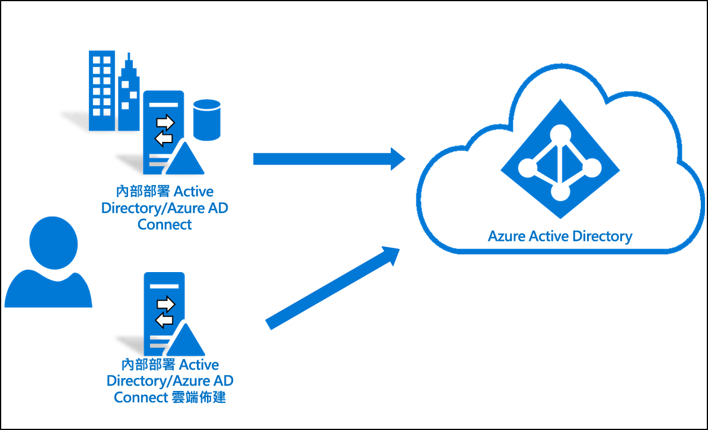
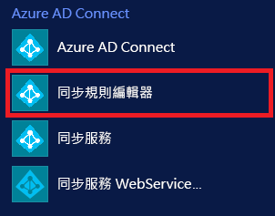
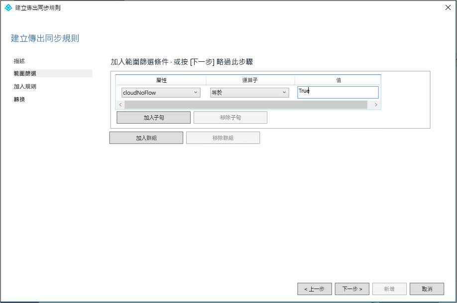
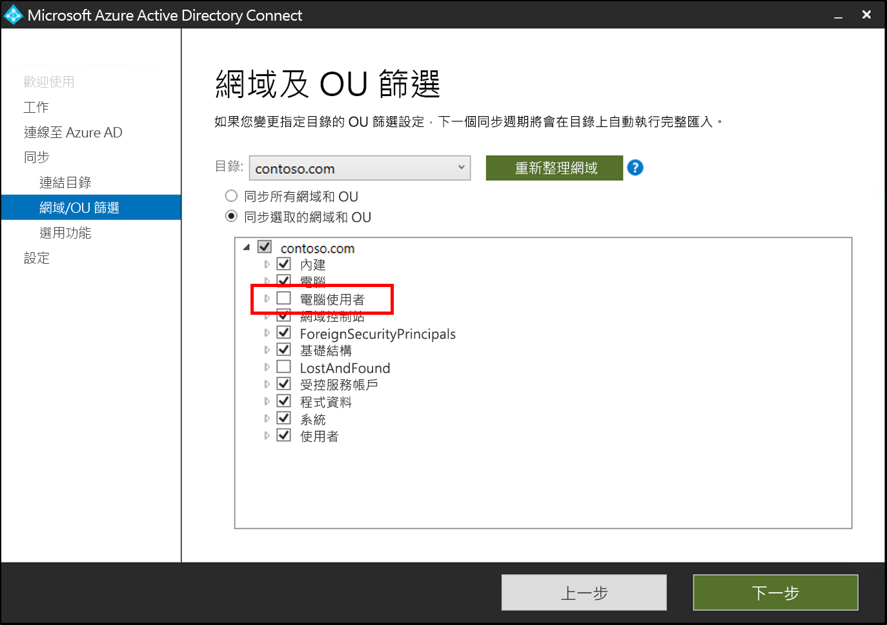

# 針對現有的同步 AD 樹系進行雲端佈建試驗 

本教學課程將逐步引導您針對已使用 Azure Active Directory (Azure AD) Connect 同步進行同步處理的測試 Active Directory 樹系，進行雲端佈建試驗。

## 考量
嘗試進行本教學課程之前，請考量下列事項：
1. 確定您熟悉雲端佈建的基本概念。 
2. 確定您執行的是 Azure AD Connect 同步1.4.32.0 版或更新版本，並已依照文件指示設定同步處理規則。 試驗時，您將會從 Azure AD Connect 同步範圍中移除測試 OU 或群組。 若將物件移出範圍外，會導致這些物件從 Azure AD 中刪除。 針對使用者物件，Azure AD 中的物件會被虛刪除，且可以還原。 針對群組物件，Azure AD 中的物件會被實刪除，且無法還原。 Azure AD Connect 同步中已導入新的連結類型，可在試驗案例中防止刪除。 
3. 請確定試驗範圍中的物件已填入 ms-ds-consistencyGUID，使雲端佈建可確實比對物件。 

   > [!NOTE]
   > 根據預設，Azure AD Connect 同步不會為群組物件填入 ms-ds-consistencyGUID。

4. 這是進階案例。 請確實遵循本教學課程中記載的步驟。

## 必要條件
下列是完成此教學課程的必要條件
- 具有 Azure AD Connect 同步 1.4.32.0 版或更新版本的測試環境
- 在同步範圍內、並且可用於試驗的 OU 或群組。 建議您先從一小組物件開始。
- 執行 Windows Server 2012 R2 或更新版本、且將裝載佈建代理程式的伺服器。  此伺服器不可與 Azure AD Connect 伺服器相同。
- Azure AD Connect 同步的來源錨點應該是 objectGuid 或 ms-ds-consistencyGUID

## 更新 Azure AD Connect

您至少應有 [Azure AD Connect](https://www.microsoft.com/download/details.aspx?id=47594) 1.4.32.0。 若要更新 Azure AD Connect 同步，請完成 [Azure AD Connect：升級至最新版本](../hybrid/how-to-upgrade-previous-version.md)中的步驟。  

## 停止排程器
Azure AD Connect 同步會使用排程器來同步處理您內部部署目錄中發生的變更。 若要修改和加入自訂規則，您可以停用排程器，如此，在您進行此作業時就不會執行同步處理。  使用下列步驟：

1.  在執行 Azure AD Connect 同步的伺服器上，以系統管理權限開啟 PowerShell。
2.  執行 `Stop-ADSyncSyncCycle`。  按 Enter 鍵。
3.  執行 `Set-ADSyncScheduler -SyncCycleEnabled $false`。

>[!NOTE] 
>如果您要執行自己的自訂排程器來進行 Azure AD Connect 同步，請停用排程器。 

## 建立自訂使用者輸入規則

 1. 從桌面的應用程式功能表中啟動同步化編輯器，如下所示： 
  
 
 2. 在下拉式清單中，針對 [方向] 選取 [輸入]，然後按一下 [新增規則]。
 ![此螢幕擷取畫面顯示已選取 [輸入] 和 [新增規則] 按鈕的 [檢視並管理您的同步規則] 視窗。](media/how-to-cloud-custom-user-rule/user1.png) 
 
 3. 在 [描述] 頁面上輸入下列項目，然後按 [下一步]：

    **名稱：** 為規則指定有意義的名稱 
    **說明：** 新增有意義的描述 
    **連線系統：** 選擇您要為其撰寫自訂同步處理規則的 AD 連接器 
    **連線系統物件類型：** User 
    **Metaverse 物件類型：** 個人 
    **連結類型：** Join 
    **優先順序：** 提供在系統中是唯一的值 
    **標籤︰** 將此選項保留空白 
    ![此螢幕擷取畫面顯示已輸入值的 [建立輸入同步處理規則 - 描述] 頁面。](media/how-to-cloud-custom-user-rule/user2.png) 
 
 4. 在 [範圍篩選] 頁面上，輸入要作為試驗基礎的 OU 或安全性群組。  若要篩選 OU，請新增辨別名稱的 OU 部分。 此規則會套用到位於該 OU 中的所有使用者。  因此，如果 DN 的結尾為 "OU=CPUsers,DC=contoso,DC=com，您就會新增此篩選。  然後按一下 [下一步]。 

    |規則|屬性|運算子|值|
    |-----|----|----|-----|
    |設定 OU 的範圍|DN|ENDSWITH|OU 的辨別名稱。|
    |設定群組的範圍||ISMEMBEROF|安全性群組的辨別名稱。|

    ![此螢幕擷取畫面顯示已輸入範圍篩選條件值的 [建立輸入同步處理規則 - 範圍篩選條件] 頁面。](media/how-to-cloud-custom-user-rule/user3.png) 
 
 5. 在 [聯結規則] 頁面上，按 [下一步]。
 6. 在 [轉換] 頁面上，將常數 transformation: flow True 新增至 cloudNoFlow 屬性。 按一下 [新增] 。
 ![此螢幕擷取畫面顯示已新增「固定轉換」流程的 [建立輸入同步處理規則 - 轉換] 頁面。](media/how-to-cloud-custom-user-rule/user4.png) 

所有物件類型 (使用者、群組和連絡人) 都必須遵循相同的步驟。 針對每個設定的 AD Connector / AD 樹系重複步驟。 

## 建立自訂使用者輸出規則

 1. 在下拉式清單中，針對 [方向] 選取 [輸出]，然後按一下 [新增規則]。
 ![此螢幕擷取畫面顯示已選取 [輸出] 方向並反白顯示 [新增規則] 按鈕。](media/how-to-cloud-custom-user-rule/user5.png) 
 
 2. 在 [描述] 頁面上輸入下列項目，然後按 [下一步]：

    **名稱：** 為規則指定有意義的名稱 
    **說明：** 新增有意義的描述 
    **連線系統：** 選擇您要為其撰寫自訂同步處理規則的 Azure AD 連接器 
    **連線系統物件類型：** User 
    **Metaverse 物件類型：** 個人 
    **連結類型：** JoinNoFlow 
    **優先順序：** 提供在系統中是唯一的值 
    **標籤︰** 將此選項保留空白 
    
    ![此螢幕擷取畫面顯示已輸入屬性的 [描述] 頁面。](media/how-to-cloud-custom-user-rule/user6.png) 
 
 3. 在 [範圍篩選] 頁面上，選擇 [cloudNoFlow] 等於 [True]。 然後按一下 [下一步]。
  
 
 4. 在 [聯結規則] 頁面上，按 [下一步]。
 5. 在 [轉換] 頁面上，按一下 [新增]。

所有物件類型 (使用者、群組和連絡人) 都必須遵循相同的步驟。

## 安裝 Azure AD Connect 佈建代理程式
1. 以企業系統管理員權限登入您將使用的伺服器。  如果您使用[基本 AD 和 Azure 環境](tutorial-basic-ad-azure.md)教學課程，則會是 CP1。
2. 使用[這裡](how-to-install.md#install-the-agent)所列的步驟，下載 Azure AD Connect 雲端佈建代理程式。
3. 執行 Azure AD Connect 雲端佈建 (AADConnectProvisioningAgent.Installer)
3. 在啟動顯示畫面上 **接受** 授權條款，然後按一下 [安裝]。 
![此螢幕擷取畫面顯示 [Microsoft Azure AD Connect 佈建代理程式] 啟動顯示畫面。](media/how-to-install/install-1.png) 

4. 此作業完成後，就會啟動組態精靈。  以 Azure AD 全域管理員帳戶登入。
5. 在 [連線 Active Directory] 畫面上，按一下 [新增目錄]，然後以您的 Active Directory 系統管理員帳戶登入。  此作業將會新增您的內部部署目錄。  按 [下一步] 。 
![此螢幕擷取畫面顯示已輸入目錄值的 [連線 Active Directory] 畫面。](media/how-to-install/install-3.png) 

6. 在 [設定完成] 畫面上，按一下 [確認]。  此作業將會註冊並重新啟動代理程式。 
![此螢幕擷取畫面顯示已選取 [確認] 按鈕的 [組態完成] 畫面。](media/how-to-install/install-4a.png) 

7. 此作業完成後，您應該會看到「您已成功通過驗證」的通知。  您可以按一下 [結束]。 
 
8. 如果您仍看到初始啟動顯示畫面，請按一下 [關閉]。

## 驗證代理程式安裝
代理程式驗證可在 Azure 入口網站中以及執行代理程式的本機伺服器上進行。

### Azure 入口網站代理程式驗證
若要確認 Azure 可看到代理程式，請遵循下列步驟：

1. 登入 Azure 入口網站。
2. 在左側選取 [Azure Active Directory]，按一下 [Azure AD Connect]，然後在中央選取 [管理佈建 (預覽)]。 
 

3.  在 [Azure AD 佈建 (預覽)] 畫面上，按一下 [檢閱所有代理程式]。
 
 
4. 在 [內部部署佈建代理程式] 畫面上，您會看到已安裝的代理程式。  確認相關代理程式位於該處，且已標示為 [停用]。  依預設會停用代理程式  

### 在本機伺服器上
若要確認代理程式正在執行中，請遵循下列步驟：

1.  以系統管理員帳戶登入伺服器
2.  瀏覽至 [服務] 或移至 [開始]/[執行]/[services.msc]，以開啟 [服務]。
3.  在 [服務] 底下，確定 **Microsoft Azure AD Connect 代理程式更新程式** 和 **Microsoft Azure AD Connect 佈建代理程式** 皆位於該處，且狀態為 [執行中]。

## 設定 Azure AD Connect 雲端佈建
使用下列步驟來設定佈建：

 1. 登入 Azure AD 入口網站。
 2. 按一下 [Azure Active Directory]
 3. 按一下 [Azure AD Connect]
 4. 選取 [管理佈建 (預覽)]
 ![螢幕擷取畫面顯示 [管理佈建 (預覽)] 連結。](media/how-to-configure/manage1.png) 
 5.  按一下 [新增設定]
 ![[Azure AD 佈建 (預覽)] 畫面的螢幕擷取畫面，反白顯示了 [新增設定] 連結。](media/tutorial-single-forest/configure1.png) 
 6.  在組態畫面上輸入 [通知電子郵件]，將選取器移至 [啟用]，然後按一下 [儲存]。
 ![[設定] 畫面的螢幕擷取畫面，其中已填入通知電子郵件並已選取啟用。](media/tutorial-single-forest/configure2.png) 
 7. 在 [設定] 底下選取 [所有使用者]，以變更組態規則的範圍。
 ![[設定] 畫面的螢幕擷取畫面，並醒目提示 [使用者範圍] 旁的 [所有使用者]。](media/how-to-configure/scope2.png) 
 8. 在右側變更範圍，以包含您剛剛建立的特定 OU "OU=CPUsers,DC=contoso,DC=com"。
 ![[使用者範圍] 畫面的螢幕擷取畫面，並醒目提示範圍已變更為您所建立的 OU。](media/tutorial-existing-forest/scope2.png) 
 9.  按一下 [完成]，然後按 [儲存]。
 10. 範圍此時應會設定為一個組織單位。 
 ![[設定] 畫面的螢幕擷取畫面，並醒目提示 [使用者範圍] 旁的 [1 個組織單位]。](media/tutorial-existing-forest/scope3.png) 
 

## 確認雲端佈建已佈建使用者
現在，您將確認內部部署目錄中的使用者已同步，而且已存在於外部 Azure AD 租用戶中。  這可能需要花幾個小時才能完成。  若要確認雲端佈建已佈建使用者，請遵循下列步驟：

1. 瀏覽至 [Azure 入口網站](https://portal.azure.com)並使用具有 Azure 訂用帳戶的帳戶登入。
2. 選取左邊的 [Azure Active Directory]
3. 按一下 [Azure AD Connect]
4. 按一下 [管理佈建 (預覽)]
5. 按一下 [記錄] 按鈕
6. 搜尋使用者名稱，以確認雲端佈建已佈建使用者

此外，您可以確認 Azure AD 中是否有使用者和群組存在。

## 啟動排程器
Azure AD Connect 同步會使用排程器來同步處理您內部部署目錄中發生的變更。 現在您已修改規則，可以重新啟動排程器。  使用下列步驟：

1.  在執行 Azure AD Connect 同步的伺服器上，以系統管理權限開啟 PowerShell
2.  執行 `Set-ADSyncScheduler -SyncCycleEnabled $true`。
3.  執行 `Start-ADSyncSyncCycle`。  按 Enter 鍵。  

>[!NOTE] 
>如果您要執行自己的自訂排程器來進行 Azure AD Connect 同步，請啟用排程器。 

一旦啟用排程器，Azure AD Connect 將會停止匯出在 Metaverse 中使用 `cloudNoFlow=true` 的物件所做的任何變更，除非任何參考屬性 (例如 管理員) 正在更新物件。 如果物件上有任何參考屬性更新，Azure AD Connect 將會忽略 `cloudNoFlow` 信號，並匯出物件上的所有更新。

## 發生錯誤
如果試驗未如預期運作，您可以依照下列步驟返回 Azure AD Connect 同步設定：
1.  在 Azure 入口網站中停用佈建設定。 
2.  使用「同步處理規則編輯器」工具，停用為「雲端佈建」建立的所有自訂同步處理規則。 停用應該會導致所有連接器上的完整同步處理。

## 設定 Azure AD Connect 同步以排除試驗 OU
當您確認試驗 OU 中的使用者可成功地由雲端佈建管理之後，您可以重新設定 Azure AD Connect，以排除先前建立的試驗 OU。  雲端佈建代理程式之後將會處理這些使用者的同步。  使用下列步驟來設定 Azure AD Connect 的範圍。

 1. 在執行 Azure AD Connect 的伺服器上，按兩下 [Azure AD Connect] 圖示。
 2. 按一下 [設定]
 3. 選取 [自訂同步處理選項]，然後按 [下一步]。
 4. 登入 Azure AD，然後按 [下一步]。
 5. 在 [連線您的目錄] 畫面上，按 [下一步]。
 6. 在 [網域和 OU 篩選] 畫面上，選取 [同步所選取的網域及 OU]。
 7. 展開您的網域，然後 **取消選取** **CPUsers** OU。  按 [下一步] 。
 
 9. 在 [選用功能] 畫面上，按 [下一步]。
 10. 在 [已可設定] 畫面上，按一下 [設定]。
 11. 完成後，按一下 [結束]。 

## 後續步驟 

- [什麼是佈建？](what-is-provisioning.md)
- [什麼是 Azure AD Connect 雲端佈建？](what-is-cloud-provisioning.md)

