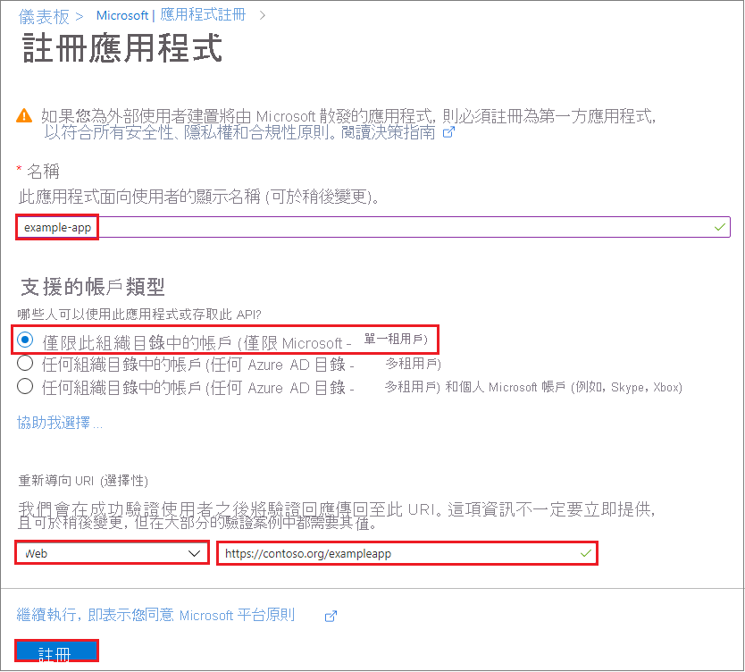

# <a name="how-to-use-the-portal-to-create-an-azure-ad-application-and-service-principal-that-can-access-resources"></a>操作說明：使用入口網站來建立可存取資源的 Azure AD 應用程式和服務主體

本文介紹如何創建新的 Azure 活動目錄 （Azure AD） 應用程式和服務主體，該應用程式和服務主體可與基於角色的存取控制一起使用。 如果您擁有需要存取或修改資源的程式碼，則可以建立應用程式的身分識別。 此身分識別就是所謂的服務主體。 然後，您可以將必要的權限指派給服務主體。 本文說明如何使用入口網站來建立服務主體。 其中著重在說明單一租用戶應用程式，此應用程式的目的是只在一個組織內執行。 您通常會將單一租用戶應用程式用在組織內執行的企業營運系統應用程式。

> [!IMPORTANT]
> 若不要建立服務主體，可考慮使用 Azure 資源的受控識別作為應用程式識別碼。 如果代碼在支援託管標識的服務上運行，並訪問支援 Azure AD 身份驗證的資源，則託管標識是更好的選擇。 若要深入了解 Azure 資源的受控識別，包含目前哪些服務支援該功能，請參閱[什麼是適用於 Azure 資源的受控識別？](../managed-identities-azure-resources/overview.md)。

## <a name="create-an-azure-active-directory-application"></a>建立 Azure Active Directory 應用程式

讓我們直接跳到建立身分識別。 如果您遇到問題，請檢查[必要的權限](#required-permissions)，以確定您的帳戶可以建立身分識別。

1. 通過[Azure 門戶](https://portal.azure.com)登錄到 Azure 帳戶。
1. 選擇**Azure 活動目錄**。
1. 選擇**應用註冊**。
1. 選取 [新增註冊]****。
1. 為應用程式命名。 選擇受支援的帳戶類型，確定誰可以使用該應用程式。 在**重定向 URI**下，為要創建的應用程式類型選擇**Web。** 輸入將訪問權杖發送到的 URI。 您無法建立[原生應用程式](../manage-apps/application-proxy-configure-native-client-application.md)的認證。 您無法將該類型使用於自動化應用程式。 設定值之後，選取 [註冊]****。

   

您已建立 Azure AD 應用程式和服務主體。

## <a name="assign-a-role-to-the-application"></a>為應用程式分配角色

要訪問訂閱中的資源，必須為應用程式分配角色。 決定哪個角色可提供應用程式的適當權限。 若要深入了解可用的角色，請參閱 [RBAC：內建角色](../../role-based-access-control/built-in-roles.md)。

您可以針對訂用帳戶、資源群組或資源的層級設定範圍。 較低的範圍層級會繼承較高層級的權限。 例如，為資源群組的讀取者角色新增應用程式，代表該角色可以讀取資源群組及其所包含的任何資源。

1. 在 Azure 門戶中，選擇要將應用程式分配給的範圍級別。 例如，要在訂閱範圍內分配角色，請搜索並選擇 **"訂閱****"，** 或選擇主頁上的 **"訂閱**"。

   

1. 選取指派應用程式時作為對象的特定訂用帳戶。

   

   如果您未看見所尋找的訂用帳戶，請選取 [全域訂閱篩選]****。 確定您想要的訂用帳戶已針對入口網站選取。

1. 選擇**存取控制 （IAM）。**
1. 選擇 **"添加角色指派**"。
1. 選取您想要將應用程式指派給哪個角色。 例如，要允許應用程式**執行重新開機、****啟動**和**停止**實例等操作，請選擇 **"參與者"** 角色。  閱讀有關[可用角色](../../role-based-access-control/built-in-roles.md)的詳細資訊 預設情況下，Azure AD 應用程式不會顯示在可用選項中。 若要尋找您的應用程式，請搜尋名稱並加以選取。

   

1. 選取 [儲存]**** 以完成角色指派。 在具有該作用域角色的使用者清單中可以看到應用程式。

您的服務主體已設定。 您可以開始使用它來執行指令碼或應用程式。 下節說明如何取得以程式設計方式登入時所需的值。

## <a name="get-values-for-signing-in"></a>取得值以便登入

以程式設計方式登入時，您需要將租用戶識別碼與驗證要求一起傳送。 您也需要應用程式識別碼和驗證金鑰。 若要取得這些值，請使用下列步驟︰

1. 選擇**Azure 活動目錄**。
1. 在 Azure AD 中，從 [應用程式註冊]**** 選取您的應用程式。
1. 複製目錄（租戶）ID並將其存儲在應用程式代碼中。

    

1. 複製 [應用程式識別碼]**** 並儲存在您的應用程式碼中。

   

## <a name="certificates-and-secrets"></a>證書和機密
守護進程應用程式可以使用兩種形式的憑據與 Azure AD 進行身份驗證：證書和應用程式機密。  我們建議使用證書，但您也可以創建新的應用程式金鑰。

### <a name="upload-a-certificate"></a>上傳憑證

如果有證書，則可以使用現有證書。  或者，您可以創建一個自簽章憑證，*僅用於測試目的*。 打開 PowerShell 並運行具有以下參數[的 New-自簽章憑證](/powershell/module/pkiclient/new-selfsignedcertificate)，以在電腦上的使用者憑證存放區中創建自簽章憑證： 

```powershell
$cert=New-SelfSignedCertificate -Subject "CN=DaemonConsoleCert" -CertStoreLocation "Cert:\CurrentUser\My"  -KeyExportPolicy Exportable -KeySpec Signature
```

使用此可從 Windows 控制台訪問的[管理使用者證書](/dotnet/framework/wcf/feature-details/how-to-view-certificates-with-the-mmc-snap-in)MMC 管理單元將此證書匯出到檔。

1. 選擇"**從開始"** 功能表**中運行**，然後輸入**certmgr.msc**。

   將顯示當前使用者的證書管理器工具。

1. 要查看證書，在左側窗格中的 **"證書 - 當前使用者**"下，請展開 **"個人"** 目錄。
1. 按右鍵您創建的證書，選擇 **"所有任務->匯出**。
1. 按照證書匯出嚮導操作。  匯出私密金鑰，指定證書檔的密碼，然後匯出到檔。

要上載證書：

1. 選擇**Azure 活動目錄**。
1. 在 Azure AD 中，從 [應用程式註冊]**** 選取您的應用程式。
1. 選取 [憑證和秘密]****。
1. 選擇 **"上載證書**"並選擇證書（現有證書或匯出的自簽章憑證）。

    

1. 選取 [加入]****。

在應用程式註冊門戶中向應用程式註冊證書後，需要啟用用戶端應用程式代碼來使用證書。

### <a name="create-a-new-application-secret"></a>建立新的應用程式祕密

如果選擇不使用證書，則可以創建新的應用程式金鑰。

1. 選取 [憑證和秘密]****。
1. 選取 [用戶端秘密] -> [新增用戶端密碼]****。
1. 提供秘密的描述及持續時間。 完成時，選取 [新增]****。

   儲存用戶端秘密之後，就會顯示用戶端秘密的值。 複製此值，因為以後無法檢索金鑰。 您將提供具有應用程式 ID 的金鑰值，以便以應用程式身份登錄。 將金鑰值儲存在應用程式可擷取的地方。

   

## <a name="configure-access-policies-on-resources"></a>配置資源訪問策略
請記住，您可能需要配置應用程式需要訪問的資源的添加許可權。 例如，還必須[更新金鑰保存庫的訪問策略](/azure/key-vault/key-vault-secure-your-key-vault#data-plane-and-access-policies)，以便應用程式訪問金鑰、機密或證書。  

1. 在[Azure 門戶](https://portal.azure.com)中，導航到金鑰保存庫並選擇**訪問策略**。  
1. 選擇 **"添加訪問策略**"，然後選擇要授予應用程式的金鑰、機密和證書許可權。  選擇以前創建的服務主體。
1. 選擇 **"添加**"以添加訪問策略，然後 **"保存"** 以提交更改。
    

## <a name="required-permissions"></a>所需的權限

您必須具有足夠的許可權才能向 Azure AD 租戶註冊應用程式，並在 Azure 訂閱中為應用程式分配角色。

### <a name="check-azure-ad-permissions"></a>檢查 Azure AD 權限

1. 選擇**Azure 活動目錄**。
1. 記下您的角色。 如果您具有 [使用者]**** 角色，則必須確定非系統管理員可以註冊應用程式。

   

1. 在左側窗格中，選擇 **"使用者設置**"。
1. 檢查 [應用程式註冊]**** 設定。 此值只能由系統管理員設定。 若設定為 [是]****，則 Azure AD 租用戶中的任何使用者都可以註冊應用程式。

如果應用程式註冊設定設為 [否]****，則只有具備系統管理員角色的使用者才能註冊這些類型的應用程式。 若要了解 Azure AD 中可用的系統管理員角色及賦予每個角色的特定權限，請參閱[可用的角色](../users-groups-roles/directory-assign-admin-roles.md#available-roles)和[角色權限](../users-groups-roles/directory-assign-admin-roles.md#role-permissions)。 如果您的帳戶已分配了"使用者"角色，但應用註冊設置僅限於管理員使用者，請讓管理員為您分配一個管理員角色，這些角色可以創建和管理應用註冊的所有方面，或者允許使用者註冊應用程式。

### <a name="check-azure-subscription-permissions"></a>檢查 Azure 訂用帳戶權限

在 Azure 訂閱中，您的帳戶必須`Microsoft.Authorization/*/Write`具有將角色指派給 AD 應用的存取權限。 此動作是[擁有者](../../role-based-access-control/built-in-roles.md#owner)角色或[使用者存取系統管理員](../../role-based-access-control/built-in-roles.md#user-access-administrator)角色來授與。 如果您的帳戶已分配了 **"參與者"** 角色，則您沒有足夠的許可權。 嘗試為服務主體分配角色時，您將收到錯誤。

若要檢查訂用帳戶權限：

1. 搜索並選擇 **"訂閱****"，或在主頁**上選擇 **"訂閱**"。

   

1. 選擇要在中創建服務主體的訂閱。

   

   如果您未看見所尋找的訂用帳戶，請選取 [全域訂閱篩選]****。 確定您想要的訂用帳戶已針對入口網站選取。

1. 選取 [我的權限]****。 然後，選取 [按一下這裡以詳細檢視此訂用帳戶的完整存取權]****。

   

1. 選擇"在**角色指派**中**查看"** 以查看分配的角色，並確定您是否有足夠的許可權將角色指派給 AD 應用。 如果沒有，請洽詢訂用帳戶管理員，將您新增至「使用者存取系統管理員」角色。 在下圖中，使用者被分配了"擁有者"角色，這意味著使用者具有足夠的許可權。

   

## <a name="next-steps"></a>後續步驟

* 若要了解如何指定安全性原則，請參閱 [Azure 角色型存取控制](../../role-based-access-control/role-assignments-portal.md)。  
* 如需可授與或拒絕使用者的可用動作清單，請參閱 [Azure Resource Manager 資源提供者作業](../../role-based-access-control/resource-provider-operations.md)。
