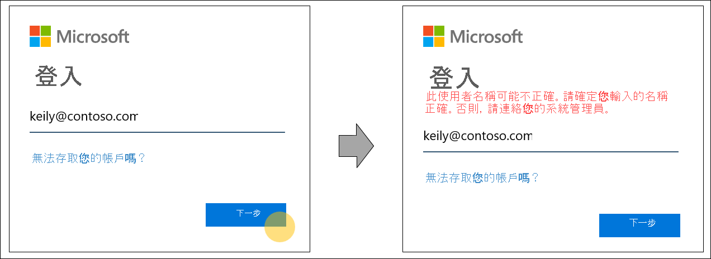
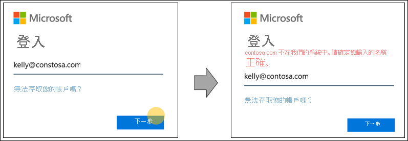
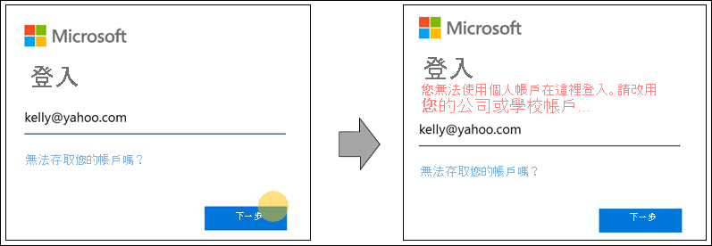

# Azure Active Directory 登入頁面的主領域探索

我們正在變更 Azure Active Directory (Azure AD) 登入行為，以騰出空間給新的驗證方法，並提升可用性。 在登入期間，Azure AD 會判斷使用者需要驗證的情況。 Azure AD 會針對在登入頁面上輸入的使用者名稱，閱讀組織和使用者設定，以做出明智的決策。 這是可啟用其他認證 (例如 FIDO 2.0) 以邁向無密碼未來的步驟。

## 主領域探索行為

在過去，主領域探索是由在登入時提供的網域，或由一些舊版應用程式的主領域探索原則所控管。 例如，在我們的探索行為中，Azure Active Directory 使用者可能錯誤地輸入其使用者名稱，但仍會抵達其組織的認證集合畫面。 當使用者正確提供組織的網域名稱 "contoso.com" 時，就會發生這種情況。 此行為不允許細微性自訂個別使用者的體驗。

為了支援更廣泛的認證並增加可用性，Azure Active Directory 的使用者名稱查閱行為會在登入過程中立即更新。 新行為會根據在登入頁面上輸入的使用者名稱，閱讀組織層級和使用者層級設定，以做出明智的決策。 為了達成此目的，Azure Active Directory 會檢查在登入頁面上輸入的使用者名稱是否存在於其指定的網域中，或將使用者重新導向以提供其認證。

此工作的另一個優點是改善了錯誤訊息。 以下是在登入僅支援 Azure Active Directory 使用者的應用程式時，一些已改善的錯誤訊息範例。

- 使用者名稱輸入錯誤，或使用者名稱尚未同步到 Azure AD：
  
    
  
- 網域名稱輸入錯誤：
  
    
  
- 使用者嘗試使用已知的取用者網域進行登入：
  
    
  
- 密碼輸入錯誤，但使用者名稱是正確的：  
  
    
  
> [!IMPORTANT]
> 此功能可能會影響依賴舊網域層級的主領域探索來強制執行同盟的同盟網域。 如需何時會新增同盟網域支援的更新，請參閱 [Microsoft 365 服務登入期間的主領域探索](https://azure.microsoft.com/updates/signin-hrd/)。 在此同時，有些組織會訓練期員工使用 Azure Active Directory 中不存在但包含適當網域名稱的使用者名稱進行登入，因為網域名稱目前會將使用者路由傳送到其組織的網域端點。 新的登入行為不允許這種情況。 系統會通知使用者更正使用者名稱，而且不允許其使用 Azure Active Directory 中不存在的使用者名稱進行登入。
>
> 如果您或您的組織有取決於舊行為的做法，組織系統管理員必須更新員工登入和驗證文件，以及訓練員工使用其 Azure Active Directory 使用者名稱進行登入。
  
如果您對新行為有所疑慮，請在本文的 **意見反應** 一節中留下您的備註。  

## 後續步驟

[自訂您的登入品牌](../fundamentals/add-custom-domain.md)
