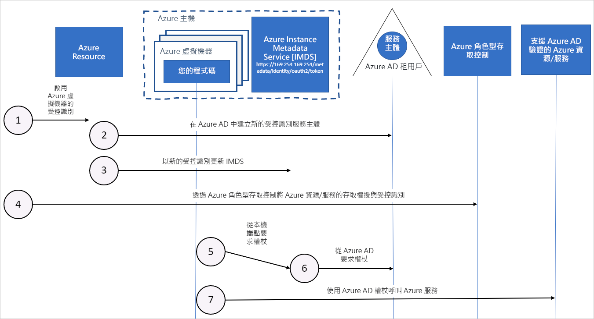

# 什麼是適用於 Azure 資源的受控識別？

[!INCLUDE [preview-notice](../../../includes/active-directory-msi-preview-notice.md)]

建置雲端應用程式常見的難題是如何管理程式碼中的認證，以向雲端服務進行驗證。 保護好這些認證是相當重要的工作。 在理想情況下，這些認證永不會出現在開發人員工作站且簽入原始程式碼控制。 Azure Key Vault 可安全地儲存認證、祕密和其他金鑰，但是您的程式碼必須向 Key Vault 進行驗證，才可擷取這些項目。

Azure Active Directory (Azure AD) 中適用於 Azure 資源的受控識別功能可解決此問題。 這項功能會在 Azure AD 中將自動受控識別提供給 Azure 服務。 您可以使用此身分識別來完成任何支援 Azure AD 驗證的服務驗證 (包括 Key Vault)，不需要您程式碼中的任何認證。

Azure 訂用帳戶的 Azure AD 可免費使用適用於 Azure 資源的受控識別功能。 沒有任何額外成本。

> [!NOTE]
> 先前稱為「受控服務識別」(MSI) 的服務，其新名稱為「Azure 資源適用受控識別」。

## 詞彙

下列字詞適用於 Azure 資源文件集的所有受控識別：

- **用戶端識別碼** - Azure AD 所產生的唯一識別碼，會在其初始佈建期間繫結至應用程式和服務主體。
- **主體識別碼** - 適用於您受控識別之服務主體物件的物件識別碼，可用來將角色型存取授與 Azure 資源。
- **Azure Instance Metadata Service (IMDS)** - REST 端點，可透過 Azure Resource Manager 建立的所有 IaaS VM 來存取。 端點可以在已知的非可路由 IP 位址 (169.254.169.254) 取得，該位址只能從 VM 內存取。

## 適用於 Azure 資源的受控識別如何運作？

受控身分識別有兩種：

- **系統指派的受控識別**可直接在 Azure 服務執行個體上啟用。 啟用此身分識別時，Azure 會在執行個體的訂用帳戶所信任的 Azure AD 租用戶中，建立執行個體的身分識別。 建立身分識別後，就會將認證佈建到執行個體。 系統指派的身分識別生命週期，會直接繫結至已啟用該身分識別的 Azure 服務執行個體。 如果執行個體已刪除，則 Azure 會自動清除 Azure AD 中的認證和身分識別。
- **使用者指派的受控識別**會以獨立 Azure 資源的形式建立。 透過建立程序，Azure 會在所使用訂用帳戶信任的 Azure AD 租用戶中建立身分識別。 建立身分識別之後，即可將它指派給一個或多個 Azure 服務執行個體。 使用者指派的身分識別與獲指派此身分識別的 Azure 服務執行個體，兩者的生命週期分開管理。

就內部而言，受控識別是特殊類型的服務主體，且限定為僅可於 Azure 資源。 刪除受控識別後，對應的服務主體也會自動移除。
此外，當建立使用者指派或系統指派的身分識別時，受控識別資源提供者 (MSRP) 會在內部發出該身分識別的憑證。 

您的程式碼可以使用受控識別來要求存取權杖，以存取支援 Azure AD 驗證的服務。 Azure 會負責更新服務個體使用的認證。 

下圖顯示受控服務識別與 Azure 虛擬機器一起運作的方式。

|  屬性    | 系統指派的受控識別 | 使用者指派的受控識別 |
|------|----------------------------------|--------------------------------|
| 建立 |  建立為 Azure 資源的一部分 (例如 Azure 虛擬機器或 Azure App Service) | 建立為獨立的 Azure 資源 |
| 生命週期 | 與用來建立受控識別的 Azure 資源共用生命週期。   當父代資源刪除時，受控識別也會一併刪除。 | 獨立的生命週期。   必須明確刪除。 |
| 由所有 Azure 資源共用 | 無法共用。   它只能與單一 Azure 資源相關聯。 | 可以共用   使用者指派的同一個受控識別可與多個 Azure 資源相關聯。 |
| 一般使用案例 | 包含在單一 Azure 資源內的工作負載   您需要獨立身分識別的工作負載。   例如，在單一虛擬機器上執行的應用程式 | 在多個資源上執行、且可共用單一身分識別的工作負載。   在佈建流程中需要預先授權以保護資源的工作負載。   資源回收頻率高、但權限應保持一致的工作負載。   例如，有多個虛擬機器需要存取相同資源的工作負載 |

### 系統指派的受控識別如何與 Azure VM 一起運作

1. Azure Resource Manager 收到要求，請求在 VM 上啟用系統指派的受控識別。

2. Azure Resource Manager 會在 Azure AD 中建立服務主體，代表 VM 的身分識別。 服務主體會建立在此訂用帳戶信任的 Azure AD 租用戶中。

3. Azure Resource Manager 會以服務主體用戶端識別碼和憑證來更新 Azure Instance Metadata Service 身分識別端點，進而在 VM 上設定身分識別。

4. 在 VM 具有身分識別後，使用服務主體資訊對 VM 授與 Azure 資源的存取權。 若要呼叫 Azure Resource Manager，請在 Azure AD 中使用角色型存取控制 (RBAC)，將適當的角色指派給 VM 服務主體。 若要呼叫 Key Vault，請將 Key Vault 中特定祕密或金鑰的存取權授與您的程式碼。

5. 您在 VM 上執行的程式碼可向能從 VM 內存取的 Azure Instance Metadata Service 端點要求權杖：`http://169.254.169.254/metadata/identity/oauth2/token`
    - resource 參數指定將權杖傳送至哪個服務。 若要向 Azure Resource Manager 進行驗證，請使用 `resource=https://management.azure.com/`。
    - API 版本參數會使用 api-version=2018-02-01 或更高版本來指定 IMDS 版本。

6. 使用步驟 3 所設定的用戶端識別碼和憑證，呼叫 Azure AD 以要求步驟 5 所指定的存取權杖。 Azure AD 會傳回 JSON Web 權杖 (JWT) 存取權杖。

7. 您的程式碼會在呼叫上傳送存取權杖給支援 Azure AD 驗證的服務。

### 使用者指派的受控識別如何與 Azure VM 一起運作

1. Azure Resource Manager 收到要求，請求建立使用者指派的受控識別。

2. Azure Resource Manager 會在 Azure AD 中建立服務主體，以代表使用者指派的受控識別。 服務主體會建立在此訂用帳戶信任的 Azure AD 租用戶中。

3. Azure Resource Manager 會收到以下要求：在 VM 上設定使用者指派的受控識別，並以使用者指派的受控識別服務主體用戶端識別碼和憑證來更新 Azure Instance Metadata Service 身分識別端點。

4. 建立使用者指派的受控識別後，使用服務主體資訊，以授權此身分識別來存取 Azure 資源。 若要呼叫 Azure Resource Manager，請在 Azure AD 中 使用 RBAC，將適當的角色指派給使用者所指派身分識別的服務主體。 若要呼叫 Key Vault，請將 Key Vault 中特定祕密或金鑰的存取權授與您的程式碼。

   > [!Note]
   > 您也可以在步驟 3 之前執行這個步驟。

5. 您在 VM 上執行的程式碼可向能從 VM 內存取的 Azure Instance Metadata Service 身分識別端點要求權杖：`http://169.254.169.254/metadata/identity/oauth2/token`
    - resource 參數指定將權杖傳送至哪個服務。 若要向 Azure Resource Manager 進行驗證，請使用 `resource=https://management.azure.com/`。
    - 用戶端識別碼參數會指定為其要求權杖的身分識別。 當單一 VM 上有多個使用者指派的身分識別時，需要此值才能釐清。
    - API 版本參數可指定 Azure 執行個體中繼資料服務版本。 使用 `api-version=2018-02-01` 或更高版本。

6. 使用步驟 3 所設定的用戶端識別碼和憑證，呼叫 Azure AD 以要求步驟 5 所指定的存取權杖。 Azure AD 會傳回 JSON Web 權杖 (JWT) 存取權杖。
7. 您的程式碼會在呼叫上傳送存取權杖給支援 Azure AD 驗證的服務。

## 認證輪替
認證輪替是由裝載 Azure 資源的資源提供者所控制。 認證的預設輪替每 46 天發生一次。 需由資源提供者呼叫新的認證，因此資源提供者可能會等待超過 46 天。

## 如何使用適用於 Azure 資源的受控識別？

若要了解如何使用受控識別來存取不同的 Azure 資源，請嘗試下列教學課程。

> [!NOTE]
> 請參閱[實作 Microsoft Azure 資源的受控識別](https://www.pluralsight.com/courses/microsoft-azure-resources-managed-identities-implementing)課程，以取得受控識別的詳細資訊，包括數個支援案例的詳細影片逐步解說。

了解如何使用受控識別搭配 Windows VM：

* [存取 Azure Data Lake Store](tutorial-windows-vm-access-datalake.md)
* [存取 Azure Resource Manager](tutorial-windows-vm-access-arm.md)
* [存取 Azure SQL](tutorial-windows-vm-access-sql.md)
* [使用存取金鑰存取 Azure 儲存體](tutorial-vm-windows-access-storage.md)
* [使用共用存取簽章存取 Azure 儲存體](tutorial-windows-vm-access-storage-sas.md)
* [透過 Azure Key Vault 存取非 Azure AD 資源](tutorial-windows-vm-access-nonaad.md)

了解如何使用受控識別搭配 Linux VM：

* [存取 Azure Container Registry](../../container-registry/container-registry-authentication-managed-identity.md)
* [存取 Azure Data Lake Store](tutorial-linux-vm-access-datalake.md)
* [存取 Azure Resource Manager](tutorial-linux-vm-access-arm.md)
* [使用存取金鑰存取 Azure 儲存體](tutorial-linux-vm-access-storage.md)
* [使用共用存取簽章存取 Azure 儲存體](tutorial-linux-vm-access-storage-sas.md)
* [透過 Azure Key Vault 存取非 Azure AD 資源](tutorial-linux-vm-access-nonaad.md)

了解如何使用受控識別搭配其他 Azure 服務：

* [Azure App Service](/azure/app-service/overview-managed-identity)
* [Azure API 管理](../../api-management/api-management-howto-use-managed-service-identity.md)
* [Azure 容器執行個體](../../container-instances/container-instances-managed-identity.md)
* [Azure Container Registry 工作](../../container-registry/container-registry-tasks-authentication-managed-identity.md)
* [Azure 事件中樞](../../event-hubs/authenticate-managed-identity.md)
* [Azure Functions](/azure/app-service/overview-managed-identity)
* [Azure Kubernetes Service](/azure/aks/use-managed-identity)
* [Azure Logic Apps](/azure/logic-apps/create-managed-service-identity)
* [Azure 服務匯流排](../../service-bus-messaging/service-bus-managed-service-identity.md)
* [Azure Data Factory](../../data-factory/data-factory-service-identity.md)

## 哪些 Azure 服務支援此功能？

適用於 Azure 資源的受控識別，可用來向支援 Azure AD 驗證的服務進行驗證。 有關哪些 Azure 服務支援適用於 Azure 資源的受控識別功能，請參閱[這些服務支援適用於 Azure 資源的受控識別](services-support-msi.md)。

## 後續步驟

透過下列快速入門，開始使用適用於 Azure 資源的受控識別功能：

* [使用 Windows VM 系統指派的受控識別來存取 Resource Manager](tutorial-windows-vm-access-arm.md)
* [使用 Linux VM 系統指派的受控識別來存取 Resource Manager](tutorial-linux-vm-access-arm.md)
