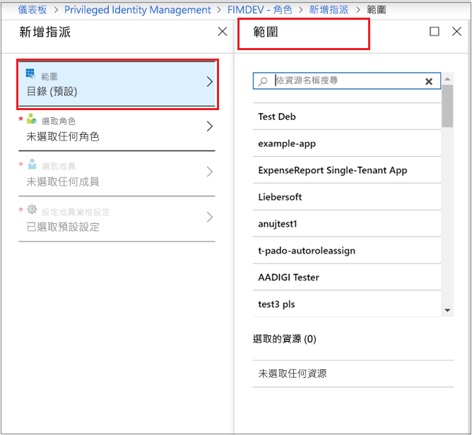
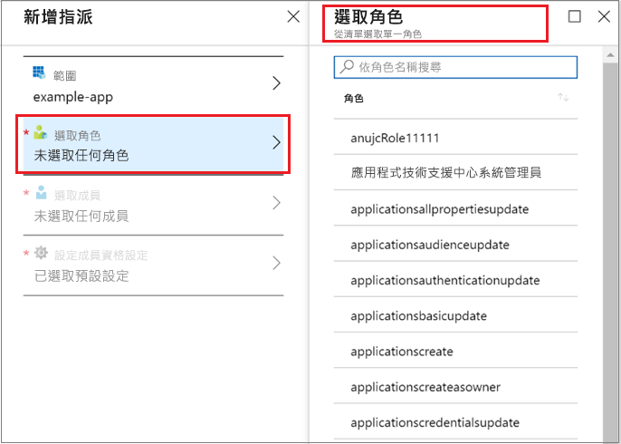
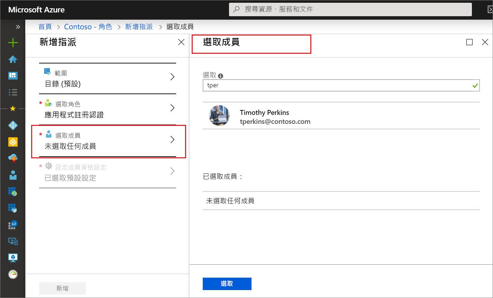

# 在 Privileged Identity Management (PIM) 中指派 Azure AD 自訂角色

本文說明如何使用 Privileged Identity Management (PIM) 對為了在 Azure Active Directory (Azure AD) 管理體驗中管理應用程式而建立的自訂角色建立 Just-In-Time 和有時限的指派。

- 如需關於在 Azure AD 中建立自訂角色以委派應用程式管理的詳細資訊，請參閱 [Azure Active Directory 中的自訂系統管理員角色 (預覽)](../users-groups-roles/roles-custom-overview.md)。
- 如果您尚未使用 Privileged Identity Management，請在[開始使用 Privileged Identity Management](pim-getting-started.md) 中取得詳細資訊。
- 如需如何授與其他系統管理員存取權來管理 Privileged Identity Management 的相關資訊，請參閱將[存取權授與其他管理員以管理 Privileged Identity Management](pim-how-to-give-access-to-pim.md)。

> [!NOTE]
> 在預覽期間，Azure AD 自訂角色不會與內建目錄角色整合。 在功能正式推出後，角色管理就會在內建角色體驗中進行。 如果您看到下列橫幅，這些角色應該[以內建角色的體驗](pim-how-to-activate-role.md)進行管理，本文並不適用：
>
> 

## 指派角色

Privileged Identity Management 可管理您可在 Azure Active Directory (Azure AD) 應用程式管理中建立的自訂角色。  下列步驟可對自訂目錄角色進行合格的指派。

1. 使用指派給「特殊權限角色管理員」角色的使用者帳戶，在 Azure 入口網站中登入 [Privileged Identity Management](https://portal.azure.com/?Microsoft_AAD_IAM_enableCustomRoleManagement=true&Microsoft_AAD_IAM_enableCustomRoleAssignment=true&feature.rbacv2roles=true&feature.rbacv2=true&Microsoft_AAD_RegisteredApps=demo#blade/Microsoft_Azure_PIMCommon/CommonMenuBlade/quickStart)。
1. 選取 [Azure AD 自訂角色 (預覽)]****。

    

1. 選取 [角色]**** 以查看 Azure AD 應用程式的自訂角色清單。

    ![選取 [角色] 查看合格角色指派的清單](./media/azure-ad-custom-roles-assign/view-roles.png)

1. 選取 [新增成員]**** 以開啟 [指派] 頁面。
1. 若要將角色指派的範圍限制為單一應用程式，請選取 [範圍]**** 以指定應用程式範圍。

    

1. 選取 [選取角色]**** 以開啟 [選取角色]**** 清單。

    

1. 選取要指派的角色，然後按一下 [選取]****。 [選取成員]**** 清單隨即開啟。

    

1. 選取您要為其指派角色的使用者，然後按一下 [選取]****。 [成員資格設定]**** 清單隨即開啟。

    ![將角色指派類型設定為 [合格] 或 [有效]](./media/azure-ad-custom-roles-assign/membership-settings.png)

1. 在 [成員資格設定]**** 頁面上，選取 [合格]**** 或 [有效]****：

    - **合格**的指派會要求指派給角色的使用者必須先執行某個動作，才能使用該角色。 動作可能包含通過多重要素驗證檢查、提供業務理由，或是向指定的核准者要求核准。
    - **有效**的指派不會要求指派的使用者必須先執行某個動作才能使用該角色。 有效的使用者有權隨時指派給角色。

1. 如果 [永久]**** 核取方塊顯示且可用 (視角色設定而定)，您可以指定指派是否為永久的。 選取此核取方塊，可讓指派永久符合資格或永久指派。 清除此核取方塊可指定指派持續時間。
1. 若要建立新的角色指派，請按一下 [儲存]****，然後按 [新增]****。 指派程序狀態的通知會隨即顯示。

若要確認角色指派，請在開啟的角色中**選取 [指派]**  >  **，** 並確認您的角色指派已正確識別為 [合格] 或 [作用中]。

 ![查看角色指派是否顯示為 [合格] 或 [有效]](./media/azure-ad-custom-roles-assign/verify-assignments.png)

## 後續步驟

- [啟用 Azure AD 自訂角色](azure-ad-custom-roles-assign.md)
- [移除或更新 Azure AD 自訂角色指派](azure-ad-custom-roles-update-remove.md)
- [設定 Azure AD 自訂角色指派](azure-ad-custom-roles-configure.md)
- [Azure AD 中的角色定義](../users-groups-roles/directory-assign-admin-roles.md)
