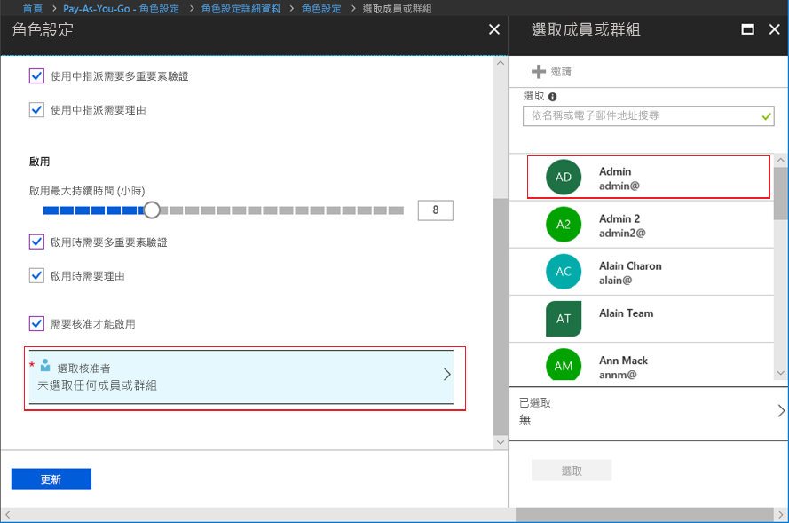

# 在 Privileged Identity Management 中設定 Azure AD 自訂角色

特殊許可權角色管理員可變更在使用者啟用對自訂角色的指派時所套用的角色設定，並且可為指派自訂角色的其他應用程式管理員變更此設定。

> [!NOTE]
> 在預覽期間，Azure AD 自訂角色不會與內建目錄角色整合。 在功能正式推出後，角色管理就會在內建角色體驗中進行。 如果您看到下列橫幅，這些角色應該[以內建角色的體驗](pim-how-to-activate-role.md)進行管理，本文並不適用：
>
> 

## 開啟角色設定

請依照下列步驟開啟 Azure AD 角色的設定。

1. 使用指派給「特殊權限角色管理員」角色的使用者帳戶，在 Azure 入口網站中登入 [Privileged Identity Management](https://portal.azure.com/?Microsoft_AAD_IAM_enableCustomRoleManagement=true&Microsoft_AAD_IAM_enableCustomRoleAssignment=true&feature.rbacv2roles=true&feature.rbacv2=true&Microsoft_AAD_RegisteredApps=demo#blade/Microsoft_Azure_PIMCommon/CommonMenuBlade/quickStart)。
1. 選取 [Azure AD 自訂角色 (預覽)]****。

    

1. 選取 [設定]**** 以開啟 [設定]**** 頁面。 選取您要設定其設定的角色。
1. 選取 [編輯]**** 以開啟 [角色設定]**** 頁面。

    

## 角色設定

您有數個設定可以設定。

### 指派持續時間

當您進行角色的設定時，每個指派類型 (合格或有效) 都有兩個指派持續時間選項可供選擇。 將成員指派給 Privileged Identity Management 中的角色後，這些選項就會變成預設的最長持續時間。

您可以從下列*合格*指派持續時間選項中選擇一個。

- **允許永久合格的指派**：系統管理員可以指派永久的合格成員資格。
- **合格指派的到期**時間：系統管理員可以要求所有合格指派都具有指定的開始和結束日期。

此外，您可以從下列*有效*指派持續時間選項中選擇一個：

- **允許永久有效的指派**：系統管理員可以指派永久有效的成員資格。
- 作用中**指派的到期**時間：系統管理員可以要求所有作用中的指派都具有指定的開始和結束日期。

### 要求使用 Azure Multi-Factor Authentication

Privileged Identity Management 可針對兩個不同的案例選擇性地強制執行 Azure Multi-Factor Authentication。

- **要求為有效指派進行多重要素驗證**

  如果您只想在短期內 (例如一天) 將成員指派給某個角色，則要求指派的成員必須要求啟用，可能會太慢。 在此案例中，Privileged Identity Management 無法在使用者啟用其角色指派時強制執行多重要素驗證，因為從指派他們的那一刻起，他們就已具備有效的角色。 若要確保執行指派的系統管理員身分屬實，請選取 [要求為有效指派進行多重要素驗證]**** 方塊。

- **啟用時需要 Multi-Factor Authentication**

  您可以要求指派給角色的合格使用者必須先註冊多重要素驗證，然後才可啟用。 此程序確保要求啟用的使用者是表明具有合理確定性的人員。 在使用者帳戶可能受到危害的情況下，強制執行此選項可保護重要角色。 若要要求合格成員在啟用前必須先執行多重要素驗證，請選取 [啟用時需要多重要素驗證]**** 方塊。

如需詳細資訊，請參閱[多重要素驗證和 Privileged Identity Management](pim-how-to-require-mfa.md)。

### 啟用持續時間上限

使用 [啟用持續時間上限]**** 滑桿，可設定角色在到期前維持作用中狀態的最長時間 (以小時為單位)。 此值可以是 1 到 24 小時。

### 需要理由

您可以要求成員在進行有效指派時或啟用時提供理由。 若要要求提供理由，請選取 [進行有效指派時需要提供理由]**** 核取方塊，或選取 [啟用時需要提供理由]**** 方塊。

### 需要核准才可啟用

如果您想要在啟用角色前先經過核准，請遵循下列步驟。

1. 請選取 [需要核准才可啟用]**** 核取方塊。
1. 選取 [選取核准者]**** 以開啟 [選取成員或群組]**** 清單。

    

1. 選取至少一個成員或群組後，按一下 [選取]****。 您必須至少選取一個核准者。 沒有任何預設核准者。 您的選項將出現在所選取的核准者清單中。
1. 在指定角色設定後，選取 [更新]**** 以儲存變更。

## 後續步驟

- [啟用 Azure AD 自訂角色](azure-ad-custom-roles-activate.md)
- [指派 Azure AD 自訂角色](azure-ad-custom-roles-assign.md)
- [移除或更新 Azure AD 自訂角色指派](azure-ad-custom-roles-update-remove.md)
- [Azure AD 中的角色定義](../users-groups-roles/directory-assign-admin-roles.md)
