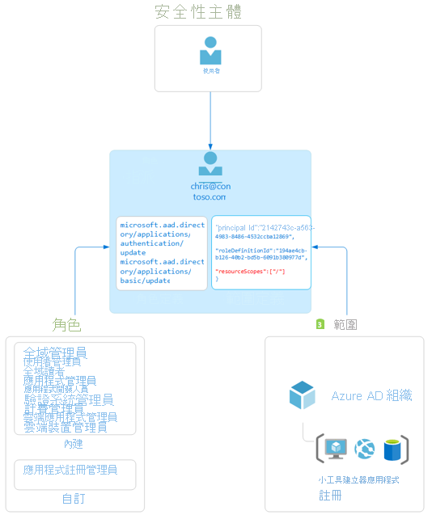

# Azure Active Directory 中的自訂管理員角色 (預覽)

本文說明如何了解 Azure Active Directory (Azure AD) 中具有角色型存取控制和資源範圍的 Azure AD 自訂角色。 自訂 Azure AD 角色會提供[內建角色](permissions-reference.md)的基礎權限，讓您可以建立和組織自己的自訂角色。 此方法可讓您在必要時，透過比內建角色更精細的方式授與存取權。 第一版的 Azure AD 自訂角色所提供的能力，包括建立角色以指派管理應用程式註冊的權限。 經過一段時間後，將會新增組織資源 (例如企業應用程式、使用者和裝置) 的其他權限。  

此外，除了較傳統的組織範圍指派以外，Azure AD 自訂角色也支援個別資源的指派。 此方法可讓您授與管理某些資源 (例如某個應用程式註冊) 的存取權，而不提供所有資源 (所有應用程式註冊) 的存取權。

Azure AD 角色型存取控制是 Azure AD 的公開預覽版功能，可與任何付費 Azure AD 授權方案搭配使用。 如需有關預覽版的詳細資訊，請參閱 [Microsoft Azure 預覽版增補使用條款](https://azure.microsoft.com/support/legal/preview-supplemental-terms/)。

## 了解 Azure AD 角色型存取控制

使用自訂 Azure AD 角色授與權限是包含兩個步驟的程序，其中牽涉到建立自訂角色定義，然後使用角色指派來指派定義。 自訂角色定義是您從預設清單新增的權限集合。 這些權限是內建角色所使用的相同權限。  

建立角色定義後，您可以藉由建立角色指派將其指派給使用者。 角色指派會為使用者授與角色定義中的權限 (限於指定範圍)。 兩個步驟的程序可讓您建立單一角色定義，並分為多次指派於不同範圍。 範圍會定義角色成員可存取的一組 Azure AD 資源。 最常見的範圍是整個組織 (全組織) 範圍。 自訂角色可指派於全組織範圍，這表示角色成員具有組織中所有資源的角色權限。 自訂角色也可指派於物件範圍。 舉例來說，單一應用程式即為物件範圍。 同一個角色可先後指派給範圍涵蓋組織中所有應用程式的一個使用者，以及另一個範圍僅限於 Contoso Expense Reports 應用程式的使用者。  

Azure AD 內建和自訂角色的運作概念與 [Azure 角色型存取控制 (Azure RBAC)](../../active-directory-b2c/overview.md) 類似。 [這兩種角色型存取控制系統的差異](../../role-based-access-control/rbac-and-directory-admin-roles.md)在於，Azure RBAC 會使用 Azure 資源管理來控制對 Azure 資源 (例如虛擬機器或儲存體) 的存取，而 Azure AD 自訂角色則會使用圖形 API 來控制對 Azure AD 資源的存取。 這兩個系統都運用了角色定義和角色指派的概念。 Azure AD RBAC 權限不能包含在 Azure RBAC 角色中，反之亦然。

### Azure AD 如何判斷使用者是否有權存取資源

以下是 Azure AD 用來判斷您是否有權存取管理資源的概要步驟。 使用這項資訊可對存取問題進行疑難排解。

1. 使用者 (或服務主體) 取得 Microsoft Graph 或 Azure AD Graph 端點的權杖。

1. 使用者使用發行的權杖，透過 Microsoft Graph 或 Azure AD Graph 對 Azure Active Directory (Azure AD) 進行 API 呼叫。

1. 視情況而定，Azure AD 會採取下列其中一個動作：

    - 根據使用者存取權杖中的 [wids 宣告](../../active-directory-b2c/access-tokens.md)，評估使用者的角色成員資格。
    - 擷取所有可針對使用者套用至要執行動作的資源 (無論是直接還是透過群組成員資格) 的角色指派。

1. Azure AD 會判斷 API 呼叫中的動作是否包含於使用者針對此資源所具備的角色中。
1. 如果使用者在要求範圍內不具含有該動作的角色，則不會授與存取權。 否則會授與存取權。

### 角色指派

角色指派是一個物件，可在特定範圍將角色定義連結至使用者，以授與 Azure AD 資源存取權。 建立角色指派可授與存取權，而移除角色指派則可撤銷存取權。 基本上，角色指派由三個元素組成：

- 使用者 (Azure Active Directory 中具有使用者設定檔的個人)
- 角色定義
- 資源範圍

您可以使用 Azure 入口網站、Azure AD PowerShell 或圖形 API 來[建立角色指派](custom-create.md)。 您也可以[檢視自訂角色的指派](custom-view-assignments.md#view-the-assignments-of-a-role)。

下圖顯示角色指派的範例。 在此範例中，我們為 Chris Green 指派了應用程式註冊管理員自訂角色，範圍限於 Contoso Widget Builder 應用程式註冊。 此指派為 Chris 授與了僅限於此應用程式註冊的應用程式註冊管理員角色權限。

### 安全性主體

安全性主體代表要被指派 Azure AD 資源存取權的使用者。 *使用者* 是 Azure Active Directory 中具有使用者設定檔的個人。

### 角色

角色定義 (或角色) 是權限的集合。 角色定義會列出可對 Azure AD 資源執行的作業，例如建立、讀取、更新和刪除。 Azure AD 中有兩種角色類型：

- 由 Microsoft 建立且無法變更的內建角色。
- 您的組織所建立及管理的自訂角色。

### 影響範圍

範圍是針對特定 Azure AD 資源的允許動作所做的限制，是角色指派的一部分。 當您指派角色時，您可以指定範圍來限制管理員對特定資源的存取權。 例如，如果您想要為開發人員授與自訂角色，但只是為了管理特定應用程式註冊，則可在角色指派中將特定應用程式註冊指定為範圍。

  > [!Note]
  > 自訂角色可指派於目錄範圍和資源範圍。 這些角色無法指派於管理單位範圍。
  > 內建角色可指派於目錄範圍，且在某些情況下，可指派於管理單位範圍。 這些角色無法指派於 Azure AD 資源範圍。

## 必要授權方案

[!INCLUDE [License requirement for using custom roles in Azure AD](../../../includes/active-directory-p1-license.md)]

## 後續步驟

- 使用 [Azure 入口網站、Azure AD PowerShell 和圖形 API](custom-create.md) 建立自訂角色指派
- [檢視自訂角色的指派](custom-view-assignments.md)
