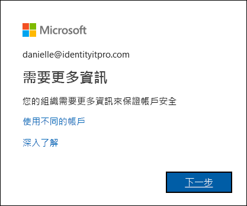

# 什麼是額外驗證頁面？

您的組織正採取額外步驟，以在您登入時確定您表明的身分與事實相符。 這個額外的安全性驗證也稱為雙重要素驗證， 其中包含使用者名稱、密碼及行動裝置或電話的組合。 如果您只是想要關閉 Microsoft 帳戶 (例如 alain@outlook.com) 的雙重要素驗證 ，請使用[開啟或關閉 Microsoft 帳戶的雙步驟驗證](https://support.microsoft.com/help/4028586/microsoft-account-turning-two-step-verification-on-or-off)中的指示。

比起只使用密碼，雙重要素驗證更為安全，因為其依賴兩種形式的驗證：

- 您知道的資訊，像是您的密碼。
- 您擁有的物品，像是您攜帶的電話或其他裝置。

雙重要素驗證可協助防止惡意駭客偽裝成您的身分。 即使他們有您的密碼，也不太可能有您的裝置。

>[!Important]
>如果您是系統管理員，且想要了解如何為您的員工或其他使用者開啟雙因素驗證，請參閱 [Azure Active Directory 驗證文件](https://docs.microsoft.com/azure/active-directory/authentication/)。 本文適用於嘗試使用公司或學校帳戶 (例如 alain@contoso.com) 進行雙重要素驗證的使用者。

## 由誰決定是否使用這項功能？

決定您是否使用雙重要素驗證的人員，會根據您擁有的帳戶類型而有所不同：

- **公司或學校帳戶。** 如果您使用公司或學校帳戶 (例如 alain@contoso.com)，則會由您的組織決定是否必須使用雙重要素驗證，以及特定的驗證方法。 因為您的組織已決定您必須使用此功能，所以您無法另行關閉。

- **個人 Microsoft 帳戶。** 您可以選擇為個人 Microsoft 帳戶 (例如 alain@outlook.com) 設定雙重要素驗證。 您可以使用[開啟或關閉 Microsoft 帳戶的雙步驟驗證](https://support.microsoft.com/help/4028586/microsoft-account-turning-two-step-verification-on-or-off)中的簡單指示，隨時開啟或關閉此功能。

    >[!Note]
    >如果您在雙重要素驗證和個人 Microsoft 帳戶遇到其他問題，可以參閱[如何將雙步驟驗證與 Microsoft 帳戶搭配使用](https://support.microsoft.com/help/12408/microsoft-account-how-to-use-two-step-verification)以了解其他建議。

## 開啟 [其他安全性驗證] 頁面

在您的組織開啟雙重要素驗證之後，您在每次登入時都會收到提示，指示您提供詳細資訊以協助保護您的帳戶。

### 存取 [其他安全性驗證] 頁面

1. 從 [需要更多資訊] 提示中選取 [下一步]。

    隨即顯示 [其他安全性驗證] 頁面。

2. 請在 [其他安全性驗證] 頁面上，選取您要在登入公司或學校帳戶時，用來驗證真實身分的雙重要素驗證方法。 您可以選取：

    | 連絡方法 | 描述 |
    | --- | --- |
    | 行動應用程式 | <ul><li>**接收驗證的通知。** 這個選項會將通知推送至您智慧型手機或平板電腦上的驗證器應用程式。 檢視通知，如果合法則選取應用程式中的 [驗證]。 您的工作或學校可能會要求您輸入 PIN 後才能進行驗證。</li><li>**使用驗證碼。** 在此模式中，應用程式會產生每 30 秒更新一次的驗證碼。 在登入畫面中輸入最新的驗證碼。 Microsoft Authenticator 應用程式適用於 [Android](https://go.microsoft.com/fwlink/?linkid=866594) 和 [iOS](https://go.microsoft.com/fwlink/?linkid=866594)。</li></ul> |
    | 驗證電話 | <ul><li>**撥打電話**撥打自動語音電話給您所提供的電話號碼。 接聽電話並按電話鍵盤上的井字鍵 (#) 進行驗證。</li><li>**簡訊**傳送包含驗證碼的簡訊。 遵循文字中的提示，回覆簡訊或將所提供的驗證碼輸入登入介面。</li></ul> |
    | 辦公室電話 | 撥打自動語音電話給您所提供的電話號碼。 接聽電話並按電話鍵盤上的井字鍵 (#) 進行驗證。 |

## 後續步驟

在 [其他安全性驗證] 頁面上選取雙重要素驗證方法後，必須完成設定：

- [將您的行動裝置設定為您的驗證方法](multi-factor-authentication-setup-phone-number.md)

- [將辦公室電話設定為您的驗證方法](multi-factor-authentication-setup-office-phone.md)

- [將 Microsoft Authenticator 應用程式設定為您的驗證方法](multi-factor-authentication-setup-auth-app.md)

## 相關資源

- [使用雙因素驗證來登入](multi-factor-authentication-end-user-signin.md)

- [取得雙因素驗證的協助](multi-factor-authentication-end-user-troubleshoot.md)
