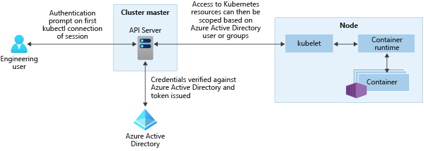

# Azure Kubernetes Service (AKS) 的存取與身分識別選項

有不同的方式可以進行驗證、控制存取/授權及保護 Kubernetes 叢集。 使用 Kubernetes 角色型存取控制（RBAC），您可以授與使用者、群組和服務帳戶只存取所需的資源。 使用 Azure Kubernetes Service （AKS），您可以使用 Azure Active Directory 和 Azure RBAC 進一步增強安全性和許可權結構。 這些方法可協助您保護叢集存取，並僅提供開發人員和操作員的最低必要許可權。

本文所介紹的核心概念，可協助您在 AKS 中驗證和指派權限：

- [Kubernetes 以角色為基礎的存取控制（RBAC）](#kubernetes-role-based-access-controls-rbac)
  - [Roles 和 ClusterRoles](#roles-and-clusterroles)
  - [RoleBindings 和 ClusterRoleBindings](#rolebindings-and-clusterrolebindings) 
  - [Kubernetes 服務帳戶](#kubernetes-service-accounts)
- [Azure Active Directory 整合](#azure-active-directory-integration)
- [Azure RBAC](#azure-role-based-access-controls-rbac)
  - [用來授權存取 AKS 資源的 Azure RBAC](#azure-rbac-to-authorize-access-to-the-aks-resource)
  - [適用于 Kubernetes 授權的 Azure RBAC （預覽）](#azure-rbac-for-kubernetes-authorization-preview)

## Kubernetes 以角色為基礎的存取控制（RBAC）

為了提供使用者可以執行之動作的細微篩選，Kubernetes 會使用角色型存取控制（RBAC）。 此控制機制可讓您指派權限給使用者或使用者群組，以執行像是建立或修改資源，或檢視執行中應用程式工作負載的記錄等動作。 這些權限可以只限於單一命名空間，或授與給整個 AKS 叢集。 透過 Kubernetes RBAC，您可以建立「角色」** 來定義權限，然後藉由「角色繫結」** 將這些角色指派給使用者。

如需詳細資訊，請參閱[使用 RBAC 授權][kubernetes-rbac]。

### Roles 和 ClusterRoles

使用 Kubernetes RBAC 將權限指派給使用者之前，您必須先將這些權限定義為「角色」**。 Kubernetes 角色會「授與」** 權限。 沒有「*拒絕*」許可權的概念。

Roles (角色) 會用來授與一個命名空間內的權限。 如果您需要將權限授與整個叢集，或授與指定命名空間外部的叢集資源，可以改用 ClusterRoles**。

ClusterRole 會以同樣方式將權限授與資源，但這些權限可以套用至整個叢集中的資源，而不是特定命名空間中的資源。

### RoleBindings 和 ClusterRoleBindings

一旦將角色定義為可授與權限給資源，您就可以透過 RoleBinding** 指派這些 Kubernetes RBAC 權限。 如果您的 AKS 叢集[與 Azure Active Directory 整合](#azure-active-directory-integration)，系結就是那些 Azure AD 使用者被授與在叢集內執行動作之許可權的方式，請參閱如何[使用角色型存取控制和 Azure Active Directory 身分識別控制叢集資源的存取權](azure-ad-rbac.md)。

角色繫結會用來為指定命名空間指派角色。 此方法可讓您以邏輯方式區隔單一 AKS 叢集，讓使用者只能存取獲派命名空間中的應用程式資源。 如果您需要將角色繫結到整個叢集，或繫結到指定命名空間外部的叢集資源，可以改用 ClusterRoleBindings**。

ClusterRoleBinding 會以同樣方式將角色繫結到使用者，但這些角色可以套用至整個叢集中的資源，而不是特定命名空間中的資源。 此方法可讓您允許系統管理員或支援工程師存取 AKS 叢集中的所有資源。

> [!NOTE]
> Microsoft/AKS 所採取的任何叢集動作，都是在內建的 Kubernetes 角色 `aks-service` 和內建角色系結之下，以使用者同意來進行 `aks-service-rolebinding` 。 此角色可讓 AKS 對叢集問題進行疑難排解和診斷，但無法修改許可權，也無法建立角色或角色系結，或其他高許可權動作。 只有在具有即時（JIT）存取權的主動式支援票證底下，才會啟用角色存取。 閱讀更多[AKS 支援原則](support-policies.md)的相關資訊。

### Kubernetes 服務帳戶

Kubernetes 的其中一個主要使用者類型是「服務帳戶」**。 服務帳戶存在 Kubernetes API 中，並受其管理。 服務帳戶的認證會儲存為 Kubernetes 祕密，如此便可讓已獲授權的 Pod 用這些認證與 API 伺服器進行通訊。 大部分的 API 要求會為服務帳戶或一般使用者帳戶提供驗證權杖。

一般使用者帳戶可讓人為系統管理員或開發人員提供更傳統的存取權，而不只是服務和處理常式。 Kubernetes 本身並不提供一般使用者帳戶和密碼儲存所在的身分識別管理解決方案。 而是將外部身分識別解決方案整合到 Kubernetes。 對 AKS 叢集而言，此整合的身分識別解決方案就是 Azure Active Directory。

如需有關 Kubernetes 中身分識別選項的詳細資訊，請參閱 [Kubernetes 驗證][kubernetes-authentication]。

## Azure Active Directory 整合

AKS 叢集的安全性可以透過整合的 Azure Active Directory (AD) 來加強。 以數十年企業身分識別管理技術為基礎，Azure AD 是多租用戶雲端式目錄，也是身分識別管理服務，可將核心目錄服務、應用程式存取管理、身分識別保護結合在單一解決方案中。 透過 Azure AD，您可以將內部部署身分識別整合至 AKS 叢集，以對帳戶管理和安全性提供單一來源。

透過與 Azure AD 整合的 AKS 叢集，您可以允許使用者或群組存取命名空間內或叢集上的 Kubernetes 資源。 若要取得 `kubectl` 設定內容，使用者可執行 [az aks get-credentials][az-aks-get-credentials] 命令。 當使用者接著與 AKS 叢集互動時 `kubectl` ，系統會提示他們使用其 Azure AD 認證登入。 此方法可對使用者帳戶管理和密碼認證提供單一來源。 使用者只能存取叢集系統管理員所定義的資源。

透過 OpenID Connect 對 AKS 叢集提供 Azure AD 驗證。 OpenID Connect 是以 OAuth 2.0 通訊協定為建置基礎的身分識別層。 如需 OpenID Connect 的詳細資訊，請參閱[OPEN ID connect 檔][openid-connect]。 從 Kubernetes 叢集內部，會使用[Webhook 權杖驗證][webhook-token-docs]來驗證驗證權杖。 Webhook 權杖驗證已設定並當作 AKS 叢集的一部分管理。

從 Kubernetes 叢集內部，Webhook 權杖驗證用來確認驗證權杖。 Webhook 權杖驗證已設定並當作 AKS 叢集的一部分管理。

### Webhook 和 API 伺服器

如上圖所示，API 伺服器會呼叫 AKS webhook 伺服器，並執行下列步驟：

1. Kubectl 會使用 Azure AD 用戶端應用程式，透過[OAuth 2.0 裝置授權授與流程](../active-directory/develop/v2-oauth2-device-code.md)來登入使用者。
2. Azure AD 提供 access_token、id_token 和 refresh_token。
3. 使用者使用來自 kubeconfig 的 access_token 提出 kubectl 的要求。
4. Kubectl 會將 access_token 傳送至 Kube-apiserver。
5. API 伺服器是使用 Auth WebHook 伺服器進行設定，以執行驗證。
6. 驗證 webhook 伺服器會藉由檢查 Azure AD 公開簽署金鑰來確認 JSON Web 權杖簽章是否有效。
7. 伺服器應用程式會使用使用者提供的認證，從 MS 圖形 API 查詢已登入使用者的群組成員資格。
8. 回應會以使用者資訊（例如存取權杖的使用者主體名稱（UPN）宣告）和使用者的群組成員資格（根據物件識別碼）傳送至 Kube-apiserver。
9. API 會根據 Kubernetes 角色/接著執行授權決策。
10. 授權之後，API 伺服器會將回應傳回給 kubectl。
11. Kubectl 會提供意見反應給使用者。
 
**[在這裡](managed-aad.md)瞭解如何整合 AKS 與 AAD。**

## Azure 角色型存取控制 (RBAC)

Azure RBAC 是建置於 [Azure Resource Manager](../azure-resource-manager/management/overview.md) 上的授權系統，可提供更細緻的 Azure 資源存取管理。

 Azure RBAC 是設計用來處理 Azure 訂用帳戶內的資源，而 Kubernetes RBAC 是設計用來處理 AKS 叢集中的 Kubernetes 資源。 

透過 Azure RBAC，您可以建立「角色定義」** 來概述要套用的權限。 接著，使用者或群組會透過特定*範圍*的*角色指派*（可能是個別資源、資源群組或訂用帳戶）指派此角色定義。

如需詳細資訊，請參閱[何謂 Azure RBAC？][azure-rbac]

完全操作 AKS 叢集所需的存取層級有兩種： 
1. [存取 Azure 訂用帳戶中的 AKS 資源](#azure-rbac-to-authorize-access-to-the-aks-resource)。 此程式可讓您使用 AKS Api 來控制要調整或升級叢集的專案，以及提取您的 kubeconfig。
2. Kubernetes API 的存取權。 此存取權可透過[KUBERNETES RBAC](#kubernetes-role-based-access-controls-rbac) （傳統）來控制，或藉由[整合 AZURE RBAC 與 AKS 來進行 Kubernetes 授權](#azure-rbac-for-kubernetes-authorization-preview)

### 用來授權存取 AKS 資源的 Azure RBAC

透過 Azure RBAC，您可以為使用者（或身分識別）提供一或多個訂用帳戶中 AKS 資源的細微存取權。 例如，您可能會有[Azure Kubernetes Service 參與者角色](../role-based-access-control/built-in-roles.md#azure-kubernetes-service-contributor-role)，可讓您執行像是調整和升級叢集等動作。 另一位使用者可能會擁有僅授與系統管理員 kubeconfig 許可權的 [ [Azure Kubernetes Service 叢集管理員] 角色](../role-based-access-control/built-in-roles.md#azure-kubernetes-service-cluster-admin-role)。

或者，您可以將一般[參與者](../role-based-access-control/built-in-roles.md#contributor)角色授與使用者，這會包含上述許可權，以及 AKS 資源上可能發生的每個動作，但管理許可權本身除外。

深入瞭解如何使用 Azure RBAC 來保護 kubeconfig 檔案的存取權，以在[這裡](control-kubeconfig-access.md)提供 Kubernetes API 的存取權。

### 適用于 Kubernetes 授權的 Azure RBAC （預覽）

使用 Azure RBAC 整合時，AKS 會使用 Kubernetes 授權 webhook 伺服器，讓您使用 Azure RBAC 角色定義和角色指派來管理 Azure AD 整合式 K8s 叢集資源的許可權和指派。

如上圖所示，當使用 Azure RBAC 整合時，Kubernetes API 的所有要求都會遵循與[Azure Active integration 一節](#azure-active-directory-integration)中所述相同的驗證流程。 

但在那之後，您不只依賴 Kubernetes RBAC 來進行授權，而是由 Azure 授權，只要 AAD 中有要求的身分識別就可以完成。 如果身分識別不存在於 AAD 中，例如 Kubernetes 服務帳戶，則 Azure RBAC 將不會開始，而是正常的 Kubernetes RBAC。

在此案例中，您可以為使用者提供四個內建角色的其中一個，或建立自訂角色，如同您對 Kubernetes 角色所做的動作，但在此情況下使用 Azure RBAC 機制和 Api。 

例如，這項功能不僅可讓使用者在訂用帳戶之間授與 AKS 資源的許可權，還能為他們提供在控制 Kubernetes API 存取權的每個叢集內擁有的角色和許可權。 例如，您可以授與 `Azure Kubernetes Service RBAC Viewer` 訂用帳戶範圍的角色，而其收件者將能夠列出並取得所有叢集的所有 Kubernetes 物件，但不能加以修改。

#### 內建角色

AKS 提供下列四個內建角色。 它們類似于[Kubernetes 內建角色](https://kubernetes.io/docs/reference/access-authn-authz/rbac/#user-facing-roles)，但有一些差異，例如支援 CRDs。 如需每個內建角色所允許動作的完整清單，請參閱[這裡](../role-based-access-control/built-in-roles.md)。

| 角色                                | 描述  |
|-------------------------------------|--------------|
| Azure Kubernetes Service RBAC 檢視器  | 允許唯讀存取，以查看命名空間中的大部分物件。 它不允許查看角色或角色系結。 此角色不允許 `Secrets` 進行流覽，因為讀取秘密的內容可以存取 `ServiceAccount` 命名空間中的認證，這會允許 `ServiceAccount` 在命名空間（許可權提升形式）中使用 API 存取  |
| Azure Kubernetes Service RBAC 寫入器 | 允許對命名空間中的大部分物件進行讀取/寫入存取。 此角色不允許 [角色] 或 [角色系結] 的流覽或修改。 不過，此角色可讓您以 `Secrets` 命名空間中的任何 ServiceAccount 存取和執行 pod，因此可以用來取得命名空間中任何 ServiceAccount 的 API 存取層級。 |
| Azure Kubernetes Service RBAC 管理員  | 允許在命名空間內授與系統管理員存取權。 允許對命名空間（或叢集範圍）中大部分資源的讀取/寫入存取，包括在命名空間內建立角色和角色系結的能力。 此角色不允許對資源配額或命名空間本身的寫入存取權。 |
| Azure Kubernetes Service RBAC 叢集系統管理員  | 允許超級使用者存取在任何資源上執行任何動作。 它可讓您完整控制叢集中的每個資源和所有命名空間。 |

**請[在這裡](manage-azure-rbac.md)瞭解如何利用 Azure RBAC 進行 Kubernetes 授權。**

## 後續步驟

- 若要開始使用 Azure AD 和 Kubernetes RBAC，請參閱[整合 Azure Active Directory 與 AKS][aks-aad]。
- 如需相關的最佳作法，請參閱[AKS 中驗證和授權的最佳做法][operator-best-practices-identity]。
- 若要開始使用 Azure RBAC 進行 Kubernetes 授權，請參閱[使用 AZURE rbac 在 Azure Kubernetes Service （AKS）叢集中授權存取](manage-azure-rbac.md)。
- 若要開始保護您的 kubeconfig 檔案，請參閱限制對叢集[設定檔的存取](control-kubeconfig-access.md)

如需有關 Kubernetes 及 AKS 核心概念的詳細資訊，請參閱下列文章：

- [Kubernetes / AKS 叢集和工作負載][aks-concepts-clusters-workloads]
- [Kubernetes / AKS 安全性][aks-concepts-security]
- [Kubernetes / AKS 虛擬網路][aks-concepts-network]
- [Kubernetes / AKS 儲存體][aks-concepts-storage]
- [Kubernetes / AKS 調整][aks-concepts-scale]

<!-- LINKS - External -->
[kubernetes-authentication]: https://kubernetes.io/docs/reference/access-authn-authz/authentication
[webhook-token-docs]: https://kubernetes.io/docs/reference/access-authn-authz/authentication/#webhook-token-authentication
[kubernetes-rbac]: https://kubernetes.io/docs/reference/access-authn-authz/rbac/

<!-- LINKS - Internal -->
[openid-connect]: ../active-directory/develop/v2-protocols-oidc.md
[az-aks-get-credentials]: /cli/azure/aks#az-aks-get-credentials
[azure-rbac]: ../role-based-access-control/overview.md
[aks-aad]: managed-aad.md
[aks-concepts-clusters-workloads]: concepts-clusters-workloads.md
[aks-concepts-security]: concepts-security.md
[aks-concepts-scale]: concepts-scale.md
[aks-concepts-storage]: concepts-storage.md
[aks-concepts-network]: concepts-network.md
[operator-best-practices-identity]: operator-best-practices-identity.md
