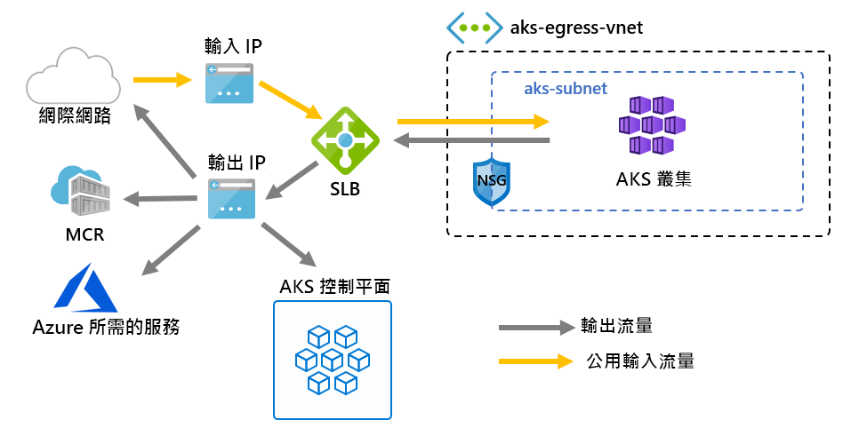

# 使用使用者定義的路由自訂叢集輸出

您可以自訂來自 AKS 叢集的輸出以符合特定案例。 根據預設，AKS 會布建要設定並用於輸出的標準 SKU Load Balancer。 不過，如果不允許公用 IP 或輸出需要額外的躍點，則預設設定可能不符合所有案例的需求。

此文章將逐步解說如何自訂叢集的輸出路由以支援自訂網路案例，例如，不允許公用 IP，以及要求叢集位於網路虛擬設備 (NVA) 的案例。

## Prerequisites
* Azure CLI 2.0.81 版或更新版本
* `2020-01-01` 或更新的 API 版本

## 限制
* OutboundType 只能在叢集建立時定義，之後就無法更新。
* 設定 `outboundType` 需要具有 `vm-set-type` `VirtualMachineScaleSets` 和 `load-balancer-sku` `Standard` 的 AKS 叢集。
* 將 `outboundType` 設定為 `UDR` 值，需要使用者定義的路由，以及適用於叢集的有效連出連線能力。
* 將 `outboundType` 設定為 `UDR` 值，表示路由傳送到負載平衡器的輸入來源 IP，可能會與叢集的連出輸出目的地位址**不相符**。

## AKS 中連出類型的概觀

您可以使用負載平衡器或使用者定義路由的唯一 `outboundType` 類型來自訂 AKS 叢集。

> [!IMPORTANT]
> 傳出類型只會影響叢集的連出流量。 如需詳細資訊，請參閱 [設定輸入控制器](ingress-basic.md)。

> [!NOTE]
> 您可以使用自己的 [路由表][byo-route-table] 搭配 UDR 和 kubenet 網路功能。 請確定您的叢集身分識別 (服務主體或受控識別) 具有自訂路由表的「參與者」許可權。

### LoadBalancer 的連出類型

如果 `loadBalancer` 設定，AKS 會自動完成下列設定。 負載平衡器可透過 AKS 指派的公用 IP 來用於輸出。 連出類型的 `loadBalancer` 支援 `loadBalancer` 類型的 Kubernetes 服務，其會預期 AKS 資源提供者所建立之負載平衡器的輸出。

下列設定是由 AKS 完成。
   * 公用 IP 位址會針對叢集輸出來佈建。
   * 此公用 IP 位址會指派給負載平衡器資源。
   * 系統會針對叢集中的代理程式節點設定負載平衡器的後端集區。

以下是預設部署於 AKS 叢集中的網路拓撲，其會使用 `loadBalancer` 的 `outboundType`。

### UserDefinedRouting 的連出類型

> [!NOTE]
> 使用連出類型是一個進階的網路案例，且需要適當的網路設定。

如果 `userDefinedRouting` 設定了，AKS 將不會自動設定輸出路徑。 輸出設定必須由您完成。

AKS 叢集必須部署到現有的虛擬網路，並具有先前已設定的子網，因為在未使用標準負載平衡器 (SLB) 架構時，您必須建立明確的輸出。 因此，此架構需要明確地將輸出流量傳送至應用裝置，例如防火牆、閘道或 proxy，或允許網路位址轉譯 (NAT) 由指派給標準負載平衡器或設備的公用 IP 來完成。

AKS 資源提供者將會部署標準負載平衡器 (SLB)。 負載平衡器不會使用任何規則進行設定，而且在 [設定規則之前，不會產生任何費用](https://azure.microsoft.com/pricing/details/load-balancer/)。 AKS **不** 會自動布建 SLB 前端的公用 IP 位址，也不會自動設定負載平衡器後端集區。

## 部署具有 UDR 和 Azure 防火牆連出類型的叢集

為了說明使用使用者定義路由的輸出類型來應用叢集，可以在具有 Azure 防火牆的虛擬網路上，于自己的子網中設定叢集。 請參閱 [使用 Azure 防火牆限制輸出流量範例](limit-egress-traffic.md#restrict-egress-traffic-using-azure-firewall)中的此範例。

> [!IMPORTANT]
> UDR 的輸出類型需要路由表中的 0.0.0.0/0 和下一個躍點目的地的路由，)  (網路虛擬裝置。
> 路由表已經有預設的 0.0.0.0/0 到網際網路，如果沒有公用 IP 到 SNAT，那麼只要新增此路由就不會提供您輸出。 AKS 會驗證您不會建立指向網際網路的 0.0.0.0/0 路由，而是改為 NVA 或閘道等。
> 
> 使用輸出類型的 UDR 時，除非已設定 *loadbalancer* 類型的服務，否則不會建立負載平衡器公用 IP 位址。

## 後續步驟

請參閱 [Azure 網路 UDR 概觀](../virtual-network/virtual-networks-udr-overview.md) \(部分機器翻譯\)。

請參閱[如何建立、變更或刪除路由表](../virtual-network/manage-route-table.md) \(部分機器翻譯\)。

<!-- LINKS - internal -->
[az-aks-get-credentials]: /cli/azure/aks?view=azure-cli-latest#az-aks-get-credentials
[byo-route-table]: configure-kubenet.md#bring-your-own-subnet-and-route-table-with-kubenet
