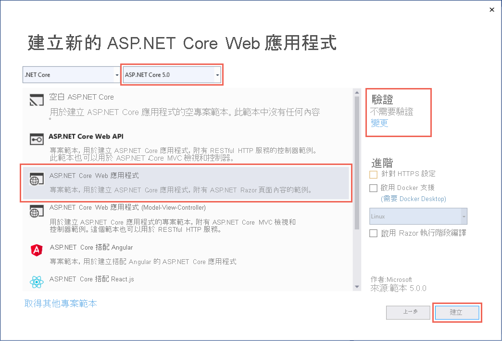
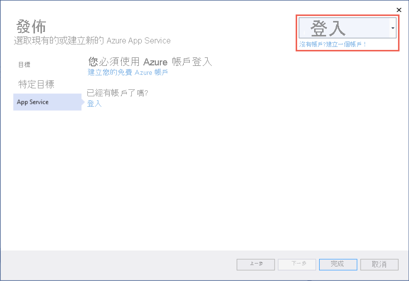
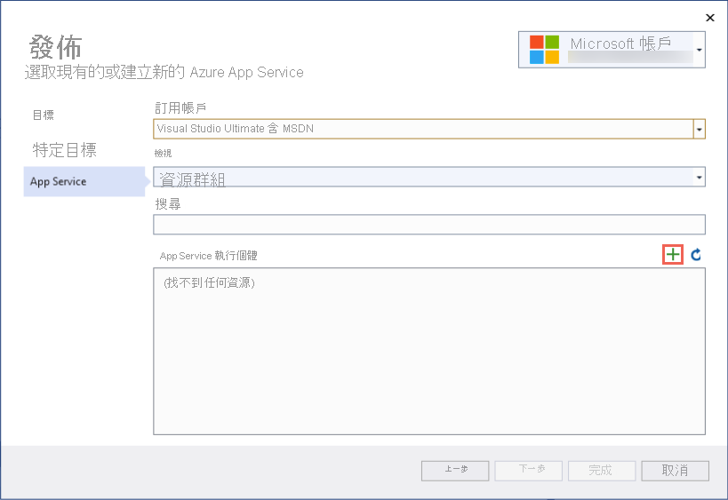
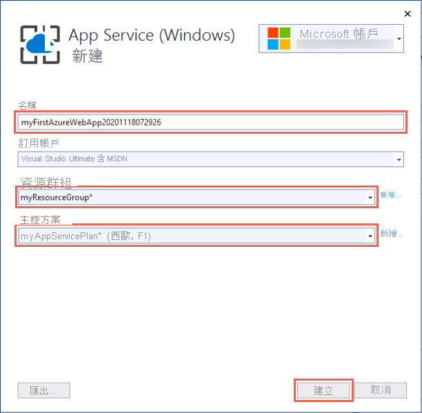
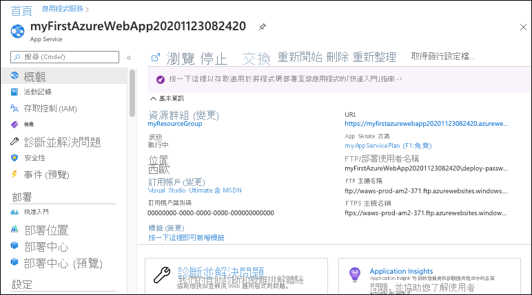
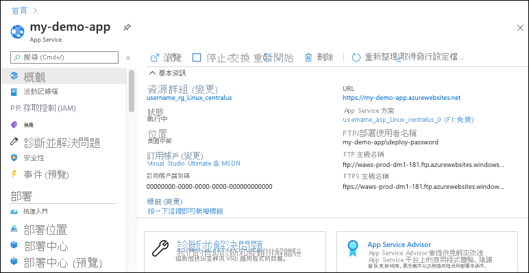

# <a name="quickstart-create-an-aspnet-core-web-app-in-azure"></a>快速入門：在 Azure 中建立 ASP.NET Core Web 應用程式

::: zone pivot="platform-windows"  

在本快速入門中，您將了解如何建立第一個 ASP.NET Core Web 應用程式，並將其部署至 [Azure App Service](overview.md)。 App Service 支援 .NET 5.0 應用程式。

當您完成時，您會有一個 Azure 資源群組，其中包含 App Service 主控方案和已部署 Web 應用程式的 App Service。

## <a name="prerequisites"></a>Prerequisites

- 具有有效訂用帳戶的 Azure 帳戶。 [免費建立帳戶](https://azure.microsoft.com/free/dotnet/)。
- 安裝包含 **ASP.NET 和 Web 開發** 工作負載的 <a href="https://www.visualstudio.com/downloads/" target="_blank">Visual Studio 2019</a>。

  若您已安裝 Visual Studio 2019：

  - 選取 [說明] > [檢查更新] 以安裝最新的 Visual Studio 更新。 最新的更新包含 .NET 5.0 SDK。
  - 選取 **[工具]**  >  **[取得工具及功能]** 。


## <a name="create-an-aspnet-core-web-app"></a>建立 ASP.NET Core Web 應用程式

請遵循下列步驟在 Visual Studio 中建立 ASP.NET Core Web 應用程式：

# <a name="net-core-31"></a>[.NET Core 3.1](#tab/netcore31)

1. 開啟 Visual Studio，然後選取 [建立新專案]  。

1. 在 [建立新專案]  中選取 [ASP.NET Core Web 應用程式]  ，並確認 **C#** 已列在該選擇的語言中，然後選取 [下一步]  。

1. 在 [設定新專案]  中，將 Web 應用程式專案命名為 myFirstAzureWebApp  ，然後選取 [建立]  。

   

1. 您可以將任何類型的 ASP.NET Core Web 應用程式部署至 Azure，但在本快速入門中，請選擇 [Web 應用程式]  範本。 請確定 [驗證]  已設定為 [不需要驗證]  ，且未選取其他選項。 然後，選取 [Create]  \(建立\)。

    
   
1. 從 Visual Studio 功能表中，選取 **[偵錯]**  >  **[啟動但不偵錯]** 以在本機執行您的 Web 應用程式。

   

# <a name="net-50"></a>[.NET 5.0](#tab/net50)

1. 開啟 Visual Studio，然後選取 [建立新專案]  。

1. 在 [建立新專案]  中選取 [ASP.NET Core Web 應用程式]  ，並確認 **C#** 已列在該選擇的語言中，然後選取 [下一步]  。

1. 在 [設定新專案]  中，將 Web 應用程式專案命名為 myFirstAzureWebApp  ，然後選取 [建立]  。

   

1. 對於 .NET 5.0 應用程式，請在下拉式清單中選取 [ASP.NET Core 5.0]。

1. 您可以將任何類型的 ASP.NET Core Web 應用程式部署至 Azure，但在本快速入門中，請選擇 [ASP.NET Core Web 應用程式] 範本。 請確定 [驗證]  已設定為 [不需要驗證]  ，且未選取其他選項。 然後，選取 [Create]  \(建立\)。

    
   
1. 從 Visual Studio 功能表中，選取 **[偵錯]**  >  **[啟動但不偵錯]** 以在本機執行您的 Web 應用程式。

   

---

## <a name="publish-your-web-app"></a>發佈 Web 應用程式

若要發佈您的 Web 應用程式，您必須先建立並設定新的 App Service，讓您可以將應用程式發佈到其中。 

在設定 App Service 的過程中，您將建立：

- 新的[資源群組](../azure-resource-manager/management/overview.md#terminology)，以包含此服務的所有 Azure 資源。
- 新的[主控方案](./overview-hosting-plans.md)，以指定用來裝載應用程式的 Web 伺服器陣列位置、大小和功能。

請遵循下列步驟來建立您的 App Service，然後發佈您的 Web 應用程式：

1. 在 [方案總管]  中，以滑鼠右鍵按一下 **myFirstAzureWebApp** 專案，然後選取 [發佈]  。 

1. 在 [發佈] 中選取 [Azure]，然後按 [下一步]。

1. 您的選項取決於您是否已登入 Azure，以及是否已將 Visual Studio 帳戶連結至 Azure 帳戶。 選取 [新增帳戶] 或 [登入] 來登入 Azure 訂用帳戶。 若您已經登入，請選取要使用的帳戶。

   

1. 在 [App Service 執行個體] 右側，按一下 **+** 。

   

1. 針對 [訂用帳戶]，請接受列出的訂用帳戶，或從下拉式清單中選取一個新的訂用帳戶。

1. 在 [資源群組] 中選取 [新增]。 在 [新增資源群組名稱]  中，輸入 myResourceGroup  ，然後選取 [確定]  。 

1. 在 [主控方案]  中選取 [新增]  。 

1. 在 [主控方案：  新建] 對話方塊中，輸入下表中指定的值：

   | 設定  | 建議的值 | 描述 |
   | -------- | --------------- | ----------- |
   | **主控方案**  | *myFirstAzureWebAppPlan* | App Service 方案的名稱。 |
   | **位置**      | 歐洲西部 | 裝載 Web 應用程式的資料中心。 |
   | **大小**          | *免費* | [定價層](https://azure.microsoft.com/pricing/details/app-service/?ref=microsoft.com&utm_source=microsoft.com&utm_medium=docs&utm_campaign=visualstudio)可決定裝載功能。 |
   
   

1. 在 [名稱] 中，輸入唯一的應用程式名稱 (只包含 `a-z`、`A-Z`、`0-9` 和 `-` 等有效字元)。 您可以接受自動產生的唯一名稱。 Web 應用程式的 URL 是 `http://<app-name>.azurewebsites.net`，其中 `<app-name>` 是您的應用程式名稱。

2. 選取 [建立] 以建立 Azure 資源。

   

   精靈完成之後，系統就會為您建立 Azure 資源，然後您就可以開始發佈。

3. 選取 [完成] 以關閉精靈。

1. 在 [發佈] 頁面中，按一下 [發佈]。 Visual Studio 會建立和封裝應用程式，並將其發佈至 Azure，然後在預設瀏覽器中啟動應用程式。

   

**恭喜！** ASP.NET Core Web 應用程式已在 Azure App Service 中即時執行。

## <a name="update-the-app-and-redeploy"></a>更新應用程式並重新部署

請遵循下列步驟來更新和重新部署您的 Web 應用程式：

1. 在 [方案總管]  的專案底下，開啟 [頁面]   > [Index.cshtml]  。

1. 將整個 `<div>` 標記取代為下列程式碼：

   ```html
   <div class="jumbotron">
       <h1>ASP.NET in Azure!</h1>
       <p class="lead">This is a simple app that we've built that demonstrates how to deploy a .NET app to Azure App Service.</p>
   </div>
   ```

1. 若要重新部署至 Azure，請在 [方案總管]  中，以滑鼠右鍵按一下 **myFirstAzureWebApp** 專案，然後選取 [發佈]  。

1. 在 [發佈]  摘要頁面中，選取 [發佈]  。

   <!--  -->

    發佈完成時，Visual Studio 會啟動瀏覽器以前往 Web 應用程式的 URL。

    

## <a name="manage-the-azure-app"></a>管理 Azure 應用程式

若要管理 Web 應用程式，請移至 [Azure 入口網站](https://portal.azure.com)，然後搜尋並選取 [應用程式服務]  。

![選取 [應用程式服務]](./media/quickstart-dotnetcore/app-services.png)

在 [應用程式服務]  頁面上，選取您的 Web 應用程式名稱。

:::image type="content" source="./media/quickstart-dotnetcore/select-app-service.png" alt-text="[應用程式服務] 頁面的螢幕擷取畫面，其中已選取範例 web 應用程式。":::

Web 應用程式的 **概觀** 頁面，其中包含瀏覽、停止、啟動、重新啟動和刪除等基本管理選項。 左側功能表提供的頁面可用來進一步設定您的應用程式。



[!INCLUDE [Clean-up section](../../includes/clean-up-section-portal.md)]

## <a name="next-steps"></a>後續步驟

在本快速入門中，您已使用 Visual Studio 來建立 ASP.NET Core Web 應用程式，並將其部署至 Azure App Service。

請前往下一篇文章，了解如何建立 .NET Core 應用程式，並將其連線到 SQL Database：

> [!div class="nextstepaction"]
> [ASP.NET Core 搭配 SQL Database](tutorial-dotnetcore-sqldb-app.md)

> [!div class="nextstepaction"]
> [設定 ASP.NET Core 應用程式](configure-language-dotnetcore.md)

::: zone-end  

::: zone pivot="platform-linux"
[Linux 上的 App Service](overview.md#app-service-on-linux) 使用 Linux 作業系統提供可高度擴充、自我修復的 Web 主機服務。 本快速入門示範如何在 Linux 上的 App Service上建立 [.NET Core](/aspnet/core/) 應用程式。 您可使用 [Azure CLI](/cli/azure/get-started-with-azure-cli) 建立應用程式，而且使用 Git 將 .NET Core 程式碼部署至應用程式。


您可以使用 Mac、Windows 或 Linux 機器，依照本文中的步驟操作。

[!INCLUDE [quickstarts-free-trial-note](../../includes/quickstarts-free-trial-note.md)]

## <a name="set-up-your-initial-environment"></a>設定初始環境

# <a name="net-core-31"></a>[.NET Core 3.1](#tab/netcore31)

若要完成本快速入門：

* <a href="https://dotnet.microsoft.com/download/dotnet-core/3.1" target="_blank">安裝最新的 .NET Core 3.1 SDK</a>。
* <a href="/cli/azure/install-azure-cli" target="_blank">安裝最新的 Azure CLI</a>。

# <a name="net-50"></a>[.NET 5.0](#tab/net50)

若要完成本快速入門：

* <a href="https://dotnet.microsoft.com/download/dotnet/5.0" target="_blank">安裝最新的 .NET 5.0 SDK</a>。
* <a href="/cli/azure/install-azure-cli" target="_blank">安裝最新的 Azure CLI</a>。

---

[有任何問題嗎？請告訴我們。](https://aka.ms/DotNetAppServiceLinuxQuickStart)

## <a name="create-the-app-locally"></a>在本機建立應用程式

在您電腦上的終端機視窗中，建立名為 `hellodotnetcore` 的目錄，並將目前的目錄變更為該目錄。

```bash
mkdir hellodotnetcore
cd hellodotnetcore
```

建立新的 .NET Core 應用程式。

```bash
dotnet new web
```

## <a name="run-the-app-locally"></a>在本機執行應用程式

在本機執行應用程式，以便您查看它在部署至 Azure 時的樣貌。 

```bash
dotnet run
```

開啟網頁瀏覽器，然後巡覽至位於 `http://localhost:5000` 的應用程式。

您會看到來自範例應用程式的 **Hello World** 訊息顯示在網頁中。


[有任何問題嗎？請告訴我們。](https://aka.ms/DotNetAppServiceLinuxQuickStart)

## <a name="sign-into-azure"></a>登入 Azure
在終端機視窗中，使用下列命令登入 Azure：

```azurecli
az login
```

## <a name="deploy-the-app"></a>部署應用程式

使用 `az webapp up` 命令，將程式碼部署在本機資料夾 (*hellodotnetcore*) 中：

```azurecli
az webapp up --sku F1 --name <app-name> --os-type linux
```

- 如果無法辨識 `az` 命令，請確定您已安裝 Azure CLI，如[設定初始環境](#set-up-your-initial-environment)所說明。
- 以 Azure 中的唯一名稱 (有效字元為 `a-z`、`0-9` 和`-`) 取代 `<app-name>`。 良好的模式是使用您的公司名稱和應用程式識別碼的組合。
- `--sku F1` 引數會在免費定價層上建立 Web 應用程式。 省略這個引數並使用進階層，如此會產生每小時成本。
- 您可以選擇性地加入引數 `--location <location-name>`，其中 `<location-name>` 是可用的 Azure 區域。 您可執行 [`az account list-locations`](/cli/azure/appservice#az-appservice-list-locations) 命令，擷取 Azure 帳戶的允許區域清單。

此命令可能需要數分鐘才能完成。 執行時，此命令會提供有關建立資源群組、App Service 方案和裝載應用程式、設定記錄，然後執行 ZIP 部署的訊息。 接著會提供「您可以在 http://&lt;app-name&gt;.azurewebsites.net 啟動應用程式」的訊息，這是 Azure 上應用程式的 URL。

# <a name="net-core-31"></a>[.NET Core 3.1](#tab/netcore31)


# <a name="net-50"></a>[.NET 5.0](#tab/net50)

<!-- Deploy the code in your local folder (*hellodotnetcore*) using the `az webapp up` command:

```azurecli
az webapp up --sku B1 --name <app-name> --os-type linux
```

- If the `az` command isn't recognized, be sure you have the Azure CLI installed as described in [Set up your initial environment](#set-up-your-initial-environment).
- Replace `<app-name>` with a name that's unique across all of Azure (*valid characters are `a-z`, `0-9`, and `-`*). A good pattern is to use a combination of your company name and an app identifier.
- The `--sku B1` argument creates the web app in the Basic pricing tier, which incurs an hourly cost. Omit this argument to use a faster premium tier, which costs more.
- You can optionally include the argument `--location <location-name>` where `<location-name>` is an available Azure region. You can retrieve a list of allowable regions for your Azure account by running the [`az account list-locations`](/cli/azure/appservice#az-appservice-list-locations) command.

The command may take a few minutes to complete. While running, it provides messages about creating the resource group, the App Service plan and hosting app, configuring logging, then performing ZIP deployment. It then gives the message, "You can launch the app at http://&lt;app-name&gt;.azurewebsites.net", which is the app's URL on Azure. -->


---

[有任何問題嗎？請告訴我們。](https://aka.ms/DotNetAppServiceLinuxQuickStart)

[!include [az webapp up command note](../../includes/app-service-web-az-webapp-up-note.md)]

## <a name="browse-to-the-app"></a>瀏覽至應用程式

使用 web 瀏覽器瀏覽至已部署的應用程式。

```bash
http://<app_name>.azurewebsites.net
```

具有內建映像的 .NET Core 程式碼範例正在 Linux 上的 App Service 中執行。


**恭喜！** 您已將第一個 .NET Core 應用程式部署至 Linux 上的 App Service。

[有任何問題嗎？請告訴我們。](https://aka.ms/DotNetAppServiceLinuxQuickStart)

## <a name="update-and-redeploy-the-code"></a>更新和重新部署程式碼

在本機目錄中，開啟 _Startup.cs_ 檔案。 在方法呼叫 `context.Response.WriteAsync` 中對文字進行小幅變更：

```csharp
await context.Response.WriteAsync("Hello Azure!");
```

儲存您的變更，然後再次使用 `az webapp up` 命令重新部署應用程式：

```azurecli
az webapp up
```

此命令會使用在 .azure/config 檔案中本機快取的值，包括應用程式名稱、資源群組和 App Service 方案。

部署完成後，切換回在「瀏覽至應用程式」  步驟中開啟的瀏覽器視窗，然後按 [重新整理]。


[有任何問題嗎？請告訴我們。](https://aka.ms/DotNetAppServiceLinuxQuickStart)

## <a name="manage-your-new-azure-app"></a>管理新的 Azure 應用程式

移至 <a href="https://portal.azure.com" target="_blank">Azure 入口網站</a>，以管理您所建立的應用程式。

按一下左側功能表中的 [應用程式服務]，然後按一下 Azure 應用程式的名稱。

:::image type="content" source="./media/quickstart-dotnetcore/portal-app-service-list-up.png" alt-text="[應用程式服務] 頁面的螢幕擷取畫面，其中顯示已選取的範例 Azure 應用程式。":::

您會看到應用程式的 [概觀] 頁面。 您可以在這裡執行基本管理工作，像是瀏覽、停止、啟動、重新啟動及刪除。 



左側功能表提供不同的頁面來設定您的應用程式。 

[!INCLUDE [cli-samples-clean-up](../../includes/cli-samples-clean-up.md)]

[有任何問題嗎？請告訴我們。](https://aka.ms/DotNetAppServiceLinuxQuickStart)

## <a name="next-steps"></a>後續步驟

> [!div class="nextstepaction"]
> [教學課程：ASP.NET Core 應用程式搭配 SQL Database](tutorial-dotnetcore-sqldb-app.md)

> [!div class="nextstepaction"]
> [設定 ASP.NET Core 應用程式](configure-language-dotnetcore.md)

::: zone-end