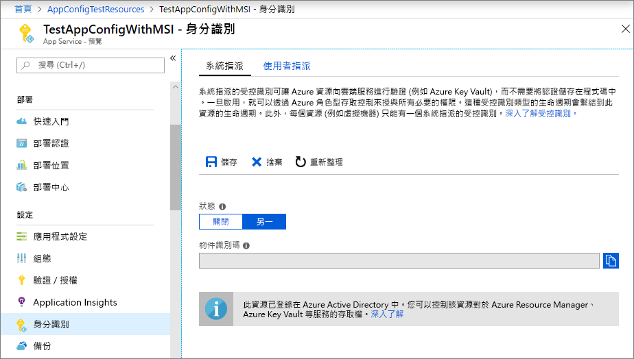

# <a name="integrate-with-azure-managed-identities"></a>與 Azure 受控識別整合

Azure Active Directory[受控](../active-directory/managed-identities-azure-resources/overview.md)識別可簡化雲端應用程式的秘密管理。 使用受控識別，您的程式碼可以使用為其執行所在之 Azure 服務所建立的服務主體。 您會使用受控識別，而不是使用儲存在 Azure Key Vault 中的個別認證或本機連接字串。 

Azure 應用程式組態及其 .NET Core、.NET Framework 和 JAVA 春季用戶端程式庫都內建了受控識別支援。 雖然您不需要使用它，但受控識別不需要包含秘密的存取權杖。 您的程式碼只能使用服務端點來存取應用程式組態存放區。 您可以直接在程式碼中內嵌此 URL，而不會公開任何秘密。

本文說明如何利用受控識別來存取應用程式組態。 本文會以快速入門中介紹的 Web 應用程式作為基礎。 繼續之前，請先[使用應用程式組態建立 ASP.NET Core 應用程式](./quickstart-aspnet-core-app.md)。

本文也會說明如何搭配應用程式組態的 Key Vault 參考來使用受控識別。 使用單一受控識別，您可以從應用程式組態順暢地存取 Key Vault 和設定值的秘密。 如果您想要探索這項功能，請先完成搭配[ASP.NET Core 使用 Key Vault 參考](./use-key-vault-references-dotnet-core.md)。

您可以使用任何程式碼編輯器來進行本教學課程中的步驟。 Windows、macOS 及 Linux 平台上都有提供的 [Visual Studio Code](https://code.visualstudio.com/) 是一個絕佳的選項。

在本文中，您將學會如何：

> [!div class="checklist"]
> * 授與「應用程式組態」的受控識別存取權。
> * 設定讓應用程式在您連線到「應用程式組態」時使用受控識別。
> * （選擇性）將您的應用程式設定為透過應用程式組態 Key Vault 參考連接到 Key Vault 時使用受控識別。

## <a name="prerequisites"></a>必要條件

若要完成本教學課程，您必須具備：

* [.NET Core SDK](https://www.microsoft.com/net/download/windows)。
* [Azure Cloud Shell 設定](https://docs.microsoft.com/azure/cloud-shell/quickstart)。

[!INCLUDE [quickstarts-free-trial-note](../../includes/quickstarts-free-trial-note.md)]

## <a name="add-a-managed-identity"></a>新增受控識別

若要在入口網站中設定受控識別，您必須先建立應用程式，然後再啟用此功能。

1. 如往常一般，在[Azure 入口網站](https://portal.azure.com)中建立應用程式服務實例。 在入口網站中移至該應用程式。

1. 在左側窗格中，向下捲動到 [設定]**** 群組，然後選取 [身分識別]****。

1. 在 [系統指派]**** 索引標籤上，將 [狀態]**** 切換成 [開啟]****，然後選取 [儲存]****。

1. 當系統指派的受控識別出現提示時，回答 **[是]** 。

    

## <a name="grant-access-to-app-configuration"></a>授與應用程式設定的存取權

1. 在 [ [Azure 入口網站](https://portal.azure.com)中，選取 [**所有資源**]，然後選取您在快速入門中建立的應用程式組態存放區。

1. 選取 [存取控制 (IAM)]。

1. 在 [檢查存取權]**** 索引標籤上，選取 [新增角色指派]**** 卡片 UI 中的 [新增]****。

1. 在 [**角色**] 下，選取 [**應用程式組態資料讀取器**]。 在 [存取權指派對象為]**** 底下，選取 [系統指派的受控識別]**** 底下的 [App Service]****。

1. 在 [訂用帳戶]**** 底下，選取您的 Azure 訂用帳戶。 選取您應用程式的 App Service 資源。

1. 選取 [儲存]。

    

1. 選擇性：如果您也想要授與 Key Vault 的存取權，請遵循[使用受控識別提供 Key Vault 驗證](https://docs.microsoft.com/azure/key-vault/managed-identity)中的指示。

## <a name="use-a-managed-identity"></a>建立受控識別

1. 新增對*Azure 身分識別*套件的參考：

    ```cli
    dotnet add package Azure.Identity
    ```

1. 尋找應用程式組態存放區的端點。 此 URL 會列在 [Azure 入口網站中存放區的 [**存取金鑰**] 索引標籤上。

1. 開啟 *appsettings.json*，然後新增下列指令碼。 以 *\<service_endpoint>* 您應用程式組態存放區的 URL 取代（包括括弧）。 

    ```json
    "AppConfig": {
        "Endpoint": "<service_endpoint>"
    }
    ```

1. 開啟*Program.cs*，並加入 `Azure.Identity` 和命名空間的參考 `Microsoft.Azure.Services.AppAuthentication` ：

    ```csharp-interactive
    using Azure.Identity;
    ```

1. 如果您只想要存取直接儲存在應用程式組態中的值，請藉 `CreateWebHostBuilder` 由取代方法來更新方法 `config.AddAzureAppConfiguration()` 。

    > [!IMPORTANT]
    > `CreateHostBuilder` 會取代 .NET Core 3.0 中的 `CreateWebHostBuilder`。  根據您的環境選取正確的語法。

    ### <a name="net-core-2x"></a>[.NET Core 2.x](#tab/core2x)

    ```csharp
        public static IWebHostBuilder CreateWebHostBuilder(string[] args) =>
            WebHost.CreateDefaultBuilder(args)
                .ConfigureAppConfiguration((hostingContext, config) =>
                {
                    var settings = config.Build();
                    config.AddAzureAppConfiguration(options =>
                        options.Connect(new Uri(settings["AppConfig:Endpoint"]), new ManagedIdentityCredential()));
                })
                .UseStartup<Startup>();
    ```

    ### <a name="net-core-3x"></a>[.NET Core 3.x](#tab/core3x)

    ```csharp
        public static IHostBuilder CreateHostBuilder(string[] args) =>
            Host.CreateDefaultBuilder(args)
            .ConfigureWebHostDefaults(webBuilder =>
            webBuilder.ConfigureAppConfiguration((hostingContext, config) =>
            {
                var settings = config.Build();
                    config.AddAzureAppConfiguration(options =>
                        options.Connect(new Uri(settings["AppConfig:Endpoint"]), new ManagedIdentityCredential()));
                })
                .UseStartup<Startup>());
    ```
    ---

1. 若要同時使用應用程式組態值和 Key Vault 參考，請更新*Program.cs* ，如下所示。 這段程式碼會使用建立新的 `KeyVaultClient` `AzureServiceTokenProvider` ，並將此參考傳遞給 `UseAzureKeyVault` 方法的呼叫。

    ### <a name="net-core-2x"></a>[.NET Core 2.x](#tab/core2x)

    ```csharp
            public static IWebHostBuilder CreateWebHostBuilder(string[] args) =>
                WebHost.CreateDefaultBuilder(args)
                    .ConfigureAppConfiguration((hostingContext, config) =>
                    {
                        var settings = config.Build();
                        var credentials = new ManagedIdentityCredential();

                        config.AddAzureAppConfiguration(options =>
                        {
                            options.Connect(new Uri(settings["AppConfig:Endpoint"]), credentials)
                                    .ConfigureKeyVault(kv =>
                                    {
                                        kv.SetCredential(credentials);
                                    });
                        });
                    })
                    .UseStartup<Startup>();
    ```

    ### <a name="net-core-3x"></a>[.NET Core 3.x](#tab/core3x)

    ```csharp
        public static IHostBuilder CreateHostBuilder(string[] args) =>
            Host.CreateDefaultBuilder(args)
            .ConfigureWebHostDefaults(webBuilder =>
            webBuilder.ConfigureAppConfiguration((hostingContext, config) =>
                    {
                        var settings = config.Build();
                        var credentials = new ManagedIdentityCredential();

                        config.AddAzureAppConfiguration(options =>
                        {
                            options.Connect(new Uri(settings["AppConfig:Endpoint"]), credentials)
                                    .ConfigureKeyVault(kv =>
                                    {
                                        kv.SetCredential(credentials);
                                    });
                        });
                    })
                    .UseStartup<Startup>());
    ```
    ---

    您現在可以存取 Key Vault 參考，就像任何其他應用程式組態金鑰一樣。 Config 提供者會使用 `KeyVaultClient` 您設定的來驗證 Key Vault 並取出值。

[!INCLUDE [Prepare repository](../../includes/app-service-deploy-prepare-repo.md)]

## <a name="deploy-from-local-git"></a>從本機 Git 進行部署

若要使用 Kudu 組建伺服器為您的應用程式啟用本機 Git 部署，最簡單的方式是使用[Azure Cloud Shell](https://shell.azure.com)。

### <a name="configure-a-deployment-user"></a>設定部署使用者

[!INCLUDE [Configure a deployment user](../../includes/configure-deployment-user-no-h.md)]

### <a name="enable-local-git-with-kudu"></a>使用 Kudu 啟用本機 Git
如果您的應用程式沒有本機 git 存放庫，則必須將它初始化。 若要初始化本機 git 存放庫，請從應用程式的專案目錄執行下列命令：

```cmd
git init
git add .
git commit -m "Initial version"
```

若要使用 Kudu 組建伺服器為您的應用程式啟用本機 Git 部署，請 [`az webapp deployment source config-local-git`](/cli/azure/webapp/deployment/source?view=azure-cli-latest#az-webapp-deployment-source-config-local-git) 在 Cloud Shell 中執行。

```azurecli-interactive
az webapp deployment source config-local-git --name <app_name> --resource-group <group_name>
```

此命令提供類似下列輸出的內容：

```json
{
  "url": "https://<username>@<app_name>.scm.azurewebsites.net/<app_name>.git"
}
```

### <a name="deploy-your-project"></a>部署專案

在_本機終端機視窗_中，將 Azure 遠端新增至您的本機 Git 存放庫。 將取代 _\<url>_ 為您從[啟用本機 Git 與 Kudu](#enable-local-git-with-kudu)中所獲得的 Git 遠端 URL。

```bash
git remote add azure <url>
```

推送到 Azure 遠端，使用下列命令來部署您的應用程式。 當系統提示您輸入密碼時，請輸入您在[設定部署使用者](#configure-a-deployment-user)中建立的密碼。 請勿使用您用來登入 Azure 入口網站的密碼。

```bash
git push azure master
```

您可能會在輸出中看到執行階段特定的自動化，例如適用於 ASP.NET 的 MSBuild、適用於 Node.js 的 `npm install`，以及適用於 Python 的 `pip install`。

### <a name="browse-to-the-azure-web-app"></a>瀏覽至 Azure Web 應用程式

使用瀏覽器來瀏覽至您的 Web 應用程式，以確認內容已部署。

```bash
http://<app_name>.azurewebsites.net
```

## <a name="use-managed-identity-in-other-languages"></a>以其他語言使用受控識別

適用於 .NET Framework 和 Java Spring 的應用程式設定提供者也有內建的受控識別支援。 當您設定其中一個提供者時，您可以使用存放區的 URL 端點，而不是它的完整連接字串。 

例如，您可以更新在快速入門中建立的 .NET Framework 主控台應用程式，以在*App.config*檔案中指定下列設定：

```xml
    <configSections>
        <section name="configBuilders" type="System.Configuration.ConfigurationBuildersSection, System.Configuration, Version=4.0.0.0, Culture=neutral, PublicKeyToken=b03f5f7f11d50a3a" restartOnExternalChanges="false" requirePermission="false" />
    </configSections>

    <configBuilders>
        <builders>
            <add name="MyConfigStore" mode="Greedy" endpoint="${Endpoint}" type="Microsoft.Configuration.ConfigurationBuilders.AzureAppConfigurationBuilder, Microsoft.Configuration.ConfigurationBuilders.AzureAppConfiguration" />
            <add name="Environment" mode="Greedy" type="Microsoft.Configuration.ConfigurationBuilders.EnvironmentConfigBuilder, Microsoft.Configuration.ConfigurationBuilders.Environment" />
        </builders>
    </configBuilders>

    <appSettings configBuilders="Environment,MyConfigStore">
        <add key="AppName" value="Console App Demo" />
        <add key="Endpoint" value ="Set via an environment variable - for example, dev, test, staging, or production endpoint." />
    </appSettings>
```

## <a name="clean-up-resources"></a>清除資源

[!INCLUDE [azure-app-configuration-cleanup](../../includes/azure-app-configuration-cleanup.md)]

## <a name="next-steps"></a>後續步驟
在本教學課程中，您已新增 Azure 受控識別，以簡化應用程式組態的存取，並改善應用程式的認證管理。 若要深入了解「應用程式組態」的使用方式，請繼續進行 Azure CLI 範例。

> [!div class="nextstepaction"]
> [CLI 範例](./cli-samples.md)
