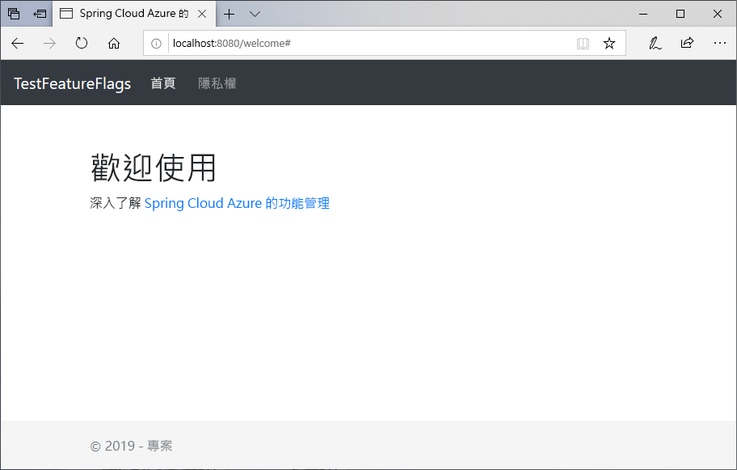
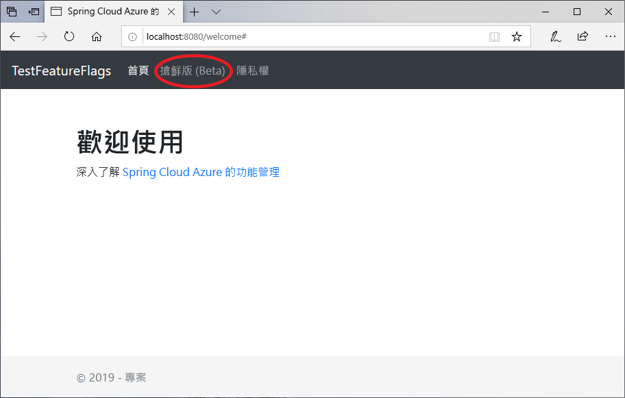

# <a name="quickstart-add-feature-flags-to-a-spring-boot-app"></a>快速入門：將功能旗標新增至 Spring Boot 應用程式

在本快速入門中，您會將 Azure 應用程式組態納入 Spring Boot Web 應用程式中，以建立功能管理的端對端實作。 您可以使用應用程式組態服務來集中儲存所有功能旗標及控制其狀態。

Spring Boot 功能管理程式庫可透過全方位的功能旗標支援來擴充架構。 這些程式庫 **不會** 相依於任何 Azure 程式庫。 它們可透過 Spring Boot 組態提供者完美地與應用程式組態整合。

## <a name="prerequisites"></a>Prerequisites

* Azure 訂用帳戶 - [建立免費帳戶](https://azure.microsoft.com/free/)
* 受支援的 [Java 開發套件 JDK](/java/azure/jdk) 第 8 版。
* [Apache Maven](https://maven.apache.org/download.cgi) 3.0 版或更新版本。

## <a name="create-an-app-configuration-instance"></a>建立應用程式組態執行個體

[!INCLUDE [azure-app-configuration-create](../../includes/azure-app-configuration-create.md)]

7. 選取 [功能管理員]   > [+新增]  ，以新增名為 `Beta` 的功能旗標。

    > [!div class="mx-imgBorder"]
    > 

    目前將 `label` 保留為未定義。

## <a name="create-a-spring-boot-app"></a>建立 Spring Boot 應用程式

使用 [Spring Initializr](https://start.spring.io/) 來建立新的 Spring Boot 專案。

1. 瀏覽至 <https://start.spring.io/>。

1. 指定下列選項：

   * 使用 **Java** 產生 **Maven** 專案。
   * 指定 **Spring Boot** 版本，應等於或大於 2.0。
   * 指定應用程式的 **群組** 和 **成品** 名稱。  本文使用 `com.example` 和 `demo`。
   * 新增 **Spring Web** 相依性。

1. 在指定先前的選項之後，選取 [產生專案]  。 出現提示時，將專案下載至您的本機電腦。

## <a name="add-feature-management"></a>新增功能管理

1. 當您在本機系統上擷取檔案之後，就可以開始編輯 Spring Boot 應用程式。 在應用程式的根目錄中找出 pom.xml  。

1. 在文字編輯器中開啟 pom.xml  檔案，並將下列內容新增至 `<dependencies>` 的清單：

    **Spring Cloud 1.1.x**

    ```xml
    <dependency>
        <groupId>com.microsoft.azure</groupId>
        <artifactId>spring-cloud-azure-appconfiguration-config-web</artifactId>
        <version>1.1.5</version>
    </dependency>
    <dependency>
        <groupId>com.microsoft.azure</groupId>
        <artifactId>spring-cloud-azure-feature-management-web</artifactId>
        <version>1.1.5</version>
    </dependency>
    <dependency>
        <groupId>org.springframework.boot</groupId>
        <artifactId>spring-boot-starter-thymeleaf</artifactId>
    </dependency>
    ```

    **Spring Cloud 1.2.x**

    ```xml
    <dependency>
        <groupId>com.microsoft.azure</groupId>
        <artifactId>spring-cloud-azure-appconfiguration-config-web</artifactId>
        <version>1.2.7</version>
    </dependency>
    <dependency>
        <groupId>com.microsoft.azure</groupId>
        <artifactId>spring-cloud-azure-feature-management-web</artifactId>
        <version>1.2.7</version>
    </dependency>
    <dependency>
        <groupId>org.springframework.boot</groupId>
        <artifactId>spring-boot-starter-thymeleaf</artifactId>
    </dependency>
    ```

> [!Note]
> 有一個非 Web 功能管理程式庫不會相依於 Spring Web。 請參閱 GitHub 的[文件](https://github.com/microsoft/spring-cloud-azure)以了解其差異。

## <a name="connect-to-an-app-configuration-store"></a>連線至應用程式組態存放區

1. 瀏覽至應用程式的 `resources` 目錄，然後開啟 `bootstrap.properties`。  如果該檔案不存在，請加以建立。 在檔案中新增以下一行。

    ```properties
    spring.cloud.azure.appconfiguration.stores[0].connection-string= ${APP_CONFIGURATION_CONNECTION_STRING}
    ```

1. 在組態存放區的應用程式組態入口網站中，選取提要欄位中的 `Access keys`。 選取 [唯讀金鑰] 索引標籤。複製主要連接字串的值。

1. 使用變數名稱 `APP_CONFIGURATION_CONNECTION_STRING`，將主要連接字串新增為環境變數。

1. 開啟主要的應用程式 Java 檔案，並新增 `@EnableConfigurationProperties` 來啟用這項功能。

    ```java
    package com.example.demo;

    import org.springframework.boot.SpringApplication;
    import org.springframework.boot.context.properties.ConfigurationProperties;
    import org.springframework.boot.context.properties.EnableConfigurationProperties;
    import org.springframework.boot.autoconfigure.SpringBootApplication;

    @SpringBootApplication
    @EnableConfigurationProperties(MessageProperties.class)
    public class DemoApplication {

        public static void main(String[] args) {
            SpringApplication.run(DemoApplication.class, args);
        }
    }
    ```

1. 在應用程式的 package 目錄中建立名為 MessageProperties.java  的新 Java 檔案。

    ```java
    package com.example.demo;

    import org.springframework.boot.context.properties.ConfigurationProperties;
    import org.springframework.context.annotation.Configuration;

    @Configuration
    @ConfigurationProperties(prefix = "config")
    public class MessageProperties {
        private String message;

        public String getMessage() {
            return message;
        }

        public void setMessage(String message) {
            this.message = message;
        }
    }
    ```

1. 在應用程式的 package 目錄中建立名為 HelloController.java  的新 Java 檔案。

    ```java
    package com.example.demo;

    import org.springframework.boot.context.properties.ConfigurationProperties;
    import org.springframework.stereotype.Controller;
    import org.springframework.ui.Model;

    import com.microsoft.azure.spring.cloud.feature.manager.FeatureManager;
    import org.springframework.web.bind.annotation.GetMapping;


    @Controller
    @ConfigurationProperties("controller")
    public class HelloController {

        private FeatureManager featureManager;

        public HelloController(FeatureManager featureManager) {
            this.featureManager = featureManager;
        }

        @GetMapping("/welcome")
        public String mainWithParam(Model model) {
            model.addAttribute("Beta", featureManager.isEnabledAsync("featureManagement.Beta").block());
            return "welcome";
        }
    }
    ```

1. 在應用程式的範本目錄中，建立名為 *welcome.html* 的新 HTML 檔案。

    ```html
    <!DOCTYPE html>
    <html lang="en" xmlns:th="http://www.thymeleaf.org">
    <head>
        <meta charset="utf-8">
        <meta name="viewport" content="width=device-width, initial-scale=1, shrink-to-fit=no">
        <title>Feature Management with Spring Cloud Azure</title>

        <link rel="stylesheet" href="/css/main.css">
        <link rel="stylesheet" href="https://stackpath.bootstrapcdn.com/bootstrap/4.3.1/css/bootstrap.min.css" integrity="sha384-ggOyR0iXCbMQv3Xipma34MD+dH/1fQ784/j6cY/iJTQUOhcWr7x9JvoRxT2MZw1T" crossorigin="anonymous">

        <script src="https://code.jquery.com/jquery-3.3.1.slim.min.js" integrity="sha384-q8i/X+965DzO0rT7abK41JStQIAqVgRVzpbzo5smXKp4YfRvH+8abtTE1Pi6jizo" crossorigin="anonymous"></script>
        <script src="https://cdnjs.cloudflare.com/ajax/libs/popper.js/1.14.7/umd/popper.min.js" integrity="sha384-UO2eT0CpHqdSJQ6hJty5KVphtPhzWj9WO1clHTMGa3JDZwrnQq4sF86dIHNDz0W1" crossorigin="anonymous"></script>
        <script src="https://stackpath.bootstrapcdn.com/bootstrap/4.3.1/js/bootstrap.min.js" integrity="sha384-JjSmVgyd0p3pXB1rRibZUAYoIIy6OrQ6VrjIEaFf/nJGzIxFDsf4x0xIM+B07jRM" crossorigin="anonymous"></script>

    </head>
    <body>
        <header>
        <!-- Fixed navbar -->
        <nav class="navbar navbar-expand-md navbar-dark fixed-top bg-dark">
            <a class="navbar-brand" href="#">TestFeatureFlags</a>
            <button class="navbar-toggler" aria-expanded="false" aria-controls="navbarCollapse" aria-label="Toggle navigation" type="button" data-target="#navbarCollapse" data-toggle="collapse">
            <span class="navbar-toggler-icon"></span>
            </button>
            <div class="collapse navbar-collapse" id="navbarCollapse">
            <ul class="navbar-nav mr-auto">
                <li class="nav-item active">
                <a class="nav-link" href="#">Home <span class="sr-only">(current)</span></a>
                </li>
                <li class="nav-item" th:if="${Beta}">
                <a class="nav-link" href="#">Beta</a>
                </li>
                <li class="nav-item">
                <a class="nav-link" href="#">Privacy</a>
                </li>
            </ul>
            </div>
        </nav>
        </header>
        <div class="container body-content">
            <h1 class="mt-5">Welcome</h1>
            <p>Learn more about <a href="https://github.com/Azure/azure-sdk-for-java/blob/master/sdk/appconfiguration/azure-spring-cloud-feature-management/README.md">Feature Management with Spring Cloud Azure</a></p>

        </div>
        <footer class="footer">
            <div class="container">
            <span class="text-muted">&copy; 2019 - Projects</span>
        </div>

        </footer>
    </body>
    </html>

    ```

1. 在 `static` 下建立名為 CSS 的新資料夾，並在其中建立名為 *main.css* 的新 CSS 檔案。

    ```css
    html {
     position: relative;
     min-height: 100%;
    }
    body {
     margin-bottom: 60px;
    }
    .footer {
     position: absolute;
     bottom: 0;
     width: 100%;
     height: 60px;
     line-height: 60px;
     background-color: #f5f5f5;
    }

    body > .container {
     padding: 60px 15px 0;
    }

    .footer > .container {
     padding-right: 15px;
     padding-left: 15px;
    }

    code {
     font-size: 80%;
    }
    ```

## <a name="build-and-run-the-app-locally"></a>於本機建置並執行應用程式

1. 使用 Maven 建置 Spring Boot 應用程式並加以執行。

    ```shell
    mvn clean package
    mvn spring-boot:run
    ```

1. 開啟瀏覽器視窗並移至 URL：`http://localhost:8080/welcome`。

    

1. 在應用程式組態入口網站中選取 [功能管理員]  ，然後將 Beta  金鑰的狀態變更為 [開啟]  ：

    | Key | State |
    |---|---|
    | Beta | 另一 |

1. 重新整理瀏覽器頁面，以查看新的組態設定。

    

## <a name="clean-up-resources"></a>清除資源

[!INCLUDE [azure-app-configuration-cleanup](../../includes/azure-app-configuration-cleanup.md)]

## <a name="next-steps"></a>後續步驟

在本快速入門中，您已建立新的應用程式組態存放區，並透過[功能管理程式庫](/dotnet/api/Microsoft.Extensions.Configuration.AzureAppConfiguration)用它來管理 Spring Boot Web 應用程式中的功能。

* 深入了解[功能管理](./concept-feature-management.md)。
* [管理功能旗標](./manage-feature-flags.md)。
* [在 Spring Boot Core 應用程式中使用功能旗標](./use-feature-flags-spring-boot.md)。