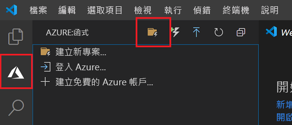
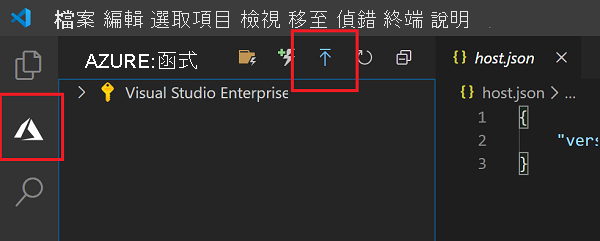

# 快速入門：使用 Visual Studio Code 搭配 TypeScript 在 Azure 中建立函式

[!INCLUDE [functions-language-selector-quickstart-vs-code](../../includes/functions-language-selector-quickstart-vs-code.md)]

在本文中，您會使用 Visual Studio Code 建立可回應 HTTP 要求的 TypeScript 函式。 在本機測試程式碼之後，您可以將其部署到 Azure Functions 的無伺服器環境。

完成本快速入門後，您的 Azure 帳戶中會產生幾美分或更少的少許費用。 

本文還有 [CLI 型版本](create-first-function-cli-typescript.md)。

## 設定環境

開始使用之前，請先確定您具備下列必要項目︰

+ 具有有效訂用帳戶的 Azure 帳戶。 [免費建立帳戶](https://azure.microsoft.com/free/?ref=microsoft.com&utm_source=microsoft.com&utm_medium=docs&utm_campaign=visualstudio)。

+ [Node.js](https://nodejs.org/)、作用中 LTS 和維修 LTS 版本 (建議使用 10.14.1)。 請使用 `node --version` 命令來檢查您的版本。  

+ 其中一個[支援的平台](https://code.visualstudio.com/docs/supporting/requirements#_platforms)上有 [Visual Studio Code](https://code.visualstudio.com/)。

+ 適用於 Visual Studio Code 的 [Azure Functions 擴充功能](https://marketplace.visualstudio.com/items?itemName=ms-azuretools.vscode-azurefunctions)。

## 建立本機專案

在本節中，您會使用 Visual Studio Code 在 TypeScript 中建立本機 Azure Functions 專案。 稍後在本文中，您會將函式程式碼發佈至 Azure。 

1. 選擇活動列中的 Azure 圖示，然後在 [Azure：  函式] 區域，選取 [建立新專案...]  圖示。

    

1. 選擇您專案工作區的目錄位置，然後選擇 [選取]  。

    > [!NOTE]
    > 這些步驟主要設計為在工作區以外的地方完成。 在此案例中，請勿選取屬於工作區的專案資料夾。

1. 依照提示提供下列資訊：

    + **為您的函式專案選取語言**：選擇 `TypeScript`。

    + **選取您的專案第一個函式的範本**：選擇 `HTTP trigger`。

    + **提供函式名稱**：輸入 `HttpExample`。

    + **授權層級** 選擇 `Anonymous`，讓任何人都能呼叫您的函式端點。 若要了解授權層級，請參閱[授權金鑰](functions-bindings-http-webhook-trigger.md#authorization-keys)。

    + **選取您開啟專案的方式**：選擇 `Add to workspace`。

1. Visual Studio Code 會使用這項資訊產生具有 HTTP 觸發程序的 Azure Functions 專案。 您可以在 Explorer 中檢視本機專案檔。 若要深入了解所建立的檔案，請參閱[產生的專案檔](functions-develop-vs-code.md#generated-project-files)。 

[!INCLUDE [functions-run-function-test-local-vs-code](../../includes/functions-run-function-test-local-vs-code.md)]

確認函式在本機電腦上正確執行之後，就可以使用 Visual Studio Code 將專案直接發佈到 Azure。

[!INCLUDE [functions-sign-in-vs-code](../../includes/functions-sign-in-vs-code.md)]

## 將專案發佈到 Azure

在這一節中，您會在 Azure 訂用帳戶中建立函式應用程式和相關資源，然後部署程式碼。

> [!IMPORTANT]
> 發佈至現有的函式應用程式會覆寫該應用程式在 Azure 中的內容。 

1. 選擇活動列中的 Azure 圖示，然後在 [Azure：  函式] 區域中，選擇 [部署至函式應用程式...]  按鈕。

    

1. 依照提示提供下列資訊：

    + **選取資料夾**：從您的工作區選擇資料夾，或瀏覽至其中一個包含您函式應用程式的資料夾。 如果您已經開啟有效的函式應用程式，您就不會看到此提示。

    + **選取訂用帳戶**：選擇要使用的訂用帳戶。 如果您只有一個訂用帳戶，就不會看見此選項。

    + **在 Azure 中選取函式應用程式**：選擇 `+ Create new Function App`。 (請勿選擇本文中未涵蓋的 `Advanced` 選項)。

    + **輸入函式應用程式的全域唯一名稱**：輸入在 URL 路徑中有效的名稱。 您輸入的名稱會進行驗證，以確定該名稱在 Azure Functions 中是唯一的。 

    + **選取執行階段**：選擇您在本機上執行的 Node.js 版本。 您可以使用 `node --version` 命令來檢查您的版本。

    + **選取新資源的位置**：若要獲得較佳的效能，請選擇您附近的 [區域](https://azure.microsoft.com/regions/)。

1. 完成時，系統會依您的函式應用程式名稱，在訂用帳戶中建立下列 Azure 資源：

    + 資源群組，這是相關資源的邏輯容器。
    + 標準 Azure 儲存體帳戶，其可維護專案的狀態和其他資訊。
    + 耗用量方案，定義無伺服器函式應用程式的基礎主機。 
    + 函式應用程式，可提供用來執行函式程式碼的環境。 函式應用程式可讓您將多個函式群組為邏輯單位，以方便您管理、部署，並在相同主控方案中共用資源。
    + 連線至函式應用程式的 Application Insights 執行個體，可追蹤無伺服器函式的使用量。

    建立函式應用程式並套用部署套件之後，即會顯示通知。 

1. 在通知中選取 [檢視輸出]  ，即可檢視建立和部署結果，包括您所建立的 Azure 資源。 如果您錯過通知，請選取右下角的鈴鐺圖示，以再次查看。

    

[!INCLUDE [functions-vs-code-run-remote](../../includes/functions-vs-code-run-remote.md)]

[!INCLUDE [functions-cleanup-resources-vs-code.md](../../includes/functions-cleanup-resources-vs-code.md)]

## 後續步驟

您已透過 Visual Studio Code，使用簡單的 HTTP 觸發函式建立函式應用程式。 在下一篇文章中，您可以藉由新增輸出繫結來展開該函式。 這個繫結會從 HTTP 要求將字串寫入 Azure 佇列儲存體佇列中的訊息。 

> [!div class="nextstepaction"]
> [連線至 Azure 儲存體佇列](functions-add-output-binding-storage-queue-vs-code.md?pivots=programming-language-typescript)

[Azure Functions Core Tools]: functions-run-local.md
[Azure Functions extension for Visual Studio Code]: https://marketplace.visualstudio.com/items?itemName=ms-azuretools.vscode-azurefunctions
