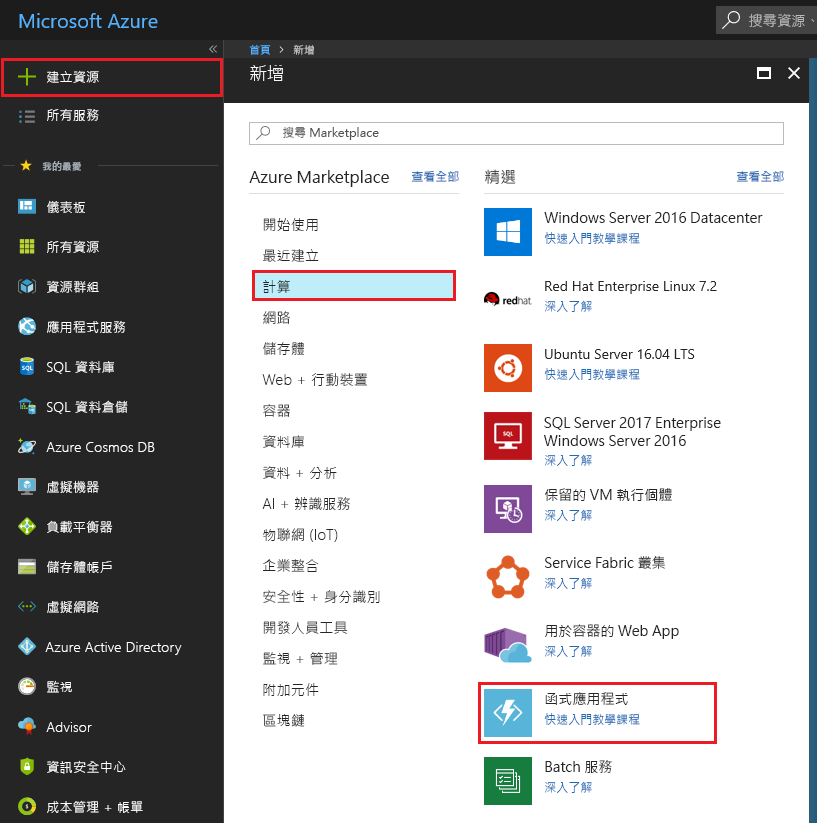
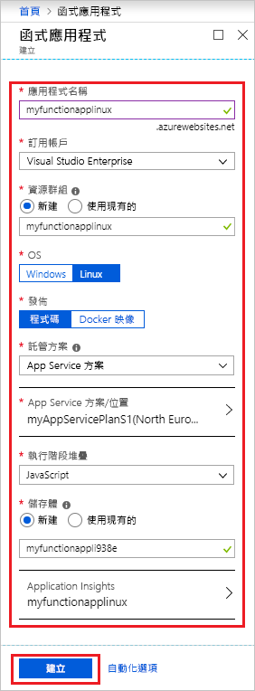
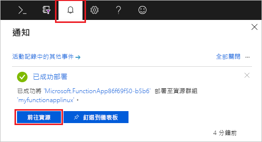
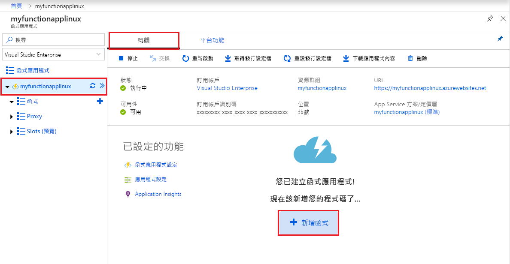
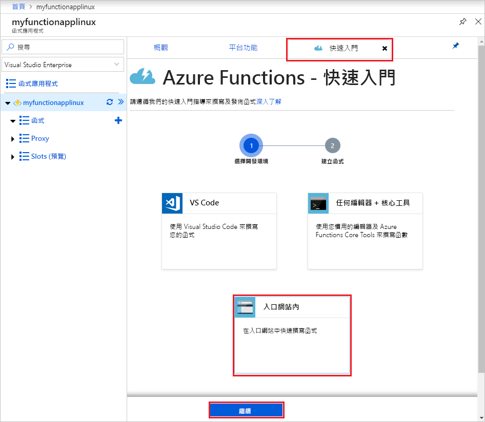
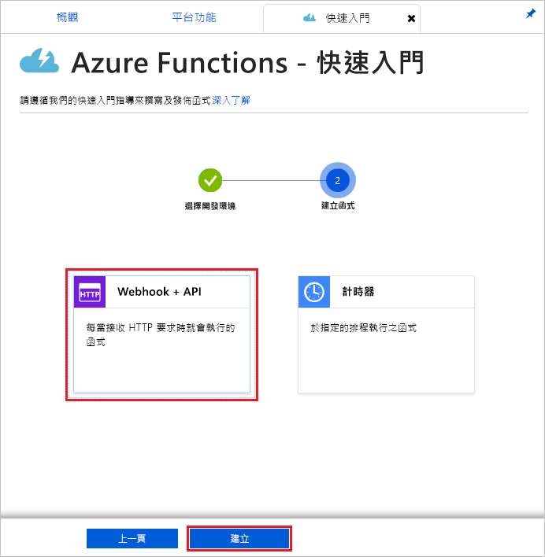
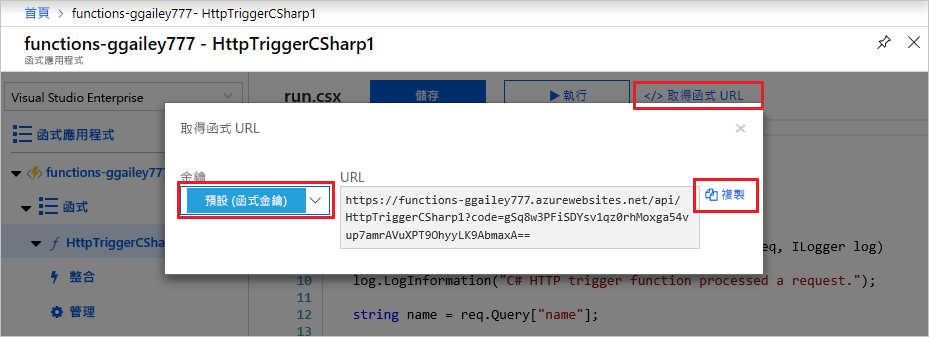

# 在 Azure App Service 方案中建立 Linux 上的函式應用程式

Azure Functions 可讓您在 Linux 上預設的 Azure App Service 容器中裝載函式。 本文會逐步引導您了解如何使用 [Azure 入口網站](https://portal.azure.com)，建立 Linux 裝載的函式應用程式，而該應用程式會在 [App Service 方案](functions-scale.md#app-service-plan)中執行。 您也可以[自備自訂容器](functions-create-function-linux-custom-image.md)。

[!INCLUDE [quickstarts-free-trial-note](../../includes/quickstarts-free-trial-note.md)]

## 登入 Azure

使用您的 Azure 帳戶登入 Azure 入口網站 (<https://portal.azure.com>)。

## 建立函數應用程式

您必須擁有函式應用程式以便在 Linux 上主控函式的執行。 函式應用程式會提供環境來讓您的函式程式碼進行執行。 其可讓您將多個函式群組為邏輯單位，以方便您管理、部署、調整和共用資源。 在本文中，您會在建立函式應用程式時建立 App Service 方案。

1. 選取 Azure 入口網站左上角的 [建立資源]  按鈕，然後選取 [計算]   > [函式應用程式]  。

    

2. 請使用影像下面的資料表中指定的函式應用程式設定。

    

    | 設定      | 建議的值  | 描述                                        |
    | ------------ |  ------- | -------------------------------------------------- |
    | **應用程式名稱** | 全域唯一的名稱 | 用以識別新函式應用程式的名稱。 有效字元是 `a-z`、`0-9` 和 `-`。  | 
    | **訂用帳戶** | 您的訂用帳戶 | 將在其下建立這個新函式應用程式的訂用帳戶。 | 
    | **[資源群組](../azure-resource-manager/management/overview.md)** |  myResourceGroup | 要在其中建立函式應用程式的新資源群組名稱。 |
    | **作業系統** | Linux | 此函式應用程式會在 Linux 上執行。 |
    | **Publish** | 程式碼 | 系統會使用 [執行階段堆疊]  的預設 Linux 容器。 您只需要提供函式應用程式的專案代碼。 另一個選項是發佈自訂 [Docker 映像](functions-create-function-linux-custom-image.md)。 |
    | **[主控方案](functions-scale.md)** | App Service 方案 | 會定義如何將資源配置給函式應用程式的主控方案。 在 App Service 方案中執行時，您可以控制[函式應用程式的調整](functions-scale.md)。  |
    | **App Service 方案/位置** | 建立方案 | 選擇 [新建]  並提供 **App Service 方案**名稱。 在**區域**中選擇 [位置](https://azure.microsoft.com/regions/) ，此位置應靠近您或靠近函式會存取的其他服務。 選擇您想要的 **[定價層](https://azure.microsoft.com/pricing/details/app-service/linux/)** 。  您無法在相同的 App Service 方案中同時執行 Linux 與 Windows 函式應用程式。 |
    | **執行階段堆疊** | 慣用語言 | 選擇支援您慣用函式程式設計語言的執行階段。 針對 C# 和 F # 函式選擇 **.NET**。 |
    | **[儲存體](../storage/common/storage-account-create.md)** |  全域唯一的名稱 |  建立您函式應用程式使用的儲存體帳戶。 儲存體帳戶名稱必須介於 3 到 24 個字元的長度，而且只能包含數字和小寫字母。 您也可以使用現有帳戶，條件是必須符合[儲存體帳戶需求](storage-considerations.md#storage-account-requirements)。 |
    | **[Application Insights](functions-monitoring.md)** | 啟用 | 依預設會停用 Application Insights。 我們建議立即啟用 Application Insights 整合，並選擇您的 App Service 方案位置附近的裝載位置。 如果您想要稍後執行這項操作，請參閱[監視 Azure Functions](functions-monitoring.md)。  |

3. 選取 [建立]  以佈建並部署函式應用程式。

4. 選取入口網站右上角的 [通知] 圖示，查看是否有**部署成功**訊息。

    

5. 選取 [前往資源]  ，以檢視您新的函式應用程式。

接下來，您要在新的函式應用程式中建立函式。 即使在您的函式應用程式可用之後，可能需要幾分鐘才能完全初始化。

## 建立由 HTTP 觸發的函式

這一節說明如何在入口網站的新函式應用程式中建立函式。

> [!NOTE]
> 試用 Azure Functions 時，入口網站開發體驗很實用。 在大部分的情況下，請考慮使用 [Visual Studio Code](functions-create-first-function-vs-code.md#create-an-azure-functions-project) 或 [Azure Functions Core Tools](functions-run-local.md#create-a-local-functions-project)，在本機開發函式並將專案發佈至函式應用程式。  

1. 在新的函式應用程式中，選擇 [概觀]  索引標籤，然後在完全載入之後，選擇 [+ 新增函式]  。

    

1. 在 [快速入門]  索引標籤上，選擇 [入口網站中]  ，然後選取 [繼續]  。

    

1. 選擇 [WebHook + API]  ，然後選取 [建立]  。

    

系統隨即會使用由 HTTP 觸發的函式特定語言範本來建立函式。

現在，您可以藉由傳送 HTTP 要求來執行新的函式。

## 測試函式

1. 在新的函式中，按一下右上方的 [</> 取得函式 URL]  ，選取 [預設 (函式索引鍵)]  ，然後按一下 [複製]  。 

    

2. 將函式 URL 貼入瀏覽器的網址列中。 將查詢字串值 `&name=<yourname>` 新增至此 URL 的結尾，並按鍵盤上的 `Enter` 鍵執行要求。 您應該會看到函式傳回的回應顯示在瀏覽器中。  

    下列範例會顯示瀏覽器中的回應：

    

    要求 URL 預設會包含所需金鑰，以便透過 HTTP 存取您的函式。

3. 當函式執行時，系統會將追蹤資訊寫入到記錄中。 若要查看上次執行的追蹤輸出，請在入口網站中返回您的函式，然後按一下畫面底部的箭號來展開**記錄**。

   

## 清除資源

[!INCLUDE [Clean-up resources](../../includes/functions-quickstart-cleanup.md)]

## 後續步驟

您已使用簡單的 HTTP 觸發函式建立了函式應用程式。  

[!INCLUDE [Next steps note](../../includes/functions-quickstart-next-steps.md)]

如需詳細資訊，請參閱 [Azure Functions HTTP 繫結](functions-bindings-http-webhook.md)。
