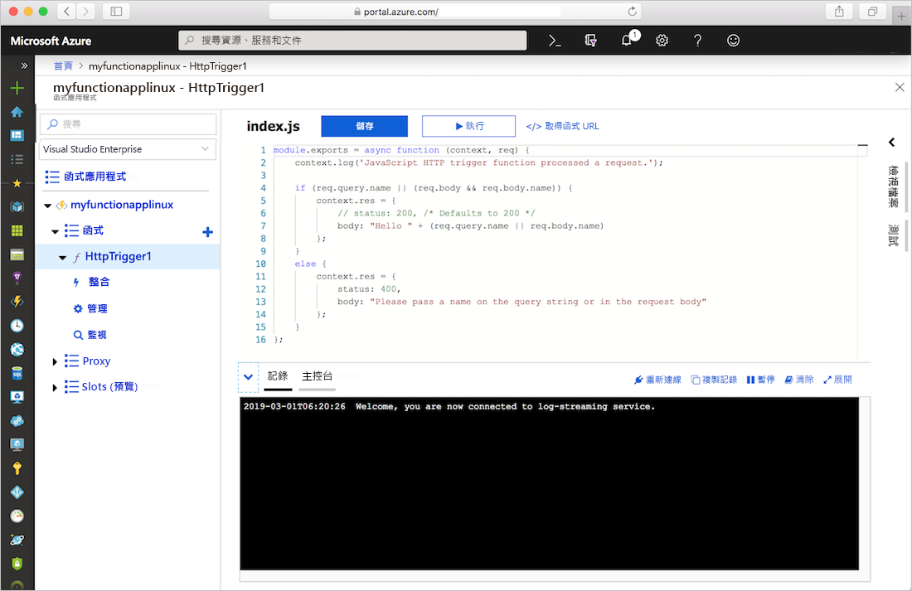
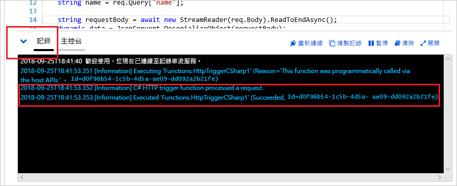

# 在 Azure App Service 方案中建立 Linux 上的函式應用程式

Azure Functions 可讓您在 Linux 上預設的 Azure App Service 容器中裝載函式。 本文會逐步引導您了解如何使用 [Azure 入口網站](https://portal.azure.com)，建立 Linux 裝載的函式應用程式，而該應用程式會在 [App Service 方案](functions-scale.md#app-service-plan)中執行。 您也可以[自備自訂容器](functions-create-function-linux-custom-image.md)。

[!INCLUDE [quickstarts-free-trial-note](../../includes/quickstarts-free-trial-note.md)]

## 登入 Azure

使用您的 Azure 帳戶登入 Azure 入口網站 (<https://portal.azure.com>)。

## 建立函數應用程式

您必須擁有函式應用程式以便在 Linux 上主控函式的執行。 函式應用程式會提供環境來讓您的函式程式碼進行執行。 其可讓您將多個函式群組為邏輯單位，以方便您管理、部署、調整和共用資源。 在本文中，您會在建立函式應用程式時建立 App Service 方案。

1. 從 Azure 入口網站功能表或[首頁]  頁面，選取 [建立資源]  。

1. 在 [新增]  頁面中，選取 [計算]   > [函數應用程式]  。

    :::image type="content" source="./media/create-function-app-linux-app-service-plan/function-app-create-flow.png" alt-text="在 Azure 入口網站中建立函式應用程式":::

1. 在 [基本資訊]  頁面中，使用下表中指定的函式應用程式設定。

    | 設定      | 建議的值  | 描述 |
    | ------------ | ---------------- | ----------- |
    | **訂用帳戶** | 您的訂用帳戶 | 將在其下建立這個新函式應用程式的訂用帳戶。 |
    | **[資源群組](../azure-resource-manager/management/overview.md)** |  *myResourceGroup* | 要在其中建立函式應用程式的新資源群組名稱。 |
    | **函式應用程式名稱** | 全域唯一的名稱 | 用以識別新函式應用程式的名稱。 有效字元為 `a-z` (區分大小寫)、`0-9` 以及 `-`。  |
    |**Publish**| **Code** （預設值） | 發佈程式碼檔案或 Docker 容器的選項。 |
    | **執行階段堆疊** | 慣用語言 | 選擇支援您慣用函式程式設計語言的執行階段。 針對 C# 和 F# 函式選擇 **.NET Core**。 |
    |**版本**| 版本號碼 | 選擇已安裝的執行階段版本。  |
    |**區域**| 慣用區域 | 選擇與您接近的[區域](https://azure.microsoft.com/regions/)，或選擇與函式將會存取之其他服務接近的區域。 |

    :::image type="content" source="./media/create-function-app-linux-app-service-plan/function-app-create-basics-linux.png" alt-text="基本頁面":::

1. 選取 [下一步：  裝載]。 在 [裝載]  頁面中輸入下列設定。

    | 設定      | 建議的值  | 描述 |
    | ------------ | ---------------- | ----------- |
    | **[儲存體帳戶](../storage/common/storage-account-create.md)** |  全域唯一的名稱 |  建立您函式應用程式使用的儲存體帳戶。 儲存體帳戶名稱必須介於 3 到 24 個字元的長度，而且只能包含數字和小寫字母。 您也可以使用現有帳戶，條件是必須符合[儲存體帳戶需求](../azure-functions/functions-scale.md#storage-account-requirements)。 |
    |**作業系統**| **Linux** | 系統會根據您的執行階段堆疊選項預先選取作業系統，但您可以視需要變更設定。 |
    | **[規劃](../azure-functions/functions-scale.md)** | **使用量 (無伺服器)** | 會定義如何將資源配置給函式應用程式的主控方案。 在預設**取用**方案中，您的函式會根據需要來動態新增資源。 在此[無伺服器](https://azure.microsoft.com/overview/serverless-computing/)裝載中，您只需要針對函式有執行的時間來付費。 在 App Service 方案中執行時，您必須管理[函式應用程式的調整](../azure-functions/functions-scale.md)。  |

    :::image type="content" source="./media/create-function-app-linux-app-service-plan/function-app-create-hosting-linux.png" alt-text="裝載頁面":::

1. 選取 [下一步：  監視]。 在 [掛接]  頁面中輸入下列設定。

    | 設定      | 建議的值  | 描述 |
    | ------------ | ---------------- | ----------- |
    | **[Application Insights](../azure-functions/functions-monitoring.md)** | **是**（預設值） | 在最近的支援區域中，建立相同*應用程式名稱*的 Application Insights 資源。 藉由展開此設定或選取 **[新建]，您**可以變更 Application Insights 名稱，或在您想要儲存資料的[Azure 地理](https://azure.microsoft.com/global-infrastructure/geographies/)位置中選擇不同的區域。 |

   :::image type="content" source="./media/create-function-app-linux-app-service-plan/function-app-create-monitoring-linux.png" alt-text="[監視] 頁面":::

1. 選取 [檢閱 + 建立]  ，以檢閱應用程式組態選項。

1. 在 [檢閱 + 建立]  頁面中檢閱您的設定，然後選取 [建立]  來佈建和部署函式應用程式。

1. 選取入口網站右上角的 [**通知**] 圖示，並監看是否有**部署成功**訊息。

1. 選取 [前往資源]  ，以檢視您新的函式應用程式。 您也可以選取 [釘選到儀表板]  。 釘選可讓您更輕鬆地從儀表板返回此函式應用程式資源。

    

    即使在您的函式應用程式可用之後，可能需要幾分鐘才能完全初始化。

接下來，您要在新的函式應用程式中建立函式。

## 建立 HTTP 觸發程式函數

這一節說明如何在入口網站的新函式應用程式中建立函式。

> [!NOTE]
> 試用 Azure Functions 時，入口網站開發體驗很實用。 在大部分的情況下，請考慮使用 [Visual Studio Code](functions-create-first-function-vs-code.md#create-an-azure-functions-project) 或 [Azure Functions Core Tools](functions-run-local.md#create-a-local-functions-project)，在本機開發函式並將專案發佈至函式應用程式。  

1. 從 [**函數**] 視窗的左側功能表中，選取 [**函數**]，然後從頂端功能表中選取 [**新增**]。 
 
1. 從 [**新增函數**] 視窗中，選取 [ **Http 觸發**程式]。

    

1. 在 [**新增函數**] 視窗中，接受 [**新**函式] 的預設名稱，或輸入新的名稱。 

1. 從 [**授權層級**] 下拉式清單中選擇 [**匿名**]，然後選取 [**建立函數**]。

    Azure 會建立 HTTP 觸發程式函數。 現在，您可以藉由傳送 HTTP 要求來執行新的函式。

## 測試函式

1. 在新的 HTTP 觸發程式函式中，從左側功能表中選取 [程式**代碼 + 測試**]，然後從頂端功能表中選取 [取得函式**URL** ]。

    ![選取 [取得函數 URL]](./media/create-function-app-linux-app-service-plan/function-app-select-get-function-url.png)

1. 在 [**取得函數 URL** ] 對話方塊中，從下拉式清單選取 [**預設值**]，然後選取 [**複製到剪貼**簿] 圖示。 

    

1. 將函式 URL 貼入瀏覽器的網址列中。 將查詢字串值新增 `?name=<your_name>` 至此 URL 的結尾，然後按 enter 鍵以執行要求。 

    下列範例會顯示瀏覽器中的回應：

    

    要求 URL 預設會包含所需金鑰，以便透過 HTTP 存取您的函式。

1. 當函式執行時，系統會將追蹤資訊寫入到記錄中。 若要查看追蹤輸出，請回到入口網站中的 [程式**代碼 + 測試**] 頁面，然後展開頁面底部的 [**記錄**] 箭號。

   

## 清除資源

[!INCLUDE [Clean-up resources](../../includes/functions-quickstart-cleanup.md)]

## 後續步驟

您已使用簡單的 HTTP 觸發程式函式建立函數應用程式。  

[!INCLUDE [Next steps note](../../includes/functions-quickstart-next-steps.md)]

如需詳細資訊，請參閱 [Azure Functions HTTP 繫結](functions-bindings-http-webhook.md)。
