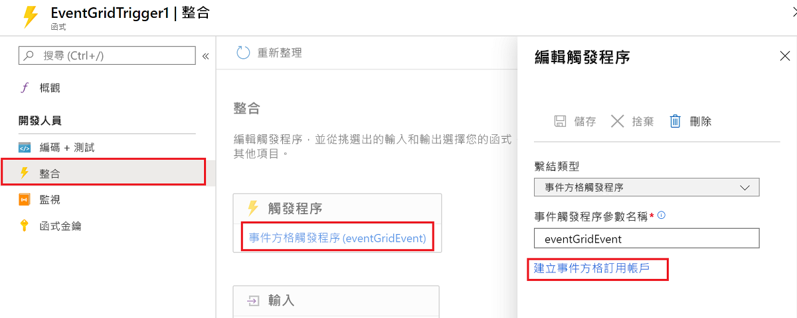
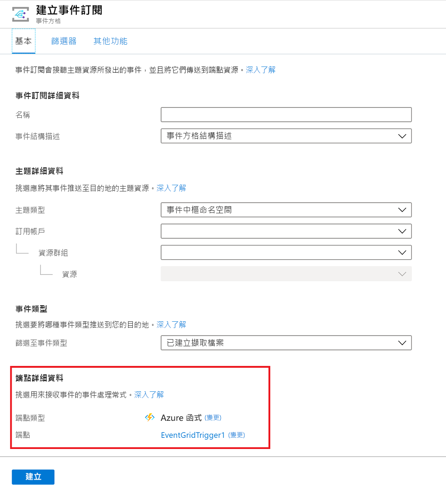

# <a name="azure-event-grid-trigger-for-azure-functions"></a>Azure 函數的 Azure 事件網格觸發器

使用函數觸發器回應發送到事件網格主題的事件。

有關設置和配置詳細資訊的資訊，請參閱[概述](./functions-bindings-event-grid.md)。

## <a name="example"></a>範例

# <a name="c"></a>[C#](#tab/csharp)

有關 HTTP 觸發器示例，請參閱[將事件接收到 HTTP 終結點](../event-grid/receive-events.md)。

### <a name="c-2x-and-higher"></a>C# （2.x 及以上）

下列範例顯示繫結至 `EventGridEvent` 的 [C# 函式](functions-dotnet-class-library.md)：

```cs
using Microsoft.Azure.EventGrid.Models;
using Microsoft.Azure.WebJobs;
using Microsoft.Azure.WebJobs.Extensions.EventGrid;
using Microsoft.Azure.WebJobs.Host;
using Microsoft.Extensions.Logging;

namespace Company.Function
{
    public static class EventGridTriggerCSharp
    {
        [FunctionName("EventGridTest")]
        public static void EventGridTest([EventGridTrigger]EventGridEvent eventGridEvent, ILogger log)
        {
            log.LogInformation(eventGridEvent.Data.ToString());
        }
    }
}
```

有關詳細資訊，請參閱包、[屬性](#attributes-and-annotations)、[配置](#configuration)和[使用方式](#usage)。

### <a name="version-1x"></a>1.x 版

下列範例顯示繫結至 `JObject` 的 Functions 1.x [C# 函式](functions-dotnet-class-library.md)：

```cs
using Microsoft.Azure.WebJobs;
using Microsoft.Azure.WebJobs.Extensions.EventGrid;
using Microsoft.Azure.WebJobs.Host;
using Newtonsoft.Json;
using Newtonsoft.Json.Linq;
using Microsoft.Extensions.Logging;

namespace Company.Function
{
    public static class EventGridTriggerCSharp
    {
        [FunctionName("EventGridTriggerCSharp")]
        public static void Run([EventGridTrigger]JObject eventGridEvent, ILogger log)
        {
            log.LogInformation(eventGridEvent.ToString(Formatting.Indented));
        }
    }
}
```

# <a name="c-script"></a>[C# 腳本](#tab/csharp-script)

下列範例示範 function.json** 檔案中的觸發程序繫結，以及使用此繫結的 [C# 指令碼函式](functions-reference-csharp.md)。

以下是 *function.json* 檔案中的繫結資料：

```json
{
  "bindings": [
    {
      "type": "eventGridTrigger",
      "name": "eventGridEvent",
      "direction": "in"
    }
  ],
  "disabled": false
}
```

### <a name="version-2x-and-higher"></a>版本 2.x 及更高版本

下面是綁定到`EventGridEvent`的示例：

```csharp
#r "Microsoft.Azure.EventGrid"
using Microsoft.Azure.EventGrid.Models;
using Microsoft.Extensions.Logging;

public static void Run(EventGridEvent eventGridEvent, ILogger log)
{
    log.LogInformation(eventGridEvent.Data.ToString());
}
```

有關詳細資訊，請參閱包、[屬性](#attributes-and-annotations)、[配置](#configuration)和[使用方式](#usage)。

### <a name="version-1x"></a>1.x 版

以下是繫結至 `JObject` 的 Functions 1.x C# 指令碼：

```cs
#r "Newtonsoft.Json"

using Newtonsoft.Json;
using Newtonsoft.Json.Linq;

public static void Run(JObject eventGridEvent, TraceWriter log)
{
    log.Info(eventGridEvent.ToString(Formatting.Indented));
}
```

# <a name="javascript"></a>[JAVAscript](#tab/javascript)

下列範例示範的是使用繫結之 function.json** 檔案，以及 [JavaScript 函式](functions-reference-node.md)中的觸發程序繫結。

以下是 *function.json* 檔案中的繫結資料：

```json
{
  "bindings": [
    {
      "type": "eventGridTrigger",
      "name": "eventGridEvent",
      "direction": "in"
    }
  ],
  "disabled": false
}
```

以下是 JavaScript 程式碼：

```javascript
module.exports = function (context, eventGridEvent) {
    context.log("JavaScript Event Grid function processed a request.");
    context.log("Subject: " + eventGridEvent.subject);
    context.log("Time: " + eventGridEvent.eventTime);
    context.log("Data: " + JSON.stringify(eventGridEvent.data));
    context.done();
};
```

# <a name="python"></a>[Python](#tab/python)

下列範例示範 *function.json* 檔案中的觸發程序繫結，以及使用此繫結的 [Python 函式](functions-reference-python.md)。

以下是 *function.json* 檔案中的繫結資料：

```json
{
  "bindings": [
    {
      "type": "eventGridTrigger",
      "name": "event",
      "direction": "in"
    }
  ],
  "disabled": false,
  "scriptFile": "__init__.py"
}
```

以下是 Python 程式碼：

```python
import json
import logging

import azure.functions as func

def main(event: func.EventGridEvent):

    result = json.dumps({
        'id': event.id,
        'data': event.get_json(),
        'topic': event.topic,
        'subject': event.subject,
        'event_type': event.event_type,
    })

    logging.info('Python EventGrid trigger processed an event: %s', result)
```

# <a name="java"></a>[JAVA](#tab/java)

本區段包含下列範例：

* [事件格線觸發程序，字串參數](#event-grid-trigger-string-parameter)
* [事件格線觸發程序，POJO 參數](#event-grid-trigger-pojo-parameter)

以下示例顯示[JAVA](functions-reference-java.md)中的觸發器綁定，該綁定使用綁定並列印出事件，首先作為 POJO 接收事件`String`，第二個接收事件作為 POJO。

### <a name="event-grid-trigger-string-parameter"></a>事件格線觸發程序，字串參數

```java
  @FunctionName("eventGridMonitorString")
  public void logEvent(
    @EventGridTrigger(
      name = "event"
    ) 
    String content, 
    final ExecutionContext context) {
      context.getLogger().info("Event content: " + content);      
  }
```

### <a name="event-grid-trigger-pojo-parameter"></a>事件格線觸發程序，POJO 參數

此範例會使用下列 POJO 來代表事件格線事件的最上層屬性：

```java
import java.util.Date;
import java.util.Map;

public class EventSchema {

  public String topic;
  public String subject;
  public String eventType;
  public Date eventTime;
  public String id;
  public String dataVersion;
  public String metadataVersion;
  public Map<String, Object> data;

}
```

抵達時，會將事件的 JSON 承載還原序列化為 ```EventSchema``` POJO，以供函式使用。 此過程允許函數以物件導向的方式訪問事件的屬性。

```java
  @FunctionName("eventGridMonitor")
  public void logEvent(
    @EventGridTrigger(
      name = "event"
    ) 
    EventSchema event, 
    final ExecutionContext context) {
      context.getLogger().info("Event content: ");
      context.getLogger().info("Subject: " + event.subject);
      context.getLogger().info("Time: " + event.eventTime); // automatically converted to Date by the runtime
      context.getLogger().info("Id: " + event.id);
      context.getLogger().info("Data: " + event.data);
  }
```

在 [Java 函式執行階段程式庫](/java/api/overview/azure/functions/runtime)中，對其值來自事件方格的參數使用 `EventGridTrigger` 註釋。 具有這些附註的參數會使得函式在事件抵達時執行。  此註釋可以搭配原生 Java 類型、POJO 或使用 `Optional<T>` 的可為 Null 值使用。

---

## <a name="attributes-and-annotations"></a>屬性和注釋

# <a name="c"></a>[C#](#tab/csharp)

在 [C# 類別庫](functions-dotnet-class-library.md)中，使用 [EventGridTrigger](https://github.com/Azure/azure-functions-eventgrid-extension/blob/master/src/EventGridExtension/TriggerBinding/EventGridTriggerAttribute.cs) 屬性。

以下是方法簽章中的 `EventGridTrigger` 屬性：

```csharp
[FunctionName("EventGridTest")]
public static void EventGridTest([EventGridTrigger] JObject eventGridEvent, ILogger log)
{
    ...
}
```

如需完整範例，請參閱 C# 範例。

# <a name="c-script"></a>[C# 腳本](#tab/csharp-script)

C# 腳本不支援屬性。

# <a name="javascript"></a>[JAVAscript](#tab/javascript)

JavaScript 不支援屬性。

# <a name="python"></a>[Python](#tab/python)

Python 不支援屬性。

# <a name="java"></a>[JAVA](#tab/java)

[事件網格觸發](https://github.com/Azure/azure-functions-java-library/blob/master/src/main/java/com/microsoft/azure/functions/annotation/EventGridTrigger.java)注釋允許您通過提供配置值來聲明配置事件網格綁定。 有關詳細資訊，請參閱[示例](#example)和[配置](#configuration)部分。

---

## <a name="configuration"></a>組態

下表說明您在 function.json** 檔案中設定的繫結設定屬性。 沒有要在 `EventGridTrigger` 屬性中設定的建構函式參數或屬性。

|function.json 屬性 |描述|
|---------|---------|
| **型別** | 必要項目 - 必須設定為 `eventGridTrigger`。 |
| **direction** | 必要項目 - 必須設定為 `in`。 |
| **名稱** | 必要項目 - 函式程式碼中用於接收事件資料之參數的變數名稱。 |

## <a name="usage"></a>使用量

# <a name="c"></a>[C#](#tab/csharp)

在 Azure 函數 1.x 中，可以為事件網格觸發器使用以下參數類型：

* `JObject`
* `string`

在 Azure 函數 2.x 及更高版本中，您還可以選擇對事件網格觸發器使用以下參數類型：

* `Microsoft.Azure.EventGrid.Models.EventGridEvent` - 定義所有事件類型通用之欄位的屬性。

> [!NOTE]
> 在 Functions v1 中，如果您嘗試繫結至 `Microsoft.Azure.WebJobs.Extensions.EventGrid.EventGridEvent`，編譯器將會顯示「已淘汰」訊息，並建議您改用 `Microsoft.Azure.EventGrid.Models.EventGridEvent`。 若要使用較新的類型，請參考 [Microsoft.Azure.EventGrid](https://www.nuget.org/packages/Microsoft.Azure.EventGrid) NuGet 套件，並且為 `EventGridEvent` 類型名稱加上 `Microsoft.Azure.EventGrid.Models` 首碼，加以完整限定。

# <a name="c-script"></a>[C# 腳本](#tab/csharp-script)

在 Azure 函數 1.x 中，可以為事件網格觸發器使用以下參數類型：

* `JObject`
* `string`

在 Azure 函數 2.x 及更高版本中，您還可以選擇對事件網格觸發器使用以下參數類型：

* `Microsoft.Azure.EventGrid.Models.EventGridEvent` - 定義所有事件類型通用之欄位的屬性。

> [!NOTE]
> 在 Functions v1 中，如果您嘗試繫結至 `Microsoft.Azure.WebJobs.Extensions.EventGrid.EventGridEvent`，編譯器將會顯示「已淘汰」訊息，並建議您改用 `Microsoft.Azure.EventGrid.Models.EventGridEvent`。 若要使用較新的類型，請參考 [Microsoft.Azure.EventGrid](https://www.nuget.org/packages/Microsoft.Azure.EventGrid) NuGet 套件，並且為 `EventGridEvent` 類型名稱加上 `Microsoft.Azure.EventGrid.Models` 首碼，加以完整限定。 如需如何在 C# 指令碼函式中參考 NuGet 套件的相關資訊，請參閱[使用 NuGet 套件](functions-reference-csharp.md#using-nuget-packages)

# <a name="javascript"></a>[JAVAscript](#tab/javascript)

事件網格實例可通過*函數.json*檔案屬性中配置的`name`參數獲得。

# <a name="python"></a>[Python](#tab/python)

事件網格實例可通過*函數.json*檔案屬性中配置的`name`參數（鍵入為`func.EventGridEvent`）可用。

# <a name="java"></a>[JAVA](#tab/java)

事件網格事件實例可通過與屬性關聯的參數可用，`EventGridTrigger`鍵入為 。 `EventSchema` 有關詳細資訊，請參閱[示例](#example)。

---

## <a name="event-schema"></a>結構描述

接收到的 Event Grid 事件資料，會是 HTTP 要求本文中的 JSON 物件。 此 JSON 大致如下列範例所示：

```json
[{
  "topic": "/subscriptions/{subscriptionid}/resourceGroups/eg0122/providers/Microsoft.Storage/storageAccounts/egblobstore",
  "subject": "/blobServices/default/containers/{containername}/blobs/blobname.jpg",
  "eventType": "Microsoft.Storage.BlobCreated",
  "eventTime": "2018-01-23T17:02:19.6069787Z",
  "id": "{guid}",
  "data": {
    "api": "PutBlockList",
    "clientRequestId": "{guid}",
    "requestId": "{guid}",
    "eTag": "0x8D562831044DDD0",
    "contentType": "application/octet-stream",
    "contentLength": 2248,
    "blobType": "BlockBlob",
    "url": "https://egblobstore.blob.core.windows.net/{containername}/blobname.jpg",
    "sequencer": "000000000000272D000000000003D60F",
    "storageDiagnostics": {
      "batchId": "{guid}"
    }
  },
  "dataVersion": "",
  "metadataVersion": "1"
}]
```

範例中顯示一個元素的陣列。 Event Grid 一律會傳送陣列，且在陣列中可能會傳送多個事件。 執行階段分別會為每個陣列元素叫用您的函式一次。

所有事件類型的事件 JSON 資料中會具有相同的最上層屬性，但 `data` 屬性的內容則會隨著事件類型而不同。 此處顯示的是 Blob 儲存體事件的範例。

如需通用屬性和事件特定屬性的說明，請參閱 Event Grid 文件中的[事件屬性](../event-grid/event-schema.md#event-properties)。

`EventGridEvent` 類型只會定義最上層屬性；`Data` 屬性為 `JObject`。

## <a name="create-a-subscription"></a>建立訂用帳戶

若要開始接收 Event Grid HTTP 要求，請建立會指定端點 URL 以叫用函式的 Event Grid 訂用帳戶。

### <a name="azure-portal"></a>Azure 入口網站

對於您在 Azure 入口網站中使用 Event Grid 觸發程序開發的函式，選取**新增 Event Grid 訂用帳戶**。



當您選取此連結時，入口網站會開啟預先填入端點 URL 的**建立事件訂用帳戶**頁面。



如需如何使用 Azure 入口網站建立訂用帳戶的詳細資訊，請參閱 Event Grid 文件中的[建立自訂事件 - Azure 入口網站](../event-grid/custom-event-quickstart-portal.md)。

### <a name="azure-cli"></a>Azure CLI

若要使用 [Azure CLI](https://docs.microsoft.com/cli/azure/get-started-with-azure-cli?view=azure-cli-latest) 建立訂用帳戶，請使用 [az eventgrid event-subscription create](https://docs.microsoft.com/cli/azure/eventgrid/event-subscription?view=azure-cli-latest#az-eventgrid-event-subscription-create) 命令。

此命令需要叫用函式的端點 URL。 下列範例顯示特定版本的 URL 模式：

#### <a name="version-2x-and-higher-runtime"></a>版本 2.x（更高版本）運行時

    https://{functionappname}.azurewebsites.net/runtime/webhooks/eventgrid?functionName={functionname}&code={systemkey}

#### <a name="version-1x-runtime"></a>1.x 版執行階段

    https://{functionappname}.azurewebsites.net/admin/extensions/EventGridExtensionConfig?functionName={functionname}&code={systemkey}

系統金鑰是必須包含在端點 URL 中供 Event Grid 觸發程序使用的授權金鑰。 下一節將說明如何取得系統金鑰。

以下是訂閱 Blob 儲存體帳戶的範例 (以預留位置表示系統金鑰)：

#### <a name="version-2x-and-higher-runtime"></a>版本 2.x（更高版本）運行時

```azurecli
az eventgrid resource event-subscription create -g myResourceGroup \
--provider-namespace Microsoft.Storage --resource-type storageAccounts \
--resource-name myblobstorage12345 --name myFuncSub  \
--included-event-types Microsoft.Storage.BlobCreated \
--subject-begins-with /blobServices/default/containers/images/blobs/ \
--endpoint https://mystoragetriggeredfunction.azurewebsites.net/runtime/webhooks/eventgrid?functionName=imageresizefunc&code=<key>
```

#### <a name="version-1x-runtime"></a>1.x 版執行階段

```azurecli
az eventgrid resource event-subscription create -g myResourceGroup \
--provider-namespace Microsoft.Storage --resource-type storageAccounts \
--resource-name myblobstorage12345 --name myFuncSub  \
--included-event-types Microsoft.Storage.BlobCreated \
--subject-begins-with /blobServices/default/containers/images/blobs/ \
--endpoint https://mystoragetriggeredfunction.azurewebsites.net/admin/extensions/EventGridExtensionConfig?functionName=imageresizefunc&code=<key>
```

如需如何建立訂用帳戶的詳細資訊，請參閱 [Blob 儲存體快速入門](../storage/blobs/storage-blob-event-quickstart.md#subscribe-to-your-storage-account)或其他 Event Grid 快速入門。

### <a name="get-the-system-key"></a>取得系統金鑰

您可以使用下列 API (HTTP GET) 來取得系統金鑰：

#### <a name="version-2x-and-higher-runtime"></a>版本 2.x（更高版本）運行時

```
http://{functionappname}.azurewebsites.net/admin/host/systemkeys/eventgrid_extension?code={masterkey}
```

#### <a name="version-1x-runtime"></a>1.x 版執行階段

```
http://{functionappname}.azurewebsites.net/admin/host/systemkeys/eventgridextensionconfig_extension?code={masterkey}
```

這是管理員 API，因此需要函式應用程式的[主要金鑰](functions-bindings-http-webhook-trigger.md#authorization-keys)。 請勿混淆系統金鑰 (用來叫用事件方格觸發程序函式) 與主要金鑰 (用來執行函式應用程式的管理工作)。 當您訂閱 Event Grid 主題時，請務必使用系統金鑰。

以下範例說明提供系統金鑰的回應：

```
{
  "name": "eventgridextensionconfig_extension",
  "value": "{the system key for the function}",
  "links": [
    {
      "rel": "self",
      "href": "{the URL for the function, without the system key}"
    }
  ]
}
```

您可以從入口網站中的 [函數應用程式設定]**** 索引標籤取得函數應用程式主要金鑰。

> [!IMPORTANT]
> 主要金鑰為系統管理員提供對函數應用程式的存取權。 請勿與第三方共用此金鑰或將其散發於原生用戶端應用程式。

如需詳細資訊，請參閱 HTTP 觸發程序參考文章中的[授權金鑰](functions-bindings-http-webhook-trigger.md#authorization-keys)。

或者，您可以傳送 HTTP PUT 以自行指定金鑰值。

## <a name="local-testing-with-viewer-web-app"></a>使用檢視器 Web 應用程式的本機測試

若要在本機測試 Event Grid 觸發程序，您必須取得從雲端中的原有位置傳遞到本機電腦的 Event Grid HTTP 要求。 其中一種方式是在線上擷取要求，然後手動將其重新傳送至您的本機電腦：

1. [建立檢視器 Web 應用程式](#create-a-viewer-web-app)，以擷取事件訊息。
1. [建立事件格線訂用帳戶](#create-an-event-grid-subscription)，以將事件傳送至檢視器應用程式。
1. [產生要求](#generate-a-request)，並從檢視器應用程式複製要求本文。
1. [手動將要求發佈至](#manually-post-the-request) Event Grid 觸發程序函式的 localhost URL。

完成測試後，您可以藉由更新端點，在生產環境使用相同的訂用帳戶。 使用 [az eventgrid event-subscription update](https://docs.microsoft.com/cli/azure/eventgrid/event-subscription?view=azure-cli-latest#az-eventgrid-event-subscription-update) Azure CLI 命令。

### <a name="create-a-viewer-web-app"></a>建立檢視器 Web 應用程式

若要簡化擷取事件訊息，您可以部署[預先建置的 Web 應用程式](https://github.com/Azure-Samples/azure-event-grid-viewer)，以顯示事件訊息。 已部署的解決方案包含 App Service 方案、App Service Web 應用程式，以及 GitHub 中的原始程式碼。

選取 [部署至 Azure]****，將解決方案部署至您的訂用帳戶。 在 Azure 入口網站中，提供參數的值。

<a href="https://portal.azure.com/#create/Microsoft.Template/uri/https%3A%2F%2Fraw.githubusercontent.com%2FAzure-Samples%2Fazure-event-grid-viewer%2Fmaster%2Fazuredeploy.json" target="_blank"></a>

部署需要幾分鐘的時間才能完成。 成功部署之後，檢視 Web 應用程式，確定它正在執行。 在網頁瀏覽器中，瀏覽至：`https://<your-site-name>.azurewebsites.net`

您看到網站，但其中尚未發佈任何事件。


### <a name="create-an-event-grid-subscription"></a>建立事件格線訂用帳戶

建立您想要測試之類型的事件格線訂用帳戶，並從您的 Web 應用程式提供其 URL 作為端點的事件通知。 Web 應用程式的端點必須包含的尾碼 `/api/updates/`。 因此，完整 URL 是 `https://<your-site-name>.azurewebsites.net/api/updates`

如需如何使用 Azure 入口網站建立訂用帳戶的資訊，請參閱事件格線文件中的[建立自訂事件 - Azure 入口網站](../event-grid/custom-event-quickstart-portal.md)。

### <a name="generate-a-request"></a>產生要求

觸發會對您的 Web 應用程式端點產生 HTTP 流量的事件。  例如，如果您已建立 Blob 儲存體訂用帳戶，請上傳或刪除 Blob。 當要求出現在 Web 應用程式上時，請複製要求本文。

您會先收到訂用帳戶驗證要求；請忽略任何驗證要求，並複製事件要求。


### <a name="manually-post-the-request"></a>手動發佈要求

在本機執行您的 Event Grid 函式。

使用 [Postman](https://www.getpostman.com/) 或 [curl](https://curl.haxx.se/docs/httpscripting.html) 之類的工具建立 HTTP POST 要求：

* 設定 `Content-Type: application/json` 標頭。
* 設定 `aeg-event-type: Notification` 標頭。
* 將 RequestBin 資料貼到要求本文中。
* 發佈到事件網格觸發器函數的 URL。
  * 對於 2.x 和更高版本，請使用以下模式：

    ```
    http://localhost:7071/runtime/webhooks/eventgrid?functionName={FUNCTION_NAME}
    ```

  * 對於 1.x 使用：

    ```
    http://localhost:7071/admin/extensions/EventGridExtensionConfig?functionName={FUNCTION_NAME}
    ```

`functionName` 參數必須是 `FunctionName` 屬性中指定的名稱。

下列螢幕擷取畫面顯示 Postman 中的標頭和要求本文：


Event Grid 觸發程序函式會執行並顯示類似於下列範例的記錄：


## <a name="next-steps"></a>後續步驟

* [調度事件網格事件](./functions-bindings-event-grid-trigger.md)
