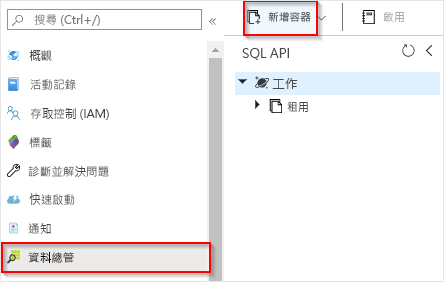
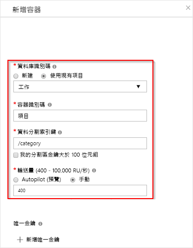

# <a name="create-a-function-triggered-by-azure-cosmos-db"></a>建立 Azure Cosmos DB 所觸發的函式

了解如何建立在 Azure Cosmos DB 中新增或變更資料時觸發的函式。 若要深入了解 Azure Cosmos DB，請參閱[Azure Cosmos DB：使用 Azure Functions 的無伺服器資料庫計算](../cosmos-db/serverless-computing-database.md)。

:::image type="content" source="./media/functions-create-cosmos-db-triggered-function/quickstart-completed.png" alt-text="Azure Cosmos DB 程式碼":::

## <a name="prerequisites"></a>必要條件

若要完成本教學課程：

+ 如果您沒有 Azure 訂用帳戶，請在開始前建立[免費帳戶](https://azure.microsoft.com/free/?WT.mc_id=A261C142F)。

> [!NOTE]
> [!INCLUDE [SQL API support only](../../includes/functions-cosmosdb-sqlapi-note.md)]

## <a name="sign-in-to-azure"></a>登入 Azure
使用您的 Azure 帳戶登入 [Azure 入口網站](https://portal.azure.com/) 。

## <a name="create-an-azure-cosmos-db-account"></a>建立 Azure Cosmos DB 帳戶

在建立觸發程序之前，您必須先擁有使用 SQL API 的 Azure Cosmos DB 帳戶。

[!INCLUDE [cosmos-db-create-dbaccount](../../includes/cosmos-db-create-dbaccount.md)]

## <a name="create-an-azure-function-app"></a>建立 Azure 函數應用程式

[!INCLUDE [Create function app Azure portal](../../includes/functions-create-function-app-portal.md)]

接下來，您要在新的函式應用程式中建立函式。

<a name="create-function"></a>

## <a name="create-azure-cosmos-db-trigger"></a>建立 Azure Cosmos DB 觸發程序

1. 在您的函式應用程式中，從左側功能表選取 [函式]，然後從頂端功能表選取 [新增]。 

1. 在 [新增函式] 頁面的搜尋欄位中輸入 `cosmos`，然後選擇 [Azure Cosmos DB 觸發程序] 範本。

   :::image type="content" source="./media/functions-create-cosmos-db-triggered-function/function-choose-cosmos.png" alt-text="Azure 入口網站中的函式頁面":::


1. 使用下表中指定的設定來設定新的觸發程序：

    | 設定      | 建議的值  | 描述                                |
    | ------------ | ---------------- | ------------------------------------------ |
    | **新增函式** | 接受預設名稱 | 函數的名稱。 |
    | **Cosmos DB 帳戶連線** | 接受預設的新名稱 | 選取 [新增]、稍早建立的 [資料庫帳戶]，然後選取 [確定]。 此動作會建立適用於帳戶連線的應用程式設定。 繫結會使用此設定來連線至資料庫。 |
    | **資料庫名稱** | 工作 | 資料庫的名稱，該資料庫包含要監視的集合。 |
    | **集合名稱** | 項目 | 要監視的集合名稱。 |
    | **租用的集合名稱** | 租用 | 可存放租用的集合名稱。 |
    | **若不存在，則建立租用集合** | 是 | 確定租用集合存在後加以自動建立。 |

    :::image type="content" source="./media/functions-create-cosmos-db-triggered-function/functions-cosmosdb-trigger-settings.png" alt-text="建立 Azure Cosmos DB 觸發的函式":::

1. 選取 [建立函式]。 

    Azure 會建立 Cosmos DB 觸發程式函式。

1. 若要顯示以範本為基礎的函式程式碼，請選取 [程式碼 + 測試]。

    :::image type="content" source="./media/functions-create-cosmos-db-triggered-function/function-cosmosdb-template.png" alt-text="C# 中的 Cosmos DB 函式範本":::

    此函式範本會將文件數和第一個文件識別碼寫入記錄。

接下來，連線至 Azure Cosmos DB 帳戶，並在 `Tasks` 資料庫中建立 `Items` 容器。

## <a name="create-the-items-container"></a>建立項目容器

1. 在瀏覽器的新索引標籤中，開啟 [Azure 入口網站](https://portal.azure.com)的第二個執行個體。

1. 在入口網站的左側，展開圖示列，在搜尋欄位中輸入 `cosmos`，然後選取 [Azure Cosmos DB]。

    

1. 選擇您的 Azure Cosmos DB 帳戶，然後選取 [資料總管]。 

1. 在 [SQL API] 底下選擇 [工作] 資料庫，然後選取 [新增容器]。

    

1. 在 [新增容器] 中，使用下圖下方的表格中顯示的設定。 

    

    | 設定|建議的值|描述 |
    | ---|---|--- |
    | **資料庫識別碼** | 工作 |新資料庫的名稱。 這必須符合您函式繫結中定義的名稱。 |
    | **容器識別碼** | 項目 | 新容器的名稱。 這必須符合您函式繫結中定義的名稱。  |
    | **[分割區索引鍵](../cosmos-db/partitioning-overview.md)** | /類別|可將資料平均分散到每個資料分割的資料分割索引鍵。 選取正確的資料分割索引鍵對於建立高效能容器來說很重要。 | 
    | **輸送量** |400 RU| 使用預設值。 如果您想要降低延遲，稍後可以擴大輸送量。 |    

1. 按一下 [確定] 以建立 [項目] 容器。 容器可能會在很短的時間內建立。

當函式繫結中指定的容器存在之後，您就能將項目新增至這個新容器，藉以測試函式。

## <a name="test-the-function"></a>測試函式

1. 在資料總管中展開新的 **項目** 容器，選擇 [項目]，然後選取 [新增項目]。

    :::image type="content" source="./media/functions-create-cosmos-db-triggered-function/create-item-in-container.png" alt-text="在項目容器中建立項目":::

1. 使用以下內容來取代新項目的內容，然後選擇 [儲存]。

    ```yaml
    {
        "id": "task1",
        "category": "general",
        "description": "some task"
    }
    ```

1. 切換至第一個瀏覽器索引標籤，其中包含您在入口網站中的函式。 展開函式記錄，並確認新文件已經觸發函式。 查看已將 `task1` 文件識別碼值寫入記錄。 

    

1. (選擇性) 返回您的文件、進行變更，然後按一下 [更新]。 接著，返回函式記錄，並確認更新也已觸發函式。

## <a name="clean-up-resources"></a>清除資源

[!INCLUDE [Next steps note](../../includes/functions-quickstart-cleanup.md)]

## <a name="next-steps"></a>後續步驟

您已建立要在 Azure Cosmos DB 中新增或修改文件時執行的函式。 如需 Azure Cosmos DB 觸發程序的詳細資訊，請參閱[適用於 Azure Functions 的 Azure Cosmos DB 繫結](functions-bindings-cosmosdb.md)。

[!INCLUDE [Next steps note](../../includes/functions-quickstart-next-steps.md)]