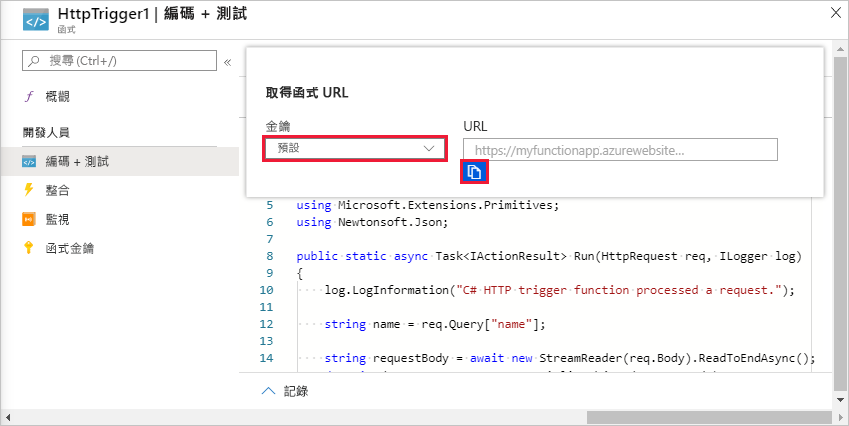

# 在 Azure 入口網站中建立您的第一個函式

Azure Functions 可讓您在無伺服器環境中執行程式碼，而不需要先建立虛擬機器 (VM) 或發佈 Web 應用程式。 在本文中，您將瞭解如何使用 Azure Functions 在 Azure 入口網站中建立 "hello world" HTTP 觸發程式函數。

建議您在 [本機開發](functions-develop-local.md) 函式併發布至 Azure 中的函數應用程式。  
您可以使用下列其中一個連結，開始使用您所選的本機開發環境和語言：

| Visual Studio Code | 終端機/命令提示字元 | Visual Studio |
| --- | --- | --- |
|  &bull;&nbsp;[C 入門#](./functions-create-first-function-vs-code.md?pivots=programming-language-csharp) &bull;&nbsp;[開始使用 JAVA](./functions-create-first-function-vs-code.md?pivots=programming-language-java) &bull;&nbsp;[開始使用 JavaScript](./functions-create-first-function-vs-code.md?pivots=programming-language-javascript) &bull;&nbsp;[開始使用 PowerShell](./functions-create-first-function-vs-code.md?pivots=programming-language-powershell) &bull;&nbsp;[開始使用 Python](./functions-create-first-function-vs-code.md?pivots=programming-language-python) |&bull;&nbsp;[C 入門#](./functions-create-first-azure-function-azure-cli.md?pivots=programming-language-csharp) &bull;&nbsp;[開始使用 JAVA](./functions-create-first-azure-function-azure-cli.md?pivots=programming-language-java) &bull;&nbsp;[開始使用 JavaScript](./functions-create-first-azure-function-azure-cli.md?pivots=programming-language-javascript) &bull;&nbsp;[開始使用 PowerShell](./functions-create-first-azure-function-azure-cli.md?pivots=programming-language-powershell) &bull;&nbsp;[開始使用 Python](./functions-create-first-azure-function-azure-cli.md?pivots=programming-language-python) | [開始使用 C#](functions-create-your-first-function-visual-studio.md) |

[!INCLUDE [quickstarts-free-trial-note](../../includes/quickstarts-free-trial-note.md)]

## 登入 Azure

使用您的 Azure 帳戶登入 [Azure 入口網站](https://portal.azure.com) 。

## 建立函數應用程式

您必須擁有函式應用程式以便主控函式的執行。 函式應用程式可讓您將多個函式群組為邏輯單位，以方便您管理、部署、調整和共用資源。

[!INCLUDE [Create function app Azure portal](../../includes/functions-create-function-app-portal.md)]

接下來，在新的函數應用程式中建立函式。

## 建立 HTTP 觸發程序函式

1. 從 [函式] 視窗的左側功能表選取 [函式]，然後從頂端功能表選取 [新增]。 
 
1. 從 [新增函式] 視窗選取 [Http 觸發程式]。

    

1. 在 [新增函式] 視窗中，接受 [新函式] 的預設名稱，或輸入新名稱。 

1. 從 [授權層級] 下拉式清單中選擇 [匿名]，然後選取 [建立函式]。

    Azure 會建立 HTTP 觸發程序函式。 現在，您可以藉由傳送 HTTP 要求來執行新的函式。

## 測試函式

1. 在新的 HTTP 觸發程式函式中，從左側功能表選取 [程式碼 + 測試]，然後從頂端功能表選取 [取得函式 URL]。

    

1. 在 [取得函式 URL] 對話方塊中，從下拉式清單中選取**預設值**，然後選取 [複製到剪貼簿] 圖示。 

    

1. 將函式 URL 貼入瀏覽器的網址列中。 將查詢字串值 `?name=<your_name>` 新增至此 URL 的結尾，然後按 Enter 鍵以執行要求。 

    下列範例會顯示瀏覽器中的回應：

    

    要求 URL 預設會包含所需金鑰，以便透過 HTTP 存取您的函式。

1. 當函式執行時，系統會將追蹤資訊寫入到記錄中。 若要查看追蹤輸出，請回到入口網站中的 [程式碼 + 測試] 頁面，然後展開頁面底部的 [記錄] 箭號。

   

## 清除資源

[!INCLUDE [Clean-up resources](../../includes/functions-quickstart-cleanup.md)]

## 後續步驟

[!INCLUDE [Next steps note](../../includes/functions-quickstart-next-steps.md)]

