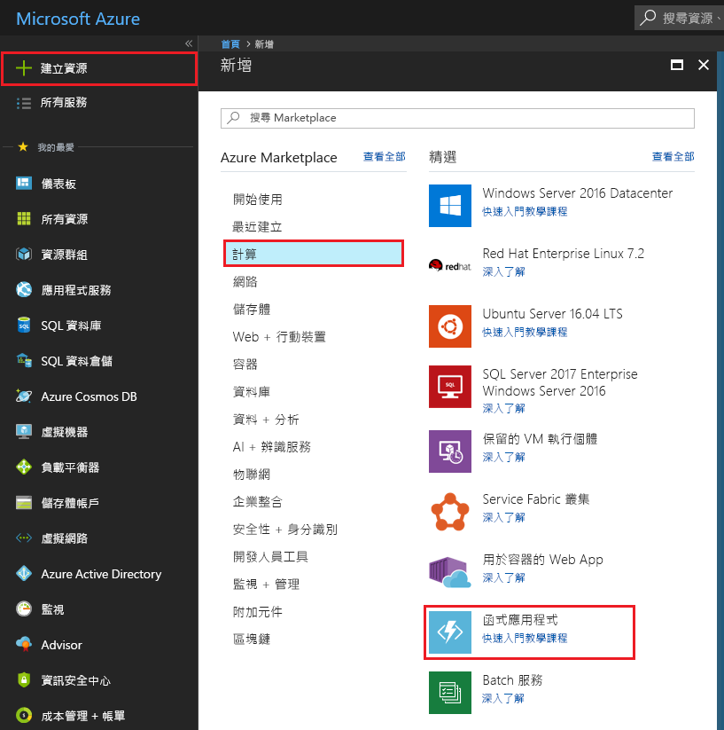
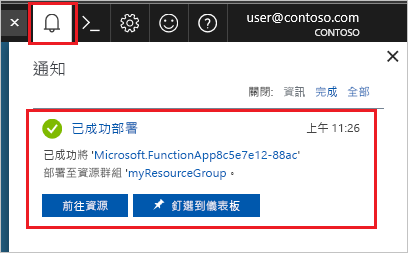
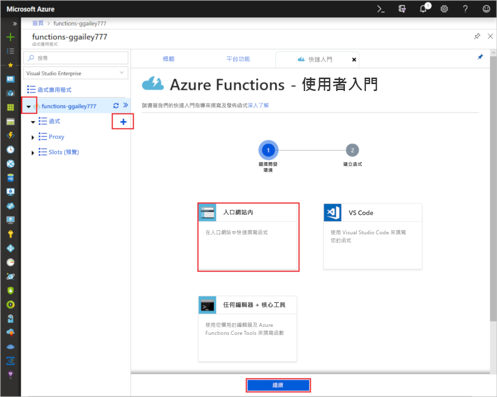
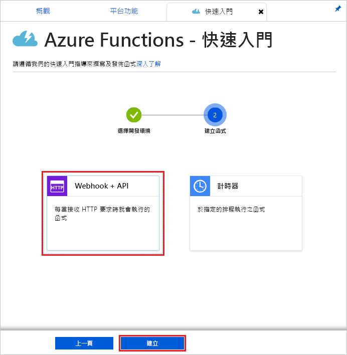
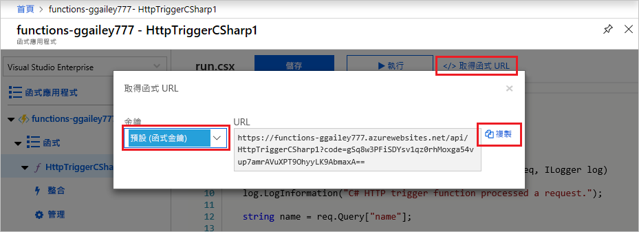

# 使用 Azure 學生入門版建立函式

在本教學課程中，我們將在 Azure 學生入門版訂用帳戶中建立 "hello world" HTTP 函式。 我們也將逐步說明 Azure Functions 中此訂用帳戶類型可用的功能。

Microsoft Azure 學生入門版  可讓您免費開始使用在雲端開發所需的 Azure 產品。 [在此深入了解這項供應項目。](https://azure.microsoft.com/offers/ms-azr-0144p/)

Azure Functions 可讓您在[無伺服器](https://azure.microsoft.com/solutions/serverless/)環境中執行程式碼，而不需要先建立 VM 或發佈 Web 應用程式。 [在此深入了解 Functions。](./functions-overview.md)

## 建立函式

 在本主題中，請學習如何使用 Functions 在 Azure 入口網站中建立 HTTP 觸發的 "hello world" 函式。

## 登入 Azure

使用您的 Azure 帳戶登入 Azure 入口網站 (<https://portal.azure.com>)。

## 建立函數應用程式

您必須擁有函式應用程式以便主控函式的執行。 函式應用程式可讓您將多個函式群組為邏輯單位，以方便您管理、部署、調整和共用資源。

1. 選取 Azure 入口網站左上角的 [建立資源]  按鈕。 然後選取 [計算]   > [函式應用程式]  。

    

2. 請使用影像下面的資料表中指定的函式應用程式設定。

    

    | 設定      | 建議的值  | 描述                                        |
    | ------------ |  ------- | -------------------------------------------------- |
    | **應用程式名稱** | 全域唯一的名稱 | 用以識別新函式應用程式的名稱。 有效字元是 `a-z`、`0-9` 和 `-`。  | 
    | **訂用帳戶** | 您的訂用帳戶 | 將在其下建立這個新函式應用程式的訂用帳戶。 | 
    | **[資源群組](../azure-resource-manager/management/overview.md)** |  myResourceGroup | 要在其中建立函式應用程式的新資源群組名稱。 |
   | **[App Service 方案/位置](./functions-scale.md)** | 新增 | 裝載方案，用以控制函式應用程式的部署區域和資源的密度。 部署到相同方案的多個函式應用程式全都會共用相同的單一可用執行個體。 這是學生入門版方案的限制。 完整的裝載選項[在此說明。](./functions-scale.md)|
    | **執行階段堆疊** | 慣用語言 | 選擇支援您慣用函式程式設計語言的執行階段。 針對 C# 和 F # 函式選擇 **.NET**。 |
    |**[Application Insights](./functions-monitoring.md)**| 啟用 | Application Insights 用來儲存及分析函式應用程式的記錄。 如果您選擇支援 Application Insights 的位置，則會依預設啟用。 手動選擇附近區域來部署 Application Insights，即可針對任何函式啟用 Application Insights。 若沒有 Application Insights，您就只能檢視即時串流記錄。

3. 選取上述的 [App Service 方案/位置]  以選擇不同的位置

4. 選取 [新建]  ，然後為您的方案賦予唯一名稱。

5. 選取最靠近您的位置。 [請在此參閱 Azure 區域的完整地圖。](https://azure.microsoft.com/global-infrastructure/regions/) 

    

6. 選取 [建立]  以佈建並部署函式應用程式。

    

7. 選取入口網站右上角的 [通知] 圖示，查看是否有**部署成功**訊息。

    

8. 選取 [前往資源]  ，以檢視您新的函式應用程式。

接下來，您要在新的函式應用程式中建立函式。

## 建立由 HTTP 觸發的函式

1. 展開新的函式應用程式，接著選取 [Functions] **+ 旁的**  按鈕、選擇 [入口網站內]  ，然後選取 [繼續]  。

    

1. 選擇 [WebHook + API]  ，然後選取 [建立]  。

    

系統隨即會使用由 HTTP 觸發的函式特定語言範本來建立函式。

現在，您可以藉由傳送 HTTP 要求來執行新的函式。

## 測試函式

1. 在新的函式中，按一下右上方的 [</> 取得函式 URL]  ，選取 [預設 (函式索引鍵)]  ，然後按一下 [複製]  。 

    

2. 將函式 URL 貼入瀏覽器的網址列中。 將查詢字串值 `&name=<yourname>` 新增至此 URL 的結尾，並按鍵盤上的 `Enter` 鍵執行要求。 您應該會看到函式傳回的回應顯示在瀏覽器中。  

    下列範例會顯示瀏覽器中的回應：

    

    要求 URL 預設會包含所需金鑰，以便透過 HTTP 存取您的函式。

3. 當函式執行時，系統會將追蹤資訊寫入到記錄中。 若要查看上次執行的追蹤輸出，請在入口網站中返回您的函式，然後按一下畫面底部的箭號來展開**記錄**。

   

## 清除資源

[!INCLUDE [Clean-up resources](../../includes/functions-quickstart-cleanup.md)]

## Azure 學生入門版支援的功能

在 Azure 學生入門版中，您可存取 Azure Functions 執行階段的大部分功能，但是有下列幾項重要限制：

* HTTP 觸發程序是唯一支援的觸發程序類型。
    * 支援所有輸入和所有輸出繫結！ [請在此參閱完整清單。](functions-triggers-bindings.md)
* 支援的語言： 
    * C# (.NET Core 2)
    * JavaScript (Node.js 8 & 10)
    * F# (.NET Core 2)
    * [請在此參閱更高方案中支援的語言](supported-languages.md)
* Windows 是唯一支援的作業系統。
* 規模受限於每天最多執行 60 分鐘的[一個免費層執行個體](https://azure.microsoft.com/pricing/details/app-service/windows/)。 在接收 HTTP 流量時，您將以無伺服器的方式自動從 0 調整到 1 個執行個體，但不會進一步調整。
* 僅支援 Azure Functions 執行階段的 [2.x 版和更新版本](functions-versions.md)。
* 所有的開發人員工具都支援編輯和發佈函式。 這包括 VS Code、Visual Studio、Azure CLI 和 Azure 入口網站。 如果您想要使用入口網站以外的工具，則必須先在入口網站中建立應用程式，然後在您慣用的工具中選擇該應用程式作為部署目標。

## 後續步驟

您已使用簡單的 HTTP 觸發函式建立了函式應用程式！ 您現在可以探索本機工具、更多語言、監視及整合。

 * [使用 Visual Studio 建立第一個函數](./functions-create-your-first-function-visual-studio.md)
 * [使用 Visual Studio Code 建立第一個函式](./functions-create-first-function-vs-code.md)
 * [Azure Functions JavaScript 開發人員指南](./functions-reference-node.md)
 * [使用 Azure Functions 連接到 Azure SQL Database](./functions-scenario-database-table-cleanup.md)
 * [深入了解 Azure Functions HTTP 繫結](./functions-bindings-http-webhook.md)。
 * [監視 Azure Functions](./functions-monitoring.md)
