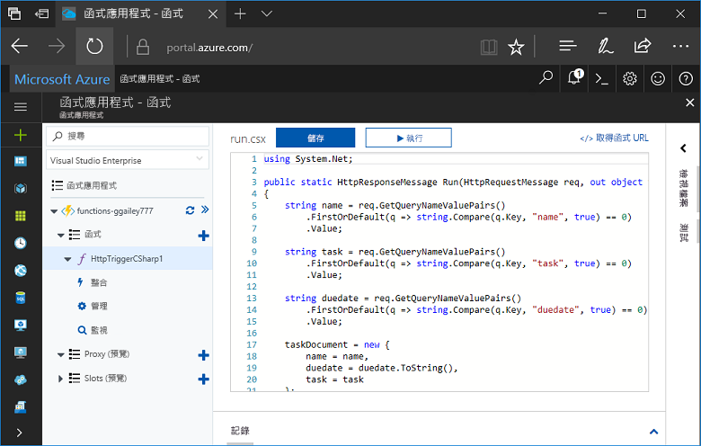
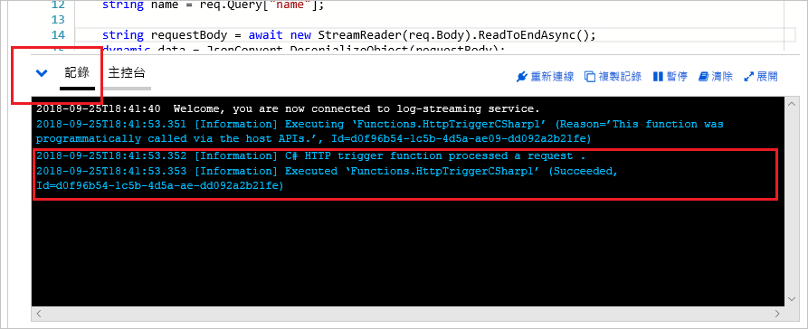

# 使用 Azure 學生入門版建立函式

在此教學課程中，我們將在 Azure 學生入門版訂用帳戶中建立 "hello world" HTTP 函式。 我們也將逐步說明 Azure Functions 中此訂用帳戶類型可用的功能。

Microsoft Azure 學生入門版可讓您免費開始使用在雲端開發所需的 Azure 產品。 [在此深入了解這項供應項目。](https://azure.microsoft.com/offers/ms-azr-0144p/)

Azure Functions 可讓您在[無伺服器](https://azure.microsoft.com/solutions/serverless/)環境中執行程式碼，而不需要先建立 VM 或發佈 Web 應用程式。 [在此深入了解 Functions。](./functions-overview.md)

[!INCLUDE [quickstarts-free-trial-note](../../includes/quickstarts-free-trial-note.md)]

## 建立函式

 在此文章中，了解如何使用 Azure Functions 在 Azure 入口網站中建立 "hello world" HTTP 觸發程序函式。

## 登入 Azure

使用您的 Azure 帳戶登入 [Azure 入口網站](https://portal.azure.com) 。

## 建立函數應用程式

您必須擁有函式應用程式以便主控函式的執行。 函式應用程式可讓您將多個函式群組為邏輯單位，以方便您管理、部署、調整和共用資源。

[!INCLUDE [Create function app Azure portal](../../includes/functions-create-function-app-portal.md)]

接下來，您要在新的函式應用程式中建立函式。

## 建立 HTTP 觸發程序函式

1. 從 [函式] 視窗的左側功能表選取 [函式]，然後從頂端功能表選取 [新增]。 
 
1. 從 [新增函式] 視窗選取 [Http 觸發程式]。

    

1. 在 [新增函式] 視窗中，接受 [新函式] 的預設名稱，或輸入新名稱。 

1. 從 [授權層級] 下拉式清單中選擇 [匿名]，然後選取 [建立函式]。

    Azure 會建立 HTTP 觸發程序函式。 現在，您可以藉由傳送 HTTP 要求來執行新的函式。

## 測試函式

1. 在新的 HTTP 觸發程式函式中，從左側功能表選取 [程式碼 + 測試]，然後從頂端功能表選取 [取得函式 URL]。

    

1. 在 [取得函式 URL] 對話方塊中，從下拉式清單中選取**預設值**，然後選取 [複製到剪貼簿] 圖示。 

    

1. 將函式 URL 貼入瀏覽器的網址列中。 將查詢字串值 `?name=<your_name>` 新增至此 URL 的結尾，然後按 Enter 鍵以執行要求。 

    下列範例會顯示瀏覽器中的回應：

    

    要求 URL 預設會包含所需金鑰，以便透過 HTTP 存取您的函式。

1. 當函式執行時，系統會將追蹤資訊寫入到記錄中。 若要查看追蹤輸出，請回到入口網站中的 [程式碼 + 測試] 頁面，然後展開頁面底部的 [記錄] 箭號。

   

## 清除資源

[!INCLUDE [Clean-up resources](../../includes/functions-quickstart-cleanup.md)]

## Azure 學生入門版支援的功能

在 Azure 學生入門版中，您可以存取 Azure Functions 執行階段的大部分功能，但是有下列幾個重要限制：

* HTTP 觸發程序是唯一支援的觸發程序類型。
    * 支援所有輸入和所有輸出繫結！ [請在此參閱完整清單。](functions-triggers-bindings.md)
* 支援的語言： 
    * C# (.NET Core 2)
    * JavaScript (Node.js 8 & 10)
    * F# (.NET Core 2)
    * [請在此參閱更高方案中支援的語言](supported-languages.md)
* Windows 是唯一支援的作業系統。
* 規模受限於每天最多執行 60 分鐘的[一個免費層執行個體](https://azure.microsoft.com/pricing/details/app-service/windows/)。 在接收 HTTP 流量時，您將以無伺服器的方式自動從 0 調整到 1 個執行個體，但不會進一步調整。
* 僅支援 Azure Functions 執行階段的 [2.x 版和更新版本](functions-versions.md)。
* 所有的開發人員工具都支援編輯和發佈函式。 這包括 VS Code、Visual Studio、Azure CLI 和 Azure 入口網站。 如果您想要使用入口網站以外的工具，則必須先在入口網站中建立應用程式，然後在您慣用的工具中選擇該應用程式作為部署目標。

## 後續步驟

您現在已使用簡單的 HTTP 觸發程序函式建立了函數應用程式。 接著，您可以探索本機工具、更多語言、監視及整合。

 * [使用 Visual Studio 建立第一個函數](./functions-create-your-first-function-visual-studio.md)
 * [使用 Visual Studio Code 建立第一個函式](./functions-create-first-function-vs-code.md)
 * [Azure Functions JavaScript 開發人員指南](./functions-reference-node.md)
 * [使用 Azure Functions 連接到 Azure SQL Database](./functions-scenario-database-table-cleanup.md)
 * [深入了解 Azure Functions HTTP 繫結](./functions-bindings-http-webhook.md)。
 * [監視 Azure Functions](./functions-monitoring.md)
