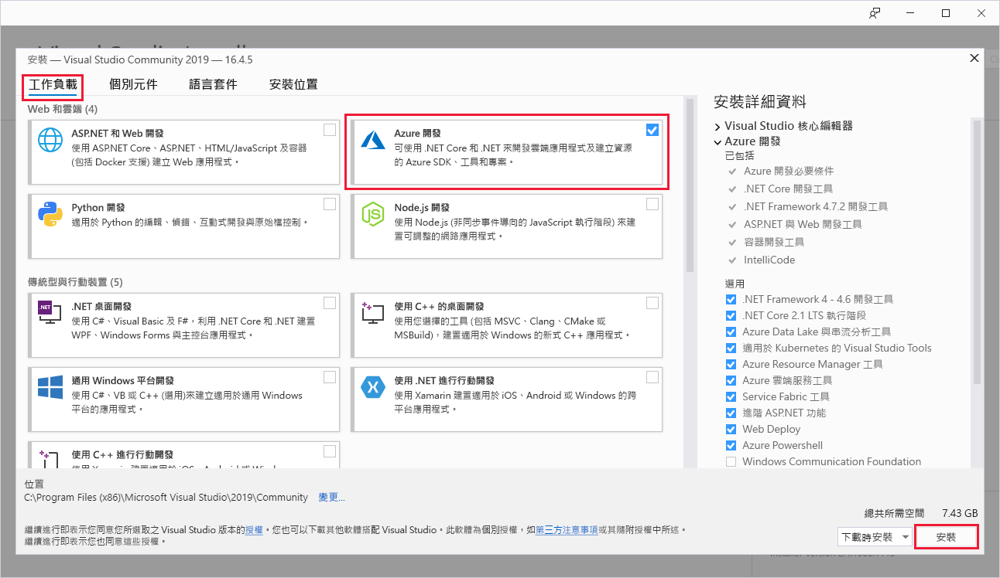

# 快速入門：使用 Visual Studio 在 Azure 中建立第一個函式

在本文中，您會使用 Visual Studio 建立可回應 HTTP 要求的 C# 類別庫函式。 在本機測試程式碼之後，您可以將其部署到 Azure Functions 的無伺服器環境。  

完成本快速入門後，您的 Azure 帳戶中會產生幾美分或更少的少許費用。

## 必要條件

若要完成本教學課程，請先安裝 [Visual Studio 2019](https://azure.microsoft.com/downloads/)。 請務必在安裝期間選取 [Azure 開發] 工作負載。 如果您想要改為使用 Visual Studio 2017 來建立 Azure Functions 專案，您必須先安裝[最新的 Azure Functions 工具](functions-develop-vs.md#check-your-tools-version)。

如果您沒有 [Azure 訂用帳戶](../guides/developer/azure-developer-guide.md#understanding-accounts-subscriptions-and-billing)，請在開始前建立[免費帳戶](https://azure.microsoft.com/free/dotnet/)。

## 建立函式應用程式專案

[!INCLUDE [Create a project using the Azure Functions template](../../includes/functions-vstools-create.md)]

Visual Studio 會建立一個專案，其中的類別包含 HTTP 觸發程序函式類型的重複使用程式碼。 重複使用程式碼會傳送 HTTP 回應，其中包含要求內文或查詢字串中的值。 `HttpTrigger` 屬性指定此函式是由 HTTP 要求所觸發。 

## 重新命名函式

`FunctionName` 方法屬性會設定函式的名稱，其預設將產生為 `Function1`。 因為當您建立專案時，工具不會讓您覆寫預設函式名稱，所以請花幾分鐘為函式類別、檔案與中繼資料建立更好的名稱。

1. 在 [檔案總管] 中，在 Function1.cs 檔案按一下滑鼠右鍵，並將其重新命名為 `HttpExample.cs`。

1. 在程式碼中，將 Function1 類別重新命名為 'HttpExample'。

1. 在名為 `Run` 的 `HttpTrigger` 方法中，將 `FunctionName` 方法屬性重新命名為 `HttpExample`。

您現在已重新命名函式，可以在本機電腦上進行測試。

## 在本機執行函式

Visual Studio 與 Azure Functions Core Tools 整合，以便您使用完整 Azure Functions 執行階段在本機測試函式。  

[!INCLUDE [functions-run-function-test-local-vs](../../includes/functions-run-function-test-local-vs.md)]

確認函式在本機電腦上正確執行之後，就可以將專案發佈到 Azure。

## 將專案發佈到 Azure

您的 Azure 訂用帳戶中必須具有函式應用程式，才可以發佈您的專案。 Visual Studio 發佈會在您第一次發佈專案時，為您建立函式應用程式。

[!INCLUDE [Publish the project to Azure](../../includes/functions-vstools-publish.md)]

## 在 Azure 中測試您的函式

1. 在 Cloud Explorer 中，您應選取新的函數應用程式。 若沒有，請展開您的訂用帳戶 > [應用程式服務]，然後選取新的函數應用程式。

1. 在函數應用程式按一下滑鼠右鍵，然後選擇 [在瀏覽器中開啟]。 這會在您預設之網頁瀏覽器中開啟函數應用程式的根，並顯示表示您的函數應用程式正在執行的頁面。 

    :::image type="content" source="media/functions-create-your-first-function-visual-studio/function-app-running-azure.png" alt-text="正在執行的函數應用程式":::

1. 在瀏覽器的網址列中，將字串 `/api/HttpExample?name=Functions` 附加至基底 URL，然後執行要求。

    呼叫 HTTP URL 觸發函式的 URL 會採用下列格式：

    `http://<APP_NAME>.azurewebsites.net/api/HttpExample?name=Functions`

2. 前往此 URL，您會看到瀏覽器中對於函式所傳回遠端 GET 要求所做出的回應，其看起來像下列範例︰

    :::image type="content" source="media/functions-create-your-first-function-visual-studio/functions-create-your-first-function-visual-studio-browser-azure.png" alt-text="瀏覽器中的函式回應":::

## 清除資源

此集合中的其他快速入門會以本快速入門為基礎。 如果您打算繼續進行後續的快速入門、教學課程或者您在本快速入門中建立的任何服務，請勿清除資源。

在 Azure 中「資源」是指函式應用程式、函式、儲存體帳戶等等。 其會分組為「資源群組」，您可以藉由刪除群組來刪除群組中的所有項目。 

您已建立資源來完成這些快速入門。 您可能必須支付這些資源，取決於您的[帳戶狀態](https://azure.microsoft.com/account/)和[服務定價](https://azure.microsoft.com/pricing/)。 如果您不再需要資源，刪除方式如下：

1. 在 Cloud Explorer 中，展開您的訂用帳戶 > [應用程式服務]，在函數應用程式按一下滑鼠右鍵，然後選擇 [在入口網站中開啟]。 

1. 在函數應用程式頁面中，選取 [概觀] 索引標籤，然後選取 [資源群組] 底下的連結。

   :::image type="content" source="media/functions-create-your-first-function-visual-studio/functions-app-delete-resource-group.png" alt-text="選取要從函數應用程式頁面中刪除的資源群組":::

2. 在 [資源群組] 分頁中，檢閱包含資源的清單，並確認這些是您想要刪除的項目。
 
3. 選取 [刪除資源群組]，並遵循指示。

   刪除需要幾分鐘的時間。 完成時，通知會出現幾秒鐘的時間。 您也可以選取分頁頂端的鈴鐺圖示以檢視通知。

## 後續步驟

在本快速入門中，您已透過 Visual Studio，使用簡單的 HTTP 觸發函式在 Azure 中建立及發佈 C# 函式應用程式。 

請接著前往下一篇文章，了解如何將 Azure 儲存體的佇列繫結新增至您的函式：
> [!div class="nextstepaction"]
> [將 Azure 儲存體佇列繫結新增至您的函式](functions-add-output-binding-storage-queue-vs.md)

