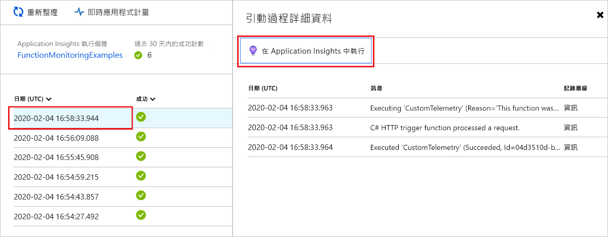
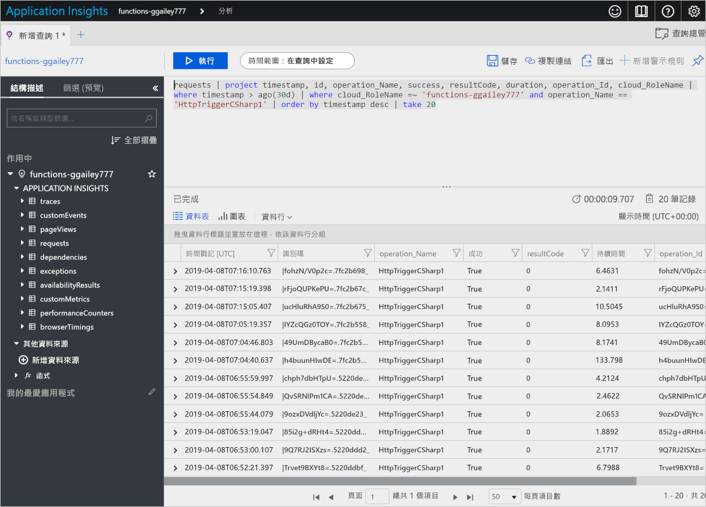

# <a name="monitor-azure-functions"></a>監視 Azure Functions

[Azure Functions](functions-overview.md) 提供與 [Azure Application Insights](../azure-monitor/app/app-insights-overview.md) 的內建整合來監視函式。 本文示範如何設定 Azure Functions，以將系統產生的記錄檔傳送到 Application Insights。

我們建議使用 Application Insights，因為其會收集記錄、效能和錯誤資料。 其會自動偵測效能異常，並隨附強大的分析工具，以協助您診斷問題，以及了解如何使用您的函式。 它是設計來協助您持續改善效能和可用性。 您甚至可以在本機函式應用程式專案開發期間使用 Application Insights。 如需詳細資訊，請參閱 [Application Insights 是什麼？](../azure-monitor/app/app-insights-overview.md)

由於 Azure Functions 內建必要的 Application Insights 檢測設備，因此，您只需要有效的檢測金鑰，即可將您的函式應用程式連線到 Application Insights 資源。 當您在 Azure 中建立函式應用程式資源時，應該將檢測金鑰新增至應用程式設定。 如果您的函式應用程式還沒有這個金鑰，您可以[手動設定](#enable-application-insights-integration)。  

## <a name="application-insights-pricing-and-limits"></a>Application Insights 定價和限制

您可以免費試用 Azure Application Insights 與 Azure Functions 整合。 每天都有一個可以免費處理資料量的限制。 您可能會在測試期間達到此限制。 當您趨近每日限制時，Azure 會提供入口網站及電子郵件通知。 如果您錯過那些警示並達到該限制，Application Insights 查詢中將不會出現新記錄。 請留意限制，以避免不必要的疑難排解時間。 如需詳細資訊，請參閱[管理 Application Insights 中的價格和資料磁碟區](../azure-monitor/app/pricing.md)。

> [!IMPORTANT]
> Application Insights 具有[取樣](../azure-monitor/app/sampling.md)功能，可以提供保護，以避免在尖峰負載期間完成的執行中產生過多的遙測資料。 取樣預設為啟用。 如果您似乎有資料遺失，可能就需要調整取樣設定，以符合您特定的監視案例。 若要深入了解，請參閱[設定取樣](#configure-sampling)。

可供函式應用程式使用的 Application Insights 功能完整清單，詳述於[適用於 Azure Functions 的 Application Insights 支援的功能](../azure-monitor/app/azure-functions-supported-features.md)中。

## <a name="view-telemetry-in-monitor-tab"></a>在監視索引標籤中檢視遙測

藉由[啟用 Application Insights 整合](#enable-application-insights-integration)，您可以在 [監視器] 索引標籤中檢視遙測資料。

1. 在函式應用程式頁面中，選取在設定 Application Insights 之後至少執行過一次的函式。 然後，從左窗格中選取 [監視器]。 定期選取 [重新整理]，直到函式引動過程的清單出現為止。

   

    > [!NOTE]
    > 當遙測用戶端將資料分批傳輸到伺服器時，可能需要五分鐘的時間，清單才會出現。 此延遲不適用[即時計量資料流](../azure-monitor/app/live-stream.md)。 當您載入頁面時，該服務會連線到 Functions 主機，以便將記錄直接串流處理到頁面。

1. 若要查看特定函式引動過程的記錄，請選取該引動過程的 [日期 (UTC)] 資料行連結。 該引動過程的記錄輸出會顯示在新頁面中。

   

1. 選擇 [在 Application Insights 中執行]，以檢視可在 Azure 記錄中擷取 Azure 監視器記錄資料的查詢來源。 如果這是您第一次在訂用帳戶中使用 Azure Log Analytics，系統就會要求您進行啟用。

1. 啟用 Log Analytics 之後，即會顯示下列查詢。 您可以看到查詢結果僅限過去 30 天 (`where timestamp > ago(30d)`)。 此外，結果顯示的資料列不會超過 20 列 (`take 20`)。 相反地，您函式的引動過程詳細資料清單適用於過去 30 天且無任何限制。

   

如需詳細資訊，請參閱本文稍後的[查詢遙測資料](#query-telemetry-data)。

## <a name="view-telemetry-in-application-insights"></a>在 Application Insights 中檢視遙測

若要從 Azure 入口網站的函式應用程式開啟 Application Insights，請在左側頁面的 [設定]  底下，選取 [Application Insights]。 如果這是您第一次使用 Application Insights 搭配訂用帳戶，系統將提示您進行啟用：選取 [開啟 Application Insights]，然後在下一頁選取 [套用]。

![從函式應用程式的 [概觀] 頁面開啟 Application Insights](media/functions-monitoring/ai-link.png)

如需如何使用 Application Insights 的相關資訊，請參閱 [Application Insights 文件](/azure/application-insights/)。 本節示範一些如何在 Application Insights 中檢視資料的範例。 如果您已經熟悉 Application Insights，即可直接前往[關於如何設定和自訂遙測資料的小節](#configure-categories-and-log-levels)。

![Application Insights 的 [概觀] 索引標籤](media/functions-monitoring/metrics-explorer.png)

評估函式中的行為、效能和錯誤時，Application Insights 的下列區域很實用：

| 調查 | 描述 |
| ---- | ----------- |
| **[失敗](../azure-monitor/app/asp-net-exceptions.md)** |  根據函式失敗和伺服器例外狀況，建立圖表和警示。 **作業名稱**是函式名稱。 除非您實作自訂遙測來取得相依性，否則不會顯示相依性中的失敗。 |
| **[效能](../azure-monitor/app/performance-counters.md)** | 藉由檢視每個**雲端角色執行個體**的資源使用率和輸送量，來分析效能問題。 如果要對函式拖累基礎資源的案例進行偵錯，此資料非常有用。 |
| **[計量](../azure-monitor/platform/metrics-charts.md)** | 建立以計量為基礎的圖表和警示。 計量包括函式引動過程的數目、執行時間和成功率。 |
| **[即時計量    ](../azure-monitor/app/live-stream.md)** | 檢視以近乎即時方式建立的計量資料。 |

## <a name="query-telemetry-data"></a>查詢遙測資料

[Application Insights 分析](../azure-monitor/log-query/log-query-overview.md)可讓您在資料庫中，以資料表形式存取所有遙測資料。 分析會提供用於擷取、操作和視覺化資料的查詢語言。 

選擇 [記錄] 以探索或查詢記錄的事件。


以下的查詢範例會顯示過去 30 分鐘內每個背景工作角色的要求分佈狀況。

<pre>
requests
| where timestamp > ago(30m) 
| summarize count() by cloud_RoleInstance, bin(timestamp, 1m)
| render timechart
</pre>

可用的資料表會顯示於左側 [結構描述] 索引標籤中。 您可以找到下表中函式引動過程所產生的資料：

| Table | 描述 |
| ----- | ----------- |
| **traces** | 由執行階段和函式程式碼所建立的記錄。 |
| **requests** | 每個函式引動過程一個要求。 |
| **exceptions** | 由執行階段擲回的任何例外狀況。 |
| **customMetrics** | 成功和失敗引動過程的計數、成功率、持續時間。 |
| **customEvents** | 由執行階段所追蹤的事件，例如：觸發函式的 HTTP 要求。 |
| **performanceCounters** | 函式執行所在的伺服器效能相關資訊。 |

其他資料表適用於可用性測試，以及用戶端和瀏覽器遙測。 您可以實作自訂遙測，將資料新增至它們。

在每個資料表內，一些 Functions 特有的資料會位於 `customDimensions` 欄位中。  例如，下列查詢會擷取記錄層級為 `Error` 的所有追蹤。

<pre>
traces 
| where customDimensions.LogLevel == "Error"
</pre>

執行階段會提供 `customDimensions.LogLevel` 和 `customDimensions.Category` 欄位。 您可以在函式程式碼內撰寫的記錄中提供額外的欄位。 請參閱本文稍後的[結構化記錄](#structured-logging)。

## <a name="configure-categories-and-log-levels"></a>設定類別和記錄層級

您可以使用 Application Insights，而不需任何自訂設定。 預設設定可能會導致大量資料。 如果您使用 Visual Studio Azure 訂用帳戶，可能就會達到 Application Insights 適用的資料上限。 您將在本文稍後了解如何設定及自訂您的函式傳送到 Application Insights 的資料。 針對函式應用程式，記錄會設定於 [host.json] 檔案中。

### <a name="categories"></a>類別

Azure Functions 記錄器包括每個記錄的「類別」。 類別指出寫入記錄的是哪個部分的執行階段程式碼或函式程式碼。 下圖說明執行階段所建立記錄的主要類別。 

| 類別 | 描述 |
| ----- | ----- | 
| Host.Results | 這些記錄會在 Application Insights 中顯示為 **requests**。 它們表示函式的成功或失敗。 所有這些記錄都會在 `Information` 層級寫入。 如果您在 `Warning` 或更高層級進行篩選，就不會看到此資料。 |
| Host.Aggregator | 這些記錄會透過[可設定](#configure-the-aggregator)的期間來提供函式引動過程的計數與平均。 預設期間為 30 秒或 1,000 個結果，視何者較早達到而定。 您可在 Application Insights 中的 **customMetrics** 資料表取得記錄。 範例包括執行次數、成功率和持續時間。 所有這些記錄都會在 `Information` 層級寫入。 如果您在 `Warning` 或以上層級進行篩選，就不會看到此資料。 |

除了這些類別，其他類別的所有記錄均可在 Application Insights 的 **traces** 資料表中取得。

具有以 `Host` 開頭之類別的所有記錄都會由 Functions 執行階段寫入。 **函式已啟動**和**函式已完成**記錄的類別為 `Host.Executor`。 針對成功執行，這些記錄均為 `Information` 層級。 例外狀況會記錄於 `Error` 層級。 執行階段也會建立 `Warning` 層級的記錄，例如：傳送至有害佇列的佇列訊息。

Functions 執行階段會建立具有以 "Host" 開頭之類別的記錄。 在 1.x 版中，`function started`、`function executed` 和 `function completed` 記錄的類別為 `Host.Executor`。 從 2.x 版開始，這些記錄的類別為 `Function.<YOUR_FUNCTION_NAME>`。

如果您在函式程式碼中寫入記錄，則類別為 `Function.<YOUR_FUNCTION_NAME>.User` 且可以是任何記錄層級。 在 1.x 版的 Functions 執行階段中，類別為 `Function`。

### <a name="log-levels"></a>記錄層級

Azure Functions 記錄器也包含具有每個記錄的「記錄層級」。 [LogLevel](/dotnet/api/microsoft.extensions.logging.loglevel) 為一個列舉，而整數代碼表示相對的重要性：

|LogLevel    |程式碼|
|------------|---|
|追蹤       | 0 |
|偵錯       | 1 |
|資訊 | 2 |
|警告     | 3 |
|錯誤       | 4 |
|重大    | 5 |
|None        | 6 |

下一節會說明記錄層級 `None`。 

### <a name="log-configuration-in-hostjson"></a>Host.json 中的記錄設定

[Host.json] 檔案會設定函式應用程式傳送到 Application Insights 的記錄數量。 針對每個類別，您可以指出要傳送的最小記錄層級。 有兩個範例：第一個範例的目標是 [2.x 版和更新版本](functions-versions.md#version-2x)的 Functions 執行階段 (使用 .NET Core)，而第二個範例則適用於 1.x 版執行階段。

### <a name="version-2x-and-higher"></a>2\.x 版和更新版本

v2.x 版和更新版本的 Functions 執行階段會使用 [.NET Core 記錄篩選階層](/aspnet/core/fundamentals/logging/?view=aspnetcore-2.1#log-filtering) \(部分機器翻譯\)。 

```json
{
  "logging": {
    "fileLoggingMode": "always",
    "logLevel": {
      "default": "Information",
      "Host.Results": "Error",
      "Function": "Error",
      "Host.Aggregator": "Trace"
    }
  }
}
```

### <a name="version-1x"></a>1\.x 版

```json
{
  "logger": {
    "categoryFilter": {
      "defaultLevel": "Information",
      "categoryLevels": {
        "Host.Results": "Error",
        "Function": "Error",
        "Host.Aggregator": "Trace"
      }
    }
  }
}
```

此範例會設定下列規則：

* 針對類別為 `Host.Results` 或 `Function` 的記錄，只會將 `Error` 層級和以上層級傳送到 Application Insights。 `Warning` 層級和以下層級的記錄均會被忽略。
* 針對類別為 `Host.Aggregator` 的記錄，則會將所有記錄傳送到 Application Insights。 `Trace` 記錄層級和某些記錄器稱為 `Verbose` 的記錄層級相同，但會在 [host.json] 檔案中使用 `Trace`。
* 針對所有其他記錄，只會將 `Information` 層級和以上層級傳送至 Application Insights。

[Host.json] 中的類別值會控制以相同值開頭之所有類別的記錄。 [Host.json] 中的 `Host` 會控制 `Host.General`、`Host.Executor`、`Host.Results` 等的記錄。

如果 [host.json] 包含多個以相同字串開頭的類別，則會先比對較長的類別。 假設您想要取得執行階段在 `Error` 層級上記錄的所有項目 (`Host.Aggregator` 除外)，但您希望 `Host.Aggregator` 記錄於 `Information` 層級：

### <a name="version-2x-and-later"></a>2\.x 版和更新版本

```json
{
  "logging": {
    "fileLoggingMode": "always",
    "logLevel": {
      "default": "Information",
      "Host": "Error",
      "Function": "Error",
      "Host.Aggregator": "Information"
    }
  }
}
```

### <a name="version-1x"></a>1\.x 版 

```json
{
  "logger": {
    "categoryFilter": {
      "defaultLevel": "Information",
      "categoryLevels": {
        "Host": "Error",
        "Function": "Error",
        "Host.Aggregator": "Information"
      }
    }
  }
}
```

若要隱藏類別的所有記錄，您可以使用記錄層級 `None`。 不會使用該類別寫入任何記錄，而且沒有任何高於該類別的記錄層級。

## <a name="configure-the-aggregator"></a>設定彙總工具

如前一節所述，執行階段經過一段時間就會彙總有關函式執行的資料。 預設期間為 30 秒或 1,000 個執行，視何者較早達到而定。 您可以在 [host.json] 檔案中設定此設定。  以下是範例：

```json
{
    "aggregator": {
      "batchSize": 1000,
      "flushTimeout": "00:00:30"
    }
}
```

## <a name="configure-sampling"></a>設定取樣

Application Insights 具有[取樣](../azure-monitor/app/sampling.md)功能，可以提供保護，以避免在尖峰負載期間完成的執行中產生過多的遙測資料。 當傳入執行速率超過指定的閾值時，Application Insights 就會開始隨機忽略某些傳入執行。 每秒執行次數上限的預設值為 20 (在 1.x 版中為五)。 您可以在 [host.json](./functions-host-json.md#applicationinsights) 中設定取樣。  以下是範例：

### <a name="version-2x-and-later"></a>2\.x 版和更新版本

```json
{
  "logging": {
    "applicationInsights": {
      "samplingSettings": {
        "isEnabled": true,
        "maxTelemetryItemsPerSecond" : 20,
        "excludedTypes": "Request"
      }
    }
  }
}
```

在2.x 版中，您可以從取樣中排除特定類型的遙測。 在上述範例中，類型的資料 `Request` 會從取樣中排除。 這可確保在其他類型的遙測仍受限於取樣時，會記錄 *所有* 的函式執行 (要求) 。

### <a name="version-1x"></a>1\.x 版 

```json
{
  "applicationInsights": {
    "sampling": {
      "isEnabled": true,
      "maxTelemetryItemsPerSecond" : 5
    }
  }
}
```

## <a name="write-logs-in-c-functions"></a>在 C# 函式中寫入記錄

您可以在函式程式碼中寫入記錄，其會在 Application Insights 中顯示為追蹤。

### <a name="ilogger"></a>ILogger

在您的函式中使用 [ILogger](/dotnet/api/microsoft.extensions.logging.ilogger) 參數而不是 `TraceWriter` 參數。 使用 `TraceWriter` 建立的記錄會移至 Application Insights，但 `ILogger` 可讓您進行[結構化記錄](https://softwareengineering.stackexchange.com/questions/312197/benefits-of-structured-logging-vs-basic-logging) \(英文\)。

利用 `ILogger` 物件，您可以呼叫 `Log<level>` [擴充方法 (位於 ILogger)](/dotnet/api/microsoft.extensions.logging.loggerextensions#methods) \(英文\) 來建立記錄。 下列程式碼會寫入 `Information` 記錄且類別為 "Function.<YOUR_FUNCTION_NAME>.User"。

```cs
public static async Task<HttpResponseMessage> Run(HttpRequestMessage req, ILogger logger)
{
    logger.LogInformation("Request for item with key={itemKey}.", id);
```

### <a name="structured-logging"></a>結構化記錄

預留位置的順序 (而不是名稱) 會決定要在記錄訊息中使用的參數。 假設您有下列程式碼：

```csharp
string partitionKey = "partitionKey";
string rowKey = "rowKey";
logger.LogInformation("partitionKey={partitionKey}, rowKey={rowKey}", partitionKey, rowKey);
```

如果您保留相同的訊息字串並反轉參數的順序，則產生的訊息文字值會處於錯誤的位置上。

您可以使用這種方式來處理預留位置，讓您能夠執行結構化記錄。 Application Insights 會儲存參數名稱/值組和訊息字串。 結果就是訊息引數會變成您可以查詢的欄位。

如果您的記錄器方法呼叫看起來類似上述範例，則您可以查詢 `customDimensions.prop__rowKey` 欄位。 `prop__` 前置詞已新增，以確保執行階段新增的欄位與您函式程式碼新增的欄位之間沒有衝突。

您也可以藉由參考欄位 `customDimensions.prop__{OriginalFormat}`，在原始訊息字串上進行查詢。  

以下是 `customDimensions` 資料的範例 JSON 表示法：

```json
{
  "customDimensions": {
    "prop__{OriginalFormat}":"C# Queue trigger function processed: {message}",
    "Category":"Function",
    "LogLevel":"Information",
    "prop__message":"c9519cbf-b1e6-4b9b-bf24-cb7d10b1bb89"
  }
}
```

### <a name="custom-metrics-logging"></a>自訂計量記錄

在 C# 指令碼函式中，您可以使用 `ILogger` 上的 `LogMetric` 擴充方法，在 Application Insights 中建立自訂計量。 以下是範例方法呼叫：

```csharp
logger.LogMetric("TestMetric", 1234);
```

此程式碼是使用適用於 .NET 的 Application Insights API 來呼叫 `TrackMetric` 的替代方法。

## <a name="write-logs-in-javascript-functions"></a>在 JavaScript 函式中寫入記錄

在 Node.js 函式，使用 `context.log` 寫入記錄。 未啟用結構化記錄。

```
context.log('JavaScript HTTP trigger function processed a request.' + context.invocationId);
```

### <a name="custom-metrics-logging"></a>自訂計量記錄

當您在 Functions 執行階段的 [1.x 版](functions-versions.md#creating-1x-apps)上執行時，Node.js 函式可以使用 `context.log.metric` 方法，在 Application Insights 中建立自訂計量。 2\.x 版和更新版本目前不支援此方法。 以下是範例方法呼叫：

```javascript
context.log.metric("TestMetric", 1234);
```

此程式碼是使用適用於 Application Insights 的 Node.js SDK 來呼叫 `trackMetric` 的替代方法。

## <a name="log-custom-telemetry-in-c-functions"></a>在 C# 函式中記錄自訂遙測

有一個 Functions 特定版本的 Application Insights SDK，可讓您將自訂遙測資料從函式傳送到 Application Insights：[Microsoft.Azure.WebJobs.Logging.ApplicationInsights](https://www.nuget.org/packages/Microsoft.Azure.WebJobs.Logging.ApplicationInsights) \(英文\)。 從命令提示字元中，使用下列命令來安裝此套件：

# <a name="command"></a>[命令](#tab/cmd)

```cmd
dotnet add package Microsoft.Azure.WebJobs.Logging.ApplicationInsights --version <VERSION>
```

# <a name="powershell"></a>[PowerShell](#tab/powershell)

```powershell
Install-Package Microsoft.Azure.WebJobs.Logging.ApplicationInsights -Version <VERSION>
```

---

在此命令中，將 `<VERSION>` 取代為此套件的版本，以支援您已安裝的 [Microsoft.Azure.WebJobs](https://www.nuget.org/packages/Microsoft.Azure.WebJobs/) \(英文\) 版本。 

下列 C# 範例會使用[自訂遙測 API](../azure-monitor/app/api-custom-events-metrics.md)。 此範例適用於 .NET 類別庫，但 Application Insights 程式碼同樣適用於 C# 指令碼。

### <a name="version-2x-and-later"></a>2\.x 版和更新版本

2\.x 版和更新版本的執行階段會使用 Application Insights 中的新功能，自動將遙測與目前作業相互關聯。 不需要手動設定作業 `Id`、`ParentId` 或 `Name` 欄位。

```cs
using System;
using System.Threading.Tasks;
using Microsoft.AspNetCore.Mvc;
using Microsoft.Azure.WebJobs;
using Microsoft.Azure.WebJobs.Extensions.Http;
using Microsoft.AspNetCore.Http;
using Microsoft.Extensions.Logging;

using Microsoft.ApplicationInsights;
using Microsoft.ApplicationInsights.DataContracts;
using Microsoft.ApplicationInsights.Extensibility;
using System.Linq;

namespace functionapp0915
{
    public class HttpTrigger2
    {
        private readonly TelemetryClient telemetryClient;

        /// Using dependency injection will guarantee that you use the same configuration for telemetry collected automatically and manually.
        public HttpTrigger2(TelemetryConfiguration telemetryConfiguration)
        {
            this.telemetryClient = new TelemetryClient(telemetryConfiguration);
        }

        [FunctionName("HttpTrigger2")]
        public Task<IActionResult> Run(
            [HttpTrigger(AuthorizationLevel.Anonymous, "get", Route = null)]
            HttpRequest req, ExecutionContext context, ILogger log)
        {
            log.LogInformation("C# HTTP trigger function processed a request.");
            DateTime start = DateTime.UtcNow;

            // Parse query parameter
            string name = req.Query
                .FirstOrDefault(q => string.Compare(q.Key, "name", true) == 0)
                .Value;

            // Track an Event
            var evt = new EventTelemetry("Function called");
            evt.Context.User.Id = name;
            this.telemetryClient.TrackEvent(evt);

            // Track a Metric
            var metric = new MetricTelemetry("Test Metric", DateTime.Now.Millisecond);
            metric.Context.User.Id = name;
            this.telemetryClient.TrackMetric(metric);

            // Track a Dependency
            var dependency = new DependencyTelemetry
            {
                Name = "GET api/planets/1/",
                Target = "swapi.co",
                Data = "https://swapi.co/api/planets/1/",
                Timestamp = start,
                Duration = DateTime.UtcNow - start,
                Success = true
            };
            dependency.Context.User.Id = name;
            this.telemetryClient.TrackDependency(dependency);

            return Task.FromResult<IActionResult>(new OkResult());
        }
    }
}
```

[GetMetric](../azure-monitor/app/api-custom-events-metrics.md#getmetric) 是目前建議用來建立計量的 API。

### <a name="version-1x"></a>1\.x 版

```cs
using System;
using System.Net;
using Microsoft.ApplicationInsights;
using Microsoft.ApplicationInsights.DataContracts;
using Microsoft.ApplicationInsights.Extensibility;
using Microsoft.Azure.WebJobs;
using System.Net.Http;
using System.Threading.Tasks;
using Microsoft.Azure.WebJobs.Extensions.Http;
using Microsoft.Extensions.Logging;
using System.Linq;

namespace functionapp0915
{
    public static class HttpTrigger2
    {
        private static string key = TelemetryConfiguration.Active.InstrumentationKey = 
            System.Environment.GetEnvironmentVariable(
                "APPINSIGHTS_INSTRUMENTATIONKEY", EnvironmentVariableTarget.Process);

        private static TelemetryClient telemetryClient = 
            new TelemetryClient() { InstrumentationKey = key };

        [FunctionName("HttpTrigger2")]
        public static async Task<HttpResponseMessage> Run(
            [HttpTrigger(AuthorizationLevel.Anonymous, "get", "post", Route = null)]
            HttpRequestMessage req, ExecutionContext context, ILogger log)
        {
            log.LogInformation("C# HTTP trigger function processed a request.");
            DateTime start = DateTime.UtcNow;

            // Parse query parameter
            string name = req.GetQueryNameValuePairs()
                .FirstOrDefault(q => string.Compare(q.Key, "name", true) == 0)
                .Value;

            // Get request body
            dynamic data = await req.Content.ReadAsAsync<object>();

            // Set name to query string or body data
            name = name ?? data?.name;
         
            // Track an Event
            var evt = new EventTelemetry("Function called");
            UpdateTelemetryContext(evt.Context, context, name);
            telemetryClient.TrackEvent(evt);
            
            // Track a Metric
            var metric = new MetricTelemetry("Test Metric", DateTime.Now.Millisecond);
            UpdateTelemetryContext(metric.Context, context, name);
            telemetryClient.TrackMetric(metric);
            
            // Track a Dependency
            var dependency = new DependencyTelemetry
                {
                    Name = "GET api/planets/1/",
                    Target = "swapi.co",
                    Data = "https://swapi.co/api/planets/1/",
                    Timestamp = start,
                    Duration = DateTime.UtcNow - start,
                    Success = true
                };
            UpdateTelemetryContext(dependency.Context, context, name);
            telemetryClient.TrackDependency(dependency);
        }
        
        // Correlate all telemetry with the current Function invocation
        private static void UpdateTelemetryContext(TelemetryContext context, ExecutionContext functionContext, string userName)
        {
            context.Operation.Id = functionContext.InvocationId.ToString();
            context.Operation.ParentId = functionContext.InvocationId.ToString();
            context.Operation.Name = functionContext.FunctionName;
            context.User.Id = userName;
        }
    }    
}
```

不要呼叫 `TrackRequest` 或 `StartOperation<RequestTelemetry>`，因為您將會看到對某個函式引動過程所做的重複要求。  Functions 執行階段會自動追蹤要求。

請勿設定 `telemetryClient.Context.Operation.Id`。 當許多函式同時執行時，此全域設定會導致不正確的相互關聯。 請改為建立新的遙測執行個體 (`DependencyTelemetry`、`EventTelemetry`)，並修改其 `Context` 屬性。 接著，將遙測執行個體傳入至 `TelemetryClient` 上對應的 `Track` 方法 (`TrackDependency()`、`TrackEvent()`、`TrackMetric()`)。 此方法可確保遙測具有目前函式引動過程的正確相互關聯詳細資料。

## <a name="log-custom-telemetry-in-javascript-functions"></a>在 JavaScript 函式中記錄自訂遙測

以下範例程式碼片段會使用 [Application Insights Node.js SDK](https://github.com/microsoft/applicationinsights-node.js)來傳送自訂遙測：

### <a name="version-2x-and-later"></a>2\.x 版和更新版本

```javascript
const appInsights = require("applicationinsights");
appInsights.setup();
const client = appInsights.defaultClient;

module.exports = function (context, req) {
    context.log('JavaScript HTTP trigger function processed a request.');

    // Use this with 'tagOverrides' to correlate custom telemetry to the parent function invocation.
    var operationIdOverride = {"ai.operation.id":context.traceContext.traceparent};

    client.trackEvent({name: "my custom event", tagOverrides:operationIdOverride, properties: {customProperty2: "custom property value"}});
    client.trackException({exception: new Error("handled exceptions can be logged with this method"), tagOverrides:operationIdOverride});
    client.trackMetric({name: "custom metric", value: 3, tagOverrides:operationIdOverride});
    client.trackTrace({message: "trace message", tagOverrides:operationIdOverride});
    client.trackDependency({target:"http://dbname", name:"select customers proc", data:"SELECT * FROM Customers", duration:231, resultCode:0, success: true, dependencyTypeName: "ZSQL", tagOverrides:operationIdOverride});
    client.trackRequest({name:"GET /customers", url:"http://myserver/customers", duration:309, resultCode:200, success:true, tagOverrides:operationIdOverride});

    context.done();
};
```

### <a name="version-1x"></a>1\.x 版

```javascript
const appInsights = require("applicationinsights");
appInsights.setup();
const client = appInsights.defaultClient;

module.exports = function (context, req) {
    context.log('JavaScript HTTP trigger function processed a request.');

    // Use this with 'tagOverrides' to correlate custom telemetry to the parent function invocation.
    var operationIdOverride = {"ai.operation.id":context.operationId};

    client.trackEvent({name: "my custom event", tagOverrides:operationIdOverride, properties: {customProperty2: "custom property value"}});
    client.trackException({exception: new Error("handled exceptions can be logged with this method"), tagOverrides:operationIdOverride});
    client.trackMetric({name: "custom metric", value: 3, tagOverrides:operationIdOverride});
    client.trackTrace({message: "trace message", tagOverrides:operationIdOverride});
    client.trackDependency({target:"http://dbname", name:"select customers proc", data:"SELECT * FROM Customers", duration:231, resultCode:0, success: true, dependencyTypeName: "ZSQL", tagOverrides:operationIdOverride});
    client.trackRequest({name:"GET /customers", url:"http://myserver/customers", duration:309, resultCode:200, success:true, tagOverrides:operationIdOverride});

    context.done();
};
```

`tagOverrides` 參數會將 `operation_Id` 設為函式的引動過程識別碼。 此設定能夠讓指定的函式引動過程中所有自動產生和自訂的遙測相互關聯。

## <a name="dependencies"></a>相依性

Functions v2 會自動收集 HTTP 要求、服務匯流排、事件中樞及 SQL 的相依性。

您可以撰寫自訂程式碼來顯示相依性。 例如，查看 [C# 自訂遙測區段](#log-custom-telemetry-in-c-functions)中的範例程式碼。 範例程式碼會在 Application Insights 中產生看起來類似下圖的「應用程式對應」：


> [!NOTE]
> 相依性會在資訊層級寫入。 如果您篩選警告或更高的版本，就不會看到任何資料。 此外，自動收集相依性會在非使用者範圍進行。 因此，請確定在 (（亦即函式之外）的 host.js，將層級設定為至少在使用者範圍之外的 **資訊** 。 <YOUR_FUNCTION_NAME>。如果您想要捕獲這些相依性，) 使用者金鑰。

## <a name="enable-application-insights-integration"></a>啟用 Application Insights 整合

針對將資料傳送至 Application Insights 的函式應用程式，它需要知道 Application Insights 資源的檢測金鑰。 金鑰必須在名為 **APPINSIGHTS_INSTRUMENTATIONKEY** 的應用程式設定中。

當您在 [Azure 入口網站](functions-create-first-azure-function.md)中，使用 [Azure Functions Core Tools](functions-create-first-azure-function-azure-cli.md) 或使用 [Visual Studio Code](functions-create-first-function-vs-code.md)，從命令列建立函式應用程式時，預設會啟用 Application Insights 整合。 Application Insights 資源的名稱與您的函式應用程式相同，而且其會建立於相同區域或最近的區域中。

### <a name="new-function-app-in-the-portal"></a>入口網站中新的函式應用程式

若要檢閱所建立的 Application Insights 資源，請加以選取以展開 [Application Insights] 視窗。 您可以變更**新資源名稱**，或者在您希望儲存資料的 [Azure 地理位置](https://azure.microsoft.com/global-infrastructure/geographies/)中，選擇不同的**位置**。


當您選擇 [建立] 時，即會使用您的函式應用程式來建立 Application Insights 資源，其已在應用程式設定中設定了 `APPINSIGHTS_INSTRUMENTATIONKEY`。 一切都已準備就緒。

<a id="manually-connect-an-app-insights-resource"></a>
### <a name="add-to-an-existing-function-app"></a>新增至現有的函式應用程式 

當您使用 [Visual Studio](functions-create-your-first-function-visual-studio.md) 建立函式應用程式時，您必須建立 Application Insights 資源。 然後，您可以從該資源新增檢測金鑰，以作為函式應用程式中的[應用程式設定](functions-how-to-use-azure-function-app-settings.md#settings)。

[!INCLUDE [functions-connect-new-app-insights.md](../../includes/functions-connect-new-app-insights.md)]

舊版 Functions 會使用內建的監視功能 (不再建議使用)。 針對這類函式應用程式啟用 Application Insights 整合時，您也必須[停用內建記錄](#disable-built-in-logging)。  

## <a name="report-issues"></a>報告問題

若要回報關於 Functions 中 Application Insights 整合的問題，或是提出建議或要求，請[在 GitHub 中建立問題](https://github.com/Azure/Azure-Functions/issues/new) \(英文\)。

## <a name="streaming-logs"></a>串流記錄

開發應用程式時，您通常會想要查看在 Azure 中執行時，以近乎即時的方式寫入記錄檔。

有兩種方式可以檢視函式執行所產生之記錄檔的資料流。

* **內建記錄資料流**：App Service 平台可讓您檢視應用程式記錄檔的資料流。 這相當於您在[本機開發](functions-develop-local.md)期間對函式進行偵錯，以及在入口網站中使用 [測試] 索引標籤時所看到的輸出。 隨即會顯示所有以記錄為基礎的資訊。 如需詳細資訊，請參閱[串流處理記錄](../app-service/troubleshoot-diagnostic-logs.md#stream-logs)。 此串流處理方法僅支援單一執行個體，且不能與在使用量方案中的 Linux 上執行的應用程式搭配使用。

* **即時計量資料流**：當您的函式應用程式[連線到 Application Insights](#enable-application-insights-integration) 時，您可以在 Azure 入口網站中使用[即時計量資料流](../azure-monitor/app/live-stream.md)，以近乎即時方式來檢視記錄資料和其他計量。 當您在使用量方案中監視在多個執行個體或 Linux 上執行的函式時，請使用此方法。 此方法會使用[取樣資料](#configure-sampling)。

您可以在入口網站和大部分的本機開發環境中檢視記錄資料流。 

### <a name="portal"></a>入口網站

您可以在入口網站中同時檢視這兩種類型的記錄資料流。

#### <a name="built-in-log-streaming"></a>內建記錄資料流

若要在入口網站中檢視資料流記錄，請在您的函式應用程式中選取 [平台功能] 索引標籤。 然後，在 [監視] 底下，選擇 [記錄串流]。


這會將您的應用程式連線至記錄資料流服務，而應用程式記錄會顯示在視窗中。 您可以在**應用程式記錄**和 **Web 伺服器記錄**之間進行切換。  


#### <a name="live-metrics-stream"></a>即時計量串流

若要檢視應用程式的即時計量資料流，請選取函式應用程式的 [概觀] 索引標籤。 當您啟用 Application Insights 時，會在 [已設定的功能] 底下看到 **Application Insights** 連結。 此連結會帶您前往應用程式的 Application Insights 頁面。

在 Application Insights 中，選取 [即時計量資料流]。 [取樣的記錄項目](#configure-sampling)會顯示在 [樣本遙測] 底下。

 

### <a name="visual-studio-code"></a>Visual Studio Code

[!INCLUDE [functions-enable-log-stream-vs-code](../../includes/functions-enable-log-stream-vs-code.md)]

### <a name="core-tools"></a>Core Tools

[!INCLUDE [functions-streaming-logs-core-tools](../../includes/functions-streaming-logs-core-tools.md)]

### <a name="azure-cli"></a>Azure CLI

您可以使用 [Azure CLI](/cli/azure/install-azure-cli) 來啟用資料流記錄。 使用下列命令來登入、選擇訂用帳戶，以及串流處理記錄檔：

```azurecli
az login
az account list
az account set --subscription <subscriptionNameOrId>
az webapp log tail --resource-group <RESOURCE_GROUP_NAME> --name <FUNCTION_APP_NAME>
```

### <a name="azure-powershell"></a>Azure PowerShell

您可以使用 [Azure PowerShell](/powershell/azure/) 來啟用資料流記錄。 針對 PowerShell，請使用 [set-azwebapp](/powershell/module/az.websites/set-azwebapp) 命令來啟用函數應用程式的記錄，如下列程式碼片段所示： 

:::code language="powershell" source="~/powershell_scripts/app-service/monitor-with-logs/monitor-with-logs.ps1" range="19-20":::

如需詳細資訊，請參閱完整的程式 [代碼範例](../app-service/scripts/powershell-monitor.md#sample-script)。 

## <a name="scale-controller-logs-preview"></a> (預覽版調整控制器記錄) 

這項功能處於預覽狀態。 

[Azure Functions 調整控制器](./functions-scale.md#runtime-scaling)會監視您的應用程式執行所在 Azure Functions 主機的實例。 此控制器會決定何時要根據目前的效能來新增或移除實例。 您可以讓調整控制器發出記錄至 Application Insights 或 Blob 儲存體，以進一步瞭解調整控制器針對您的函數應用程式所做的決策。

若要啟用這項功能，請新增名為的新應用程式設定 `SCALE_CONTROLLER_LOGGING_ENABLED` 。 這項設定的值必須是以下格式的格式 `<DESTINATION>:<VERBOSITY>` ：

[!INCLUDE [functions-scale-controller-logging](../../includes/functions-scale-controller-logging.md)]

例如，下列 Azure CLI 命令會開啟從調整控制器到 Application Insights 的詳細資訊記錄：

```azurecli-interactive
az functionapp config appsettings set --name <FUNCTION_APP_NAME> \
--resource-group <RESOURCE_GROUP_NAME> \
--settings SCALE_CONTROLLER_LOGGING_ENABLED=AppInsights:Verbose
```

在此範例中， `<FUNCTION_APP_NAME>` 請 `<RESOURCE_GROUP_NAME>` 分別以函式應用程式的名稱和資源組名取代。 

下列 Azure CLI 命令會將詳細資訊設定為，以停用記錄 `None` ：

```azurecli-interactive
az functionapp config appsettings set --name <FUNCTION_APP_NAME> \
--resource-group <RESOURCE_GROUP_NAME> \
--settings SCALE_CONTROLLER_LOGGING_ENABLED=AppInsights:None
```

您也可以 `SCALE_CONTROLLER_LOGGING_ENABLED` 使用下列 Azure CLI 命令移除設定，以停用記錄：

```azurecli-interactive
az functionapp config appsettings delete --name <FUNCTION_APP_NAME> \
--resource-group <RESOURCE_GROUP_NAME> \
--setting-names SCALE_CONTROLLER_LOGGING_ENABLED
```

## <a name="disable-built-in-logging"></a>停用內建記錄

當您啟用 Application Insights，請停用使用 Azure 儲存體的內建記錄。 內建記錄適合用來測試少量的工作負載，但不適用於負載繁重的實際執行環境。 若要監視實際執行環境，建議使用 Application Insights。 如果將內建記錄用於實際執行環境，記錄內容可能會因為 Azure 儲存體的頻寬節流設定而變得不完整。

若要停用內建記錄，請刪除 `AzureWebJobsDashboard` 應用程式設定。 如需在 Azure 入口網站中刪除應用程式設定的相關資訊，請參閱[如何管理函式應用程式](functions-how-to-use-azure-function-app-settings.md#settings)的**應用程式設定**。 刪除應用程式設定之前，確定相同函式應用程式中目前沒有任何函式會使用適用於 Azure 儲存體觸發程序或繫結的設定。

## <a name="next-steps"></a>後續步驟

如需詳細資訊，請參閱下列資源：

* [Application Insights](/azure/application-insights/)
* [ASP.NET Core 記錄](/aspnet/core/fundamentals/logging/)

[host.json]: functions-host-json.md
