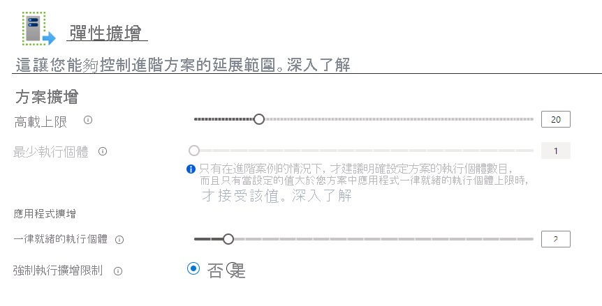

# <a name="azure-functions-premium-plan"></a>Azure Functions Premium 方案

Azure Functions Premium 方案 (有時稱為彈性高階方案) 是函數應用程式的裝載選項。 Premium 方案提供 VNet 連線能力、無冷啟動和 Premium 硬體等功能。  您可以將多個函式應用程式部署到相同的高階方案，而且此方案可讓您設定計算實例大小、基本方案大小和方案大小上限。  如需高階方案和其他方案和裝載類型的比較，請參閱函式 [規模和裝載選項](functions-scale.md)。

## <a name="create-a-premium-plan"></a>建立進階方案

[!INCLUDE [functions-premium-create](../../includes/functions-premium-create.md)]

您也可以在 Azure CLI 中使用 [az functionapp plan create](/cli/azure/functionapp/plan#az-functionapp-plan-create) 來建立高階方案。 下列範例會建立 _彈性 Premium 1_ 層方案：

```azurecli-interactive
az functionapp plan create --resource-group <RESOURCE_GROUP> --name <PLAN_NAME> \
--location <REGION> --sku EP1
```

在此範例中，請將取代為 `<RESOURCE_GROUP>` 您的資源群組，並 `<PLAN_NAME>` 以資源群組中唯一的方案名稱取代。 請指定[支援 `<REGION>` ](https://azure.microsoft.com/global-infrastructure/services/?products=functions)的。 若要建立支援 Linux 的 Premium 方案，請包含 `--is-linux` 選項。

建立方案之後，您可以使用 [az functionapp create](/cli/azure/functionapp#az-functionapp-create) 來建立函數應用程式。 在入口網站中，系統會同時建立方案和應用程式。 如需完整 Azure CLI 腳本的範例，請參閱 [在 Premium 方案中建立函數應用程式](scripts/functions-cli-create-premium-plan.md)。

## <a name="features"></a>特性

下列功能適用于部署至 Premium 方案的函式應用程式。

### <a name="always-ready-instances"></a>隨時可用的實例

如果目前在取用方案中沒有發生任何事件和執行，您的應用程式可能會相應縮小為零個實例。 當新的事件出現時，就必須將新的實例特製化，讓您的應用程式在其上執行。  根據應用程式而定，專門的新實例可能需要一些時間。  第一次呼叫的額外延遲通常稱為應用程式冷啟動。

在高階方案中，您可以讓應用程式隨時都能在指定的實例數目上備妥。  Always ready 實例的數目上限為20。  當事件開始觸發應用程式時，系統會先將它們路由傳送至永遠可用的實例。  當函式變成作用中時，會將其他實例準備就緒為緩衝區。  這個緩衝區可防止在調整期間需要的新實例冷啟動。  這些緩衝的實例稱為 [預先準備就緒的實例](#pre-warmed-instances)。  使用 always ready 實例和預先準備就緒的緩衝區組合，您的應用程式可以有效地消除冷啟動。

> [!NOTE]
> 每個高階方案都至少會有一個作用中和已計費的實例。

您可以藉由選取 **函數應用程式**、前往 [ **平臺功能** ] 索引標籤，然後選取 [ **Scale Out** ] 選項，來設定 Azure 入口網站中隨時可用的實例數目。 在函數應用程式的 [編輯] 視窗中，[永遠可用的實例] 是該應用程式專用的實例。



您也可以為具有 Azure CLI 的應用程式設定永遠可用的實例。

```azurecli-interactive
az resource update -g <resource_group> -n <function_app_name>/config/web --set properties.minimumElasticInstanceCount=<desired_always_ready_count> --resource-type Microsoft.Web/sites 
```

#### <a name="pre-warmed-instances"></a>預先準備就緒的實例

預先準備就緒的實例是在調整和啟用事件期間準備就緒為緩衝區的實例數目。  預先準備就緒的實例會繼續緩衝，直到達到最大相應放大限制為止。  預設預先準備就緒的實例計數為1，在大部分的情況下，應該維持為1。  如果應用程式有很長的準備 (例如自訂容器映射) ，您可能會想要增加此緩衝區。  只有在所有作用中的實例充分利用之後，預先準備就緒的實例才會變成作用中狀態。

請考慮此範例，說明 always ready 實例和預先準備就緒的實例如何一起運作。  高階函式應用程式已設定五個永遠就緒的實例，以及一個預熱實例的預設值。  當應用程式閒置且沒有觸發任何事件時，就會在五個實例上布建和執行應用程式。  

第一個觸發程式進入之後，五個永遠就緒的實例就會變成作用中狀態，並配置額外的預先準備就緒實例。  應用程式現在會使用六個已布建的實例來執行：五個目前作用中的 always ready 實例，以及第六個預先準備就緒和非使用中的緩衝區。  如果執行率持續增加，則最後會使用五個使用中的實例。  當平臺決定調整超過五個實例時，會將其調整為預先準備就緒的實例。  發生這種情況時，現在會有六個使用中的實例，而且會立即布建第七個實例，並填入預先準備就緒的緩衝區。  這一系列的調整和預先預熱將繼續進行，直到達到應用程式的最大實例計數為止。  沒有任何實例會預先準備就緒或啟用超過最大值。

您可以使用 Azure CLI 修改應用程式的預先準備就緒實例數目。

```azurecli-interactive
az resource update -g <resource_group> -n <function_app_name>/config/web --set properties.preWarmedInstanceCount=<desired_prewarmed_count> --resource-type Microsoft.Web/sites 
```

#### <a name="maximum-instances-for-an-app"></a>應用程式的最大實例

除了方案的 [ [最大實例計數](#plan-and-sku-settings)] 之外，您還可以設定每個應用程式的最大數目。  您可以使用 [應用程式規模限制](./functions-scale.md#limit-scale-out)來設定應用程式的最大值。

### <a name="private-network-connectivity"></a>私人網路連線能力

部署至 Premium 方案的 Azure Functions 會利用 [適用于 web apps 的新 VNet 整合](../app-service/web-sites-integrate-with-vnet.md)。  設定時，您的應用程式可以與 VNet 內的資源進行通訊，或透過服務端點來保護。  您也可以在應用程式上使用 IP 限制來限制連入流量。

將子網指派給高階方案中的函式應用程式時，您需要一個子網，且每個潛在實例都有足夠的 IP 位址。 我們需要至少有100個可用位址的 IP 區塊。

如需詳細資訊，請參閱 [將函數應用程式與 VNet 整合](functions-create-vnet.md)。

### <a name="rapid-elastic-scale"></a>快速彈性調整

系統會為您的應用程式自動新增額外的計算實例，使用相同的快速調整邏輯作為取用方案。 相同 App Service 方案中的應用程式會根據個別應用程式的需求彼此獨立調整。 不過，相同 App Service 計畫中的函式應用程式會共用 VM 資源，以協助降低成本（可能的話）。 與 VM 相關聯的應用程式數目取決於每個應用程式的使用量和 VM 的大小。

若要深入瞭解調整的運作方式，請參閱函式 [調整和裝載](./functions-scale.md#how-the-consumption-and-premium-plans-work)。

### <a name="longer-run-duration"></a>長時間執行的持續時間

在取用方案中 Azure Functions 會限制為單一執行的10分鐘。  在 Premium 方案中，回合持續時間預設為30分鐘，以防止執行失控。 不過，您可以 [修改設定的 host.js](./functions-host-json.md#functiontimeout) ，讓高階方案應用程式的持續時間無限制， (保證60分鐘) 。

## <a name="plan-and-sku-settings"></a>方案和 SKU 設定

當您建立方案時，有兩個方案大小設定： (的實例數目下限或方案大小) 和最大高載限制。

如果您的應用程式需要的實例超出 always ready 實例，它可以繼續擴充，直到實例數目達到最高高載限制為止。  只有在您的方案大小超過方案規模的情況下，才會向您收取費用。  我們會盡力將您的應用程式相應放大至其定義的上限。

您可以在 Azure 入口網站中設定方案大小和最大值，方法是選取方案中的 **Scale Out** 選項，或在 [ **平臺功能** ]) 下， (部署至該方案的函數應用程式。

您也可以從 Azure CLI 增加最大的高載限制：

```azurecli-interactive
az resource update -g <resource_group> -n <premium_plan_name> --set properties.maximumElasticWorkerCount=<desired_max_burst> --resource-type Microsoft.Web/serverfarms 
```

每個方案的最小值至少會有一個實例。  系統會根據方案中的應用程式所要求的 always ready 實例，自動為您自動設定實例的實際最小數目。  例如，如果應用程式 A 要求五個永遠就緒的實例，而應用程式 B 要求相同方案中有兩個永遠可用的實例，則最小的方案大小將會計算為五個。  應用程式 A 會在所有5上執行，而且應用程式 B 只會在2上執行。

> [!IMPORTANT]
> 無論函式是否正在執行，您都必須支付在最小實例計數中配置的每個實例的費用。

在大部分的情況下，此 autocalculated 的最小值應該就已足夠。  不過，在最少的情況下，會以最少的時間進行調整。  雖然不太可能，在特定時間相應放大的情況下，如果無法使用其他實例，則可能會延遲。  藉由將最小值設定為最小值（autocalculated），您可以在相應放大前保留實例。

您可以使用 Azure CLI 來增加為方案計算的最小值。

```azurecli-interactive
az resource update -g <resource_group> -n <premium_plan_name> --set sku.capacity=<desired_min_instances> --resource-type Microsoft.Web/serverfarms 
```

### <a name="available-instance-skus"></a>可用的實例 Sku

建立或調整您的方案時，您可以選擇三種實例大小。  您將會支付每秒耗用的核心總數和記憶體總數。  您的應用程式可以視需要自動相應放大至多個實例。  

|SKU|核心|記憶體|儲存體|
|--|--|--|--|
|EP1|1|3.5 GB|250GB|
|EP2|2|7 GB|250GB|
|EP3|4|14 GB|250GB|

### <a name="memory-utilization-considerations"></a>記憶體使用量考慮
在具有更多記憶體的電腦上執行時，不一定表示您的函數應用程式會使用所有可用的記憶體。

例如，JavaScript 函數應用程式受限於 Node.js 中的預設記憶體限制。 若要增加此固定記憶體限制，請新增 `languageWorkers:node:arguments` 具有值的應用程式設定 `--max-old-space-size=<max memory in MB>` 。

## <a name="region-max-scale-out"></a>區域最大 Scale Out

以下是每個區域和 OS 設定中，單一方案目前支援的最大相應放大值。 若要要求增加，請開啟支援票證。

請參閱此處的函式完整區域可用性： [Azure.com](https://azure.microsoft.com/global-infrastructure/services/?products=functions)

|區域| Windows | Linux |
|--| -- | -- |
|澳大利亞中部| 20 | 無法使用 |
|澳大利亞中部 2| 20 | 無法使用 |
|澳大利亞東部| 100 | 20 |
|澳大利亞東南部 | 100 | 20 |
|巴西南部| 60 | 20 |
|加拿大中部| 100 | 20 |
|美國中部| 100 | 20 |
|東亞| 100 | 20 |
|美國東部 | 100 | 20 |
|美國東部 2| 100 | 20 |
|法國中部| 100 | 20 |
|德國中西部| 100 | 無法使用 |
|日本東部| 100 | 20 |
|日本西部| 100 | 20 |
|南韓中部| 100 | 20 |
|美國中北部| 100 | 20 |
|北歐| 100 | 20 |
|挪威東部| 20 | 20 |
|美國中南部| 100 | 20 |
|印度南部 | 100 | 無法使用 |
|東南亞| 100 | 20 |
|英國南部| 100 | 20 |
|英國西部| 100 | 20 |
|西歐| 100 | 20 |
|印度西部| 100 | 20 |
|美國中西部| 20 | 20 |
|美國西部| 100 | 20 |
|美國西部 2| 100 | 20 |

## <a name="next-steps"></a>後續步驟

> [!div class="nextstepaction"]
> [瞭解 Azure Functions 規模和裝載選項](functions-scale.md)
