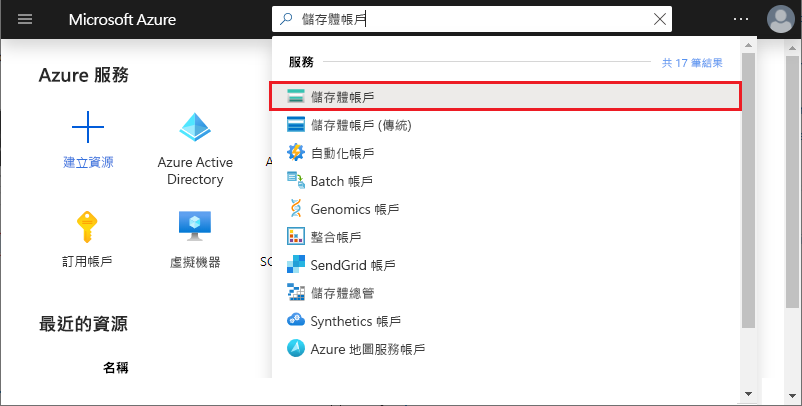
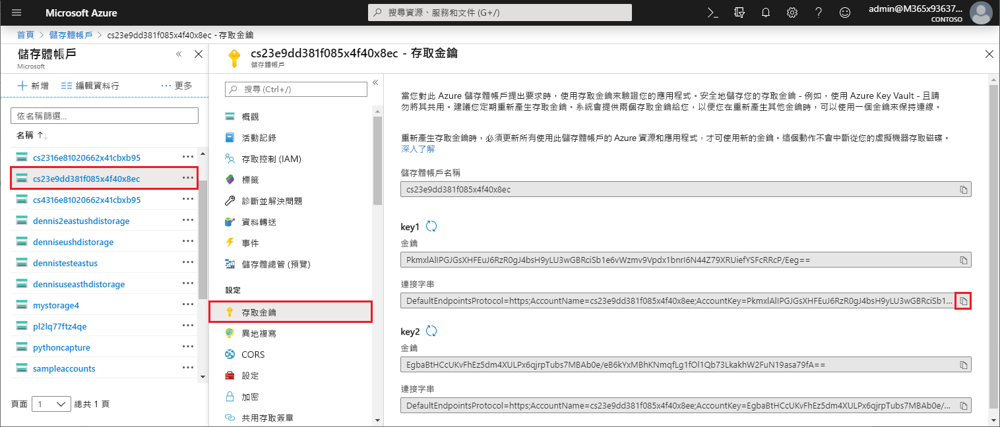
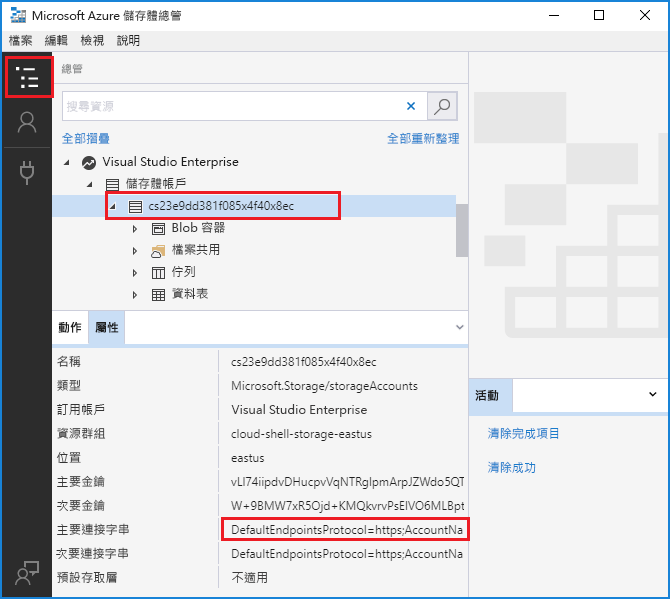

# <a name="work-with-azure-functions-core-tools"></a>使用 Azure Functions Core Tools

Azure Functions Core Tools 可讓您使用命令提示字元或終端機，在本機電腦上開發及測試函式。 您的本機函式可以連線到即時 Azure 服務，而且您可以在本機電腦上使用完整的 Functions 執行階段進行您的函式偵錯。 您甚至可以將函式應用程式部署至您的 Azure 訂用帳戶。

[!INCLUDE [Don't mix development environments](../../includes/functions-mixed-dev-environments.md)]

在您的本機電腦上開發函式，並使用核心工具將其發佈至 Azure 時，會遵循下列基本步驟：

> [!div class="checklist"]
> * [安裝核心工具和相依性。](#v2)
> * [從語言特定的範本建立函數應用程式專案。](#create-a-local-functions-project)
> * [註冊觸發程式和系結延伸模組。](#register-extensions)
> * [定義儲存體和其他連接。](#local-settings-file)
> * [從觸發程式和語言特定的範本建立函式。](#create-func)
> * [在本機執行函數。](#start)
> * [將專案發佈至 Azure。](#publish)

## <a name="core-tools-versions"></a>Core Tools 版本

Azure Functions Core Tools 有三個版本。 您所使用的版本取決於您的本機開發環境、[選擇的語言](supported-languages.md)，以及所需的支援層級：

+ [**版本 3.x/**](#v2)2.X：支援[版本3.x 或2.x 的 Azure Functions 運行](functions-versions.md)時間。 這些版本支援[Windows](?tabs=windows#v2)、 [macOS](?tabs=macos#v2)和[Linux](?tabs=linux#v2) ，並使用平臺特定套件管理員或 npm 進行安裝。

+ 1.x**版**：支援版本1.x 的 Azure Functions 執行時間。 這個版本的工具只有在 Windows 電腦上提供支援，並且從 [npm 套件](https://www.npmjs.com/package/azure-functions-core-tools)進行安裝。

除非另有說明，否則本文中的範例適用于3.x 版。

## <a name="prerequisites"></a>必要條件

Azure Functions Core Tools 目前取決於使用您的 Azure 帳戶進行驗證的 Azure CLI。 這表示您必須在[本機上安裝 Azure CLI](/cli/azure/install-azure-cli) ，才能夠從 Azure Functions Core Tools[發佈至 Azure](#publish) 。 

## <a name="install-the-azure-functions-core-tools"></a>安裝 Azure Functions Core Tools

[Azure Functions Core Tools] 包含相同的執行階段版本，以支援您可在本機開發電腦上執行的 Azure Functions 執行階段。 它也提供命令來建立函式、連線到 Azure，以及部署函式專案。

### <a name="version-3x-and-2x"></a><a name="v2"></a>3.x 和2.x 版

2.x/2.x 版的工具會使用以 .NET Core 為基礎的 Azure Functions 執行時間。 .NET Core 支援的所有平臺都支援這個版本，包括[Windows](?tabs=windows#v2)、 [macOS](?tabs=macos#v2)和[Linux](?tabs=linux#v2)。 

> [!IMPORTANT]
> 您可以使用[延伸]模組套件，略過安裝 .NET Core SDK 的需求。

# <a name="windows"></a>[Windows](#tab/windows)

下列步驟會使用 Windows installer (MSI) 來安裝 Core Tools v3. x。 如需其他以套件為基礎的安裝程式的詳細資訊，這些是安裝 Core Tools v2. x 的必要條件，請參閱[Core tools 讀我檔案](https://github.com/Azure/azure-functions-core-tools/blob/master/README.md#windows)。

1. 根據您的 Windows 版本，下載並執行 Core Tools 安裝程式：

    - 建議使用[v3. x-Windows 64-bit](https://go.microsoft.com/fwlink/?linkid=2135274) (。 [Visual Studio Code 的調試](functions-develop-vs-code.md#debugging-functions-locally)需要64位。 ) 
    - [v3. x-Windows 32 位](https://go.microsoft.com/fwlink/?linkid=2135275)

1. 如果您不打算使用[延伸](functions-bindings-register.md#extension-bundles)模組配套，請安裝[適用于 Windows 的 .NET Core 3.x SDK](https://dotnet.microsoft.com/download)。

# <a name="macos"></a>[macOS](#tab/macos)

下列步驟使用 Homebrew 在 macOS 上安裝 Core Tools。

1. 如果尚未安裝 [Homebrew](https://brew.sh/)，請加以安裝。

1. 安裝 Core Tools 套件：

    ##### <a name="v3x-recommended"></a>建議使用 v3. x () 

    ```bash
    brew tap azure/functions
    brew install azure-functions-core-tools@3
    # if upgrading on a machine that has 2.x installed
    brew link --overwrite azure-functions-core-tools@3
    ```
    
    ##### <a name="v2x"></a>v2.x

    ```bash
    brew tap azure/functions
    brew install azure-functions-core-tools@2
    ```
    
1. 如果您不打算使用[延伸](functions-bindings-register.md#extension-bundles)模組配套，請安裝[適用于 MacOS 的 .NET Core 3.x SDK](https://dotnet.microsoft.com/download)。

# <a name="linux"></a>[Linux](#tab/linux)

下列步驟使用 [APT](https://wiki.debian.org/Apt) 在 Ubuntu/Debian Linux 散發套件上安裝 Core Tools。 若為其他 Linux 散發套件，請參閱 [Core Tools 讀我檔案](https://github.com/Azure/azure-functions-core-tools/blob/master/README.md#linux)。

1. 安裝 Microsoft 封裝存放庫 GPG 金鑰，以驗證封裝完整性：

    ```bash
    curl https://packages.microsoft.com/keys/microsoft.asc | gpg --dearmor > microsoft.gpg
    sudo mv microsoft.gpg /etc/apt/trusted.gpg.d/microsoft.gpg
    ```

1. 進行 APT 更新之前，請先設定 APT 來源清單。

    ##### <a name="ubuntu"></a>Ubuntu

    ```bash
    sudo sh -c 'echo "deb [arch=amd64] https://packages.microsoft.com/repos/microsoft-ubuntu-$(lsb_release -cs)-prod $(lsb_release -cs) main" > /etc/apt/sources.list.d/dotnetdev.list'
    ```

    ##### <a name="debian"></a>Debian

    ```bash
    sudo sh -c 'echo "deb [arch=amd64] https://packages.microsoft.com/debian/$(lsb_release -rs | cut -d'.' -f 1)/prod $(lsb_release -cs) main" > /etc/apt/sources.list.d/dotnetdev.list'
    ```

1. 檢查 `/etc/apt/sources.list.d/dotnetdev.list` 下列其中一個適當 Linux 版本字串的檔案：

    | Linux 發行版本 | 版本 |
    | --------------- | ----------- |
    | Debian 10 | `buster`  |
    | Debian 9  | `stretch` |
    | Ubuntu 20.04    | `focal`     |
    | Ubuntu 19.04    | `disco`     |
    | Ubuntu 18.10    | `cosmic`    |
    | Ubuntu 18.04    | `bionic`    |
    | Ubuntu 17.04    | `zesty`     |
    | Ubuntu 16.04/Linux Mint 18    | `xenial`  |

1. 啟動 APT 來源更新：

    ```bash
    sudo apt-get update
    ```

1. 安裝 Core Tools 套件：

    ##### <a name="v3x-recommended"></a>建議使用 v3. x () 
    ```bash
    sudo apt-get update
    sudo apt-get install azure-functions-core-tools-3
    ```
    
    ##### <a name="v2x"></a>v2.x
    ```bash
    sudo apt-get update
    sudo apt-get install azure-functions-core-tools-2
    ```

1. 如果您不打算使用[延伸](functions-bindings-register.md#extension-bundles)模組配套，請安裝[適用于 Linux 的 .NET Core 3.x SDK](https://dotnet.microsoft.com/download)。

---

## <a name="create-a-local-functions-project"></a>建立本機的 Functions 專案

Functions 專案目錄包含 [host.json](functions-host-json.md) 和 [local.settings.json](#local-settings-file) 檔案，以及包含個別函式程式碼的子資料夾。 此目錄相當於 Azure 中的函式應用程式。 若要深入了解 Functions 的資料夾結構，請參閱 [Azure Functions 的開發人員指南](functions-reference.md#folder-structure)。

版本 3.x/2.x 會要求您在初始化專案時為其選取預設語言。 在 3.x/2.x 版中，新增的所有函式都會使用預設語言範本。 在 1.x 版中，您會在每次建立函式時指定語言。

在終端機視窗或命令提示字元中，執行下列命令來建立專案和本機 Git 存放庫：

```
func init MyFunctionProj
```

當您提供專案名稱時，系統會建立具有該名稱的新資料夾，並將其初始化。 否則，會將目前的資料夾初始化。  
在 3.x/2.x 版中，當您執行命令時，必須為您的專案選擇執行時間。 

<pre>
Select a worker runtime:
dotnet
node
python 
powershell
</pre>

使用向上/向下鍵來選擇語言，然後按 Enter。 如果您打算開發 JavaScript 或 TypeScript 函式，請選擇 [ **node**]，然後選取語言。 TypeScript 有[一些額外的需求](functions-reference-node.md#typescript)。 

JavaScript 專案的輸出看起來會像下列範例：

<pre>
Select a worker runtime: node
Writing .gitignore
Writing host.json
Writing local.settings.json
Writing C:\myfunctions\myMyFunctionProj\.vscode\extensions.json
Initialized empty Git repository in C:/myfunctions/myMyFunctionProj/.git/
</pre>

`func init`支援下列版本 3.x/2. x-only 的選項，除非另有注明：

| 選項     | 描述                            |
| ------------ | -------------------------------------- |
| **`--csx`** | 建立 .NET 函數做為 c # 腳本，這是1.x 版的行為。 僅適用于 `--worker-runtime dotnet` 。 |
| **`--docker`** | 使用以選擇的為基礎的基底映射，建立容器的 Dockerfile `--worker-runtime` 。 如果您要發佈至自訂 Linux 容器，請使用此選項。 |
| **`--docker-only`** |  將 Dockerfile 加入至現有的專案。 如果未在 local.settings.js中指定或設定，則會提示您輸入背景工作執行時間。 當您打算將現有的專案發行至自訂的 Linux 容器時，請使用此選項。 |
| **`--force`** | 即使專案中有現有的檔案，仍初始化專案。 此設定會以相同的名稱覆寫現有的檔案。 專案資料夾中的其他檔案不會受到影響。 |
| **`--language`** | 初始化語言特定專案。 當 `--worker-runtime` 設定為時，目前支援 `node` 。 選項為 `typescript` 和 `javascript` 。 您也可以使用 `--worker-runtime javascript` 或 `--worker-runtime typescript` 。  |
| **`--managed-dependencies`**  | 安裝受控相依性。 目前，只有 PowerShell 背景工作執行時間支援這種功能。 |
| **`--source-control`** | 控制是否要建立 Git 存放庫。 依預設不會建立存放庫。 設為 `true` 時，就會建立存放庫。 |
| **`--worker-runtime`** | 設定專案的語言執行階段。 支援的值為： `csharp` 、 `dotnet` 、 `javascript` 、 `node` (JavaScript) 、 `powershell` 、 `python` 和 `typescript` 。 針對 JAVA，請使用[Maven](functions-reference-java.md#create-java-functions)。未設定時，系統會提示您在初始化期間選擇您的執行時間。 |
|
> [!IMPORTANT]
> 根據預設，2.x 版和更新版本的 Core 工具會建立 .NET 執行時間的函式應用程式專案，做為[c # 類別專案](functions-dotnet-class-library.md) ( .csproj) 。 這些 C# 專案可以與 Visual Studio 或 Visual Studio Code 搭配使用，並在測試期間以及發佈至 Azure 時進行編譯。 如果您想要改為建立和使用在 1.x 版中以及在入口網站中建立的相同 C# 指令碼 (.csx) 檔案，當您建立及部署函式時，必須包含 `--csx` 參數。

## <a name="register-extensions"></a>註冊延伸模組

除了 HTTP 和計時器觸發程式以外，執行時間2.x 版和更新版本中的函式系結會實作為擴充封裝。 HTTP 系結和計時器觸發程式不需要擴充功能。 

為了減少各種延伸模組套件之間的不相容性，函式可讓您在專案檔的 host.js中參考擴充功能配套。 如果您選擇不使用延伸模組配套，您也必須在本機安裝 .NET Core 2.x SDK，並使用您的函式專案來維護副檔名 .csproj。  

在2.x 版和之後的 Azure Functions 執行時間中，您必須明確地為函式中使用的系結類型註冊擴充功能。 您可以選擇個別安裝系結延伸模組，也可以將延伸模組配套參考新增至專案檔案上的 host.js。 延伸模組配套會移除在使用多個系結類型時，發生套件相容性問題的機會。 這是註冊系結延伸模組的建議方法。 延伸模組配套也會移除安裝 .NET Core 2.x SDK 的需求。 

### <a name="use-extension-bundles"></a>使用延伸模組配套

[!INCLUDE [Register extensions](../../includes/functions-extension-bundles.md)]

若要深入瞭解，請參閱[註冊 Azure Functions](functions-bindings-register.md#extension-bundles)系結延伸模組。 您應該先將延伸模組配套新增至 host.js，然後再將系結新增至檔案 function.js。

### <a name="explicitly-install-extensions"></a>明確安裝延伸模組

[!INCLUDE [functions-extension-register-core-tools](../../includes/functions-extension-register-core-tools.md)]

[!INCLUDE [functions-local-settings-file](../../includes/functions-local-settings-file.md)]

根據預設，在專案發佈至 Azure 時，這些設定將不會自動移轉。 請在[發佈時](#publish)使用 `--publish-local-settings` 參數，以確保這些設定會新增至 Azure 中的函式應用程式。 請注意，**ConnectionStrings** 中的值一律不會發佈。

這些函數應用程式設定值在您的程式碼中也可以做為環境變數加以讀取。 如需詳細資訊，請參閱這些特定語言參考主題的「環境變數」章節：

* [先行編譯 C#](functions-dotnet-class-library.md#environment-variables)
* [C# 指令碼 (.csx)](functions-reference-csharp.md#environment-variables)
* [Java](functions-reference-java.md#environment-variables)
* [JavaScript](functions-reference-node.md#environment-variables)
* [PowerShell](functions-reference-powershell.md#environment-variables)
* [Python](functions-reference-python.md#environment-variables)

若未針對設定有效的儲存體連接字串 [`AzureWebJobsStorage`] ，且未使用模擬器，則會顯示下列錯誤訊息：

> 在 local.settings.json 中遺失 AzureWebJobsStorage 的值。 這對 HTTP 以外的所有觸發程序是必要的。 您可以執行 'func azure functionapp fetch-app-settings \<functionAppName\>'，或指定 local.settings.json 中的連接字串。

### <a name="get-your-storage-connection-strings"></a>取得您的儲存體連接字串

即使在使用 Microsoft Azure 儲存體模擬器進行開發時，您可能會想要使用實際的儲存體連接進行測試。 假設您已經[建立了儲存體帳戶](../storage/common/storage-account-create.md)，您可以透過下列其中一種方式取得有效的儲存體連接字串：

- 從 [ [Azure 入口網站]] 中，搜尋並選取 [**儲存體帳戶**]。 
  
  
  選取您的儲存體帳戶，選取 [**設定**] 中的 [**存取金鑰**]，然後複製其中一個**連接字串**值。
  

- 使用 [Azure 儲存體總管](https://storageexplorer.com/)以連接至您的 Azure 帳戶。 在**Explorer**中，展開您的訂用帳戶，展開 [**儲存體帳戶**]，選取您的儲存體帳戶，然後複製主要或次要連接字串。

  

+ 使用核心工具，並藉由以下其中一個命令從 Azure 下載連接字串：

  + 從現有的函數應用程式下載所有設定：

    ```
    func azure functionapp fetch-app-settings <FunctionAppName>
    ```
  + 取得特定儲存體帳戶的連接字串：

    ```
    func azure storage fetch-connection-string <StorageAccountName>
    ```

    如果您尚未登入 Azure，系統會提示您執行此動作。

## <a name="create-a-function"></a><a name="create-func"></a>建立函式

若要建立函式，請執行下列命令：

```
func new
```

在 3.x/2.x 版中，當您執行時， `func new` 系統會提示您以函式應用程式的預設語言來選擇範本，然後系統也會提示您選擇函式的名稱。 在 1.x 版中，系統也會提示您選擇語言。

<pre>
Select a language: Select a template:
Blob trigger
Cosmos DB trigger
Event Grid trigger
HTTP trigger
Queue trigger
SendGrid
Service Bus Queue trigger
Service Bus Topic trigger
Timer trigger
</pre>

如您在下列佇列觸發程序輸出中所見，函式程式碼會在子資料夾中產生並採用所提供的函式名稱：

<pre>
Select a language: Select a template: Queue trigger
Function name: [QueueTriggerJS] MyQueueTrigger
Writing C:\myfunctions\myMyFunctionProj\MyQueueTrigger\index.js
Writing C:\myfunctions\myMyFunctionProj\MyQueueTrigger\readme.md
Writing C:\myfunctions\myMyFunctionProj\MyQueueTrigger\sample.dat
Writing C:\myfunctions\myMyFunctionProj\MyQueueTrigger\function.json
</pre>

您也可以使用下列引數，在命令中指定這些選項：

| 引數     | 描述                            |
| ------------------------------------------ | -------------------------------------- |
| **`--csx`** |  (2.x 版和更新版本。 ) 會產生相同的 c # 腳本 (. x 版和入口網站中使用的) 範本。 |
| **`--language`**, **`-l`**| 範本程式語言，例如 C#、F# 或 JavaScript。 這是 1.x 版中的必要選項。 在2.x 版和更新版本中，請勿使用此選項，或選擇符合背景工作執行時間的語言。 |
| **`--name`**, **`-n`** | 函數名稱。 |
| **`--template`**, **`-t`** | 使用 `func templates list` 命令，以針對每個支援的語言查看可用範本的完整清單。   |


例如，若要在單一命令中建立 JavaScript HTTP 觸發程序，請執行：

```
func new --template "Http Trigger" --name MyHttpTrigger
```

若要在單一命令中建立佇列所觸發的函式，請執行：

```
func new --template "Queue Trigger" --name QueueTriggerJS
```

## <a name="run-functions-locally"></a><a name="start"></a>在本機執行函式

若要執行 Functions 專案，請執行 Functions 主機。 主機會對專案中的所有函式啟用觸發程式。 視您的專案語言而定，啟動命令會有所不同。

# <a name="c"></a>[C\#](#tab/csharp)

```
func start --build
```
# <a name="javascript"></a>[JavaScript](#tab/node)

```
func start
```

# <a name="python"></a>[Python](#tab/python)

```
func start
```
此命令必須[在虛擬環境中執行](./functions-create-first-azure-function-azure-cli.md?pivots=programming-language-python#create-venv)。

# <a name="typescript"></a>[TypeScript](#tab/ts)

```
npm install
npm start     
```

---

>[!NOTE]  
> 1.x 版的函式執行時間需要 `host` 命令，如下列範例所示：
>
> ```
> func host start
> ```

`func start` 支援下列選項：

| 選項     | 描述                            |
| ------------ | -------------------------------------- |
| **`--no-build`** | 執行前請勿建置目前的專案。 僅適用於 dotnet 專案。 預設會設定為 false。 1.x 版不支援。 |
| **`--cors-credentials`** | 允許跨原始來源驗證的要求 (例如，cookie 和驗證標頭) 不支援1.x 版。 |
| **`--cors`** | 以逗號分隔的 CORS 來源清單，不含空格。 |
| **`--language-worker`** | 用來設定語言背景工作角色的引數。 例如，您可以藉由提供[debug 埠和其他必要的引數](https://github.com/Azure/azure-functions-core-tools/wiki/Enable-Debugging-for-language-workers)，啟用語言背景工作的偵錯工具。 1.x 版不支援。 |
| **`--cert`** | 包含私密金鑰的 .pfx 檔案路徑。 僅能與 `--useHttps` 搭配使用。 1.x 版不支援。 |
| **`--password`** | 密碼或包含 .pfx 檔案密碼的檔案。 僅能與 `--cert` 搭配使用。 1.x 版不支援。 |
| **`--port`**, **`-p`** | 要接聽的本機連接埠。 預設值：7071。 |
| **`--pause-on-error`** | 暫停以在結束處理程序之前取得其他輸入。 這僅適用於從整合式開發環境 (IDE) 啟動 Core Tools 時。|
| **`--script-root`**, **`--prefix`** | 用來為要執行或部署的函式應用程式指定根目錄的路徑。 此選項可用於在子資料夾中產生專案檔的編譯專案。 例如，當您建置 C# 類別庫專案時，將會以類似於 `MyProject/bin/Debug/netstandard2.0` 的路徑在 *root* 子資料夾中產生 host.json、local.settings.json 和 function.json 等檔案。 在此情況下，請將前置詞設為 `--script-root MyProject/bin/Debug/netstandard2.0`。 這是函式應用程式在 Azure 中執行時的根目錄。 |
| **`--timeout`**, **`-t`** | Functions 主機要啟動的逾時 (以秒為單位)。 預設值：20 秒。|
| **`--useHttps`** | 繫結至 `https://localhost:{port}` 而不是 `http://localhost:{port}` 。 根據預設，此選項會在您的電腦上建立受信任的憑證。|

Functions 主機啟動時，它會輸出 HTTP 觸發函式的 URL：

<pre>
Found the following functions:
Host.Functions.MyHttpTrigger

Job host started
Http Function MyHttpTrigger: http://localhost:7071/api/MyHttpTrigger
</pre>

>[!IMPORTANT]
>在本機執行時，不會對 HTTP 端點強制執行授權。 這表示所有的本機 HTTP 要求會作為 `authLevel = "anonymous"` 處理。 如需詳細資訊，請參閱 [HTTP 繫結文章](functions-bindings-http-webhook-trigger.md#authorization-keys)。

### <a name="passing-test-data-to-a-function"></a>將測試資料傳遞至函式

若要在本機測試您的函式，您要使用 HTTP 要求在本機伺服器上[啟動 Functions 主機](#start)並呼叫端點。 您呼叫的端點取決於函式的類型。

>[!NOTE]
> 本主題中的範例使用 cURL 工具，從終端機或命令提示字元傳送 HTTP 要求。 您可以使用您選擇的工具，將 HTTP 要求傳送至本機伺服器。 在以 Linux 為基礎的系統和 Windows 10 組建17063及更新版本上，預設會提供捲曲的工具。 在較舊的 Windows 上，您必須先下載並安裝[捲曲的工具](https://curl.haxx.se/)。

如需測試函式的更多一般資訊，請參閱[在 Azure Functions 中測試程式碼的策略](functions-test-a-function.md)。

#### <a name="http-and-webhook-triggered-functions"></a>HTTP 和 Webhook 觸發的函式

您要呼叫下列端點，以在本機執行 HTTP 和 Webhook 觸發的函式：

```
http://localhost:{port}/api/{function_name}
```

請務必使用 Functions 主機接聽的相同伺服器名稱和連接埠。 啟動 Function 主機時，您會在產生的輸出中看到下列內容。 您可以使用觸發程序支援的任何 HTTP 方法呼叫此 URL。

下列 cURL 命令從 GET 要求在查詢字串中傳遞 _name_ 參數，觸發 `MyHttpTrigger` 快速入門函式。

```
curl --get http://localhost:7071/api/MyHttpTrigger?name=Azure%20Rocks
```

下列範例與從 POST 要求在要求本文中傳遞 _name_ 所呼叫的函式相同：

# <a name="bash"></a>[Bash](#tab/bash)
```bash
curl --request POST http://localhost:7071/api/MyHttpTrigger --data '{"name":"Azure Rocks"}'
```
# <a name="cmd"></a>[Cmd](#tab/cmd)
```cmd
curl --request POST http://localhost:7071/api/MyHttpTrigger --data "{'name':'Azure Rocks'}"
```
---

您可以從瀏覽器在查詢字串中傳遞資料來進行 GET 要求。 對於所有其他 HTTP 方法，您必須使用 cURL、Fiddler、Postman 或類似的 HTTP 測試工具。

#### <a name="non-http-triggered-functions"></a>非 HTTP 觸發函式

對於 HTTP 觸發程式和 webhook 和事件方格觸發程式以外的所有函式類型，您可以呼叫管理端點，在本機測試您的函式。 在本機伺服器上使用 HTTP POST 要求來呼叫此端點會觸發函式。 

若要在本機測試 Event Grid 觸發的函式，請參閱[使用檢視器 web 應用程式進行本機測試](functions-bindings-event-grid-trigger.md#local-testing-with-viewer-web-app)。

您可以在 POST 要求本文中選擇性地傳遞測試資料到執行程序。 這項功能類似於 Azure 入口網站中的 [測試]**** 索引標籤。

您可以呼叫下列系統管理員端點來觸發非 HTTP 函式：

```
http://localhost:{port}/admin/functions/{function_name}
```

若要將測試資料傳遞至函式的管理員端點，您必須在 POST 要求訊息的本文中提供資料。 訊息本文必須具備下列 JSON 格式：

```JSON
{
    "input": "<trigger_input>"
}
```

`<trigger_input>` 值包含函式預期格式的資料。 下列 cURL 範例是 POST 到 `QueueTriggerJS` 函式。 在此情況下，輸入是一個相當於在佇列中預期找到的訊息字串。

# <a name="bash"></a>[Bash](#tab/bash)
```bash
curl --request POST -H "Content-Type:application/json" --data '{"input":"sample queue data"}' http://localhost:7071/admin/functions/QueueTrigger
```
# <a name="cmd"></a>[Cmd](#tab/cmd)
```bash
curl --request POST -H "Content-Type:application/json" --data "{'input':'sample queue data'}" http://localhost:7071/admin/functions/QueueTrigger
```
---

#### <a name="using-the-func-run-command-version-1x-only"></a>僅使用 `func run` (1.x 版的命令) 

>[!IMPORTANT]
> `func run`只有1.x 版的工具才支援此命令。 如需詳細資訊，請參閱[如何設定 Azure Functions 執行階段版本目標](set-runtime-version.md)主題。

在1.x 版中，您也可以使用直接叫用函式 `func run <FunctionName>` ，並提供函數的輸入資料。 此命令類似於使用 Azure 入口網站中的 [測試]**** 索引標籤執行函式。

`func run` 支援下列選項：

| 選項     | 描述                            |
| ------------ | -------------------------------------- |
| **`--content`**, **`-c`** | 內嵌內容。 |
| **`--debug`**, **`-d`** | 在執行函式之前，請先將偵錯工具附加到主機處理序。|
| **`--timeout`**, **`-t`** | 本機 Functions 主機就緒前的等候時間 (以秒為單位)。|
| **`--file`**, **`-f`** | 要用來作為內容的檔案名稱。|
| **`--no-interactive`** | 不會提示輸入。 適用於自動化情節。|

例如，若要呼叫 HTTP 觸發的函式並傳遞內容的內文，請執行下列命令：

```
func run MyHttpTrigger -c '{\"name\": \"Azure\"}'
```

## <a name="publish-to-azure"></a><a name="publish"></a>發佈至 Azure

此 Azure Functions Core Tools 支援兩種部署類型：透過[Zip 部署](functions-deployment-technologies.md#zip-deploy)和[部署自訂 Docker 容器](functions-deployment-technologies.md#docker-container)，將函式專案檔直接部署至函式應用程式。 您必須已[在 Azure 訂用帳戶中建立函式應用程式](functions-cli-samples.md#create)，您將在其中部署您的程式碼。 應建置需要編譯的專案，以便部署二進位檔。

>[!IMPORTANT]
>您必須將[Azure CLI](/cli/azure/install-azure-cli)安裝在本機上，才能從核心工具發行至 Azure。  

專案資料夾可能包含不應發行的特定語言檔案和目錄。 排除的專案會列在根專案資料夾中的 funcignore 檔案中。     

### <a name="deploy-project-files"></a><a name="project-file-deployment"></a>部署專案檔案

若要將您的本機程式碼發佈至 Azure 中的函式應用程式，請使用 `publish` 命令：

```
func azure functionapp publish <FunctionAppName>
```

此命令會發行至 Azure 中的現有函式應用程式。 如果您嘗試發行至不存在於訂用帳戶中的，將會收到錯誤 `<FunctionAppName>` 。 若要了解如何使用 Azure CLI 從命令提示字元或終端機視窗建立函式應用程式，請參閱[建立無伺服器也可執行的函式應用程式](./scripts/functions-cli-create-serverless.md)。 根據預設，此命令會使用[遠端組建](functions-deployment-technologies.md#remote-build)，並部署您的應用程式以[從部署套件執行](run-functions-from-deployment-package.md)。 若要停用這個建議的部署模式，請使用 `--nozip` 選項。

>[!IMPORTANT]
> 當您在 Azure 入口網站中建立函數應用程式時，它預設會使用版本3.x 的函式執行時間。 若要讓函式應用程式使用 1.x 版的執行階段，請依照[在 1.x 版上執行](functions-versions.md#creating-1x-apps)中的指示操作。
> 若函式應用程式具有現有的函式，您就無法變更其執行階段版本。

下列發行選項適用于所有版本：

| 選項     | 描述                            |
| ------------ | -------------------------------------- |
| **`--publish-local-settings -i`** |  將 local.settings.json 中的設定發佈至 Azure，若設定已經存在，則提示進行覆寫。 如果您使用 Microsoft Azure 儲存體模擬器，請先將應用程式設定變更為[實際的儲存體連接](#get-your-storage-connection-strings)。 |
| **`--overwrite-settings -y`** | 在使用 `--publish-local-settings -i` 時隱藏覆寫應用程式設定的提示。|

只有2.x 版和更新版本才支援下列發行選項：

| 選項     | 描述                            |
| ------------ | -------------------------------------- |
| **`--publish-settings-only`**, **`-o`** |  僅發佈設定而略過內容。 預設值為提示。 |
|**`--list-ignored-files`** | 顯示在發佈期間忽略的檔案清單，以 .funcignore 檔案為準。 |
| **`--list-included-files`** | 顯示要發佈的檔案清單，以 .funcignore 檔案為準。 |
| **`--nozip`** | 關閉預設 `Run-From-Package` 模式。 |
| **`--build-native-deps`** | 發行 Python 函式應用程式時，略過產生車輪資料夾。 |
| **`--build`**, **`-b`** | 部署至 Linux 函式應用程式時執行組建動作。 接受： `remote` 和 `local` 。 |
| **`--additional-packages`** | 建置原生相依性時將安裝的套件清單。 例如： `python3-dev libevent-dev` 。 |
| **`--force`** | 在設定情況下忽略發佈前驗證。 |
| **`--csx`** | 發佈 C# 指令碼 (.csx) 專案。 |
| **`--no-build`** | 發行期間不會建立專案。 針對 Python，則 `pip install` 不會執行。 |
| **`--dotnet-cli-params`** | 發佈已編譯的 C# (.csproj) 函式時，Core Tools 會呼叫 'dotnet build --output bin/publish'。 傳至此處的任何參數都會附加至命令列。 |

### <a name="deploy-custom-container"></a>部署自訂容器

Azure Functions 可讓您在[自訂的 Docker 容器](functions-deployment-technologies.md#docker-container)中部署函數專案。 如需詳細資訊，請參閱[使用自訂映像在 Linux 上建立函式](functions-create-function-linux-custom-image.md)。 自訂容器必須具有 Dockerfile。 若要建立具有 Dockerfile 的應用程式，請使用上的--Dockerfile 選項 `func init` 。

```
func deploy
```

以下是可用的自訂容器部署選項：

| 選項     | 描述                            |
| ------------ | -------------------------------------- |
| **`--registry`** | 目前的使用者所登入的 Docker 登錄名稱。 |
| **`--platform`** | 函式應用程式的裝載平台。 有效選項為 `kubernetes` |
| **`--name`** | 函式應用程式名稱。 |
| **`--max`**  | (選擇性) 設定作為部署目標的函式應用程式執行個體數目上限。 |
| **`--min`**  | (選擇性) 設定作為部署目標的函式應用程式執行個體數目下限。 |
| **`--config`** | 設定選用的部署組態檔。 |

## <a name="monitoring-functions"></a>監視函式

若要監視函式的執行，建議的方法是與 Azure 應用程式 Insights 整合。 您也可以將執行記錄串流至本機電腦。 若要深入了解，請參閱[監視 Azure Functions](functions-monitoring.md)。

### <a name="application-insights-integration"></a>Application Insights 整合

當您在 Azure 中建立函數應用程式時，應該啟用 Application Insights 整合。 如果您的函式應用程式因為某些原因而未連接到 Application Insights 實例，在 Azure 入口網站中執行此整合很容易。 

[!INCLUDE [functions-connect-new-app-insights.md](../../includes/functions-connect-new-app-insights.md)]

### <a name="enable-streaming-logs"></a>啟用串流記錄

您可以在本機電腦上的命令列會話中，查看您的函式所產生的記錄檔串流。 

#### <a name="native-streaming-logs"></a>原生串流記錄

[!INCLUDE [functions-streaming-logs-core-tools](../../includes/functions-streaming-logs-core-tools.md)]

這種類型的串流記錄需要為您的函數應用程式啟用 Application Insights 整合。   


## <a name="next-steps"></a>後續步驟

瞭解如何使用 Azure Functions Core Tools [Microsoft 學習模組](/learn/modules/develop-test-deploy-azure-functions-with-core-tools/)Azure Functions Core Tools 是[開放原始碼並裝載于 GitHub 上](https://github.com/azure/azure-functions-cli)，來開發、測試和發佈 Azure Functions。  
若要提出錯誤或功能要求，[請開啟 GitHub 問題](https://github.com/azure/azure-functions-cli/issues)。

<!-- LINKS -->

[Azure Functions Core Tools]: https://www.npmjs.com/package/azure-functions-core-tools
[Azure 入口網站]: https://portal.azure.com 
[Node.js]: https://docs.npmjs.com/getting-started/installing-node#osx-or-windows
[`FUNCTIONS_WORKER_RUNTIME`]: functions-app-settings.md#functions_worker_runtime
[AzureWebJobsStorage]: functions-app-settings.md#azurewebjobsstorage
[延伸模組配套]: functions-bindings-register.md#extension-bundles
