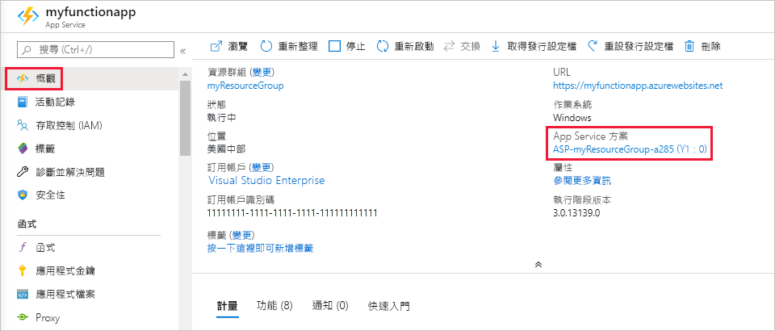

# <a name="azure-functions-scale-and-hosting"></a>Azure Functions 的規模調整和主控

在 Azure 中創建函數應用時,必須為應用選擇託管計劃。 Azure 函數有三個託管計劃:[消耗計劃](#consumption-plan)、[進階計畫和](#premium-plan)[專用(應用服務)計畫](#app-service-plan)。

您選擇的託管計劃規定了以下行為:

* 如何縮放函數應用。
* 每個函數應用實例可用的資源。
* 支援高級功能,如 Azure 虛擬網路連接。

當代碼運行時,消耗計劃和高級計劃都會自動增加計算能力。 應用在需要時會橫向擴展以處理負載,並在代碼停止運行時放大。 對於消費計劃,您也不必提前為閒置 VM 或預留容量付費。  

高級計劃提供其他功能,如高級計算實例、無限期保持實例溫暖的能力以及 VNet 連接。

應用服務計劃允許您利用您管理的專用基礎結構。 函數應用不會根據事件進行縮放,這意味著永遠不會縮放為零。 (要求[始終處於](#always-on)啟用狀態。

## <a name="hosting-plan-support"></a>託管計劃支援

功能支援分為以下兩類:

* _一般可用 (GA):_ 完全支援並批准用於生產。
* _預覽_:尚未完全支援或批准用於生產。

下表指示在 Windows 或 Linux 執行時對三個託管計劃的目前支援等級:

| | 取用方案 | 進階方案 | 專用計劃 |
|-|:----------------:|:------------:|:----------------:|
| Windows | GA | GA | GA |
| Linux | GA | GA | GA |

## <a name="consumption-plan"></a>取用方案

使用消耗計畫時,將根據傳入事件的數量動態添加和刪除 Azure 函數主機的實例。 此無伺服器方案會自動調整，您只需支付函式執行時使用的計算資源。 在取用方案中，函式執行會在一段可設定的時間之後逾時。

帳單是根據執行數目、執行時間以及使用的記憶體。 帳單會跨函式應用程式內的所有函式進行彙總。 如需詳細資訊，請參閱 [Azure Functions 價格頁面](https://azure.microsoft.com/pricing/details/functions/)。

取用方案是預設主控方案，具有下列優點︰

* 只有當您的函式執行時才需付費。
* 會自動調整規模，即使在高負載期間也會

可以將同一區域中的函數應用分配給相同的消耗計劃。 在同一消費計劃中運行多個應用沒有任何缺點或影響。 將多個應用分配給同一消費計劃不會影響每個應用的恢復能力、可擴充性或可靠性。

要瞭解有關如何在消費計劃中運行時估計成本的更多,請參閱[瞭解消費計劃成本](functions-consumption-costs.md)。

## <a name="premium-plan"></a><a name="premium-plan"></a>保費計劃

使用進階計畫時,將根據傳入事件的數量(如消耗計畫)添加和刪除 Azure 函數主機的實例。  進階計劃支援以下功能:

* 永久溫暖實例,以避免任何冷啟動
* VNet 連線
* 無限制的執行持續時間(保證 60 分鐘)
* 進階實體大小(一個核心實體、兩個核心實體與四個核心實體)
* 更可預測的定價
* 具有多個功能應用的計畫的高密度應用配置

有關如何設定這些選項的資訊,請參閱[Azure 函數進階計畫文件](functions-premium-plan.md)。

高級計劃的計費不是按執行和消耗的記憶體計費,而是基於在需要和預熱的實例中使用的核心秒數和記憶體數。 每個計劃必須始終至少有一個實例是溫暖的。 這意味著每個活動計劃每月最低成本,而不考慮執行次數。 請記住,高級計劃中的所有功能應用都共用預熱的和活動實例。

在以下情況下考慮 Azure 函數進階計劃:

* 您的函式應用程式會連續執行或接近連續執行。
* 您有大量的小執行,並且執行帳單高,但在消耗計劃中 GB 第二個帳單較低。
* 您需要更多的 CPU 或記憶體選項,而不是消耗計畫提供的選項。
* 程式碼執行時間需要超過消耗計畫[允許的最大執行時間](#timeout)。
* 您需要僅在進階計畫上可用的功能,例如虛擬網路連接。

在高級計劃上運行 JAVAScript 函數時,應選擇 vCPU 較少的實例。 有關詳細資訊,請參閱[選擇單核進階計畫](functions-reference-node.md#considerations-for-javascript-functions)。  

## <a name="dedicated-app-service-plan"></a><a name="app-service-plan"></a>專用(應用服務)計劃

您的功能應用也可以與其他應用服務應用(基本、標準、高級和隔離 SKU)在同一專用 VM 上運行。

在以下情況下考慮應用服務計劃:

* 您有現有的、使用量過低的 VM 已在執行其他 App Service 執行個體。
* 您希望提供要在其中運行函數的自定義映射。

對於應用服務計劃中的功能應用,您支付的費用與其他應用服務資源(如 Web 應用)相同。 如需 App Service 方案運作方式的詳細資訊，請參閱 [Azure App Service 方案深入概觀](../app-service/overview-hosting-plans.md)。

使用應用服務計畫,您可以通過添加更多 VM 實例來手動橫向擴展。 您還可以啟用自動縮放。 如需詳細資訊，請參閱[手動或自動調整執行個體計數規模](../azure-monitor/platform/autoscale-get-started.md?toc=%2fazure%2fapp-service%2ftoc.json)。 您也可以透過選擇不同的 App Service 方案來相應增加。 如需詳細資訊，請參閱[在 Azure 中為應用程式進行相應增加](../app-service/manage-scale-up.md)。 

在 App Service 方案上執行 JavaScript 函式時，您應該選擇 vCPU 數目較少的方案。 有關詳細資訊,請參閱[選擇單核應用服務計畫](functions-reference-node.md#choose-single-vcpu-app-service-plans)。 
<!-- Note: the portal links to this section via fwlink https://go.microsoft.com/fwlink/?linkid=830855 --> 

### <a name="always-on"></a><a name="always-on"></a>始終開啟

如果運行在應用服務計畫上,則應啟用 **「始終打開**」設置,以便函數應用正常運行。 在 App Service 方案中，函式的執行階段會在無作用幾分鐘後進入閒置狀態，因此只有 HTTP 觸發程序會「喚醒」您的函式。 只有 App Service 方案具備「永遠開啟」選項。 在取用方案中，平台會自動啟動函數應用程式。

[!INCLUDE [Timeout Duration section](../../includes/functions-timeout-duration.md)]


即使已啟用 [永遠開啟] 選項，個別函式的執行逾時還是由 [host.json](functions-host-json.md#functiontimeout) 專案檔的 `functionTimeout` 設定來控制。

## <a name="determine-the-hosting-plan-of-an-existing-application"></a>確定現有應用程式的託管計劃

要確定函數應用使用的託管計劃,請參閱[Azure 門戶](https://portal.azure.com)中的「**概述」** 選項卡中**的應用服務計畫**。 要查看定價層,請選擇**應用服務計劃**的名稱,然後從左側窗格中選擇 **「屬性**」。。



您也可以使用 Azure CLI 來判斷方案，如下所示：

```azurecli-interactive
appServicePlanId=$(az functionapp show --name <my_function_app_name> --resource-group <my_resource_group> --query appServicePlanId --output tsv)
az appservice plan list --query "[?id=='$appServicePlanId'].sku.tier" --output tsv
```  

如果此命令的輸出是 `dynamic`，表示函式應用程式在取用方案中。 當來自此命令的輸出為`ElasticPremium`時,函數應用位於高級計劃中。 所有其他值指示應用服務計劃的不同層。

## <a name="storage-account-requirements"></a>儲存體帳戶的需求

在任何計畫中,函數應用都需要一個常規的 Azure 儲存帳戶,該帳戶支援 Azure Blob、佇列、檔和表存儲。 這是因為 Azure 函數依賴於 Azure 儲存來執行諸如管理觸發器和日誌記錄函數執行等操作,但某些儲存帳戶不支援佇列和表。 這些帳戶 (包括僅限 Blob 的儲存體帳戶 (包含進階儲存體) 和搭配區域備援儲存體複寫的一般用途儲存體帳戶) 會在您建立函式應用程式時，從現有**儲存體帳戶**選項中篩選出來。

函數應用使用的相同存儲帳戶也可以由觸發器和綁定用於存儲應用程序數據。 但是,對於存儲密集型操作,應使用單獨的存儲帳戶。  

多個功能應用當然可以共用同一個存儲帳戶,而不會出現任何問題。 (一個很好的例子是,當您使用 Azure 儲存模擬器在本地環境中開發多個應用時,它就像一個存儲帳戶。 

<!-- JH: Does using a Premium Storage account improve perf? -->

若要深入了解儲存體帳戶類型，請參閱 [Azure 儲存體服務簡介](../storage/common/storage-introduction.md#azure-storage-services)。

## <a name="how-the-consumption-and-premium-plans-work"></a>消費和高級計劃的工作原理

在消耗和高級計劃中,Azure 函數基礎結構會根據其函數觸發的事件數添加函數主機的其他實例來擴展 CPU 和記憶體資源。 消耗計劃中的函數主機的每個實例都限制為 1.5 GB 記憶體和一個 CPU。  主機的實例是整個函數應用,這意味著函數應用中的所有函數共用實例內的資源並同時縮放。 共用相同取用方案的函數應用程式會個別進行調整。  在進階計畫中,計劃大小將確定該實例上該計劃中所有應用的可用記憶體和 CPU。  

函數代碼檔案儲存在函數的主存儲帳戶上的 Azure 檔共用上。 當您刪除函式應用程式的主要儲存體帳戶時，函式程式碼檔案會被刪除，且無法復原。

### <a name="runtime-scaling"></a>執行階段調整

Azure Functions 使用名為「縮放控制器」** 的元件來監視事件的速率，並判斷是否相應放大或相應縮小。 縮放控制器會在每種觸發程序類型使用啟發學習法。 例如，當使用 Azure 佇列儲存體觸發程序時，會根據佇列長度和最舊佇列訊息的壽命調整規模。

Azure 函數的縮放單位是函數應用。 當函式應用程式相應放大時，會配置額外資源來執行 Azure Functions 主機的多個執行個體。 反之，當計算需求降低時，縮放控制器會移除 Functions 主機的執行個體。 當函數應用中沒有運行任何函數時,實例數最終將*縮放為*零。


### <a name="understanding-scaling-behaviors"></a>了解規模調整行為

縮放比例會因為許多因素而有所不同，也會因為選取的觸發程序和語言不同，而進行不同的規模調整。 要注意一些複雜的縮放行為:

* 單個函數應用僅擴展到最多 200 個實例。 單一執行個體可能會一次處理一個以上的訊息或要求，因此沒有設定平行執行的數目上限。
* 對於 HTTP 觸發器,最多每秒分配一次新實例。
* 對於非 HTTP 觸發器,最多每 30 秒分配一次新實例。 在[高級計劃中](#premium-plan)運行時,縮放速度更快。
* 對於服務總線觸發器,請使用_資源管理_許可權進行最有效的縮放。 使用_偵聽_許可權時,縮放不太準確,因為佇列長度不能用於通知縮放決策。 要瞭解有關在服務總線存取策略中設定權限的更多資訊,請參閱[共享存取授權原則](../service-bus-messaging/service-bus-sas.md#shared-access-authorization-policies)。
* 有關事件中心觸發器,請參閱參考文章中的[縮放指南](functions-bindings-event-hubs-trigger.md#scaling)。 

### <a name="best-practices-and-patterns-for-scalable-apps"></a>可調整應用程式的最佳做法與模式

函數應用程式中有多個面向會影響其調整規模的效果，包括主機設定、執行階段耗用量和資源效率。  如需詳細資訊，請參閱[效能考量文章中的延展性一節](functions-best-practices.md#scalability-best-practices)。 您也應了解在縮放函式應用程式後，連線會如何運作。 如需詳細資訊，請參閱[如何管理 Azure Functions 中的連線](manage-connections.md)。

有關在 Python 和 Node.js 中縮放的詳細資訊,請參閱[Azure 函數 Python 開發人員指南 - 縮放和併發和併發](functions-reference-python.md#scaling-and-concurrency)和[Azure 函數 Node.js 開發人員指南 - 縮放和併發](functions-reference-node.md#scaling-and-concurrency)。

### <a name="billing-model"></a>計費模式

[Azure 函數定價頁上](https://azure.microsoft.com/pricing/details/functions/)詳細介紹了不同計劃的計費。 使用量是在函式應用程式層級彙總，且只會計算函式程式碼執行的時間。 計費單位如下︰

* **以十億位元組-秒 (GB-s) 為單位的資源取用量**。 會計算為在函數應用程式中執行之所有函式的記憶體大小和執行時間組合。 
* **執行**。 每次函式為回應事件觸發程序而執行，就算一次。

有用的查詢和資訊,如何瞭解您的消費單,可以在[帳單常見問題中找到](https://github.com/Azure/Azure-Functions/wiki/Consumption-Plan-Cost-Billing-FAQ)。

[Azure Functions pricing page]: https://azure.microsoft.com/pricing/details/functions

## <a name="service-limits"></a>服務限制

下表指示在各種託管計劃中執行時應用於函數應用的限制:

[!INCLUDE [functions-limits](../../includes/functions-limits.md)]
