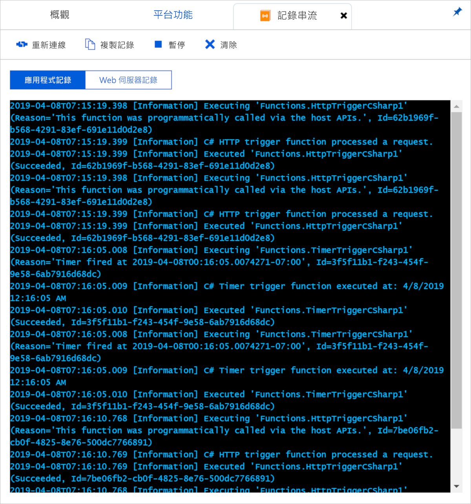

# <a name="enable-streaming-execution-logs-in-azure-functions"></a>在 Azure Functions 中啟用串流執行記錄

開發應用程式時，您通常會想要查看在 Azure 中執行時，以近乎即時的方式寫入記錄檔。

有兩種方式可以檢視函式執行所產生之記錄檔的資料流。

* **內建記錄資料流**：App Service 平台可讓您檢視應用程式記錄檔的資料流。 這相當於您在[本機開發](functions-develop-local.md)期間對函式進行偵錯，以及在入口網站中使用 [測試] 索引標籤時所看到的輸出。 隨即會顯示所有以記錄為基礎的資訊。 如需詳細資訊，請參閱[串流處理記錄](../app-service/troubleshoot-diagnostic-logs.md#stream-logs)。 此串流處理方法僅支援單一執行個體，且不能與在使用量方案中的 Linux 上執行的應用程式搭配使用。

* **即時計量資料流**：當您的函式應用程式[連線到 Application Insights](configure-monitoring.md#enable-application-insights-integration) 時，您可以在 Azure 入口網站中使用[即時計量資料流](../azure-monitor/app/live-stream.md)，以近乎即時方式來檢視記錄資料和其他計量。 當您在使用量方案中監視在多個執行個體或 Linux 上執行的函式時，請使用此方法。 此方法會使用[取樣資料](configure-monitoring.md#configure-sampling)。

您可以在入口網站和大部分的本機開發環境中檢視記錄資料流。 

## <a name="portal"></a>入口網站

您可以在入口網站中同時檢視這兩種類型的記錄資料流。

### <a name="built-in-log-streaming"></a>內建記錄資料流

若要在入口網站中檢視資料流記錄，請在您的函式應用程式中選取 [平台功能] 索引標籤。 然後，在 [監視] 底下，選擇 [記錄串流]。


這會將您的應用程式連線至記錄資料流服務，而應用程式記錄會顯示在視窗中。 您可以在**應用程式記錄**和 **Web 伺服器記錄**之間進行切換。  



### <a name="live-metrics-stream"></a>即時計量串流

若要檢視應用程式的即時計量資料流，請選取函式應用程式的 [概觀] 索引標籤。 當您啟用 Application Insights 時，會在 [已設定的功能] 底下看到 **Application Insights** 連結。 此連結會帶您前往應用程式的 Application Insights 頁面。

在 Application Insights 中，選取 [即時計量資料流]。 [取樣的記錄項目](configure-monitoring.md#configure-sampling)會顯示在 [樣本遙測] 底下。

 

## <a name="visual-studio-code"></a>Visual Studio Code

[!INCLUDE [functions-enable-log-stream-vs-code](../../includes/functions-enable-log-stream-vs-code.md)]

## <a name="core-tools"></a>Core Tools

[!INCLUDE [functions-streaming-logs-core-tools](../../includes/functions-streaming-logs-core-tools.md)]

## <a name="azure-cli"></a>Azure CLI

您可以使用 [Azure CLI](/cli/azure/install-azure-cli) 來啟用資料流記錄。 使用下列命令來登入、選擇訂用帳戶，以及串流處理記錄檔：

```azurecli
az login
az account list
az account set --subscription <subscriptionNameOrId>
az webapp log tail --resource-group <RESOURCE_GROUP_NAME> --name <FUNCTION_APP_NAME>
```

## <a name="azure-powershell"></a>Azure PowerShell

您可以使用 [Azure PowerShell](/powershell/azure/) 來啟用資料流記錄。 針對 PowerShell，請使用 [set-azwebapp](/powershell/module/az.websites/set-azwebapp) 命令來啟用函數應用程式的記錄，如下列程式碼片段所示： 

:::code language="powershell" source="~/powershell_scripts/app-service/monitor-with-logs/monitor-with-logs.ps1" range="19-20":::

如需詳細資訊，請參閱完整的程式 [代碼範例](../app-service/scripts/powershell-monitor.md#sample-script)。 

## <a name="next-steps"></a>後續步驟

+ [監視 Azure Functions](functions-monitoring.md)
+ [分析 Application Insights 中的 Azure Functions 遙測](analyze-telemetry-data.md)
