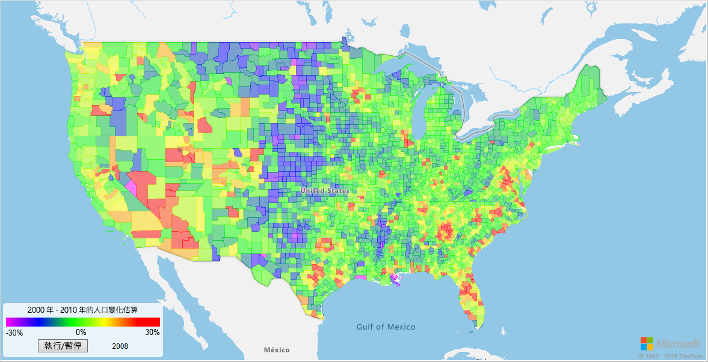
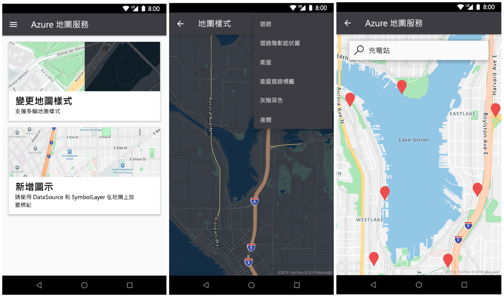
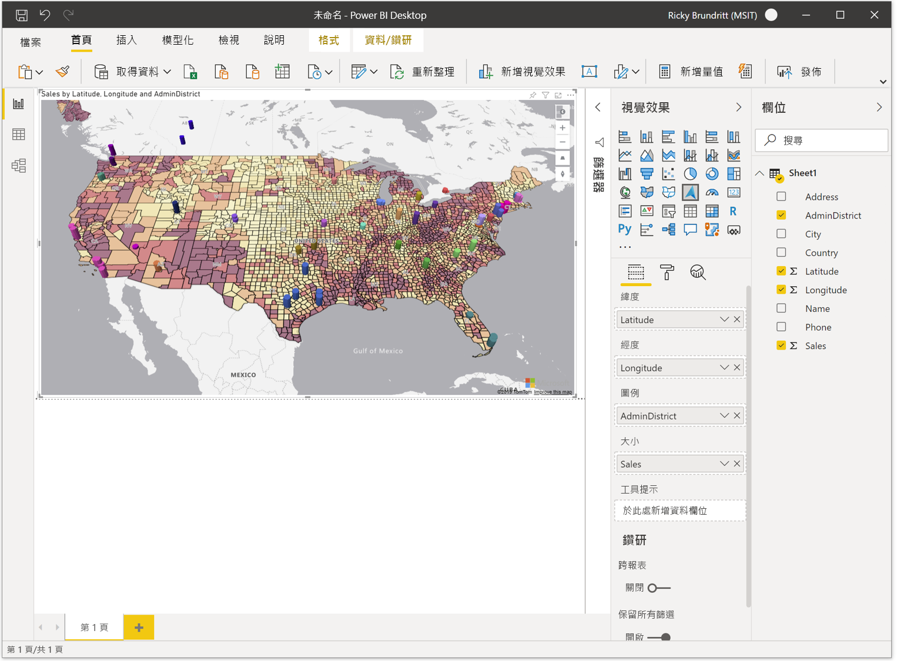

# <a name="what-is-azure-maps"></a>什麼是 Azure 地圖服務？

Azure 地圖服務是地理空間服務的集合，採用最新的地圖資料為 Web 和行動裝置應用程式提供地理內容。 Azure 地圖服務提供以下功能與服務：

* 用於以多種樣式和衛星影像呈現地圖的 REST API。
* 尋找全世界地址、地點及熱門景點的搜尋服務。
* 各種路線規劃選項：例如點對點、多點、多點最佳化、等時線、商用車輛、交通影響，以及矩陣路線規劃。
* 交通流量檢視和事件檢視，適用於需要交通資訊的應用程式。
* 可要求大眾運輸情況、即時規劃路線及要求運輸替換模式資訊的行動服務。
* 時區和地理位置服務，並可以將位置轉換為時區。
* 建立地理圍欄服務及儲存地圖資料，位置資訊則由 Azure 代管。 
* 能夠分析地理空間的高智慧定位能力。 

此外，也可以透過 Web SDK 或 Android SDK 來使用 Azure 地圖服務。 這些工具可協助讓開發人員快速開發和調整解決方案，以將位置資訊整合到 Azure 解決方案中。 

您可以註冊免費的 [Azure 地圖服務帳戶](https://azure.microsoft.com/services/azure-maps/)，開始進行開發！

以下影片會深入說明 Azure 地圖服務：

<br/>

<iframe src="https://channel9.msdn.com/Shows/Internet-of-Things-Show/Azure-Maps/player?format=ny" width="960" height="540" allowFullScreen frameBorder="0"></iframe>

## <a name="map-controls"></a>地圖控制項

### <a name="web-sdk"></a>Web SDK

Azure 地圖服務 Web SDK 可讓您以自己的內容和圖像自訂互動式地圖。 您可以針對 Web 或行動應用程式使用此互動式地圖。 此地圖控制項使用 WebGL，因此您能夠以高效能轉譯大型資料集。 您可以使用 JavaScript 或 TypeScript 搭配 SDK 進行開發。



### <a name="android-sdk"></a>Android SDK

Azure 地圖服務 Android SDK 可讓您建立功能強大的行動地圖應用程式。 



## <a name="services-in-azure-maps"></a>Azure 地圖服務中的服務

Azure 地圖服務是由下列九個服務組成，可以為 Azure 應用程式提供地理內容。

### <a name="data-service"></a>資料服務

對地圖而言，資料是不可或缺的。 請使用資料服務上傳及儲存地理空間資料供空間作業或影像構圖使用。  讓客戶資料更貼近 Azure 地圖服務可減少您應用程式的延遲、提高應用程式生產力，以及在您的應用程式中建立全新的案例。 如需這項服務的詳細資訊，請瀏覽[資料服務 API 文件](https://docs.microsoft.com/rest/api/maps/data) \(英文\)。

### <a name="mobility-service"></a>行動服務

Azure 地圖服務行動服務可讓您即時規劃行程。 它會傳回最理想的路線選項，並提供不同類型的旅遊模式。 對於擁有地鐵 (城市) 區域，這些模式可能包含走路、騎自行車，以及搭乘大眾運輸工具。 您可以要求運輸路線、線條幾何、停站名單、排定的抵達位置、即時抵達位置，以及服務警示。

此服務也支援搜尋某個位置周邊的特定物件類型。 使用者可以搜尋某個位置附近的共享自行車、機車或汽車。 使用者可以要求最接近的站點可用的自行車數目，以及搜尋可用的共乘車輛。 此外，使用者也可搜尋後續可用的車輛和目前燃料存量之類的詳細資料。

若要深入了解服務相關資訊，請參閱[行動 API 文件](https://docs.microsoft.com/rest/api/maps/mobility) \(英文\)。

### <a name="render-service"></a>轉譯服務

轉譯服務可協助開發人員建立具有地圖服務功能的 Web 和行動裝置應用程式。 此服務會使用高品質點陣圖形影像 (提供 19 個縮放層級)，或可完全自訂的向量格式地圖影像。


轉譯服務現在提供具預覽功能的 API，可讓開發人員使用衛星影像。 如需詳細資訊，請參閱[轉譯 API 文件](https://docs.microsoft.com/rest/api/maps/render) \(英文\)。

### <a name="route-service"></a>路線規劃服務

路線規劃服務包含真實世界基礎結構的強固幾何計算，與多種交通模式的路線。 服務可讓開發人員跨幾種旅行模式 (例如汽車、貨車、自行車或步行) 計算方向。 服務也可以考量輸入，例如交通情況、重量限制，或危險材料運輸。


路線規劃服務提供以下進階功能的預覽： 

* 以批次處理方式處理多個路徑規劃要求。
* 包含一組出發地與目的地之間旅行時間和距離資訊的矩陣。
* 尋找路徑或距離資訊可讓使用者了解所需的旅行時間與燃料需求，據以做好萬全準備。 

如需路線規劃功能的詳細資料，請參閱[路線規劃 API 文件](https://docs.microsoft.com/rest/api/maps/route) \(英文\)。

### <a name="search-service"></a>搜尋服務

搜尋服務可協助開發人員搜尋地址、位置、依名稱或類別列出的企業清單，以及其他地理資訊。 搜尋服務可根據經度和緯度進行地址與交叉路口的[反向地理編碼](https://en.wikipedia.org/wiki/Reverse_geocoding) \(英文\)。


搜尋服務也提供進階功能，例如：

* 沿路線搜尋。
* 搜尋更廣大區域的內部。
* 以批次處理方式處理一組搜尋要求。
* 搜尋更大的區域，而非位置點。 

批次處理和區域搜尋的 API 目前處於預覽狀態。 如需搜尋功能的詳細資訊，請參閱[搜尋 API 文件](https://docs.microsoft.com/rest/api/maps/search) \(英文\) 頁面。

### <a name="spatial-operations-service"></a>空間作業服務

Azure 地圖服務的空間作業服務會取得位置資訊。 該服務會快速分析位置資訊，以便通知客戶有關某個時間和空間發生的進行中事件。 藉此達到幾近即時的事件分析和預測性模型化。 

服務可讓客戶運用內含常見地理空間數學計算的程式庫，提升他們的智慧定位能力。 一般計算包括最接近點、大圓距離及環域。 若要深入了解服務以及各種功能，請參閱[空間作業 API 文件](https://docs.microsoft.com/rest/api/maps/spatial)。

### <a name="time-zone-service"></a>時區服務

時區服務可讓您查詢目前、過去及未來的時區資訊。 您可以使用經緯度組合或 [IANA 識別碼](https://www.iana.org/)。 時區服務也具備下列能力：

* 將 Microsoft Windows 時區識別碼轉換為 IANA 時區。
* 擷取 UTC 時區時差。
* 取得某一選定時區目前的時間。 

時區服務查詢的典型 JSON 回應如以下範例所示：

```JSON
{
    "Version": "2017c",
    "ReferenceUtcTimestamp": "2017-11-20T23:09:48.686173Z",
    "TimeZones": [{
        "Id": "America/Los_Angeles",
        "ReferenceTime": {
            "Tag": "PST",
            "StandardOffset": "-08:00:00",
            "DaylightSavings": "00:00:00",
            "WallTime": "2017-11-20T15:09:48.686173-08:00",
            "PosixTzValidYear": 2017,
            "PosixTz": "PST+8PDT,M3.2.0,M11.1.0"
        }
    }]
}
```

如需這項服務的詳細資訊，請瀏覽[時區服務 API 文件](https://docs.microsoft.com/rest/api/maps/timezone) \(英文\)。

### <a name="traffic-service"></a>交通服務

交通服務是一套 Web 服務，可讓開發人員用於需要交通資訊的 Web 或行動應用程式。 服務可提供兩種資料類型：

* 交通流量：針對路網中的所有重要道路提供即時觀察速度和行進時間。
* 交通事故：提供路網中交通阻塞和交通事故的最新檢視。


如需詳細資訊，請參閱[交通路況 API 文件](https://docs.microsoft.com/rest/api/maps/traffic) \(英文\)。

### <a name="ip-to-location-service"></a>IP 對位置服務

可使用「IP 對位置」服務預覽從 IP 位址擷取的兩個字母國碼/區域碼。 此服務可協助您藉由根據地理位置提供自訂應用程式內容，來加強使用者體驗。

如需與 REST API 中的「IP 到地點」服務有關的資訊，請閱讀 [Azure 地圖服務地理位置 API 文件](https://docs.microsoft.com/rest/api/maps/geolocation)。

## <a name="programming-model"></a>程式設計模型

Azure 地圖服務是針對行動性而建置，可以協助您開發跨平台應用程式。 它使用與語言無關的程式設計模型，並且透過 [REST API](https://docs.microsoft.com/rest/api/maps/) 支援 JSON 輸出。

此外，Azure 地圖服務也使用簡單的程式設計模型提供方便的 [JavaScript 地圖控制項](https://docs.microsoft.com/javascript/api/azure-maps-control)。 Web 和行動應用程式都可輕易且快速地進行開發。

## <a name="power-bi-visual"></a>Power BI 視覺效果

Power BI 的 Azure 地圖服務視覺效果會針對地圖頂端的空間資料提供一組豐富的資料視覺效果。 估計超過 80% 的商務資料有位置內容。 Azure 地圖服務視覺效果提供無程式碼的解決方案，可深入了解此位置內容與您的商務資料之間有何關聯和影響。



如需詳細資訊，請參閱 [Azure 地圖服務 Power BI 視覺效果](power-bi-visual-getting-started.md)文件的使用者入門。

## <a name="usage"></a>使用量

存取 Azure 地圖服務時須前往 [Azure 入口網站](https://portal.azure.com)，並建立 Azure 地圖服務帳戶。

Azure 地圖服務會使用金鑰型驗證結構描述。 您的帳戶隨附已預先為您產生的兩個金鑰，請使用任一個金鑰。 開始在您的應用程式中整合這些位置功能，並提出對 Azure 地圖服務的要求。

注意 - Azure 地圖服務會與第三方 TomTom 分享客戶提供的位址/位置查詢 (稱為「查詢」)，以用於對應功能。 與 TomTom 分享時，查詢不會連結至任何客戶或終端使用者，也不能用來識別個人。 Microsoft 目前正在將 TomTom 新增至線上服務轉包商清單。 請注意，包含與 Moovit 和 AccuWeather 整合的行動性和天氣服務，目前處於[預覽](https://azure.microsoft.com/support/legal/preview-supplemental-terms/)狀態。

## <a name="supported-regions"></a>支援區域

Azure 地圖服務 API 目前可在下列國家以外的所有國家和地區中使用：

* 中國
* 南韓

請確認您目前 IP 位址的位置處於支援的國家/區域中。

## <a name="next-steps"></a>後續步驟

請試用一下展示 Azure 地圖服務的範例應用程式：

> [!div class="nextstepaction"]
> [快速入門：建立 Web 應用程式](quick-demo-map-app.md)

掌握 Azure 地圖服務的最新動態： 

> [!div class="nextstepaction"]
> [Azure 地圖服務部落格](https://azure.microsoft.com/blog/topics/azure-maps/)
