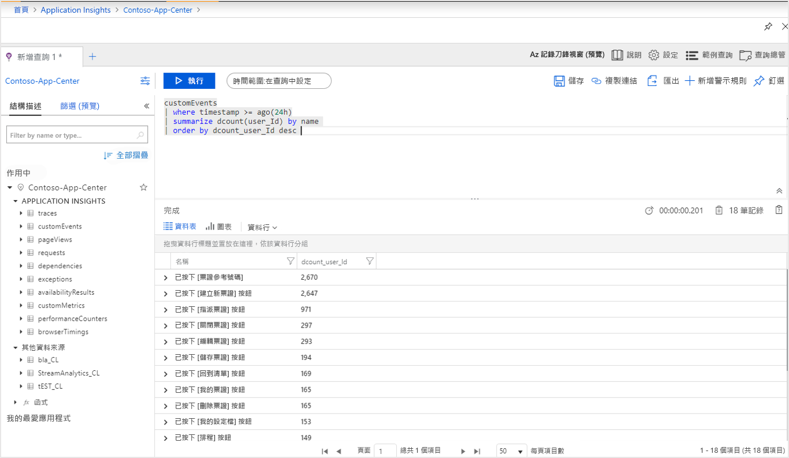
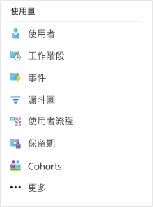
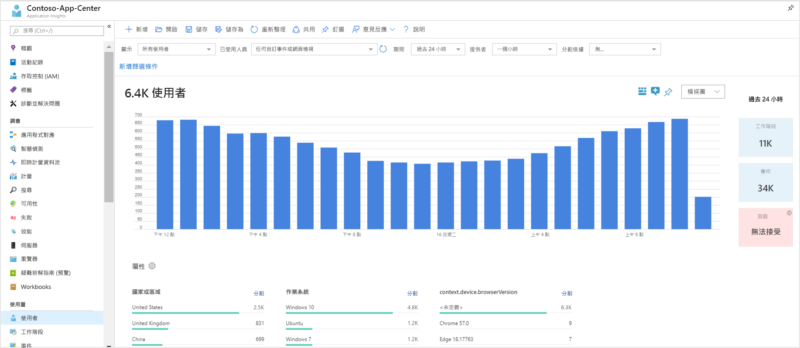
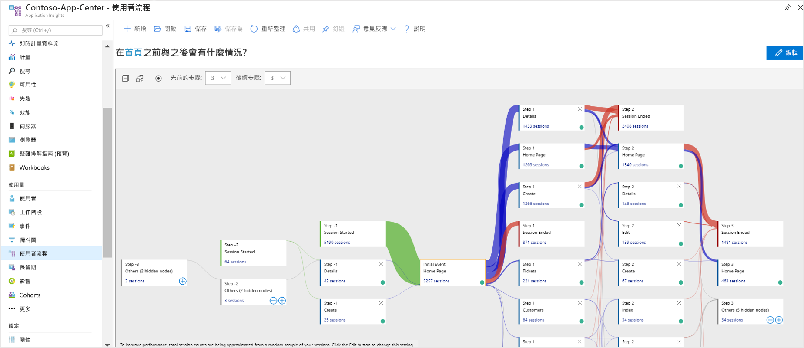

# <a name="start-analyzing-your-mobile-app-with-app-center-and-application-insights"></a>開始使用 App Center 和 Application Insights 分析您的行動應用程式

本快速入門會引導您將應用程式的 App Center 執行個體連線到 Application Insights。 Application Insights 提供查詢、分割、篩選及分析遙測資料的強大工具，遠勝於 App Center 的 [Analytics](/mobile-center/analytics/) \(英文\) 服務。

## <a name="prerequisites"></a>必要條件

若要完成本快速入門，您需要：

- Azure 訂用帳戶。
- iOS、Android、Xamarin、通用 Windows 或 React Native 應用程式。
 
如果您沒有 Azure 訂用帳戶，請在開始前建立[免費帳戶](https://azure.microsoft.com/free/)。

## <a name="sign-up-with-app-center"></a>使用 App Center 註冊
若要開始，請建立帳戶並[使用 App Center 註冊](https://appcenter.ms/signup?utm_source=ApplicationInsights&utm_medium=Azure&utm_campaign=docs) \(英文\)。

## <a name="onboard-to-app-center"></a>登入 App Center

您必須先將應用程式上架至 [App Center](/mobile-center/) \(英文\)，才能將 Application Insights 與行動應用程式搭配使用。 Application Insights 不會直接從您的行動應用程式接收遙測資料。 相反地，您的應用程式會將自訂事件遙測資料傳送到 App Center。 之後，當 App Center 接收到這些自訂事件，會持續將這些自訂事件的複本匯出到 Application Insights。 (這不適用於 [Application Insights JS SDK](https://github.com/Microsoft/ApplicationInsights-JS)，或將遙測直接傳送至 Application Insights 的 [React Native 外掛程式](https://github.com/Microsoft/ApplicationInsights-JS/tree/master/extensions/applicationinsights-react-native))。

若要將應用程式上架，請針對應用程式支援的每個平台，遵循 App Center 快速入門來操作。 針對每個平台建立個別的 App Center 執行個體：

* [iOS](/mobile-center/sdk/getting-started/ios)。
* [Android](/mobile-center/sdk/getting-started/android)。
* [Xamarin](/mobile-center/sdk/getting-started/xamarin)。
* [通用 Windows](/mobile-center/sdk/getting-started/uwp)。
* [React Native](/mobile-center/sdk/getting-started/react-native)。

## <a name="track-events-in-your-app"></a>追蹤應用程式中的事件

您的應用程式上架到 App Center 之後，必須使用 App Center SDK 將它修改成會傳送自訂事件遙測資料。 自訂事件是唯一會匯出到 Application Insights 的 App Center 遙測資料類型。

若要從 iOS 應用程式傳送自訂事件，請使用 App Center SDK 中的 `trackEvent` 或 `trackEvent:withProperties` 方法。 [深入了解追蹤 iOS 應用程式的事件。](/mobile-center/sdk/analytics/ios) \(英文\)

```Swift
MSAnalytics.trackEvent("Video clicked")
```

若要從 Android 應用程式傳送自訂事件，請使用 App Center SDK 中的 `trackEvent` 方法。 [深入了解追蹤 Android 應用程式的事件](/mobile-center/sdk/analytics/android) \(英文\)。

```Java
Analytics.trackEvent("Video clicked")
```

若要從其他應用程式平台傳送自訂事件，請使用其 App Center SDK 中的 `trackEvent`。

若要確認有接收到您的自訂事件，請移至 App Center 中 [分析] 區段下的 [事件] 索引標籤。 事件從應用程式傳送之後，可能需要幾分鐘的時間才會顯示。

## <a name="create-an-application-insights-resource"></a>建立 Application Insights 資源

一旦您的應用程式開始傳送自訂事件，且 App Center 已經收到這些事件，您就需要在 Azure 入口網站中建立 App Center 類型的 Application Insights 資源：

1. 登入 [Azure 入口網站](https://portal.azure.com/)。
2. 選取 [建立資源] > [開發人員工具] > [Application Insights]。

    > [!NOTE]
    > 如果這是您第一次建立 Application Insights 資源，您可以瀏覽[建立 Application Insights 資源](../app/create-new-resource.md)文件以進一步了解。

    隨後將會出現設定方塊。 根據下表來填寫輸入欄位。

    | 設定        |  值           | 描述  |
   | ------------- |:-------------|:-----|
   | **名稱**      | 某些全域唯一的值，例如 "myApp-iOS" | 此名稱可識別您要監視的應用程式 |
     | **資源群組**     | 新的資源群組或功能表中現有的資源群組 | 要在其中建立新 Application Insights 資源的資源群組 |
   | **位置** | 功能表中的位置 | 選擇您附近或接近應用程式裝載位置的地點 |

3. 按一下 [建立]。

如果您的應用程式支援多個平台 (iOS、Android 等等)，建議針對每個平台建立個別的 Application Insights 資源。

## <a name="export-to-application-insights"></a>匯出到 Application Insights

位於 [概觀] 頁面上您的新 Application Insights 資源中。 從資源複製檢測金鑰。

在應用程式的 [App Center](https://appcenter.ms/) 執行個體中：

1. 在 [設定] 頁面上，按一下 [匯出]。
2. 選擇 [新匯出]，挑選 [Application Insights]，然後按一下 [自訂]。
3. 將您的 Application Insights 檢測金鑰貼到方塊中。
4. 同意增加包含您 Application Insights 資源的 Azure 訂用帳戶使用量。 每個 Application Insights 資源每月前 1 GB 接收的資料為免費。 [深入了解 Application Insights 定價](https://azure.microsoft.com/pricing/details/application-insights/)

請記得對應用程式支援的每個平台重複執行此程序。

一旦設定好[匯出](/mobile-center/analytics/export) \(英文\) 之後，App Center 收到的每個自訂事件就都會複製到 Application Insights。 事件可能需要幾分鐘才會送達 Application Insights，因此如果它們沒有馬上顯示，請先稍等一下再進行進一步的診斷。

為了在您第一次連線時提供更多資料，App Center 中最近 48 小時的自訂事件會自動匯出到 Application Insights。

## <a name="start-monitoring-your-app"></a>開始監視應用程式

Application Insights 可以查詢、分割、篩選及分析應用程式的自訂事件遙測資料，遠勝於 App Center 提供的分析工具。

1. **查詢您的自訂事件遙測資料。** 從 Application Insights [概觀] 頁面，選擇 [記錄 (分析)]。

   此時會開啟與您的 Application Insights 資源相關聯的 Application Insights 記錄 (分析) 入口網站。 記錄 (分析) 入口網站可讓您使用 Log Analytics 查詢語言直接查詢資料，因此您可以任意詢問有關應用程式和其使用者的複雜問題。
   
   在記錄 (分析) 入口網站中開啟新的索引標籤，然後貼上下列查詢。 它會傳回過去 24 小時內有多少個不同的使用者從您的應用程式傳送每個自訂事件，並根據這些不同的計數來排序。

   ```AIQL
   customEvents
   | where timestamp >= ago(24h)
   | summarize dcount(user_Id) by name 
   | order by dcount_user_Id desc 
   ```

   

   1. 在文字編輯器中的查詢上任一處按一下，以選取該查詢。
   2. 按一下 [執行] 來執行查詢。 

   深入了解 [Application Insights 分析](../log-query/log-query-overview.md)以及 [Log Analytics 查詢語言](/azure/data-explorer/kusto/query/) \(英文\)。


2. **分割及篩選您的自訂事件遙測資料。** 從 Application Insights [概觀] 頁面，選擇目錄中的 [使用者]。

   

   [使用者] 工具可以針對您使用 App Center SDK 追蹤做為事件的項目，顯示有多少應用程式使用者按過特定按鈕、瀏覽特定畫面，或執行過任何其他動作。 如果您在尋找分割及篩選 App Center 事件的方法，[使用者] 工具是絕佳的選擇。

    

   例如，選擇 [分割依據] 下拉式功能表中的 [國家或地區]，以根據地理位置來分割使用量。

3. **分析應用程式中的轉換、保留和瀏覽模式。** 從 Application Insights [概觀] 頁面，選擇目錄中的 [使用者流程]。

   

   [使用者流程] 工具可將使用者在起始事件之後傳送的事件視覺化。 此工具有助於了解使用者瀏覽應用程式的大致情況。 它也能顯示許多使用者離開應用程式的位置，或不斷重複執行相同動作的位置。

   除了 [使用者流程] 之外，Application Insights 還有可以回答特定問題的其他使用者行為分析工具：

   * [漏斗圖] 可分析及監視轉換率。
   * [保留期] 可分析應用程式隨著時間留住使用者的能力。
   * [活頁簿] 可將視覺效果和文字結合成可共用的報表。
   * [世代] 可命名或儲存特定使用者群組或事件，以方便從其他分析工具參考。

## <a name="clean-up-resources"></a>清除資源

如果您不想繼續搭配 Application Insights 使用 App Center，請在 App Center 中關閉匯出並刪除 Application Insights 資源。 這樣可以避免 Application Insights 針對此資源進一步向您收費。

在 App Center 中關閉匯出：

1. 在 App Center 中，移至 [設定] 並選擇 [匯出]。
2. 按一下您要刪除的 Application Insights 匯出，然後按一下底端的 [刪除匯出] 並確認。

刪除 Application Insights 資源：

1. 在 Azure 入口網站的左側功能表中，按一下 [資源群組]，然後選取 Application Insights 資源建立於其中的資源群組。
2. 開啟您要刪除的 Application Insights 資源。 然後按一下資源最上層功能表中的 [刪除] 並確認。 如此將永久刪除匯出到 Application Insights 的資料複本。

## <a name="next-steps"></a>後續步驟

> [!div class="nextstepaction"]
> [了解客戶如何使用您的應用程式](../app/usage-overview.md)