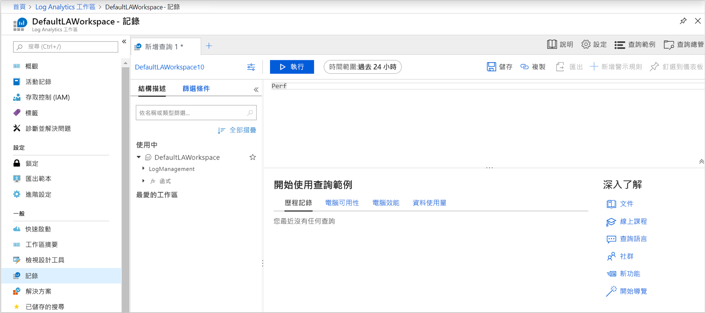

# 使用 Azure 監視器從混合式環境中的 Windows 電腦收集資料

[Azure 監視器](../overview.md)可將來自環境中實體或虛擬 Windows 電腦的資料直接收集到 Log Analytics 工作區，以供詳細分析和相互關聯。 安裝 [Log Analytics 代理程式](../platform/log-analytics-agent.md)可讓 Azure 監視器從資料中心或其他雲端環境收集資料。 本快速入門向您示範如何以幾個簡單步驟來設定和收集 Windows 電腦的資料。 如需 Azure Windows VM 的相關資訊，請參閱[收集關於 Azure 虛擬機器的資料](./quick-collect-azurevm.md)。  

若要了解支援的組態，請參閱[支援的 Windows 作業系統](../platform/log-analytics-agent.md#supported-windows-operating-systems)和[網路防火牆組態](../platform/log-analytics-agent.md#network-requirements)。
 
如果您沒有 Azure 訂用帳戶，請在開始前建立[免費帳戶](https://azure.microsoft.com/free/?WT.mc_id=A261C142F)。

## 登入 Azure 入口網站

登入 Azure 入口網站：[https://portal.azure.com](https://portal.azure.com)。 

## 建立工作區

1. 在 Azure 入口網站中，選取 [所有服務]  。 在資源清單中輸入 **Log Analytics**。 當您開始輸入時，清單會根據您輸入的文字進行篩選。 選取 [Log Analytics 工作區]  。

       

2. 選取 [建立]  ，然後選取下列項目的選項：

   * 為新的 [Log Analytics 工作區]  提供名稱，例如 DefaultLAWorkspace  。  
   * 如果選取的預設值不合適，請從下拉式清單中選取要連結的 [訂用帳戶]  。
   * 對於 [資源群組]  ，選取包含一或多個 Azure 虛擬機器的現有資源群組。  
   * 選取要部署 VM 的 [位置]  。  如需詳細資訊，請查看 [Log Analytics 的可用區域](https://azure.microsoft.com/regions/services/)。
   * 如果您要在 2018 年 4 月 2 之後建立的新訂用帳戶中建立工作區，系統會自動使用「每 GB」  定價方案和選項來選取將無法使用的定價層。  如果您要為在 4 月 2 日之前建立的現有訂用帳戶，或已繫結至現有 EA 註冊的訂用帳戶建立工作區，請選取您偏好的定價層。  如需特定層的詳細資訊，請參閱 [Log Analytics 價格詳細資料](https://azure.microsoft.com/pricing/details/log-analytics/)。
  
        ![[建立 Log Analytics] 資源刀鋒視窗](media/quick-collect-azurevm/create-log-analytics-workspace-azure-portal.png) 

3. 在 [Log Analytics 工作區]  窗格中提供必要資訊之後，選取 [確定]  。  

在驗證資訊及建立工作區時，您可以在功能表的 [通知]  底下追蹤其進度。 

## 取得工作區識別碼與金鑰

安裝適用於 Windows 的 Log Analytics 代理程式 (也稱為 Microsoft Monitoring Agent (MMA)) 之前，您必須擁有 Log Analytics 工作區的工作區識別碼和金鑰。 安裝精靈必須要有這項資訊，才能正確設定代理程式，並確保它能與 Azure 監視器進行通訊。  

1. 在 Azure 入口網站的左上角，選取 [所有服務]  。 在搜尋方塊中，輸入 **Log Analytics**。 當您輸入時，清單會根據您輸入的文字進行篩選。 選取 [Log Analytics 工作區]  。

2. 在 Log Analytics 工作區清單中，選取您稍早建立的工作區 (您可能已經將它命名為 **DefaultLAWorkspace**)。

3. 選取 [進階設定]  ：

    
  
4. 選取 [連接的來源]  ，然後選取 [Windows 伺服器]  。

5. 複製 [工作區識別碼]  和 [主要金鑰]  右邊的值。 將它們貼到您最愛的編輯器。

## 安裝適用於 Windows 的代理程式

下列步驟將會在 Azure 和 Azure Government 中安裝並設定 Log Analytics 的代理程式。 您將使用 Microsoft Monitoring Agent 安裝程式，在您的電腦上安裝代理程式。

1. 從之前的幾個步驟繼續，在 [Windows 伺服器]  頁面上，選取您想要下載的 [下載 Windows 代理程式]  版本。 選取適當版本作為 Windows 作業系統的處理器架構。

2. 執行安裝程式以在您的電腦上安裝代理程式。

3. 在 [歡迎]  頁面上，選取 [下一步]  。

4. 在 [授權條款]  頁面上，閱讀授權並選取 [我同意]  。

5. 在 [目的資料夾]  頁面上，變更或保留預設的安裝資料夾，然後選取 [下一步]  。

6. 在 [代理程式安裝選項]  頁面上，將代理程式連線到 Azure Log Analytics，然後選取 [下一步]  。

7. 在 [Azure Log Analytics]  頁面上，完成下列步驟：

   1. 貼上您先前複製的 [工作區識別碼]  和 [工作區金鑰 (主要金鑰)]  。 如果電腦應該向 Azure Government 中的 Log Analytics 工作區回報，請在 [Azure 雲端]  清單中選取 [Azure US Gov]  。  
   2. 如果電腦需要透過 Proxy 伺服器與 Log Analytics 服務進行通訊，請選取 [進階]  ，然後提供 Proxy 伺服器的 URL 和連接埠號碼。 如果您的 Proxy 伺服器要求驗證，請輸入要向 Proxy 伺服器進行驗證的使用者名稱和密碼，然後選取 [下一步]  。  

8. 新增組態設定之後，選取 [下一步]  ：

    

9. 在 [安裝準備就緒]  頁面上，檢閱您的選擇，然後選取 [安裝]  。

10. 在 [設定成功完成]  頁面上，選取 [完成]  。

安裝和設定完成時，Microsoft Monitoring Agent 會顯示在 [控制台] 中。 您可以檢閱您的組態，並確認代理程式已連線到 Log Analytics 工作區。 連線時，在 [Azure Log Analytics]  索引標籤上，代理程式會顯示以下訊息：**Microsoft Monitoring Agent 已成功連線到 Microsoft Log Analytics 服務。**   

## 收集事件和效能資料

Azure 監視器可以收集您從 Windows 事件記錄檔和效能計數器指定的事件，以便進行更長期的分析和報告。 它也可以在偵測到特定條件時採取動作。 請依照下列步驟來設定從 Windows 事件記錄檔收集事件，以及收集數個常用的效能計數器，來開始進行作業。  

1. 在 Azure 入口網站的左下角，選取 [更多服務]  。 在搜尋方塊中，輸入 **Log Analytics**。 當您輸入時，清單會根據您輸入的文字進行篩選。 選取 [Log Analytics 工作區]  。

2. 選取 [進階設定]  ：

    
 
3. 選取 [資料]  ，然後選取 [Windows 事件記錄]  。  

4. 您可以輸入記錄檔的名稱，來新增事件記錄檔。 輸入 **System**，然後選取加號 ( **+** )。  

5. 在表格中，選取 [錯誤]  和 [警告]  嚴重性。

6. 在頁面上方選取 [儲存]  。

7. 選取 [Windows 效能計數器]  以啟用收集 Windows 電腦上的效能計數器。

8. 當您第一次為新的 Log Analytics 工作區設定 Windows 效能計數器時，系統會提供選項，讓您快速建立數個常用的計數器。 此時將列出每個選項，且旁邊有一個核取方塊：

    。
    
    選取 [新增選定的效能計數器]  。 隨即會新增計數器，且收集取樣間隔時間的預設值為 10 秒。

9. 在頁面上方選取 [儲存]  。

## 檢視收集的資料

既然您已經啟用資料收集，現在可以執行簡單的記錄搜尋，以查看來自目標電腦的一些資料。  

1. 在選取的工作區中，從左側窗格中選取 [記錄]  。

2. 在記錄查詢頁面的查詢編輯器中輸入 `Perf`，然後選取 [執行]  。
 
    

    例如，下圖中的查詢會傳回 10,000 筆效能記錄。 結果將會大幅減少。

    

## 清除資源

如果您不再需要，可以從電腦移除代理程式，並刪除 Log Analytics 工作區。  

若要移除代理程式，請完成下列步驟：

1. 開啟 [控制台]。

2. 開啟 [程式和功能]  。

3. 在 [程式和功能]  中，選取 [Microsoft Monitoring Agent]  ，然後選取 [解除安裝]  。

若要刪除您先前建立的 Log Analytics 工作區，請選取該工作區，然後在資源頁面上，選取 [刪除]  ：

## 後續步驟

既然您正在從 Windows 電腦收集作業和效能資料，您可以輕鬆地開始針對收集的資料*免費*進行探索、分析及採取行動。  

若要了解如何檢視和分析資料，請繼續進行本教學課程：

> [!div class="nextstepaction"]
> [在 Log Analytics 中檢視或分析資料](../log-query/get-started-portal.md)

