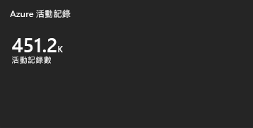

# <a name="collect-and-analyze-azure-activity-log-in-azure-monitor"></a>在 Azure 監視器中收集和分析 Azure 活動紀錄
[Azure 活動日誌](platform-logs-overview.md)是一個[平台日誌](platform-logs-overview.md),用於深入瞭解 Azure 中發生的訂閱級事件。 雖然可以在 Azure 門戶中查看活動日誌,但應將其配置為發送到日誌分析工作區以啟用 Azure 監視器的其他功能。 本文介紹如何執行此配置以及如何將活動日誌發送到 Azure 存儲和事件中心。

在日誌分析工作區中收集活動日誌具有以下優點:

- 日誌分析工作區中存儲的活動日誌數據無需數據引入或數據保留費用。
- 將活動日誌數據與 Azure 監視器收集的其他監視數據相關聯。
- 使用日誌查詢執行複雜的分析,並獲得對活動日誌條目的深入瞭解。
- 將日誌警報與活動條目一起使用,允許更複雜的警報邏輯。
- 存儲活動日誌條目超過 90 天。
- 將多個 Azure 訂閱和租戶的日誌條目合併到一個位置,以便一起分析。


## <a name="collecting-activity-log"></a>收集活動記錄
活動紀錄將自動收集,以便[在 Azure 門戶中檢視](activity-log-view.md)。 要在紀錄分析工作區中收集它或將其傳送 Azure 儲存或事件中心,請建立[一個診斷設定](diagnostic-settings.md)。 這是資源日誌使用的方法,使其對所有[平台日誌](platform-logs-overview.md)保持一致。  

要為作用紀錄建立診斷設定,請從 Azure 監視器中的 **「活動紀錄**」選單中選擇 **「診斷」設定**。 有關建立設定的詳細資訊,請參閱[建立診斷設定以在 Azure 中收集平台紀錄和指標](diagnostic-settings.md)。 有關可以篩選的類別的說明,請參閱[活動紀錄中的類別](activity-log-view.md#categories-in-the-activity-log)。 如果您有任何舊版設置,請確保在創建診斷設置之前禁用它們。 同時啟用這兩個功能可能會導致資料重複。


> [!NOTE]
> 目前,您只能使用 Azure 門戶和資源管理器範本創建訂閱級診斷設置。 


## <a name="legacy-settings"></a>舊版設定 
雖然診斷設置是將活動日誌發送到不同目標的首選方法,但如果不選擇替換為診斷設置,舊方法將繼續工作。 與舊方法不同,診斷設置具有以下優勢,建議您更新配置:

- 收集所有平台日誌的一致方法。
- 跨多個訂閱和租戶收集活動日誌。
- 篩選集合以僅收集特定類別的日誌。
- 收集所有活動日誌類別。 某些類別不會使用舊方法收集。
- 日誌引入的延遲更快。 前一種方法的延遲約為15分鐘,而診斷設置僅添加約1分鐘。


### <a name="log-profiles"></a>記錄檔的設定檔
紀錄設定檔是將活動日誌發送到 Azure 儲存或事件中心的傳統方法。 使用以下過程繼續使用日誌配置檔或禁用它,以便遷移到診斷設置。

1. 從 Azure 門戶中的**Azure 監視器**選單中,選擇**活動紀錄**。
3. 按下 **「診斷設置**」。

   

4. 單擊紫色橫幅即可獲得舊體驗。

    

### <a name="log-analytics-workspace"></a>Log Analytics 工作區
將活動日誌收集到日誌分析工作區的傳統方法是在工作區配置中連接日誌。 

1. 從 Azure 門戶中的 **「日誌分析」工作區**功能表中,選擇工作區以收集活動日誌。
1. 在工作區選單的工作**區資料來源**部份中,選擇**Azure 活動紀錄**。
1. 按一下要連接的訂閱。

    

1. 按下 **「連線**」將訂閱中的活動日誌連接到所選工作區。 如果訂閱已連接到另一個工作區,請單擊"首先**斷開連接**"以斷開連接。

    


要禁用該設置,請執行相同的過程,然後單擊 **「斷開連接**」以從工作區中刪除訂閱。


## <a name="analyze-activity-log-in-log-analytics-workspace"></a>在紀錄分析工作區中分析活動紀錄
將活動日誌連接到日誌分析工作區時,條目將寫入工作區,該表名為*AzureActivity,* 您可以使用[日誌查詢](../log-query/log-query-overview.md)檢索該表。 此表的結構因[日誌條目的類別](activity-log-view.md#categories-in-the-activity-log)而異。 有關每個類別的說明,請參閱[Azure 活動紀錄事件架構](activity-log-schema.md)。


### <a name="data-structure-changes"></a>資料結構變更
診斷設置收集的數據與用於收集活動日誌的舊方法相同的數據,對*AzureActivity*表的結構進行了一些更改。

下表中的列已棄用更新的架構。 它們仍然存在於*AzureActivity 中,* 但它們將沒有數據。 這些列的替換不是新的,但它們包含的數據與棄用列相同。 它們採用不同的格式,因此您可能需要修改使用它們的日誌查詢。 

| 已棄用欄 | 取代欄位 |
|:---|:---|
| 活動狀態    | ActivityStatusValue    |
| 作用子級狀態 | 作用子狀態值 |
| OperationName     | 操作名稱值     |
| ResourceProvider  | 資源提供者價值  |

> [!IMPORTANT]
> 在某些情況下,這些列中的值可能在所有大寫中。 如果查詢包含這些列,則應使用[* 運算子](https://docs.microsoft.com/azure/kusto/query/datatypes-string-operators)執行不區分大小寫的比較。

以下列已新增到更新的架構中的*AzureActivity:*

- Authorization_d
- Claims_d
- Properties_d


## <a name="activity-logs-analytics-monitoring-solution"></a>活動紀錄分析監視解決方案
Azure 日誌分析監視解決方案將很快棄用,並使用日誌分析工作區中更新的架構替換為工作簿。 如果已啟用該解決方案,您仍可以使用該解決方案,但只能使用舊版設置收集活動日誌時才能使用它。 


### <a name="use-the-solution"></a>使用解決方案
監視解決方案從 Azure 門戶中的 **「監視器」** 功能表存取。 在 **「見解」** 部分中選擇 **「更多**」以使用解決方案磁貼打開 **「概述」** 頁。 Azure**活動日誌**磁貼顯示工作區中**AzureActivity**記錄數的計數。




按**下 Azure 活動日誌**磁貼以打開**Azure 活動日誌**檢視。 視圖包括下表中的可視化部分。 每個部件最多列出 10 個與指定時間範圍的零件條件相匹配的專案。 可以通過按一下「查看零件底部**的所有記錄**」來運行回所有匹配記錄的日誌查詢。


### <a name="enable-the-solution-for-new-subscriptions"></a>開啟新訂閱的解決方案
您將很快不再能夠使用 Azure 入口將活動日誌分析解決方案添加到訂閱中。 您可以使用以下過程與資源管理器範本一起添加它。 

1. 將以下 json 複製到名為*活動日誌範本*.json 的檔。

    ```json
    {
    "$schema": "https://schema.management.azure.com/schemas/2014-04-01-preview/deploymentTemplate.json#",
    "contentVersion": "1.0.0.0",
    "parameters": {
        "workspaceName": {
            "type": "String",
            "defaultValue": "my-workspace",
            "metadata": {
              "description": "Specifies the name of the workspace."
            }
        },
        "location": {
            "type": "String",
            "allowedValues": [
              "east us",
              "west us",
              "australia central",
              "west europe"
            ],
            "defaultValue": "australia central",
            "metadata": {
              "description": "Specifies the location in which to create the workspace."
            }
        }
      },
        "resources": [
        {
            "type": "Microsoft.OperationalInsights/workspaces",
            "name": "[parameters('workspaceName')]",
            "apiVersion": "2015-11-01-preview",
            "location": "[parameters('location')]",
            "properties": {
                "features": {
                    "searchVersion": 2
                }
            }
        },
        {
            "type": "Microsoft.OperationsManagement/solutions",
            "apiVersion": "2015-11-01-preview",
            "name": "[concat('AzureActivity(', parameters('workspaceName'),')')]",
            "location": "[parameters('location')]",
            "dependsOn": [
                "[resourceId('microsoft.operationalinsights/workspaces', parameters('workspaceName'))]"
            ],
            "plan": {
                "name": "[concat('AzureActivity(', parameters('workspaceName'),')')]",
                "promotionCode": "",
                "product": "OMSGallery/AzureActivity",
                "publisher": "Microsoft"
            },
            "properties": {
                "workspaceResourceId": "[resourceId('microsoft.operationalinsights/workspaces', parameters('workspaceName'))]",
                "containedResources": [
                    "[concat(resourceId('microsoft.operationalinsights/workspaces', parameters('workspaceName')), '/views/AzureActivity(',parameters('workspaceName'))]"
                ]
            }
        },
        {
          "type": "Microsoft.OperationalInsights/workspaces/datasources",
          "kind": "AzureActivityLog",
          "name": "[concat(parameters('workspaceName'), '/', subscription().subscriptionId)]",
          "apiVersion": "2015-11-01-preview",
          "location": "[parameters('location')]",
          "dependsOn": [
              "[parameters('WorkspaceName')]"
          ],
          "properties": {
              "linkedResourceId": "[concat(subscription().Id, '/providers/microsoft.insights/eventTypes/management')]"
          }
        }
      ]
    }    
    ```

2. 使用以下 PowerShell 命令部署樣本:

    ```PowerShell
    Connect-AzAccount
    Select-AzSubscription <SubscriptionName>
    New-AzResourceGroupDeployment -Name activitysolution -ResourceGroupName <ResourceGroup> -TemplateFile <Path to template file>
    ```


## <a name="next-steps"></a>後續步驟

- 瞭解有關[活動日誌](platform-logs-overview.md)的更多內容。
- 瞭解有關 Azure[監視器數據平臺](data-platform.md)的更多資訊。
- 使用[紀錄查詢](../log-query/log-query-overview.md)查看活動日誌中的詳細資訊。
