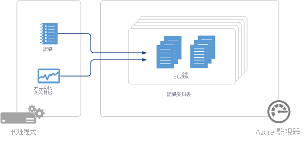

# Azure 監視器中的 Log Analytics 代理程式資料來源
Azure 監視器使用 [Log analytics](log-analytics-agent.md) 代理程式從虛擬機器收集的資料，是由您在 [log analytics 工作區](data-platform-logs.md)中設定的資料來源所定義。   每個資料來源都會建立特定類型的記錄，每種類型各有自己的一組屬性。

> [!IMPORTANT]
> 本文涵蓋 [Log Analytics 代理程式](log-analytics-agent.md) 的資料來源，這是 Azure 監視器所使用的其中一個代理程式。 其他代理程式會收集不同的資料，並以不同的方式進行設定。 如需可用的代理程式清單和可收集的資料，請參閱 [Azure 監視器代理](agents-overview.md) 程式的總覽。

> [!IMPORTANT]
> 本文所述的資料來源只適用于執行 Log Analytics 代理程式的虛擬機器。 

## 資料來源的摘要
下表列出 Log Analytics 代理程式目前可用的代理程式資料來源。  每個資料來源都有個別的文章連結，提供該資料來源的詳細資料。   此外，還提供收集方法與頻率的相關資訊。 

| 資料來源 | 平台 | Log analytics 代理程式 | Operations Manager 代理程式 | Azure 儲存體 | 是否需要 Operations Manager？ | 透過管理群組傳送的 Operations Manager 代理程式資料 | 收集頻率 |
| --- | --- | --- | --- | --- | --- | --- | --- |
| [自訂的記錄](data-sources-custom-logs.md) | Windows |&#8226; |  | |  |  | 與抵達同時 |
| [自訂的記錄](data-sources-custom-logs.md) | Linux   |&#8226; |  | |  |  | 與抵達同時 |
| [IIS 記錄](data-sources-iis-logs.md) | Windows |&#8226; |&#8226; |&#8226; |  |  |取決於記錄檔檔案換用設定 |
| [效能計數器](data-sources-performance-counters.md) | Windows |&#8226; |&#8226; |  |  |  |依排程，最少 10 秒 |
| [效能計數器](data-sources-performance-counters.md) | Linux |&#8226; |  |  |  |  |依排程，最少 10 秒 |
| [Syslog](data-sources-syslog.md) | Linux |&#8226; |  |  |  |  |從 Azure 儲存體 ：10 分鐘；從代理程式：與抵達同時 |
| [Windows 事件記錄](data-sources-windows-events.md) |Windows |&#8226; |&#8226; |&#8226; |  |&#8226; | 與抵達同時 |

## 設定資料來源
若要設定 Log Analytics 代理程式的資料來源，請移至 Azure 入口網站中的 **Log analytics 工作區** 功能表，然後選取工作區。 依序按一下 [ **Advanced settings** ] 和 [ **Data**]。 選取您要設定的資料來源。 您可以依照上表中的連結，取得每個資料來源的檔，以及其設定的詳細資料。

所有設定都會傳遞至所有連線到該工作區的代理程式。  您無法從此設定中排除任何已連線的代理程式。

## 資料收集
系統會在幾分鐘內，將資料來源組態傳遞給直接連接到 Azure 監視器的代理程式。  系統會從代理程式收集指定的資料，並依據每個資料來源特定的時間間隔，直接傳遞給 Azure 監視器。  請參閱每個資料來源的文件，以了解這些特性。

若是已連接管理群組中的 System Center Operations Manager 代理程式，系統會將資料來源組態轉譯為管理組件，並依預設每隔 5 分鐘傳遞給管理群組。  如同其他任何代理程式一樣，此代理程式也會下載管理組件，並收集指定的資料。 視資料來源而定，資料會傳送至管理伺服器，而管理伺服器再將資料轉送至 Azure 監視器，或者，由這個代理程式直接將資料傳送至 Azure 監視器，而沒有經過管理伺服器。 如需詳細資訊，請參閱 [Azure 中監視解決方案的資料收集詳細資料](../monitor-reference.md)。  您可以閱讀連接 Operations Manager 與 Azure 監視器的詳細資訊，以及修改在[設定與 System Center Operations Manager 的整合](om-agents.md)時傳遞之組態頻率的詳細資訊。

如果代理程式無法連接到 Azure 監視器或 Operations Manager，它將會繼續收集資料，以便在建立連線時進行傳遞。  如果資料量達到用戶端的快取大小上限，或者代理程式無法在 24 小時內建立連線，可能就會遺失資料。

## 所有記錄
Azure 監視器收集的所有記錄資料都會以記錄形式儲存在工作區中。  不同資料來源所收集的記錄會有自己的一組屬性，並由其 **類型** 屬性來識別。  如需每種記錄類型的詳細資訊，請參閱各資料來源和方案的文件。

## 後續步驟
* 了解可將功能新增至 Azure 監視器，並會將資料收集到工作區的[監視解決方案](../insights/solutions.md)。
* 了解[記錄查詢](../log-query/log-query-overview.md)，以分析從資料來源和監視解決方案收集到的資料。  
* 設定[警示](alerts-overview.md)，以便從資料來源和監視解決方案收集到重要資料時主動通知您。
