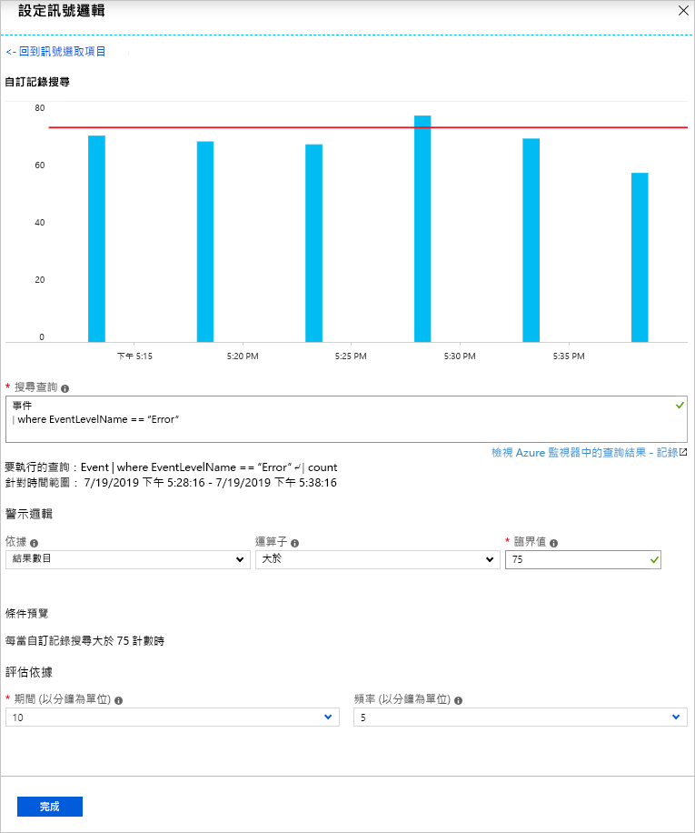
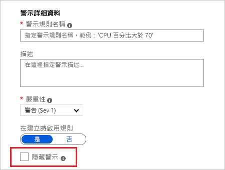
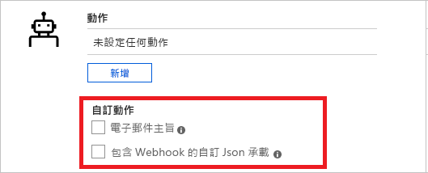
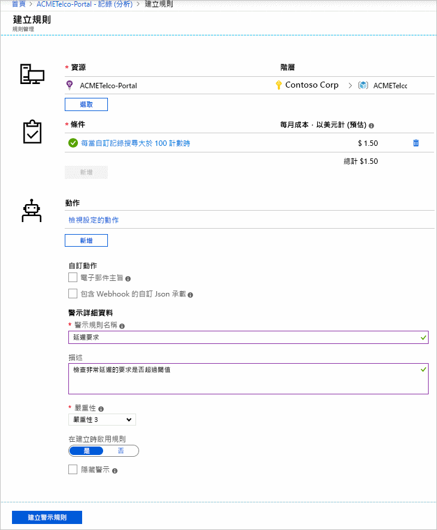
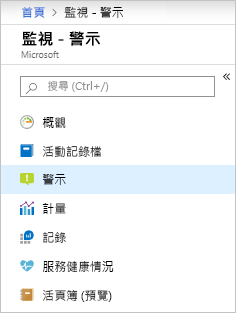
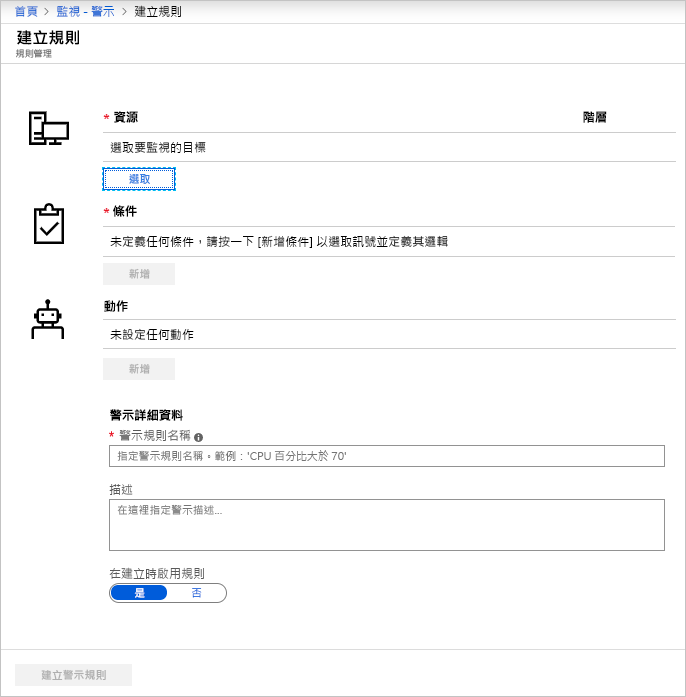
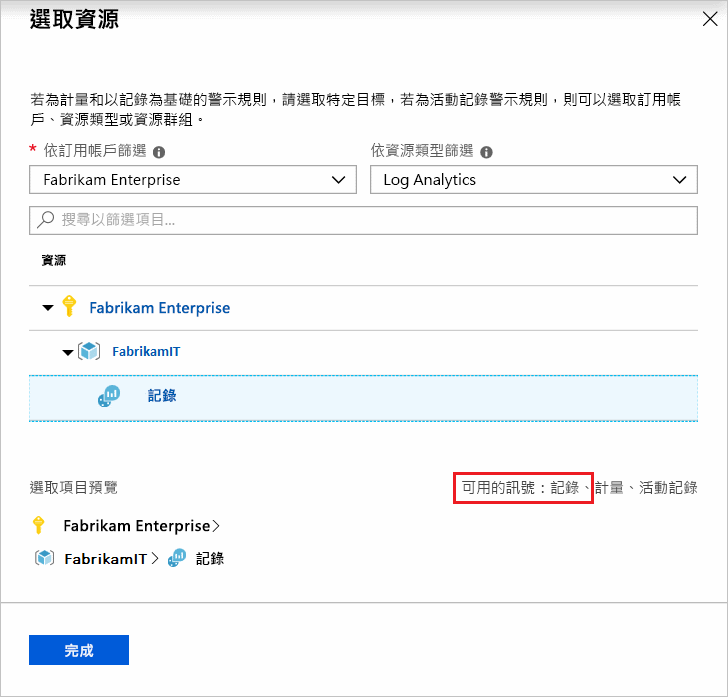
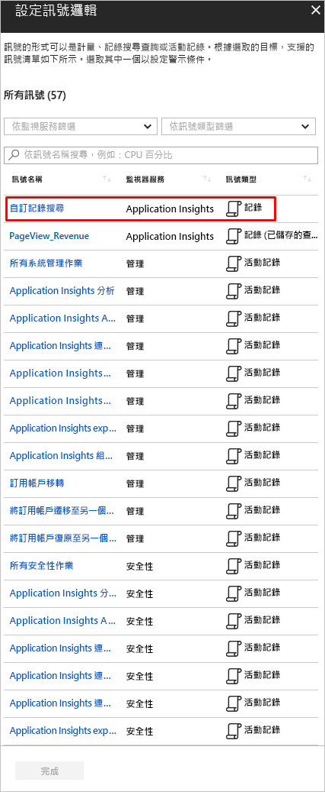

# <a name="create-view-and-manage-log-alerts-using-azure-monitor"></a>使用 Azure 監視器來建立、檢視及管理記錄警示

## <a name="overview"></a>概觀

記錄警示可讓使用者使用 [Log Analytics](../log-query/get-started-portal.md) 查詢來評估每個設定頻率的資源記錄，並根據結果引發警示。 規則可以使用 [動作群組](./action-groups.md)觸發一或多個動作。 [深入瞭解記錄警示的功能和術語](alerts-unified-log.md)。

本文說明如何使用 Azure 監視器建立和記錄管理警示。 警示規則是由三個元件所定義：
- 目標：要監視的特定 Azure 資源。
- 準則：要評估的邏輯。 如果符合，則會引發警示。  
- 動作：通知或自動化-電子郵件、SMS、webhook 等等。

您也可以使用 Azure Resource Manager 範本建立記錄警示規則，這些範本會在 [個別的文章](alerts-log-create-templates.md)中說明。

> [!NOTE]
> Log [Analytics 工作區](../log-query/get-started-portal.md) 中的記錄資料可以傳送至 Azure 監視器計量存放區。 計量警示有 [不同的行為](alerts-metric-overview.md)，視您使用的資料而定，這可能更適合。 如需有關如何將記錄路由至計量的詳細資訊，請參閱 [記錄的計量警示](alerts-metric-logs.md)。

## <a name="create-a-log-alert-rule-with-the-azure-portal"></a>使用 Azure 入口網站建立記錄警示規則

下列步驟可讓您開始撰寫警示的查詢：

1. 移至您想要警示的資源。
1. 在 [ **監視**] 底下，選取 [ **記錄**]。
1. 查詢可指出問題的記錄資料。 您可以使用「 [警示查詢範例」主題](../log-query/saved-queries.md) 來瞭解您可以探索的內容，或 [開始撰寫您自己的查詢](../log-query/get-started-portal.md)。 此外，[了解如何建立最佳化的警示查詢](alerts-log-query.md)。
1. 按 [+ 新增警示規則] 按鈕，以啟動警示建立流程。

    

> [!NOTE]
> 建議您在針對使用資源群組或訂用帳戶範圍的多個資源上執行的記錄使用資源存取模式時，大規模建立警示。 大規模警示可減少規則管理額外負荷。 若要能夠以資源為目標，請在結果中包含資源識別碼資料行。 [深入瞭解如何依照維度分割警示](alerts-unified-log.md#split-by-alert-dimensions)。

### <a name="log-alert-for-log-analytics-and-application-insights"></a>記錄分析和 Application Insights 的記錄警示

1. 如果查詢語法正確，則查詢的歷程記錄資料會顯示為圖形，並可選擇是否要從過去六小時到上周調整圖表週期。
 
    如果您的查詢結果包含摘要資料或不含時間資料行的 [專案](/azure/kusto/query/projectoperator) 特定資料行，則圖表會顯示單一值。

    

1. 使用 [ [**期間**](alerts-unified-log.md#query-time-range) ] 選項，選擇要評估指定條件的時間範圍。

1. 記錄警示可以根據兩種類型的 [**量值**](alerts-unified-log.md#measure)：
    1. **結果數目** -查詢所傳回的記錄計數。
    1. **度量測量**  - 使用 [摘要] 來計算的匯總*值*會依所選運算式分組，並選取 [ [bin] ( # B1](/azure/kusto/query/binfunction) 。 例如：

    ```Kusto
    // Reported errors
    union Event, Syslog // Event table stores Windows event records, Syslog stores Linux records
    | where EventLevelName == "Error" // EventLevelName is used in the Event (Windows) records
    or SeverityLevel== "err" // SeverityLevel is used in Syslog (Linux) records
    | summarize AggregatedValue = count() by Computer, bin(TimeGenerated, 15m)
    ```

1. 針對計量測量警示邏輯，您可以選擇性地指定如何使用 [**匯總依據**] 選項來[分割依維度的警示](alerts-unified-log.md#split-by-alert-dimensions)。 資料列群組運算式必須是唯一的且已排序。

    > [!NOTE]
    > 由於 [bin ( # B1 ](/azure/kusto/query/binfunction) 可能會導致時間間隔不平均，因此警示服務會自動將 [Bin ( # B3 ](/azure/kusto/query/binfunction) 函式自動轉換成在執行時間使用適當的時間 [bin_at ( # B5 ](/azure/kusto/query/binatfunction) 函式，以確保具有固定點的結果。

    > [!NOTE]
    > 依警示維度分割僅適用于目前的 scheduledQueryRules API。 如果您使用舊版 [Log Analytics 警示 API](api-alerts.md)，您將需要切換。 [深入瞭解切換](./alerts-log-api-switch.md)。 只有 API 版本和更新版本才支援大規模以資源為中心的警示 `2020-05-01-preview` 。

    ![[依據彙總] 選項](media/alerts-log/aggregate-on.png)

1. 接下來，根據預覽資料設定 [**運算子**、 **臨界值**](alerts-unified-log.md#threshold-and-operator)和 [**頻率**](alerts-unified-log.md#frequency)。

1. 您也可以選擇性地使用**總計或連續缺口**[來設定觸發警示的違規次數](alerts-unified-log.md#number-of-violations-to-trigger-alert)。

1. 選取 [完成]。 

1. 定義 **警示規則名稱**、 **描述**，然後選取警示 **嚴重性**。 這些詳細資料會用於所有警示動作。 此外，您可以在建立時選取 [ **啟用規則**]，以選擇不要在建立時啟動警示規則。

1. 選擇是否要在引發警示之後隱藏規則動作一段時間，請使用 [ [**隱藏警示**](alerts-unified-log.md#state-and-resolving-alerts) ] 選項。 規則仍會執行並建立警示，但不會觸發動作來防止雜訊。 靜音動作值必須大於警示的頻率才會生效。

    

1. 指定警示規則是否應在符合警示條件時觸發一或多個 [**動作群組**](action-groups.md#webhook) 。

    > [!NOTE]
    > 針對可執行檔動作，請參閱 [Azure 訂用帳戶服務限制](../../azure-resource-manager/management/azure-subscription-service-limits.md) 。  

1. 您可以選擇性地自訂記錄警示規則中的動作：

    - **自訂電子郵件**主旨：覆寫電子郵件動作的 *電子郵件* 主旨。 您無法修改郵件的本文，而且此欄位 **不是電子郵件地址**。
    - **包含自訂 Json**承載：會覆寫動作群組（假設動作群組包含 webhook 動作）所使用的 webhook Json。 深入瞭解 [記錄警示的 webhook 動作](./alerts-log-webhook.md)。

    

1. 如果所有欄位都已正確設定，則可以按一下 [ **建立警示規則** ] 按鈕並建立警示。

    在幾分鐘之內，警示會開始作用，且先前所述觸發。

    

#### <a name="creating-log-alert-for-log-analytics-and-application-insights-from-the-alerts-management"></a>從警示管理建立 Log Analytics 的記錄警示和 Application Insights

> [!NOTE]
> 資源中心的記錄目前不支援從警示管理建立

1. 在 [入口網站](https://portal.azure.com/)中，選取 [ **監視** ]，然後選擇 [ **警示**]。

    

1. 選取 [ **新增警示規則**]。 

    

1. [ **建立警示** ] 窗格隨即出現。 其中有四個部分： 
    - 要套用警示的資源。
    - 要檢查的條件。
    - 條件為 true 時要採取的動作。
    - 要命名和描述警示的詳細資料。 

    

1. 按下 [ **選取資源** ] 按鈕。 選擇 *訂*用帳戶、 *資源類型*，然後選取資源來進行篩選。 確定資源具有可用的記錄。

   

1. 接下來，使用 [新增 **條件** ] 按鈕來查看可供資源使用的信號選項清單。 選取 [ **自訂記錄檔搜尋** 選項]。

   

   > [!NOTE]
   > 警示入口網站會列出來自 Log Analytics 的已儲存查詢和 Application Insights，並可作為範本警示查詢使用。

1. 一旦選取之後，請在 [ **搜尋查詢** ] 欄位中撰寫、貼上或編輯警示查詢。

1. 繼續進行 [最後一節](#log-alert-for-log-analytics-and-application-insights)所述的下一個步驟。

### <a name="log-alert-for-all-other-resource-types"></a>所有其他資源類型的記錄警示

> [!NOTE]
> API 版本 `2020-05-01-preview` 和以資源為中心的記錄警示目前不會產生額外費用。  預覽版中的功能價格將于未來宣佈，並在開始計費之前提供通知。 如果您選擇在通知期間之後繼續使用新的 API 版本和以資源為中心的記錄警示，將會以適用的費率計費。

1. 從 [ **條件** ] 索引標籤開始：

    1. 檢查 [**量值**](alerts-unified-log.md#measure)、 [**匯總類型**](alerts-unified-log.md#aggregation-type)和 [**匯總細微性**](alerts-unified-log.md#aggregation-granularity) 是否正確。 
        1. 根據預設，此規則會計算過去5分鐘內的結果數目。
        1. 如果我們偵測到摘要的查詢結果，則會在幾秒鐘內自動更新規則以進行捕捉。

    1. 視需要選擇 [依維度分割的警示](alerts-unified-log.md#split-by-alert-dimensions)： 
       - 如果偵測到，系統會自動選取 [**資源識別碼**] 資料行，並將引發的警示內容變更為記錄的資源。 
       - 您可以取消選取 [**資源識別碼**] 資料行，以在訂用帳戶或資源群組上引發警示。 當查詢結果是以跨資源為基礎時，取消選取會很有用。 例如，檢查80% 的資源群組虛擬機器是否遇到高 CPU 使用率的查詢。
       - 使用維度資料表的任何數位或文字資料行類型，最多可以選取六個額外的 splittings。
       - 系統會根據唯一組合的分割來個別引發警示，而警示承載則包含這種資訊。
    
        

    1. **預覽**圖表會顯示一段時間的查詢評估結果。 您可以變更圖表期間，或選取因維度唯一的警示分割所產生的不同時間序列。

        

    1. 接下來，根據預覽資料設定 **警示邏輯**; [**運算子**、 **臨界值**](alerts-unified-log.md#threshold-and-operator)和 [**頻率**](alerts-unified-log.md#frequency)。

        

    1. 您可以選擇性地在 [ **Advanced options** ] 區段中設定[**觸發警示的違規次數**](alerts-unified-log.md#number-of-violations-to-trigger-alert)。
    
        

1. 在 [ **動作** ] 索引標籤中，選取或建立必要的 [動作群組](action-groups.md)。

    ![[動作] 索引標籤](media/alerts-log/actions-tab.png)

1. 在 [ **詳細資料** ] 索引標籤中，定義 **警示規則詳細資料**和 **專案詳細資料**。 您可以選擇性地設定是否要 **立即開始**執行，或在警示規則引發之後的期間將 [**動作靜音**](alerts-unified-log.md#state-and-resolving-alerts) 。

    > [!NOTE]
    > 記錄警示規則目前是無狀態的，而且會在每次建立警示時引發動作，除非已定義靜音。

    

1. 在 [ **標記** ] 索引標籤中，設定警示規則資源上的任何必要標記。

    

1. 在 [ **審核 + 建立** ] 索引標籤中，會執行驗證，並通知任何問題。 檢查並核准規則定義。
1. 如果所有欄位都是正確的，請選取 [ **建立** ] 按鈕，並完成建立警示規則。 所有警示都可以從警示管理中查看。
 
    

## <a name="view--manage-log-alerts-in-azure-portal"></a>在 Azure 入口網站中檢視和管理記錄警示

1. 在 [入口網站](https://portal.azure.com/)中，選取相關的資源或 **監視** 服務。 然後選取 [監視] 區段中的 [ **警示** ]。

1. 警示管理會顯示所有引發的警示。 [深入瞭解警示管理](alerts-managing-alert-instances.md)。

    > [!NOTE]
    > 記錄警示規則目前為 [無狀態且無法解析](alerts-unified-log.md#state-and-resolving-alerts)。

1. 選取頂端列上的 [ **管理規則** ] 按鈕以編輯規則：

    

## <a name="managing-log-alerts-using-powershell"></a>使用 PowerShell 記錄管理警示

[!INCLUDE [updated-for-az](../../../includes/updated-for-az.md)]

> [!NOTE]
> API 版本目前不支援 PowerShell `2020-05-01-preview`

下列 PowerShell Cmdlet 可用來管理已 [排程查詢規則 API](/rest/api/monitor/scheduledqueryrules/)的規則。

- [AzScheduledQueryRule](/powershell/module/az.monitor/new-azscheduledqueryrule) ： PowerShell Cmdlet 以建立新的記錄警示規則。
- [AzScheduledQueryRule](/powershell/module/az.monitor/set-azscheduledqueryrule) ： PowerShell Cmdlet 可更新現有的記錄警示規則。
- [AzScheduledQueryRuleSource](/powershell/module/az.monitor/new-azscheduledqueryrulesource) ： PowerShell Cmdlet 可建立或更新指定記錄警示來源參數的物件。 用來作為 [AzScheduledQueryRule](/powershell/module/az.monitor/new-azscheduledqueryrule) 和 [AzScheduledQueryRule](/powershell/module/az.monitor/set-azscheduledqueryrule) Cmdlet 的輸入。
- [AzScheduledQueryRuleSchedule](/powershell/module/az.monitor/new-azscheduledqueryruleschedule)： PowerShell Cmdlet 可建立或更新物件，指定記錄警示的排程參數。 用來作為 [AzScheduledQueryRule](/powershell/module/az.monitor/new-azscheduledqueryrule) 和 [AzScheduledQueryRule](/powershell/module/az.monitor/set-azscheduledqueryrule) Cmdlet 的輸入。
- [AzScheduledQueryRuleAlertingAction](/powershell/module/az.monitor/new-azscheduledqueryrulealertingaction) ： PowerShell Cmdlet 可建立或更新物件，指定記錄警示的動作參數。 用來作為 [AzScheduledQueryRule](/powershell/module/az.monitor/new-azscheduledqueryrule) 和 [AzScheduledQueryRule](/powershell/module/az.monitor/set-azscheduledqueryrule) Cmdlet 的輸入。
- [AzScheduledQueryRuleAznsActionGroup](/powershell/module/az.monitor/new-azscheduledqueryruleaznsactiongroup) ： PowerShell Cmdlet 可建立或更新物件，指定記錄警示的動作群組參數。 用來作為 [AzScheduledQueryRuleAlertingAction](/powershell/module/az.monitor/new-azscheduledqueryrulealertingaction) Cmdlet 的輸入。
- [AzScheduledQueryRuleTriggerCondition](/powershell/module/az.monitor/new-azscheduledqueryruletriggercondition) ： PowerShell Cmdlet 來建立或更新物件，以指定記錄警示的觸發條件參數。 用來作為 [AzScheduledQueryRuleAlertingAction](/powershell/module/az.monitor/new-azscheduledqueryrulealertingaction) Cmdlet 的輸入。
- [AzScheduledQueryRuleLogMetricTrigger](/powershell/module/az.monitor/new-azscheduledqueryrulelogmetrictrigger) ： PowerShell Cmdlet 可建立或更新物件，指定 [計量測量類型記錄警示](./alerts-unified-log.md#calculation-of-measure-based-on-a-numeric-column-such-as-cpu-counter-value)的度量觸發條件參數。 用來作為 [AzScheduledQueryRuleTriggerCondition](/powershell/module/az.monitor/new-azscheduledqueryruletriggercondition) Cmdlet 的輸入。
- [AzScheduledQueryRule](/powershell/module/az.monitor/get-azscheduledqueryrule) ： PowerShell Cmdlet 可列出現有的記錄警示規則或特定的記錄警示規則
- [AzScheduledQueryRule](/powershell/module/az.monitor/update-azscheduledqueryrule) ： PowerShell Cmdlet 以啟用或停用記錄警示規則
- [AzScheduledQueryRule](/powershell/module/az.monitor/remove-azscheduledqueryrule)： PowerShell Cmdlet 可刪除現有的記錄警示規則

> [!NOTE]
> ScheduledQueryRules PowerShell Cmdlet 只能管理在目前已 [排程的查詢規則 API](/rest/api/monitor/scheduledqueryrules/)中建立的規則。 使用舊版 [Log Analytics 警示 api](api-alerts.md) 所建立的記錄警示規則只能在 [切換至已排程的查詢規則 api](alerts-log-api-switch.md)之後，才使用 PowerShell 進行管理。

以下是使用 PowerShell 建立記錄警示規則的範例步驟：

```powershell
$source = New-AzScheduledQueryRuleSource -Query 'Heartbeat | summarize AggregatedValue = count() by bin(TimeGenerated, 5m), _ResourceId' -DataSourceId "/subscriptions/a123d7efg-123c-1234-5678-a12bc3defgh4/resourceGroups/contosoRG/providers/microsoft.OperationalInsights/workspaces/servicews"

$schedule = New-AzScheduledQueryRuleSchedule -FrequencyInMinutes 15 -TimeWindowInMinutes 30

$metricTrigger = New-AzScheduledQueryRuleLogMetricTrigger -ThresholdOperator "GreaterThan" -Threshold 2 -MetricTriggerType "Consecutive" -MetricColumn "_ResourceId"

$triggerCondition = New-AzScheduledQueryRuleTriggerCondition -ThresholdOperator "LessThan" -Threshold 5 -MetricTrigger $metricTrigger

$aznsActionGroup = New-AzScheduledQueryRuleAznsActionGroup -ActionGroup "/subscriptions/a123d7efg-123c-1234-5678-a12bc3defgh4/resourceGroups/contosoRG/providers/microsoft.insights/actiongroups/sampleAG" -EmailSubject "Custom email subject" -CustomWebhookPayload "{ `"alert`":`"#alertrulename`", `"IncludeSearchResults`":true }"

$alertingAction = New-AzScheduledQueryRuleAlertingAction -AznsAction $aznsActionGroup -Severity "3" -Trigger $triggerCondition

New-AzScheduledQueryRule -ResourceGroupName "contosoRG" -Location "Region Name for your Application Insights App or Log Analytics Workspace" -Action $alertingAction -Enabled $true -Description "Alert description" -Schedule $schedule -Source $source -Name "Alert Name"
```

您也可以使用 PowerShell [，使用範本和參數](./alerts-log-create-templates.md) 檔案來建立記錄警示：

```powershell
Connect-AzAccount

Select-AzSubscription -SubscriptionName <yourSubscriptionName>

New-AzResourceGroupDeployment -Name AlertDeployment -ResourceGroupName ResourceGroupofTargetResource `
  -TemplateFile mylogalerttemplate.json -TemplateParameterFile mylogalerttemplate.parameters.json
```

## <a name="managing-log-alerts-using-cli"></a>使用 CLI 記錄管理警示

> [!NOTE]
> Azure CLI 支援僅適用于 scheduledQueryRules API 版本和更新版本 `2020-05-01-preview` 。 舊 API 版本可以搭配使用 Azure Resource Manager CLI 與範本，如下所述。 如果您使用舊版 [Log Analytics 警示 API](api-alerts.md)，您將必須切換為使用 CLI。 [深入瞭解切換](./alerts-log-api-switch.md)。

先前幾節描述如何使用 Azure 入口網站建立、查看和記錄管理警示規則。 此節說明如何使用跨平台 [Azure CLI](/cli/azure/get-started-with-azure-cli) 執行相同的作業。 開始使用 Azure CLI 最快的方式就是透過 [Azure Cloud Shell](../../cloud-shell/overview.md)。 在本文中，我們將使用 Cloud Shell。

1. 移至 Azure 入口網站，然後選取 **Cloud Shell**。

1. 在出現提示時，您可以搭配 ``--help`` 選項來使用命令，以深入了解該命令與其使用方式。 例如，下列命令會顯示可用來建立、查看和記錄管理警示的命令清單：

    ```azurecli
    az monitor scheduled-query --help
    ```

1. 您可以建立記錄警示規則來監視系統事件錯誤的計數：

    ```azurecli
    az monitor scheduled-query create -g {ResourceGroup} -n {nameofthealert} --scopes {vm_id} --condition "count \'union Event, Syslog | where TimeGenerated > ago(1h) | where EventLevelName == \"Error\" or SeverityLevel== \"err\"\' > 2" --description {descriptionofthealert}
    ```

1. 您可以使用下列命令來查看資源群組中的所有記錄警示：

    ```azurecli
    az monitor scheduled-query list -g {ResourceGroup}
    ```

1. 您可以使用規則的名稱或資源識別碼，查看特定記錄警示規則的詳細資料：

    ```azurecli
    az monitor scheduled-query show -g {ResourceGroup} -n {AlertRuleName}
    ```

    ```azurecli
    az monitor scheduled-query show --ids {RuleResourceId}
    ```

1. 您可以使用下列命令來停用記錄警示規則：

    ```azurecli
    az monitor scheduled-query update -g {ResourceGroup} -n {AlertRuleName} --enabled false
    ```

1. 您可以使用下列命令來刪除記錄警示規則：

    ```azurecli
    az monitor scheduled-query delete -g {ResourceGroup} -n {AlertRuleName}
    ```

您也可以搭配使用 Azure Resource Manager CLI 與 [範本](./alerts-log-create-templates.md) 檔案：

```azurecli
az login

az group deployment create \
    --name AlertDeployment \
    --resource-group ResourceGroupofTargetResource \
    --template-file mylogalerttemplate.json \
    --parameters @mylogalerttemplate.parameters.json
```

建立成功時，會傳回201。 更新成功時，會傳回200。

## <a name="next-steps"></a>後續步驟

* 瞭解 [記錄警示](./alerts-unified-log.md)。
* 使用 [Azure Resource Manager 範本](./alerts-log-create-templates.md)建立記錄警示。
* 瞭解 [記錄警示的 webhook 動作](./alerts-log-webhook.md)。
* 深入瞭解 [記錄查詢](../log-query/log-query-overview.md)。

