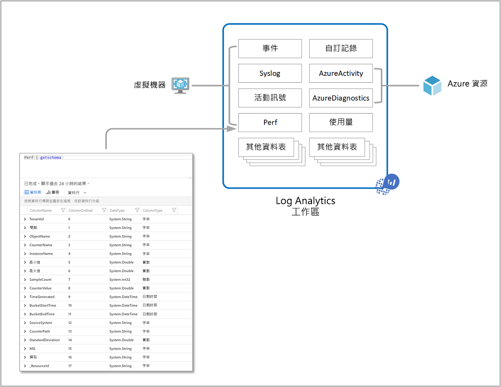
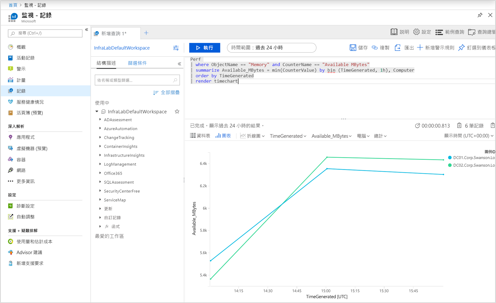
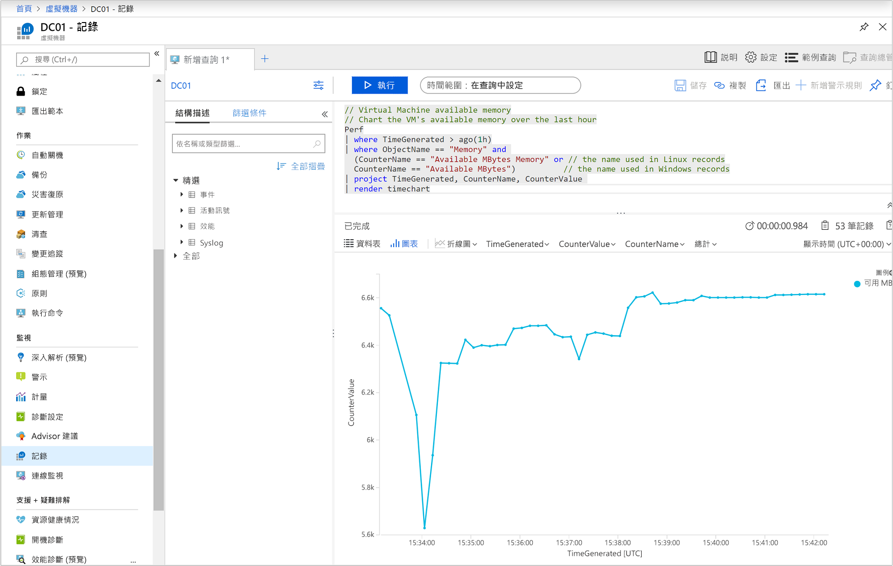
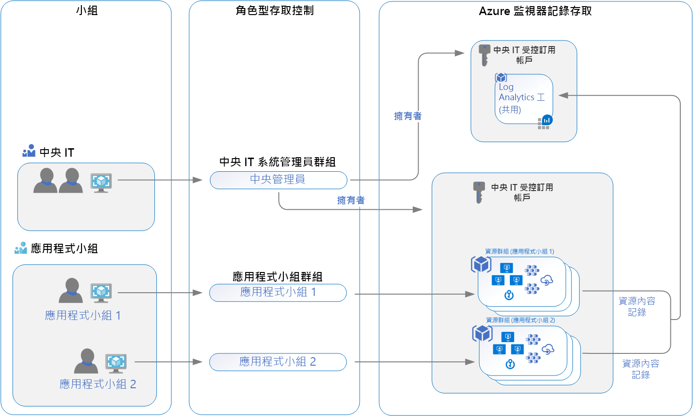

# <a name="designing-your-azure-monitor-logs-deployment"></a>設計 Azure 監視器日誌部署

Azure 監視器將[日誌](data-platform-logs.md)資料存儲在日誌分析工作區中，該工作區是 Azure 資源和容器，其中收集資料、聚合並用作管理邊界。 雖然您可以在 Azure 訂閱中部署一個或多個工作區，但您應該瞭解以下幾個注意事項，以確保初始部署遵循我們的準則，為您提供經濟高效、可管理且可擴展的部署，滿足組織的需求。

工作區中的資料被組織成表，每個表存儲不同類型的資料，並且基於生成資料的資源具有自己獨特的屬性集。 大多數資料來源都將寫入日誌分析工作區中的自己的表。



Log Analytics 工作區提供：

* 資料存儲的地理位置。
* 根據我們推薦的設計策略之一，通過授予不同的使用者存取權限來資料隔離。
* 設置（如[定價層](https://docs.microsoft.com/azure/azure-monitor/platform/manage-cost-storage#changing-pricing-tier)、[保留和](https://docs.microsoft.com/azure/azure-monitor/platform/manage-cost-storage#change-the-data-retention-period)[資料上限](https://docs.microsoft.com/azure/azure-monitor/platform/manage-cost-storage#manage-your-maximum-daily-data-volume)）的配置範圍。

本文詳細介紹了設計和遷移注意事項、存取控制概述以及我們對 IT 組織建議的設計實現的理解。


## <a name="important-considerations-for-an-access-control-strategy"></a>存取控制策略的重要注意事項

確定所需的工作區數受以下一個或多個要求的影響：

* 您是一家全球性公司，基於資料主權或合規性理由，您需要將記錄資料儲存在特定區域。
* 您使用 Azure，想要將工作區和它所管理的 Azure 資源放在相同區域中，以避免輸出資料傳輸費用。
* 您可以管理多個部門或業務組，並且希望每個部門查看自己的資料，而不是其他人的資料。 此外，對於合併的跨部門或業務組視圖，沒有業務需求。

如今，IT 組織採用集中式、分散式或兩種結構之間的混合模式進行建模。 因此，以下工作區部署模型通常用於映射到以下組織結構之一：

* **集中式**：所有日誌都存儲在中央工作區中，由單個團隊管理，Azure 監視器提供每個團隊的不同訪問。 在這種情況下，它很容易管理，跨資源搜索，和交叉關聯日誌。 工作區可以顯著增長，具體取決於從訂閱中的多個資源收集的資料量，並需要額外的管理開銷來維護對不同使用者的存取控制。 此模型稱為"集線器和分支"。
* **分散**：每個團隊都有自己自己擁有和管理的資源組中創建的工作區，並且日誌資料按資源隔離。 在這種情況下，工作區可以保持安全，存取控制與資源訪問一致，但很難交叉關聯日誌。 需要廣泛查看許多資源的使用者無法以有意義的方式分析資料。
* **混合**：安全審核合規性要求使此方案更加複雜，因為許多組織並行實現兩種部署模型。 這通常會導致配置複雜、昂貴且難以維護，日誌覆蓋率存在差距。

使用日誌分析代理收集資料時，您需要瞭解以下內容，以便規劃代理部署：

* 要從 Windows 代理收集資料，可以將[每個代理配置為向一個或多個工作區報告](../../azure-monitor/platform/agent-windows.md)，即使它向系統中心操作管理器管理組報告也是如此。 Windows 代理最多可以報告四個工作區。
* Linux 代理不支援多宿主，只能向單個工作區報告。

如果您使用的是系統中心操作管理器 2012 R2 或更高版本：

* 每個操作管理器管理組只能[連接到一個工作區](../platform/om-agents.md)。 
* 向管理組報告 Linux 電腦必須配置為直接報告到日誌分析工作區。 如果您的 Linux 電腦已直接報告到工作區，並且您希望使用操作管理器監視它們，請按照以下步驟[向操作管理器管理組報告](agent-manage.md#configure-agent-to-report-to-an-operations-manager-management-group)。 
* 您可以在 Windows 電腦上安裝日誌分析 Windows 代理，並使其向操作管理器報告與工作區和不同的工作區集成。

## <a name="access-control-overview"></a>存取控制概觀

使用基於角色的存取控制 （RBAC），您可以僅向使用者和組授予在工作區中處理監視資料所需的訪問量。 這允許您使用單個工作區與 IT 組織操作模型保持一致，以存儲在所有資源上啟用的收集的資料。 例如，向負責 Azure 虛擬機器 （VM） 上託管的基礎結構服務的團隊授予存取權限，因此他們只能訪問 VM 生成的日誌。 這是遵循我們新的資源上下文日誌模型。 此模型的基礎是 Azure 資源發出的每個日誌記錄，它會自動與此資源關聯。 日誌將轉發到一個中央工作區，該工作區尊重基於資源的範圍範圍和 RBAC。

使用者有權訪問的資料由下表中列出的多種因素組合決定。 每個部分都介紹在下面的章節中。

| 因數 | 描述 |
|:---|:---|
| [訪問模式](#access-mode) | 使用者用於訪問工作區的方法。  定義可用資料的範圍和應用的存取控制模式。 |
| [存取控制模式](#access-control-mode) | 在工作區上設置，以定義在工作區或資源級別應用許可權。 |
| [許可權](manage-access.md) | 應用於工作區或資源的個人或使用者組的許可權。 定義使用者有權訪問的資料。 |
| [表級 RBAC](manage-access.md#table-level-rbac) | 適用于所有使用者的可選細微性許可權，而不考慮其訪問模式或存取控制模式。 定義使用者可以訪問的資料類型。 |

## <a name="access-mode"></a>存取模式

*訪問模式*是指使用者訪問日誌分析工作區並定義他們可以訪問的資料範圍的方式。 

使用者有兩個訪問資料的選項：

* **工作區上下文**：您可以查看工作區中所有您有權使用的所有日誌。 此模式下的查詢範圍限定為工作區中的所有表中的所有資料。 這是使用工作區作為作用域訪問日誌時使用的訪問模式，例如從 Azure 門戶中的**Azure 監視器**功能表中選擇 **"日誌**"時。

    

* **資源上下文**：當您訪問特定資源、資源組或訂閱的工作區時（例如，當您從 Azure 門戶中的資源功能表中選擇 **"日誌"** 時，只能查看有權訪問的所有表中的資源的日誌。 此模式下的查詢範圍僅限於與該資源關聯的資料。 此模式還啟用精細 RBAC。

    

    > [!NOTE]
    > 僅當日志與相關資源正確關聯時，日誌才可用於資源上下文查詢。 目前，以下資源有限制：
    > - Azure 以外的電腦
    > - Service Fabric
    > - Application Insights
    >
    > 您可以通過執行查詢並檢查您感興趣的記錄來測試日誌是否與其資源正確關聯。 如果正確的資源識別碼 位於[_ResourceId](log-standard-properties.md#_resourceid)屬性中，則資料可用於以資源為中心的查詢。

Azure 監視器根據執行日誌搜索的上下文自動確定正確的模式。 範圍始終顯示在日誌分析的左上角部分。

### <a name="comparing-access-modes"></a>比較訪問模式

下表總結了訪問模式：

| | 工作區上下文 | 資源上下文 |
|:---|:---|:---|
| 每種型號面向誰？ | 中央行政管理。 需要配置資料收集的管理員和需要訪問各種資源的使用者。 需要訪問 Azure 外部資源的日誌的使用者當前也需要。 | 應用程式團隊。 正在監視的 Azure 資源的管理員。 |
| 使用者查看日誌需要什麼？ | 工作區的許可權。 請參閱[使用工作區版權管理存取權限](manage-access.md#manage-access-using-workspace-permissions)中的**工作區許可權**。 | 讀取對資源的存取權限。 請參閱[使用 Azure 版權管理訪問](manage-access.md#manage-access-using-azure-permissions)中的**資源許可權**。 可以繼承許可權（例如從包含的資源組）或直接分配給資源。 將自動分配對資源日誌的許可權。 |
| 許可權的範圍是什麼？ | 工作。 有權訪問工作區的使用者可以從具有許可權的表中查詢工作區中的所有日誌。 請參閱[表存取控制](manage-access.md#table-level-rbac) | Azure 資源。 使用者可以查詢日誌中的特定資源、資源組或訂閱，以便從任何工作區訪問，但不能查詢日誌以訪問其他資源。 |
| 使用者如何訪問日誌？ | <ul><li>從**Azure 監視器**功能表開始**日誌**。</li></ul> <ul><li>從**日誌分析工作區**開始**日誌**。</li></ul> <ul><li>從 Azure 監視器[活頁簿](../visualizations.md#workbooks)。</li></ul> | <ul><li>從 Azure 資源的功能表開始**日誌**</li></ul> <ul><li>從**Azure 監視器**功能表開始**日誌**。</li></ul> <ul><li>從**日誌分析工作區**開始**日誌**。</li></ul> <ul><li>從 Azure 監視器[活頁簿](../visualizations.md#workbooks)。</li></ul> |

## <a name="access-control-mode"></a>存取控制模式

*Access 控制模式*是每個工作區上的一個設置，用於定義如何確定工作區的許可權。

* **需要工作區許可權**：此控制模式不允許細微性 RBAC。 要訪問工作區，必須授予他們對工作區或特定表的許可權。

    如果使用者按照工作區上下文模式訪問工作區，則他們有權訪問已被授予存取權限的任何表中的所有資料。 如果使用者按照資源上下文模式訪問工作區，則他們只能訪問已被授予存取權限的任何表中該資源的資料。

    這是 2019 年 3 月之前創建的所有工作區的預設設置。

* **使用資源或工作區許可權**：此控制模式允許細微性 RBAC。 使用者只能訪問與其可以通過分配 Azure`read`許可權查看的資源關聯的資料。 

    當使用者在工作區上下文模式下訪問工作區時，將應用工作區許可權。 當使用者以資源上下文模式訪問工作區時，僅驗證資源許可權，並且忽略工作區許可權。 通過從工作區許可權中刪除使用者並允許識別其資源許可權，為使用者啟用 RBAC。

    這是 2019 年 3 月後創建的所有工作區的預設設置。

    > [!NOTE]
    > 如果使用者對工作區只有資源許可權，則他們只能使用資源上下文模式訪問工作區，前提是工作區訪問模式設置為 **"使用資源"或"工作區"許可權**。

要瞭解如何使用 PowerShell 或使用資源管理器範本更改門戶中的存取控制模式，請參閱[配置存取控制模式](manage-access.md#configure-access-control-mode)。

## <a name="ingestion-volume-rate-limit"></a>攝入體積速率限制

Azure 監視器是一種大規模的資料服務，服務對象為每月需傳送數 TB 資料 (且不斷成長) 的上千名客戶。 預設引入速率閾值設置為每個工作區**6 GB/min。** 這是一個近似值，因為實際大小可能因資料類型而異，具體取決於日誌長度及其壓縮率。 此限制不適用於從代理或[資料收集器 API](data-collector-api.md)發送的資料。

如果以較高速率將資料發送到單個工作區，則某些資料將被刪除，並且每隔 6 小時將事件發送到工作區中的 *"操作"* 表，同時繼續超過閾值。 如果您的引入量繼續超過速率限制，或者您希望很快達到它，您可以通過打開支援請求請求請求增加工作區。
 
要在工作區中此類事件收到通知，請使用以下查詢創建[日誌警報規則](alerts-log.md)，該查詢的警報邏輯基於結果數大於零。

``` Kusto
Operation
|where OperationCategory == "Ingestion"
|where Detail startswith "The rate of data crossed the threshold"
``` 


## <a name="recommendations"></a>建議



此方案涵蓋 IT 組織訂閱中的單個工作區設計，該設計不受資料主權或法規遵從性的限制，或者需要映射到資源部署在其中的區域。 它使組織安全和 IT 管理團隊能夠利用與 Azure 訪問管理和更安全的存取控制的改進集成。

所有資源、監視解決方案和見解（如 VM 的應用程式見解和 Azure 監視器、由不同團隊維護的支援基礎結構和應用程式）都配置為將其收集的日誌資料轉發給 IT 組織集中共用工作區。 每個團隊的使用者都被授予對已授予其存取權限的資源的日誌存取權限。

部署工作區體系結構後，可以使用[Azure 策略](../../governance/policy/overview.md)在 Azure 資源上強制實施此體系結構。 它提供了一種定義策略並確保符合 Azure 資源的方法，以便它們將其所有資源日誌發送到特定工作區。 例如，對於 Azure 虛擬機器或虛擬機器縮放集，可以使用評估工作區合規性和報告結果的現有策略，或者自訂以修復不符合。  

## <a name="workspace-consolidation-migration-strategy"></a>工作區整合遷移策略

對於已部署多個工作區並有興趣合併到資源上下文訪問模型的客戶，我們建議您採用增量方法遷移到建議的訪問模型，並且不要嘗試實現此目的快速或積極。 遵循分階段方法按照合理的時程表進行規劃、遷移、驗證和停用，將有助於避免任何計畫外事件或對雲操作的意外影響。 如果出於合規性或業務原因沒有資料保留原則，則需要評估在過程中從工作區中保留資料的適當時間長度。 在重新配置資源以向共用工作區報告時，您仍可以根據需要分析原始工作區中的資料。 遷移完成後，如果受控制在保留期結束前保留原始工作區中的資料，請不要將其刪除。

在規劃遷移到此模型時，請考慮以下事項：

* 瞭解您必須遵守的行業法規和內部政策，以遵守哪些行業法規和內部政策。
* 確保應用程式團隊可以在現有資源上下文功能中工作。
* 確定為應用程式團隊授予的資源存取權限，並在開發環境中進行測試，然後再在生產中實現。
* 將工作區配置為啟用 **"使用資源"或"工作區"許可權**。
* 刪除應用程式團隊讀取和查詢工作區的許可權。
* 啟用和配置在原始工作區中部署的任何監視解決方案、見解（如容器的 Azure 監視器和/或 VM 的 Azure 監視器）、自動化帳戶和管理解決方案（如更新管理、啟動/停止 VM 等）。

## <a name="next-steps"></a>後續步驟

要實現本指南中建議的安全許可權和控制，請查看[管理對日誌的訪問](manage-access.md)。
