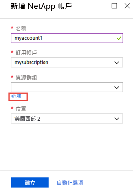
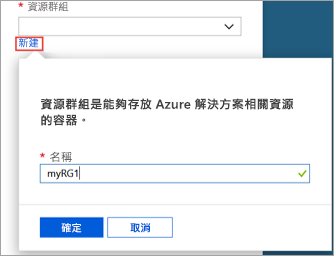
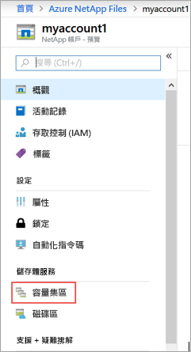
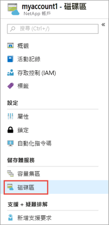
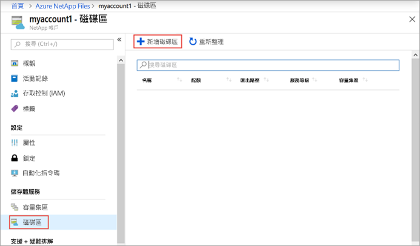
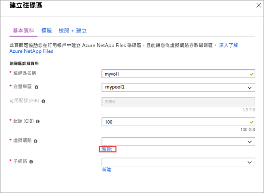
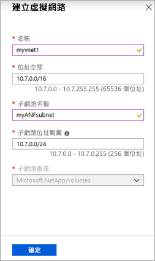
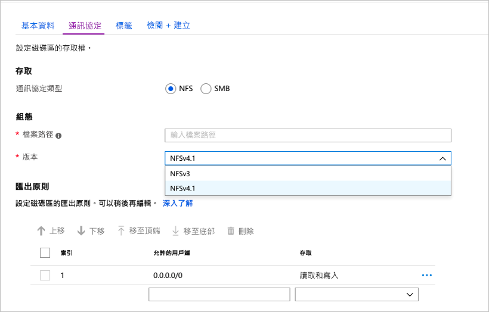
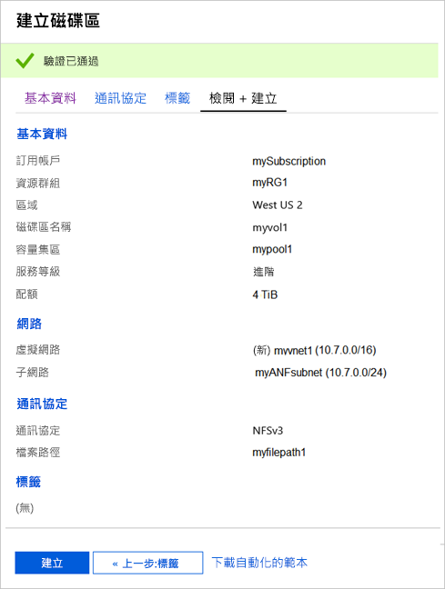
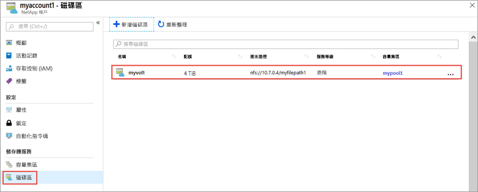

# <a name="quickstart-set-up-azure-netapp-files-and-create-an-nfs-volume"></a>快速入門：設定 Azure NetApp Files 並建立 NFS 磁碟區 

本文將示範如何快速設定 Azure NetApp Files 並建立磁碟區。 

在本快速入門中，您會設定下列項目：

- 註冊 Azure NetApp Files 和 NetApp 資源提供者
- 一個 NetApp 帳戶
- 一個容量集區
- 一個適用於 Azure NetApp Files 的 NFS 磁碟區

如果您沒有 Azure 訂用帳戶，請在開始前建立[免費帳戶](https://azure.microsoft.com/free/?WT.mc_id=A261C142F)。

## <a name="before-you-begin"></a>開始之前 

> [!IMPORTANT] 
> 您必須具備 Azure NetApp Files 服務的存取權。  若要要求服務的存取權，請參閱 [Azure NetApp 檔案等候清單提交頁面](https://aka.ms/azurenetappfiles) \(英文\)。  您必須等候 Azure NetApp Files 團隊發出官方確認電子郵件，然後再繼續。 

[!INCLUDE [cloud-shell-try-it.md](../../includes/cloud-shell-try-it.md)]

---

## <a name="register-for-azure-netapp-files-and-netapp-resource-provider"></a>註冊 Azure NetApp Files 和 NetApp 資源提供者

> [!NOTE]
> 註冊程序可能需要一些時間才能完成。
>

# <a name="portal"></a>[入口網站](#tab/azure-portal)

如需使用入口網站的註冊步驟，請如上所示開啟 Cloud Shell 工作階段，並遵循下列 Azure CLI 步驟：

[!INCLUDE [azure-netapp-files-cloudshell-include](../../includes/azure-netapp-files-azure-cloud-shell-window.md)]

# <a name="powershell"></a>[PowerShell](#tab/azure-powershell)

本操作說明文章需要 Azure PowerShell 模組 Az 2.6.0 版或更新版本。 執行 `Get-Module -ListAvailable Az` 來尋找您目前的版本。 如果您需要安裝或升級，請參閱[安裝 Azure PowerShell 模組](/powershell/azure/install-Az-ps)。 如果您想要，也可以改為在 PowerShell 工作階段中使用 Cloud Shell 主控台。

1. 在 PowerShell 命令提示字元 (或 PowerShell Cloud Shell 工作階段) 中，指定 Azure NetApp Files 已核准的訂用帳戶：
    ```powershell-interactive
    Select-AzSubscription -Subscription <subscriptionId>
    ```

2. 註冊 Azure 資源提供者：
    ```powershell-interactive
    Register-AzResourceProvider -ProviderNamespace Microsoft.NetApp
    ```

# <a name="azure-cli"></a>[Azure CLI](#tab/azure-cli)

[!INCLUDE [azure-netapp-files-cloudshell-include](../../includes/azure-netapp-files-azure-cloud-shell-window.md)]

# <a name="template"></a>[範本](#tab/template)

無。  

使用 Azure 入口網站、PowerShell 或 Azure CLI 來註冊 Azure NetApp Files 和 NetApp 資源提供者。  

如需詳細資訊，請參閱[註冊 Azure NetApp Files](azure-netapp-files-register.md)。 

---

## <a name="create-a-netapp-account"></a>建立 NetApp 帳戶

# <a name="portal"></a>[入口網站](#tab/azure-portal)

1. 在 Azure 入口網站的搜尋方塊中，輸入 **Azure NetApp Files**，然後從顯示的清單中選取 [Azure NetApp Files]  。

      

2. 按一下 [+ 新增]  以建立新的 NetApp 帳戶。

     

3. 在 [新增 NetApp 帳戶] 視窗中，提供下列資訊： 
   1. 輸入 **myaccount1** 作為帳戶名稱。 
   2. 選取您的訂用帳戶。
   3. 選取 [新建]  來建立新的資源群組。 輸入 **myRG1** 作為資源群組名稱。 按一下 [確定]  。 
   4. 選取您的帳戶位置。  

        

      

4. 按一下 [建立]  以建立新的 NetApp 帳戶。

# <a name="powershell"></a>[PowerShell](#tab/azure-powershell)

1. 定義一些變數，以便我們在其餘的範例中予以參考：

    ```powershell-interactive
    $resourceGroup = "myRG1"
    $location = "eastus"
    $anfAccountName = "myaccount1"
    ``` 

    > [!NOTE]
    > 如需支援的區域清單，請參閱[各區域提供的產品](https://azure.microsoft.com/global-infrastructure/services/?products=netapp&regions=all)。
    > 若要取得命令列工具所支援的區域名稱，請使用 `Get-AzLocation | select Location`
    >

1. 使用 [New-AzResourceGroup](/powershell/module/az.resources/new-azresourcegroup) 命令建立新的資源群組：

    ```powershell-interactive
    New-AzResourceGroup -Name $resourceGroup -Location $location
    ```

2. 使用 [New-AzNetAppFilesAccount](/powershell/module/az.netappfiles/New-AzNetAppFilesAccount) 命令建立 Azure NetApp Files 帳戶：
   
    ```powershell-interactive
    New-AzNetAppFilesAccount -ResourceGroupName $resourceGroup -Location $location -Name $anfAccountName
    ```

# <a name="azure-cli"></a>[Azure CLI](#tab/azure-cli)

1. 定義一些變數，以便我們在其餘的範例中予以參考：

    ```azurecli-interactive
    RESOURCE_GROUP="myRG1"
    LOCATION="eastus"
    ANF_ACCOUNT_NAME="myaccount1"
    ``` 

    > [!NOTE]
    > 如需支援的區域清單，請參閱[各區域提供的產品](https://azure.microsoft.com/global-infrastructure/services/?products=netapp&regions=all)。
    > 若要取得命令列工具所支援的區域名稱，請使用 `az account list-locations --query "[].{Region:name}" --out table`
    >

2. 使用 [az group create](/cli/azure/group#az-group-create) 命令來建立新資源群組：

    ```azurecli-interactive
    az group create \
        --name $RESOURCE_GROUP \
        --location $LOCATION
    ```

3. 使用 [az netappfiles account create](/cli/azure/netappfiles/account#az-netappfiles-account-create) 命令建立 Azure NetApp Files 帳戶：
   
    ```azurecli-interactive
    az netappfiles account create \
        --resource-group $RESOURCE_GROUP \
        --location $LOCATION \
        --account-name $ANF_ACCOUNT_NAME
    ```

# <a name="template"></a>[範本](#tab/template)

[!INCLUDE [About Azure Resource Manager](../../includes/resource-manager-quickstart-introduction.md)]

下列程式碼片段示範如何使用 [Microsoft.NetApp/netAppAccounts](/azure/templates/microsoft.netapp/netappaccounts) 資源，在 Azure Resource Manager 範本 (ARM 範本) 中建立 NetApp 帳戶。 若要執行程式碼，請從我們的 GitHub 存放庫下載[完整 ARM 範本](https://github.com/Azure/azure-quickstart-templates/blob/master/101-anf-nfs-volume/azuredeploy.json)。

:::code language="json" source="~/quickstart-templates/101-anf-nfs-volume/azuredeploy.json" range="177-183":::

<!-- Block begins with "type": "Microsoft.NetApp/netAppAccounts", -->

---

## <a name="set-up-a-capacity-pool"></a>設定容量集區

# <a name="portal"></a>[入口網站](#tab/azure-portal)

1. 從 Azure NetApp Files 管理刀鋒視窗中，選取您的 NetApp 帳戶 (**myaccount1**)。

      

2. 從您 NetApp 帳戶的 Azure NetApp Files 管理刀鋒視窗中，按一下 [容量集區]  。

      

3. 按一下 [+ 新增集區]  。 

      

4. 提供容量集區的資訊： 
    * 請輸入 **mypool1** 作為集區名稱。
    * 選取 [進階]  作為服務等級。 
    * 指定 **4 (TiB)** 作為集區大小。 
    * 使用 [自動] QoS 類型。

5. 按一下 [建立]。

# <a name="powershell"></a>[PowerShell](#tab/azure-powershell)

1. 定義一些新變數以供日後參考

    ```powershell-interactive
    $poolName = "mypool1"
    $poolSizeBytes = 4398046511104 # 4TiB
    $serviceLevel = "Premium" # Valid values are Standard, Premium and Ultra
    ```

1. 使用 [New-AzNetAppFilesPool](/powershell/module/az.netappfiles/new-aznetappfilespool) 建立新的容量集區

    ```powershell-interactive
    New-AzNetAppFilesPool -ResourceGroupName $resourceGroup -Location $location -AccountName $anfAccountName -Name $poolName -PoolSize $poolSizeBytes -ServiceLevel $serviceLevel
    ```

# <a name="azure-cli"></a>[Azure CLI](#tab/azure-cli)

1. 定義一些新變數以供日後參考

    ```azurecli-interactive
    POOL_NAME="mypool1"
    POOL_SIZE_TiB=4 # Size in Azure CLI needs to be in TiB unit (minimum 4 TiB)
    SERVICE_LEVEL="Premium" # Valid values are Standard, Premium and Ultra
    ```

2. 使用 [az netappfiles pool create](/cli/azure/netappfiles/pool#az-netappfiles-pool-create) 建立新的容量集區 

    ```azurecli-interactive
    az netappfiles pool create \
        --resource-group $RESOURCE_GROUP \
        --location $LOCATION \
        --account-name $ANF_ACCOUNT_NAME \
        --pool-name $POOL_NAME \
        --size $POOL_SIZE_TiB \
        --service-level $SERVICE_LEVEL
    ```

# <a name="template"></a>[範本](#tab/template)

<!-- [!INCLUDE [About Azure Resource Manager](../../includes/resource-manager-quickstart-introduction.md)] -->

下列程式碼片段示範如何使用 [Microsoft.NetApp/netAppAccounts/capacityPools](/azure/templates/microsoft.netapp/netappaccounts/capacitypools) 資源，在 Azure Resource Manager 範本 (ARM 範本) 中建立集區。 若要執行程式碼，請從我們的 GitHub 存放庫下載[完整 ARM 範本](https://github.com/Azure/azure-quickstart-templates/blob/master/101-anf-nfs-volume/azuredeploy.json)。

:::code language="json" source="~/quickstart-templates/101-anf-nfs-volume/azuredeploy.json" range="184-196":::

<!-- LN 185, block begins with  "type": "Microsoft.NetApp/netAppAccounts/capacityPools", -->

---

## <a name="create-nfs-volume-for-azure-netapp-files"></a>建立適用於 Azure NetApp Files 的 NFS 磁碟區

# <a name="portal"></a>[入口網站](#tab/azure-portal)

1. 從您 NetApp 帳戶的 Azure NetApp Files 管理刀鋒視窗中，按一下 [磁碟區]  。

      

2. 按一下 [+ 新增磁碟區]  。

      

3. 在 [建立磁碟區] 視窗中，提供磁碟區的資訊： 
   1. 輸入 **myvol1** 作為磁碟區名稱。 
   2. 選取您的容量集區 (**mypool1**)。
   3. 針對配額，請使用預設值。 
   4. 在 [虛擬網路] 下，按一下 [新建]  來建立新的 Azure 虛擬網路 (Vnet)。  然後填寫下列資訊︰
       * 輸入 **myvnet1** 作為 Vnet 名稱。
       * 針對您的設定來指定位址空間，例如 10.7.0.0/16
       * 輸入 **myANFsubnet** 作為子網路名稱。
       * 指定子網路位址範圍，例如 10.7.0.0/24。 您無法與其他資源共用專用子網路。
       * 針對子網路委派，請選取 [Microsoft.NetApp/磁碟區]  。
       * 按一下 [確定]  以建立 Vnet。
   5. 在子網路中，選取新建立的 Vnet (**myvnet1**) 作為委派子網路。

        

        

4. 按一下 [通訊協定]  ，然後完成下列動作： 
    * 選取 [NFS]  作為磁碟區的通訊協定類型。  
    * 輸入 **myfilepath1**，作為用來建立磁碟區匯出路徑的檔案路徑。  
    * 選取磁碟區的 NFS 版本 (**NFSv3** 或 **NFSv4.1**)。  
      請參閱有關 NFS 版本的[考量](azure-netapp-files-create-volumes.md#considerations)和[最佳做法](azure-netapp-files-create-volumes.md#best-practice)。 
      
  

5. 按一下 [檢閱 + 建立]  。

      

6. 檢閱磁碟區的資訊，然後按一下 [建立]  。  
    建立的磁碟區會出現在 [磁碟區] 刀鋒視窗中。

      

# <a name="powershell"></a>[PowerShell](#tab/azure-powershell)

1. 使用 [New-AzDelegation](/powershell/module/az.network/new-azdelegation) 命令建立 "Microsoft.NetApp/volumes" 的子網路委派。

    ```powershell-interactive
    $anfDelegation = New-AzDelegation -Name ([guid]::NewGuid().Guid) -ServiceName "Microsoft.NetApp/volumes"
    ```

2. 使用 [New-AzVirtualNetworkSubnetConfig](/powershell/module/az.network/new-azvirtualnetworksubnetconfig) 命令建立子網路組態。

    ```powershell-interactive
    $subnet = New-AzVirtualNetworkSubnetConfig -Name "myANFSubnet" -AddressPrefix "10.7.0.0/24" -Delegation $anfDelegation
    ```

3. 使用 [New-AzVirtualNetwork](/powershell/module/az.network/new-azvirtualnetwork) 命令建立虛擬網路。
    
    ```powershell-interactive
    $vnet = New-AzVirtualNetwork -Name "myvnet1" -ResourceGroupName $resourceGroup -Location $location -AddressPrefix "10.7.0.0/16" -Subnet $subnet
    ```

4. 使用 [New-AzNetAppFilesVolume](/powershell/module/az.netappfiles/new-aznetappfilesvolume) 命令建立磁碟區。
   
    ```powershell-interactive
    $volumeSizeBytes = 1099511627776 # 100GiB
    $subnetId = $vnet.Subnets[0].Id

    New-AzNetAppFilesVolume -ResourceGroupName $resourceGroup `
        -Location $location `
        -AccountName $anfAccountName `
        -PoolName $poolName `
        -Name "myvol1" `
        -UsageThreshold $volumeSizeBytes `
        -SubnetId $subnetId `
        -CreationToken "myfilepath1" `
        -ServiceLevel $serviceLevel `
        -ProtocolType NFSv3
    ```

# <a name="azure-cli"></a>[Azure CLI](#tab/azure-cli)

1. 定義一些變數以供稍後使用。
    
    ```azurecli-interactive
    VNET_NAME="myvnet1"
    SUBNET_NAME="myANFSubnet"
    ```

1. 使用 [az network vnet create](/cli/azure/network/vnet#az-network-vnet-create) 命令建立虛擬網路 (不含子網路)。
    
    ```azurecli-interactive
    az network vnet create \
        --resource-group $RESOURCE_GROUP \
        --name $VNET_NAME \
        --location $LOCATION \
        --address-prefix "10.7.0.0/16"

    ```

2. 使用 [az network vnet subnet create](/cli/azure/network/vnet/subnet#az-network-vnet-subnet-create) 命令建立委派的子網路。

    ```azurecli-interactive
    az network vnet subnet create \
        --resource-group $RESOURCE_GROUP \
        --vnet-name $VNET_NAME \
        --name $SUBNET_NAME \
        --address-prefixes "10.7.0.0/24" \
        --delegations "Microsoft.NetApp/volumes"
    ```

3. 使用 [az netappfiles volume create](/cli/azure/netappfiles/volume#az-netappfiles-volume-create) 命令建立磁碟區。
   
    ```azurecli-interactive
    VNET_ID=$(az network vnet show --resource-group $RESOURCE_GROUP --name $VNET_NAME --query "id" -o tsv)
    SUBNET_ID=$(az network vnet subnet show --resource-group $RESOURCE_GROUP --vnet-name $VNET_NAME --name $SUBNET_NAME --query "id" -o tsv)
    VOLUME_SIZE_GiB=100 # 100 GiB
    UNIQUE_FILE_PATH="myfilepath2" # Please note that creation token needs to be unique within subscription and region

    az netappfiles volume create \
        --resource-group $RESOURCE_GROUP \
        --location $LOCATION \
        --account-name $ANF_ACCOUNT_NAME \
        --pool-name $POOL_NAME \
        --name "myvol1" \
        --service-level $SERVICE_LEVEL \
        --vnet $VNET_ID \
        --subnet $SUBNET_ID \
        --usage-threshold $VOLUME_SIZE_GiB \
        --file-path $UNIQUE_FILE_PATH \
        --protocol-types "NFSv3"
    ```

# <a name="template"></a>[範本](#tab/template)

<!-- [!INCLUDE [About Azure Resource Manager](../../includes/resource-manager-quickstart-introduction.md)] --> 

下列程式碼片段示範如何在 Azure Resource Manager 範本 (ARM 範本) 中設定 VNet 並建立 Azure NetApp Files 磁碟區。 設定 VNet 時會使用 [Microsoft.Network/virtualNetworks](/azure/templates/Microsoft.Network/virtualNetworks) 的資源。 建立磁碟區時會使用 [Microsoft.NetApp/netAppAccounts/capacityPools/volumes](/azure/templates/microsoft.netapp/netappaccounts/capacitypools/volumes) 資源。 若要執行程式碼，請從我們的 GitHub 存放庫下載[完整 ARM 範本](https://github.com/Azure/azure-quickstart-templates/blob/master/101-anf-nfs-volume/azuredeploy.json)。

:::code language="json" source="~/quickstart-templates/101-anf-nfs-volume/azuredeploy.json" range="148-176":::

<!-- Block begins with  "type": "Microsoft.Network/virtualNetworks", -->

:::code language="json" source="~/quickstart-templates/101-anf-nfs-volume/azuredeploy.json" range="197-229":::

<!-- Block begins with  "type": "Microsoft.NetApp/netAppAccounts/capacityPools/volumes", -->

---

## <a name="clean-up-resources"></a>清除資源

# <a name="portal"></a>[入口網站](#tab/azure-portal)

完成之後可以選擇刪除資源群組。 刪除資源群組是無法回復的動作。  

> [!IMPORTANT]
> 資源群組內的所有資源都將永久刪除且無法復原。 

1. 在 Azure 入口網站的搜尋方塊中，輸入 **Azure NetApp Files**，然後從顯示的清單中選取 [Azure NetApp Files]  。

2. 在訂用帳戶清單中，按一下您想要刪除的資源群組 (myRG1)。 

    


3. 在 [資源群組] 頁面中，按一下 [刪除資源群組]  。

    ![反白顯示 [刪除資源群組] 按鈕的螢幕擷取畫面。](../media/azure-netapp-files/azure-netapp-files-azure-delete-resource-group.png) 

    隨即開啟一個視窗，其中顯示有關資源將會與資源群組一起刪除的警告。

4. 輸入資源群組名稱 (myRG1) 以確認您想要永久刪除該資源群組和所有資源，然後按一下 [刪除]  。

     

# <a name="powershell"></a>[PowerShell](#tab/azure-powershell)

完成之後可以選擇刪除資源群組。 刪除資源群組是無法回復的動作。  

> [!IMPORTANT]
> 資源群組內的所有資源都將永久刪除且無法復原。

1. 使用 [Remove-AzResourceGroup](/powershell/module/az.resources/remove-azresourcegroup) 命令刪除資源群組。
   
    ```powershell-interactive
    Remove-AzResourceGroup -Name $resourceGroup
    ```

# <a name="azure-cli"></a>[Azure CLI](#tab/azure-cli)

完成之後可以選擇刪除資源群組。 刪除資源群組是無法回復的動作。  

> [!IMPORTANT]
> 資源群組內的所有資源都將永久刪除且無法復原。

1. 使用 [az group delete](/cli/azure/group#az-group-delete) 命令刪除資源群組。
   
    ```azurecli-interactive
    az group delete \
        --name $RESOURCE_GROUP
    ```

# <a name="template"></a>[範本](#tab/template)

無。

使用 Azure 入口網站、PowerShell 或 Azure CLI 來刪除資源群組。   

---

## <a name="next-steps"></a>後續步驟  

> [!div class="nextstepaction"]
> [Azure NetApp Files 的儲存體階層](azure-netapp-files-understand-storage-hierarchy.md)   
> [Azure NetApp Files 的服務等級](azure-netapp-files-service-levels.md)   
> [建立 NFS 磁碟區](azure-netapp-files-create-volumes.md)