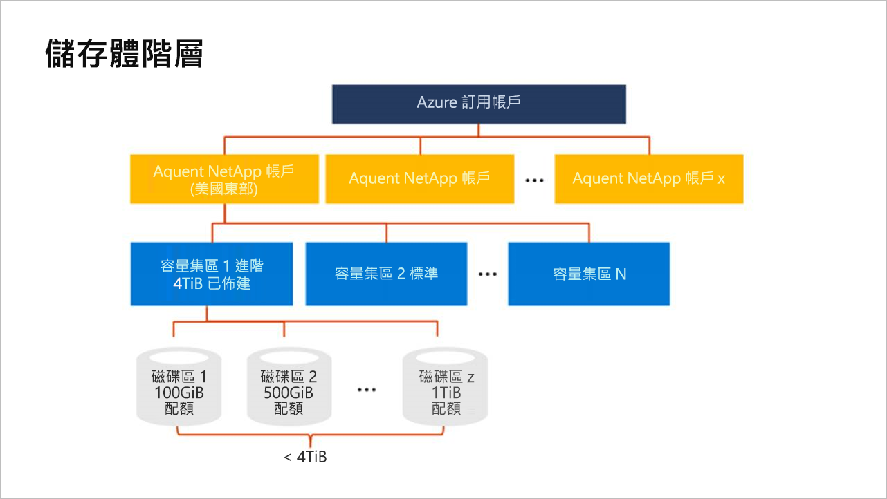

# Azure NetApp Files 的儲存體階層

在 Azure NetApp Files 中建立磁碟區之前，您必須先購買及設定佈建容量的集區。  若要設定容量集區，您必須具有 NetApp 帳戶。 了解儲存體階層有助於設定和管理您的 Azure NetApp Files 資源。

> [!IMPORTANT] 
> Azure NetApp Files 目前不支援訂用帳戶之間的資源移轉。

## NetApp 帳戶

- NetApp 帳戶可充當組成容量集區的系統管理群組。  
- NetApp 帳戶與一般 Azure 儲存體帳戶不同。 
- NetApp 帳戶的範圍具有區域性。   
- 您在一個區域中可以有多個 NetApp 帳戶，但是每個 NetApp 帳戶都只繫結至單一區域。

## 容量集區

了解容量集區的運作方式可協助您針對儲存體需求選取正確的容量集區類型。 

### 容量集區的一般規則

- 容量集區是依據其佈建容量進行測量。   
    如需其他資訊，請參閱 [QoS類型](#qos_types)。  
- 容量是以您購買的固定 SKU (例如 4-TiB 容量) 進行佈建。
- 容量集區只能有一個服務等級。  
- 每個容量集區都只能屬於一個 NetApp 帳戶。 不過，您的 NetApp 帳戶內可以有多個容量集區。  
- 容量集區不能跨越 NetApp 帳戶移動。   
  例如，在下方[儲存體階層的概念圖表](#conceptual_diagram_of_storage_hierarchy)中，容量集區 1 無法從美國東部 NetApp 帳戶移至美國西部 2 NetApp 帳戶。  
- 必須先刪除容量集區內的所有磁碟區之後，才能刪除容量集區。

### 容量集區的服務品質 (QoS) 類型

QoS 類型是容量集區的屬性。 Azure NetApp Files 提供兩種 QoS 類型的容量集區。 

- *自動* QoS 類型  

    當您建立容量集區時，預設的 QoS 類型為 [自動]。

    在自動 QoS 容量集區中，輸送量會自動指派給集區中的磁碟區，並與指派給磁碟區的大小配額成正比。 

    配置給磁碟區的最大輸送量取決於容量集區的服務層級和磁碟區的大小配額。 如需計算範例，請參閱 [Azure NetApp Files 的服務等級](azure-netapp-files-service-levels.md)。

- *手動* QoS 類型  

     > [!IMPORTANT] 
     > 將手動 QoS 類型用於容量集區需要註冊。  請參閱[管理手動 QoS 容量集區](manage-manual-qos-capacity-pool.md)。  

    您可以選擇將手動 QoS 類型用於容量集區。

    在手動 QoS 容量集區中，您可以個別指派磁碟區的容量和輸送量。 以手動 QoS 容量集區建立的所有磁碟區輸送量總計，受限於集區的輸送量總計。  這是由集區大小和服務層級輸送量的組合所決定。 

    例如，具有 Ultra 服務等級的 4 TiB 容量集區，其輸送量容量總計為 512 MiB/秒 (4 TiB x 128 MiB/s/TiB)，可供磁碟區使用。

## 磁碟區

- 磁碟區會依據邏輯容量耗用量進行測量，且可以調整。 
- 磁碟區的容量耗用量是根據其集區的佈建容量進行計算。
- 磁碟區的輸送量耗用量會根據其集區的可用輸送量進行計算。 請參閱[手動 QoS 類型](#manual_qos_type)。
- 每個磁碟區都只屬於一個集區，但是一個集區可以包含多個磁碟區。 

## 儲存體階層的概念圖表 
下列範例顯示 Azure 訂用帳戶、NetApp 帳戶、容量集區和磁碟區之間的關係。   

## 後續步驟

- [Azure NetApp Files 的資源限制](azure-netapp-files-resource-limits.md)
- [註冊 Azure NetApp Files](azure-netapp-files-register.md)
- [Azure NetApp Files 的服務等級](azure-netapp-files-service-levels.md)
- [適用於 Azure NetApp Files 的效能考量](azure-netapp-files-performance-considerations.md)
- [設定容量集區](azure-netapp-files-set-up-capacity-pool.md)
- [管理手動 QoS 容量集區](manage-manual-qos-capacity-pool.md)
