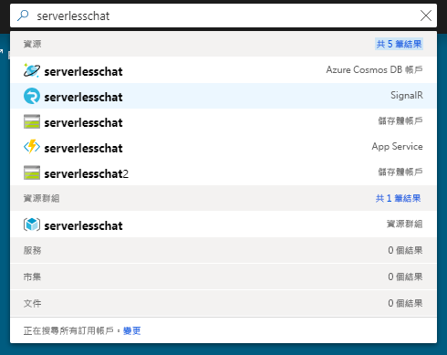
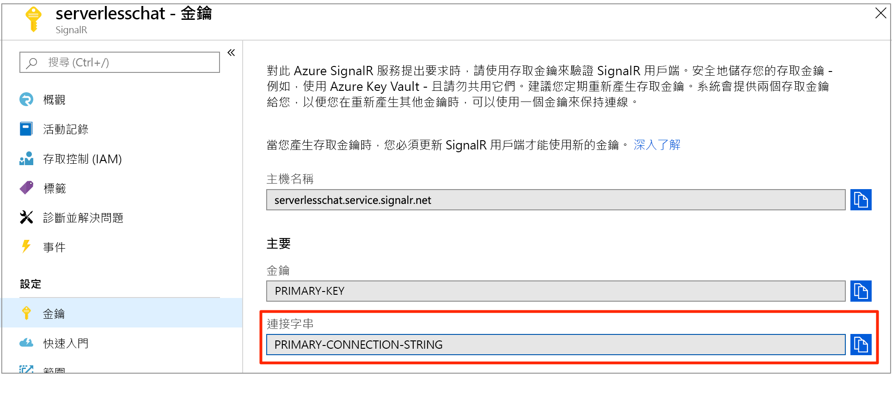

# <a name="quickstart-create-a-chat-room-with-azure-functions-and-signalr-service-using-python"></a>快速入門：使用 Python 搭配 Azure Functions 與 SignalR Service 來建立聊天室

Azure SignalR 服務可讓您輕鬆地新增即時功能到您的應用程式。 Azure Functions 是無伺服器平台，可讓您在不需要管理任何基礎結構的情況下執行您的程式碼。 在此快速入門中，了解如何使用 SignalR 服務與 Functions 來建置無伺服器的即時聊天應用程式。

## <a name="prerequisites"></a>Prerequisites

此快速入門可以在 macOS、Windows 或 Linux 上執行。

請確定您已安裝程式碼編輯器，如 [Visual Studio Code](https://code.visualstudio.com/) \(英文\)。

安裝 [Azure Functions Core Tools](https://github.com/Azure/azure-functions-core-tools#installing) (2.7.1505 版或更新版本)，以在本機執行 Python Azure Function 應用程式。

Azure Functions 需要 [Python 3.6 或 3.7](https://www.python.org/downloads/)。

[!INCLUDE [quickstarts-free-trial-note](../../includes/quickstarts-free-trial-note.md)]

## <a name="log-in-to-azure"></a>登入 Azure

使用您的 Azure 帳戶登入 Azure 入口網站 (<https://portal.azure.com/>)。

[!INCLUDE [Create instance](includes/signalr-quickstart-create-instance.md)]

[!INCLUDE [Clone application](includes/signalr-quickstart-clone-application.md)]

## <a name="configure-and-run-the-azure-function-app"></a>設定及執行 Azure Function 應用程式

1. 在開啟 Azure 入口網站的瀏覽器中，透過在入口網站頂端的搜尋方塊中搜尋您稍早部署的 SignalR 服務執行個體名稱，以確認該執行個體已成功建立。 選取該執行個體以開啟它。

    

1. 選取 [金鑰]  以檢視 SignalR 服務執行個體的連接字串。

1. 選取並複製主要連接字串。

    

1. 在您的程式碼編輯器中，開啟複製的存放庫中包含的 *src/chat/python* 資料夾。

1. 若要在本機開發及測試 Python 函式，您必須在 Python 3.6 或 3.7 環境中工作。 執行下列命令來建立並啟用名為 `.venv` 的虛擬環境。

    **Linux 或 macOS：**

    ```bash
    python3.7 -m venv .venv
    source .venv/bin/activate
    ```

    **Windows：**

    ```powershell
    py -3.7 -m venv .venv
    .venv\scripts\activate
    ```

1. 將 *local.settings.sample.json* 重新命名為 *local.settings.json*。

1. 在 **local.settings.json** 中，將連接字串貼到 **AzureSignalRConnectionString** 設定的值中。 儲存檔案。

1. Python 函式會組織成資料夾。 每個資料夾中會有兩個檔案：*function.json* 會定義函式中使用的繫結， *\_\_init\_\_.py* 則是函式的主體。 此函式應用程式中有兩個 HTTP 觸發的函式：

    - **negotiate** - 使用 *SignalRConnectionInfo* 輸入繫結來產生並傳回有效的連線資訊。
    - **messages** - 在要求主體中接收聊天訊息，並使用 *SignalR* 輸出繫結來將訊息廣播給所有已連線的用戶端應用程式。

1. 在已啟用虛擬環境的終端機中，確定您位於 *src/chat/python* 資料夾中。 使用 PIP 安裝必要的 Python 套件。

    ```bash
    python -m pip install -r requirements.txt
    ```

1. 執行函式應用程式。

    ```bash
    func start
    ```

    

[!INCLUDE [Run web application](includes/signalr-quickstart-run-web-application.md)]

[!INCLUDE [Cleanup](includes/signalr-quickstart-cleanup.md)]

## <a name="next-steps"></a>後續步驟

在此快速入門中，您已在 VS Code 中建置並執行即時無伺服器應用程式。 接著，您將了解入和從 VS Code 部署 Azure Functions。

> [!div class="nextstepaction"]
> [使用 VS Code 部署 Azure Functions](/azure/developer/javascript/tutorial-vscode-serverless-node-01)
