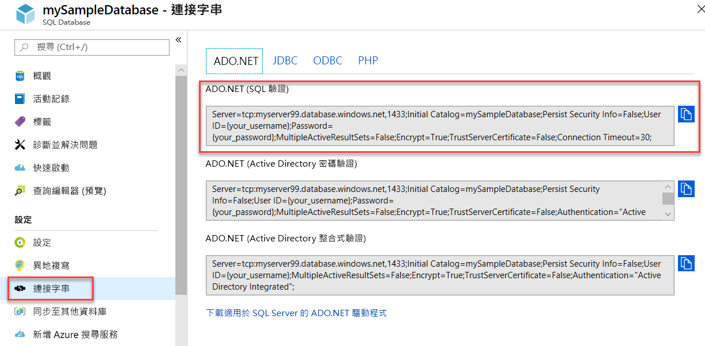

# <a name="quickstart-use-net-core-c-to-query-a-database-in-azure-sql-database-or-azure-sql-managed-instance"></a>快速入門：使用 .NET Core (C#) 查詢 Azure SQL Database 中的資料庫或 Azure SQL 受控執行個體
[!INCLUDE[appliesto-sqldb-sqlmi](../includes/appliesto-sqldb-sqlmi.md)]

在本快速入門中，您將使用 [.NET Core](https://www.microsoft.com/net/) 和 C# 程式碼來連線到資料庫。 然後，您將使用 Transact-SQL 陳述式來查詢資料。

> [!TIP]
> 下列 Microsoft Learn 課程模組可協助您免費學習如何[開發和設定可查詢 Azure SQL Database 中資料庫的 ASP.NET 應用程式](/learn/modules/develop-app-that-queries-azure-sql/)

## <a name="prerequisites"></a>必要條件

若要完成本快速入門，您需要：

- 具有有效訂用帳戶的 Azure 帳戶。 [免費建立帳戶](https://azure.microsoft.com/free/?ref=microsoft.com&utm_source=microsoft.com&utm_medium=docs&utm_campaign=visualstudio)。
- 資料庫。 您可以使用其中一個快速入門，以建立資料庫並加以設定：

  | 動作 | SQL Database | SQL 受控執行個體 | Azure VM 上的 SQL Server |
  |:--- |:--- |:---|:---|
  | 建立| [入口網站](single-database-create-quickstart.md) | [入口網站](../managed-instance/instance-create-quickstart.md) | [入口網站](../virtual-machines/windows/sql-vm-create-portal-quickstart.md)
  || [CLI](scripts/create-and-configure-database-cli.md) | [CLI](https://medium.com/azure-sqldb-managed-instance/working-with-sql-managed-instance-using-azure-cli-611795fe0b44) |
  || [PowerShell](scripts/create-and-configure-database-powershell.md) | [PowerShell](../managed-instance/scripts/create-configure-managed-instance-powershell.md) | [PowerShell](../virtual-machines/windows/sql-vm-create-powershell-quickstart.md)
  | 設定 | [伺服器層級 IP 防火牆規則](firewall-create-server-level-portal-quickstart.md)| [VM 的連線能力](../managed-instance/connect-vm-instance-configure.md)|
  |||[來自內部部署的連線](../managed-instance/point-to-site-p2s-configure.md) | [連線到 SQL Server 執行個體](../virtual-machines/windows/sql-vm-create-portal-quickstart.md)
  |載入資料|每個快速入門載入的 Adventure Works|[還原 Wide World Importers](../managed-instance/restore-sample-database-quickstart.md) | [還原 Wide World Importers](../managed-instance/restore-sample-database-quickstart.md) |
  |||從 [GitHub](https://github.com/Microsoft/sql-server-samples/tree/master/samples/databases/adventure-works) 中的 [BACPAC](database-import.md) 檔案還原或匯入 Adventure Works| 從 [GitHub](https://github.com/Microsoft/sql-server-samples/tree/master/samples/databases/adventure-works) 的 [BACPAC](database-import.md) 檔案，還原或匯入 Adventure Works|
  |||

  > [!IMPORTANT]
  > 本文中已撰寫的指令碼會使用 Adventure Works 資料庫。 對於 SQL 受控執行個體，您必須將 Adventure Works 資料庫匯入執行個體資料庫中，或將本文中的指令碼修改為使用 Wide World Importers 資料庫。

- 已安裝[適用於您作業系統的 .NET Core](https://www.microsoft.com/net/core)。

> [!NOTE]
> 本快速入門會使用 *mySampleDatabase* 資料庫。 如果想要使用不同的資料庫，就必須變更資料庫參考，並使用 C# 程式碼修改 `SELECT` 查詢。

## <a name="get-server-connection-information"></a>取得伺服器連線資訊

取得連線到 Azure SQL Database 資料庫所需的連線資訊。 在後續程序中，您將需要完整的伺服器名稱或主機名稱、資料庫名稱和登入資訊。

1. 登入 [Azure 入口網站](https://portal.azure.com/)。

2. 瀏覽至 [SQL 資料庫] 或 [SQL 受控執行個體] 頁面。

3. 在 [概觀] 頁面上，若是 Azure SQL Database 中的資料庫，則檢閱 [伺服器名稱] 旁的完整伺服器名稱；若是 Azure SQL 受控執行個體或 Azure VM 上的 SQL Server，則檢閱 [主機] 旁的完整伺服器名稱 (或 IP 位址)。 若要複製伺服器名稱或主機名稱，請將滑鼠暫留在其上方，然後選取 [複製] 圖示。

> [!NOTE]
> 如需 Azure VM 上的 SQL Server 連線資訊，請參閱[連線到 SQL Server 執行個體](../virtual-machines/windows/sql-vm-create-portal-quickstart.md#connect-to-sql-server)。

## <a name="get-adonet-connection-information-optional---sql-database-only"></a>取得 ADO.NET 連線資訊 (選擇性 - 僅限 SQL Database)

1. 瀏覽至 **mySampleDatabase** 頁面，然後在 [設定] 之下選取 [連接字串]。

2. 檢閱完整 **ADO.NET** 連接字串。

    

3. 視需要複製 **ADO.NET** 連接字串。
  
## <a name="create-a-new-net-core-project"></a>建立新的 .NET Core 專案

1. 開啟命令提示字元，並建立名為 sqltest 的資料夾。 瀏覽至此資料夾並執行此命令。

    ```cmd
    dotnet new console
    ```

    此命令會建立新的應用程式專案檔案，包括最初的 C# 程式碼檔案 ( **Program.cs** )、XML 組態檔 ( **sqltest.csproj** )，以及所需的二進位檔。

2. 在文字編輯器中，開啟 **sqltest.csproj** 並在 `<Project>` 標記之間貼上以下 XML。 此 XML 會將 `System.Data.SqlClient` 新增為相依性。

    ```xml
    <ItemGroup>
        <PackageReference Include="System.Data.SqlClient" Version="4.6.0" />
    </ItemGroup>
    ```

## <a name="insert-code-to-query-the-database-in-azure-sql-database"></a>插入程式碼以查詢 Azure SQL Database 中的資料庫

1. 在文字編輯器中開啟 **Program.cs** 。

2. 使用以下程式碼取代內容，並為您的伺服器、資料庫、使用者名稱和密碼新增適當的值。

> [!NOTE]
> 若要使用 ADO.NET 連接字串，請用下面這一行取代程式碼中設定伺服器、資料庫、使用者名稱和密碼的那 4 行。 在字串中設定您的使用者名稱和密碼。
>
>    `builder.ConnectionString="<your_ado_net_connection_string>";`

```csharp
using System;
using System.Data.SqlClient;
using System.Text;

namespace sqltest
{
    class Program
    {
        static void Main(string[] args)
        {
            try 
            { 
                SqlConnectionStringBuilder builder = new SqlConnectionStringBuilder();

                builder.DataSource = "<your_server.database.windows.net>"; 
                builder.UserID = "<your_username>";            
                builder.Password = "<your_password>";     
                builder.InitialCatalog = "<your_database>";
         
                using (SqlConnection connection = new SqlConnection(builder.ConnectionString))
                {
                    Console.WriteLine("\nQuery data example:");
                    Console.WriteLine("=========================================\n");
                    
                    connection.Open();       
                    StringBuilder sb = new StringBuilder();
                    sb.Append("SELECT TOP 20 pc.Name as CategoryName, p.name as ProductName ");
                    sb.Append("FROM [SalesLT].[ProductCategory] pc ");
                    sb.Append("JOIN [SalesLT].[Product] p ");
                    sb.Append("ON pc.productcategoryid = p.productcategoryid;");
                    String sql = sb.ToString();

                    using (SqlCommand command = new SqlCommand(sql, connection))
                    {
                        using (SqlDataReader reader = command.ExecuteReader())
                        {
                            while (reader.Read())
                            {
                                Console.WriteLine("{0} {1}", reader.GetString(0), reader.GetString(1));
                            }
                        }
                    }                    
                }
            }
            catch (SqlException e)
            {
                Console.WriteLine(e.ToString());
            }
            Console.WriteLine("\nDone. Press enter.");
            Console.ReadLine(); 
        }
    }
}
```

## <a name="run-the-code"></a>執行程式碼

1. 在命令提示字元中，執行以下命令。

   ```cmd
   dotnet restore
   dotnet run
   ```

2. 確認是否傳回前 20 個資料列。

   ```text
   Query data example:
   =========================================

   Road Frames HL Road Frame - Black, 58
   Road Frames HL Road Frame - Red, 58
   Helmets Sport-100 Helmet, Red
   Helmets Sport-100 Helmet, Black
   Socks Mountain Bike Socks, M
   Socks Mountain Bike Socks, L
   Helmets Sport-100 Helmet, Blue
   Caps AWC Logo Cap
   Jerseys Long-Sleeve Logo Jersey, S
   Jerseys Long-Sleeve Logo Jersey, M
   Jerseys Long-Sleeve Logo Jersey, L
   Jerseys Long-Sleeve Logo Jersey, XL
   Road Frames HL Road Frame - Red, 62
   Road Frames HL Road Frame - Red, 44
   Road Frames HL Road Frame - Red, 48
   Road Frames HL Road Frame - Red, 52
   Road Frames HL Road Frame - Red, 56
   Road Frames LL Road Frame - Black, 58
   Road Frames LL Road Frame - Black, 60
   Road Frames LL Road Frame - Black, 62

   Done. Press enter.
   ```

3. 選擇 **Enter** 關閉應用程式視窗。

## <a name="next-steps"></a>後續步驟

- [使用命令列以開始使用在 Windows/Linux/macOS 上的 .NET Core](/dotnet/core/tutorials/using-with-xplat-cli)。
- 了解如何[使用 .NET Framework 和 Visual Studio，來連線及查詢 Azure SQL Database 或 Azure SQL 受控執行個體](connect-query-dotnet-visual-studio.md)。  
- 了解如何[使用 SSMS 設計您的第一個資料庫](design-first-database-tutorial.md)，或是[使用 C# 和 ADO.NET 設計及連線資料庫](design-first-database-csharp-tutorial.md)。
- 如需 .NET 的詳細資訊，請參閱 [.NET 文件](/dotnet/)。