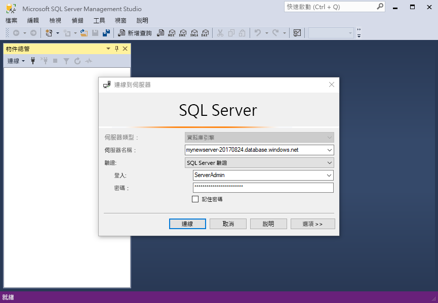
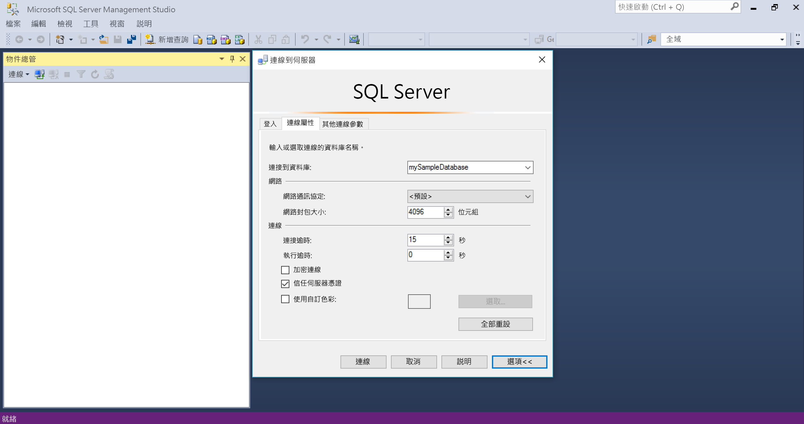
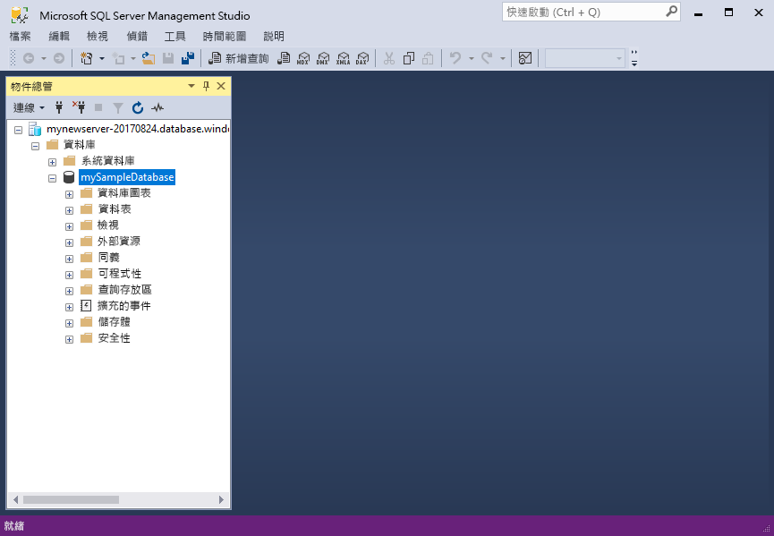
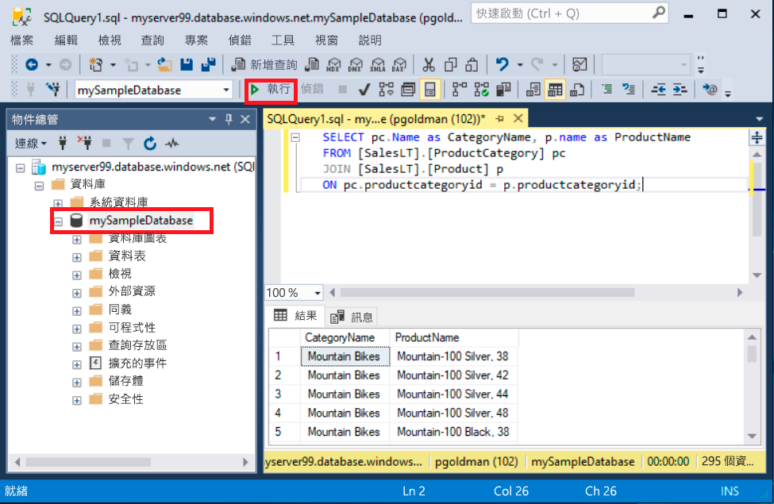
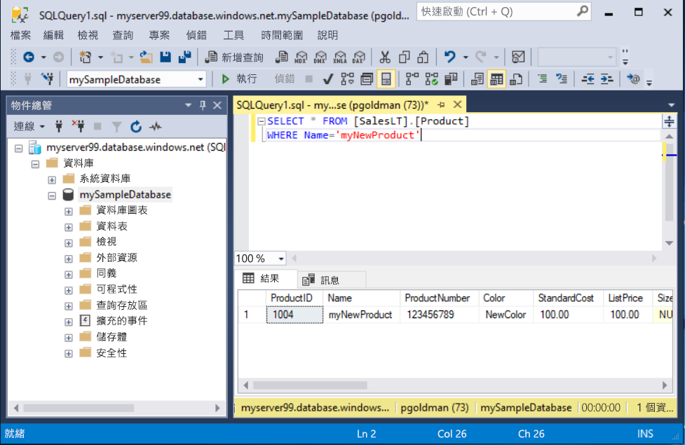

# <a name="quickstart-use-ssms-to-connect-to-and-query-azure-sql-database-or-azure-sql-managed-instance"></a>快速入門：使用 SSMS 連線到 Azure SQL Database 或 Azure SQL 受控執行個體並進行查詢
[!INCLUDE[appliesto-sqldb-sqlmi](../includes/appliesto-sqldb-sqlmi.md)]

在本快速入門中，您將了解如何使用 SQL Server Management Studio (SSMS) 來連線到 Azure SQL Database 或 Azure SQL 受控執行個體，並執行一些查詢。

## <a name="prerequisites"></a>必要條件

完成本快速入門需要下列項目：

- [SQL Server Management Studio (SSMS)](/sql/ssms/download-sql-server-management-studio-ssms/)。

- Azure SQL Database 中的資料庫。 您可以使用其中一個快速入門，在 Azure SQL Database 中建立資料庫並加以設定：

  | 動作 | SQL Database | SQL 受控執行個體 | Azure VM 上的 SQL Server |
  |:--- |:--- |:---|:---|
  | 建立| [入口網站](single-database-create-quickstart.md) | [入口網站](../managed-instance/instance-create-quickstart.md) | [入口網站](../virtual-machines/windows/sql-vm-create-portal-quickstart.md)
  || [CLI](scripts/create-and-configure-database-cli.md) | [CLI](https://medium.com/azure-sqldb-managed-instance/working-with-sql-managed-instance-using-azure-cli-611795fe0b44) |
  || [PowerShell](scripts/create-and-configure-database-powershell.md) | [PowerShell](../managed-instance/scripts/create-configure-managed-instance-powershell.md) | [PowerShell](../virtual-machines/windows/sql-vm-create-powershell-quickstart.md)
  | 設定 | [伺服器層級 IP 防火牆規則](firewall-create-server-level-portal-quickstart.md)| [VM 的連線能力](../managed-instance/connect-vm-instance-configure.md)|
  |||[現場的連線能力](../managed-instance/point-to-site-p2s-configure.md) | [連線到 SQL Server](../virtual-machines/windows/sql-vm-create-portal-quickstart.md)
  |載入資料|每個快速入門載入的 Adventure Works|[還原 Wide World Importers](../managed-instance/restore-sample-database-quickstart.md) | [還原 Wide World Importers](../managed-instance/restore-sample-database-quickstart.md) |
  |||從 [GitHub](https://github.com/Microsoft/sql-server-samples/tree/master/samples/databases/adventure-works) 中的 [BACPAC](database-import.md) 檔案還原或匯入 Adventure Works| 從 [GitHub](https://github.com/Microsoft/sql-server-samples/tree/master/samples/databases/adventure-works) 中的 [BACPAC](database-import.md) 檔案還原或匯入 Adventure Works|
  |||

  > [!IMPORTANT]
  > 本文中已撰寫的指令碼會使用 Adventure Works 資料庫。 對於受控執行個體，您必須將 Adventure Works 資料庫匯入執行個體資料庫中，或將本文中的指令碼修改為使用 Wide World Importers 資料庫。

如果您只想要執行一些特定查詢，而不安裝 SSMS，請參閱 [快速入門：使用 Azure 入口網站的查詢編輯器來查詢 Azure SQL Database 中的資料庫](connect-query-portal.md)。

## <a name="get-server-connection-information"></a>取得伺服器連線資訊

取得連線到資料庫所需的連線資訊。 您將需要完整的[伺服器](logical-servers.md)名稱或主機名稱、資料庫名稱和登入資訊，才能完成本快速入門。

1. 登入 [Azure 入口網站](https://portal.azure.com/)。

2. 瀏覽至您想要查詢的**資料庫**或**受控執行個體**。

3. 在 [概觀] 頁面上，若是 SQL Database 中的資料庫，則檢閱 [伺服器名稱] 旁的完整伺服器名稱；若是 SQL 受控執行個體中的受控執行個體或 VM 上的 SQL Server 執行個體，則檢閱 [主機] 旁的完整伺服器名稱 (或 IP 位址)。 若要複製伺服器名稱或主機名稱，請將滑鼠暫留在其上方，然後選取 [複製] 圖示。

> [!NOTE]
> 如需 Azure VM 上的 SQL Server 連線資訊，請參閱[連線到 SQL Server](../virtual-machines/windows/sql-vm-create-portal-quickstart.md#connect-to-sql-server)

## <a name="connect-to-your-database"></a>連接到您的資料庫

在 SSMS 中，連線到您的伺服器。

> [!IMPORTANT]
> 伺服器會接聽連接埠 1433。 若要連線到公司防火牆後方的伺服器，該防火牆必須開啟此連接埠。

1. 開啟 SSMS。

2. [連線到伺服器] 對話方塊隨即出現。 輸入以下資訊：

   | 設定      | 建議的值    | 描述 |
   | ------------ | ------------------ | ----------- |
   | **伺服器類型** | 資料庫引擎 | 必要值。 |
   | **伺服器名稱** | 完整伺服器名稱 | 如下所示：**servername.database.windows.net**。 |
   | **驗證** | SQL Server 驗證 | 本教學課程使用 SQL 驗證。 |
   | **登入** | 伺服器管理帳戶使用者識別碼 | 建立伺服器時所使用伺服器系統管理員帳戶的使用者識別碼。 |
   | **密碼** | 伺服器系統管理員帳戶密碼 | 建立伺服器時所使用伺服器系統管理員帳戶的密碼。 |
   ||||

     

3. 選取 [連線到伺服器] 對話方塊中的 [選項]。 在 [連線到伺服器] 下拉式功能表中，選取 **mySampleDatabase**。 完成快速入門的[必要條件一節](#prerequisites)後，您會建立名為 mySampleDatabase 的 AdventureWorksLT 資料庫。 如果 AdventureWorks 資料庫的工作複本名稱與 mySampleDatabase 不同，請改為選取該名稱。

     

4. 選取 [連接]。 此時會開啟 [物件總管] 視窗。

5. 若要檢視資料庫的物件，請展開 [資料庫]，然後展開您的資料庫節點。

     

## <a name="query-data"></a>查詢資料

執行此 [SELECT](/sql/t-sql/queries/select-transact-sql/) Transact-SQL 程式碼，依照類別查詢前 20 項產品。

1. 在 [物件總管] 中，於 **mySampleDatabase** 上按一下滑鼠右鍵，然後選取 [新增查詢]。 連線到您資料庫的新查詢視窗將會開啟。

2. 在查詢視窗中貼上下列 SQL 查詢：

   ```sql
   SELECT pc.Name as CategoryName, p.name as ProductName
   FROM [SalesLT].[ProductCategory] pc
   JOIN [SalesLT].[Product] p
   ON pc.productcategoryid = p.productcategoryid;
   ```

3. 在工具列上，選取 [執行] 以執行查詢並擷取 `Product` 和 `ProductCategory` 資料表中的資料。

    

### <a name="insert-data"></a>插入資料

執行此 [INSERT](/sql/t-sql/statements/insert-transact-sql/) Transact-SQL 程式碼，以在 `SalesLT.Product` 資料表中建立新產品。

1. 使用此查詢取代先前的查詢。

   ```sql
   INSERT INTO [SalesLT].[Product]
           ( [Name]
           , [ProductNumber]
           , [Color]
           , [ProductCategoryID]
           , [StandardCost]
           , [ListPrice]
           , [SellStartDate] )
     VALUES
           ('myNewProduct'
           ,123456789
           ,'NewColor'
           ,1
           ,100
           ,100
           ,GETDATE() );
   ```

2. 選取 [執行] 以在 `Product` 資料表中插入新資料列。 [訊息] 窗格會顯示 [(1 個資料列受影響)]。

#### <a name="view-the-result"></a>檢視結果

1. 使用此查詢取代先前的查詢。

   ```sql
   SELECT * FROM [SalesLT].[Product]
   WHERE Name='myNewProduct'
   ```

2. 選取 [執行] 。 此時會出現下列結果。

   

### <a name="update-data"></a>更新資料

執行此 [UPDATE](/sql/t-sql/queries/update-transact-sql?view=sql-server-ver15) Transact-SQL 程式碼以修改您的新產品。

1. 將先前的查詢取代為此查詢，以傳回先前建立的新記錄：

   ```sql
   UPDATE [SalesLT].[Product]
   SET [ListPrice] = 125
   WHERE Name = 'myNewProduct';
   ```

2. 選取 [執行] 以在 `Product` 資料表中更新指定的資料列。 [訊息] 窗格會顯示 [(1 個資料列受影響)]。

### <a name="delete-data"></a>刪除資料

執行此 [DELETE](/sql/t-sql/statements/delete-transact-sql/) Transact-SQL 程式碼以移除新產品。

1. 使用此查詢取代先前的查詢。

   ```sql
   DELETE FROM [SalesLT].[Product]
   WHERE Name = 'myNewProduct';
   ```

2. 選取 [執行] 以在 `Product` 資料表中刪除指定的資料列。 [訊息] 窗格會顯示 [(1 個資料列受影響)]。

## <a name="next-steps"></a>後續步驟

- 如需有關 SSMS 的資訊，請參閱 [SQL Server Management Studio](/sql/ssms/sql-server-management-studio-ssms/)。
- 若要使用 Azure 入口網站連線及查詢，請參閱[使用 Azure 入口網站 SQL 查詢編輯器連線和查詢](connect-query-portal.md)。
- 若要使用 Visual Studio Code 進行連線和查詢，請參閱[使用 Visual Studio Code 進行連線和查詢](connect-query-vscode.md)。
- 若要使用 .NET 進行連線和查詢，請參閱[使用 .NET 進行連線和查詢](connect-query-dotnet-visual-studio.md)。
- 若要使用 PHP 進行連線和查詢，請參閱[使用 PHP 進行連線和查詢](connect-query-php.md)。
- 若要使用 Node.js 進行連線和查詢，請參閱[使用 Node.js 進行連線和查詢](connect-query-nodejs.md)。
- 若要使用 Java 進行連線和查詢，請參閱[使用 Java 進行連線和查詢](connect-query-java.md)。
- 若要使用 Python 進行連線和查詢，請參閱[使用 Python 進行連線和查詢](connect-query-python.md)。
- 若要使用 Ruby 進行連線和查詢，請參閱[使用 Ruby 進行連線和查詢](connect-query-ruby.md)。
