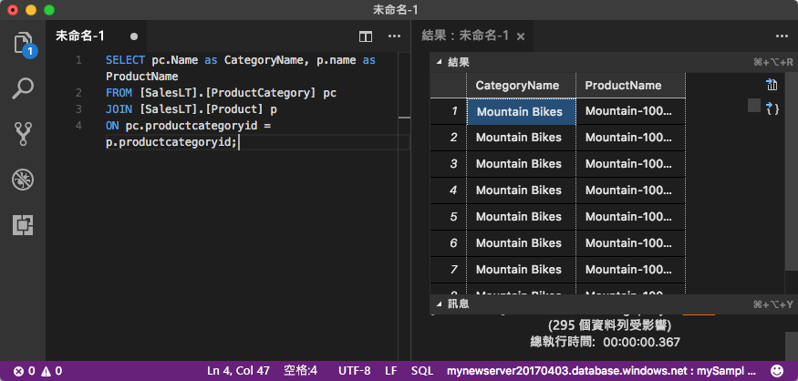

# <a name="quickstart-use-visual-studio-code-to-connect-and-query"></a>快速入門：使用 Visual Studio Code 連線及查詢 
[!INCLUDE[appliesto-sqldb-sqlmi](../includes/appliesto-sqldb-sqlmi.md)]

[Visual Studio Code](https://code.visualstudio.com/docs) 是 Linux、macOS 及 Windows 適用的圖形化程式碼編輯器。 其支援延伸模組，包括用來查詢 SQL Server 執行個體、Azure SQL Database、Azure SQL 受控執行個體和 Azure Synapse Analytics 中資料庫的 [mssql 延伸模組](https://aka.ms/mssql-marketplace)。 在此快速入門中，您將使用 Visual Studio Code 連線至 Azure SQL Database 或 Azure SQL 受控執行個體，然後執行 Transact-SQL 陳述式以查詢、插入、更新及刪除資料。

## <a name="prerequisites"></a>必要條件

- Azure SQL Database 或 Azure SQL 受控執行個體中的資料庫。 您可以使用其中一個快速入門，在 Azure SQL Database 中建立資料庫並加以設定：

  | 動作 | Azure SQL Database | Azure SQL 受控執行個體 |
  |:--- |:--- |:---|
  | 建立| [入口網站](single-database-create-quickstart.md) | [入口網站](../managed-instance/instance-create-quickstart.md) |
  || [CLI](scripts/create-and-configure-database-cli.md) | [CLI](https://medium.com/azure-sqldb-managed-instance/working-with-sql-managed-instance-using-azure-cli-611795fe0b44) |
  || [PowerShell](scripts/create-and-configure-database-powershell.md) | [PowerShell](../managed-instance/scripts/create-configure-managed-instance-powershell.md) |
  | 設定 | [伺服器層級 IP 防火牆規則](firewall-create-server-level-portal-quickstart.md))| [來自虛擬機器 (VM) 的連線](../managed-instance/connect-vm-instance-configure.md)|
  |||[來自內部部署環境的連線](../managed-instance/point-to-site-p2s-configure.md)
  |載入資料|每個快速入門載入的 Adventure Works|[還原 Wide World Importers](../managed-instance/restore-sample-database-quickstart.md)
  |||從 [GitHub](https://github.com/Microsoft/sql-server-samples/tree/master/samples/databases/adventure-works) 的 [BACPAC](database-import.md) 檔案，還原或匯入 Adventure Works|
  |||

  > [!IMPORTANT]
  > 本文中已撰寫的指令碼會使用 Adventure Works 資料庫。 對於 SQL 受控執行個體，您必須將 Adventure Works 資料庫匯入執行個體資料庫中，或將本文中的指令碼修改為使用 Wide World Importers 資料庫。

## <a name="install-visual-studio-code"></a>安裝 Visual Studio Code

請確定您已安裝最新版的 [Visual Studio Code](https://code.visualstudio.com/Download) 並已載入 [mssql 擴充功能](https://aka.ms/mssql-marketplace)。 如需 mssql 延伸模組的安裝指引，請參閱[安裝 Visual Studio Code](/sql/linux/sql-server-linux-develop-use-vscode#install-and-start-visual-studio-code) 和[適用於 Visual Studio Code 的 mssql](https://marketplace.visualstudio.com/items?itemName=ms-mssql.mssql)。

## <a name="configure-visual-studio-code"></a>設定 Visual Studio Code

### <a name="macos"></a>**macOS**

對於 macOS，您必須安裝 OpenSSL，這是 mssql 擴充功能所用 .NET Core 的必要條件。 開啟您的終端機，並輸入下列命令以安裝 **brew** 和 **OpenSSL** 。

```bash
ruby -e "$(curl -fsSL https://raw.githubusercontent.com/Homebrew/install/master/install)"
brew update
brew install openssl
mkdir -p /usr/local/lib
ln -s /usr/local/opt/openssl/lib/libcrypto.1.0.0.dylib /usr/local/lib/
ln -s /usr/local/opt/openssl/lib/libssl.1.0.0.dylib /usr/local/lib/
```

### <a name="linux-ubuntu"></a>**Linux (Ubuntu)**

不需要特別設定。

### <a name="windows"></a>**Windows**

不需要特別設定。

## <a name="get-server-connection-information"></a>取得伺服器連線資訊

取得連線到 Azure SQL Database 所需的連線資訊。 在後續程序中，您將需要完整的伺服器名稱或主機名稱、資料庫名稱和登入資訊。

1. 登入 [Azure 入口網站](https://portal.azure.com/)。

2. 瀏覽至 [SQL 資料庫] 或 [SQL 受控執行個體] 頁面。

3. 在 [概觀] 頁面上，針對 SQL Database 檢閱 [伺服器名稱] 旁的完整伺服器名稱，若為 SQL 受控執行個體，則檢閱 [主機] 旁的完整伺服器名稱。 若要複製伺服器名稱或主機名稱，請將滑鼠暫留在其上方，然後選取 [複製] 圖示。

## <a name="set-language-mode-to-sql"></a>將語言模式設定為 SQL

在 Visual Studio Code 中將語言模式設定為 **SQL** ，以啟用 mssql 命令和 T-SQL IntelliSense。

1. 開啟新的 Visual Studio Code 視窗。

2. 按 **Ctrl**+**N** 。 此時會開啟新的純文字檔。

3. 選取狀態列右下角的 [純文字]。

4. 在開啟的 [選取語言模式] 下拉式功能表中，選取 [SQL]。

## <a name="connect-to-your-database"></a>連接到您的資料庫

使用 Visual Studio Code，以建立與伺服器的連線。

> [!IMPORTANT]
> 在繼續之前，確定您已備妥伺服器和登入資訊。 開始輸入連線設定檔資訊後，如果您的焦點變換自 Visual Studio Code，則必須重新開始建立設定檔。

1. 在 Visual Studio Code 中，按 **Ctrl+Shift+P** (或 **F1** ) 以開啟命令選擇區。

2. 選取 [MS SQL: 連線] 然後選擇 **Enter** 。

3. 選取 [建立連線設定檔]。

4. 請依照提示指定新設定檔的連線屬性。 指定每個值之後，選擇 **ENTER** 繼續。

   | 屬性       | 建議的值 | 描述 |
   | ------------ | ------------------ | ------------------------------------------------- |
   | **伺服器名稱** | 完整伺服器名稱 | 應該類似這樣︰ **mynewserver20170313.database.windows.net** 。 |
   | **資料庫名稱** | mySampleDatabase | 要連線的資料庫。 |
   | **驗證** | SQL 登入| 本教學課程使用 SQL 驗證。 |
   | **使用者名稱** | [使用者名稱] | 建立伺服器時所使用伺服器系統管理員帳戶的使用者名稱。 |
   | **密碼 (SQL 登入)** | 密碼 | 建立伺服器時所使用伺服器系統管理員帳戶的密碼。 |
   | **儲存密碼嗎？** | [是] 或 [否] | 如果您不希望每次都要輸入密碼，請選取 [是]。 |
   | **輸入此設定檔的名稱** | 設定檔名稱，例如 **mySampleProfile** | 儲存設定檔可讓您在後續登入時加快連線速度。 |

   如果成功會顯示通知，指出您的設定檔已建立並連線。

## <a name="query-data"></a>查詢資料

執行以下 [SELECT](/sql/t-sql/queries/select-transact-sql) Transact-SQL 陳述式來依照類別查詢前 20 項產品。

1. 在 [編輯器] 視窗中，貼上下列 SQL 查詢。

   ```sql
   SELECT pc.Name as CategoryName, p.name as ProductName
   FROM [SalesLT].[ProductCategory] pc
   JOIN [SalesLT].[Product] p
   ON pc.productcategoryid = p.productcategoryid;
   ```

2. 按 **Ctrl**+**Shift**+**E** 執行查詢並顯示來自 `Product` 和 `ProductCategory` 資料表的結果。

    

## <a name="insert-data"></a>插入資料

執行以下 [INSERT](/sql/t-sql/statements/insert-transact-sql) Transact-SQL 陳述式在 `SalesLT.Product` 資料表中加入新產品。

1. 使用此查詢取代先前的查詢。

   ```sql
   INSERT INTO [SalesLT].[Product]
        ( [Name]
        , [ProductNumber]
        , [Color]
        , [ProductCategoryID]
        , [StandardCost]
        , [ListPrice]
        , [SellStartDate]
        )
     VALUES
        ('myNewProduct'
        ,123456789
        ,'NewColor'
        ,1
         ,100
         ,100
         ,GETDATE() );
   ```

2. 按下 **Ctrl**+**Shift**+**E** 在 `Product` 資料表中插入新資料列。

## <a name="update-data"></a>更新資料

執行以下 [UPDATE](/sql/t-sql/queries/update-transact-sql) Transact-SQL 陳述式更新加入的產品。

1. 使用此查詢取代先前的查詢：

   ```sql
   UPDATE [SalesLT].[Product]
   SET [ListPrice] = 125
   WHERE Name = 'myNewProduct';
   ```

2. 按 **Ctrl**+**Shift**+**E** 以在 `Product` 資料表中更新指定的資料列。

## <a name="delete-data"></a>刪除資料

執行以下 [DELETE](/sql/t-sql/statements/delete-transact-sql) Transact-SQL 陳述式移除新產品。

1. 使用此查詢取代先前的查詢：

   ```sql
   DELETE FROM [SalesLT].[Product]
   WHERE Name = 'myNewProduct';
   ```

2. 按 **Ctrl**+**Shift**+**E** 以在 `Product` 資料表中刪除指定的資料列。

## <a name="next-steps"></a>後續步驟

- 若要使用 SQL Server Management Studio 進行連線和查詢，請參閱[快速入門：使用 SQL Server Management Studio 連線到 Azure SQL Database 中的資料庫及查詢資料](connect-query-ssms.md)。
- 若要使用 Azure 入口網站連接及查詢，請參閱[快速入門：在 Azure 入口網站中使用 SQL 查詢編輯器進行連線並查詢資料](connect-query-portal.md)。
- 如需有關使用 Visual Studio Code 的 MSDN 雜誌文章，請參閱[使用 MSSQL 擴充功能建立資料庫 IDE 部落格文章](/archive/msdn-magazine/2017/june/data-points-visual-studio-code-create-a-database-ide-with-mssql-extension)。