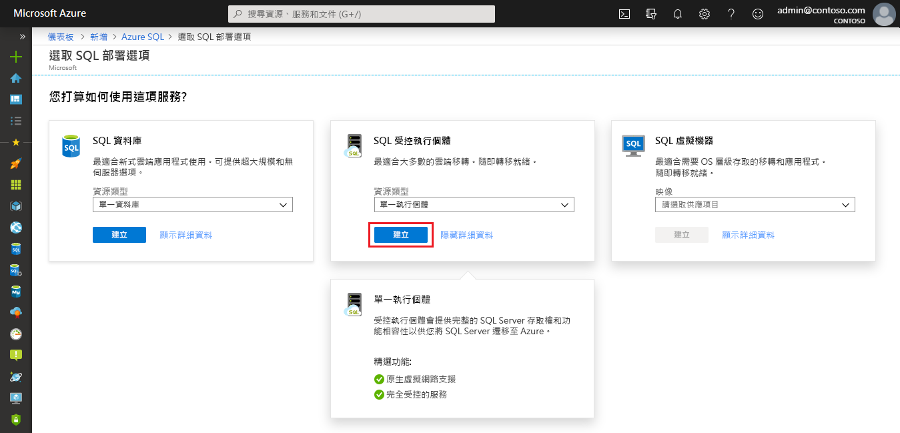
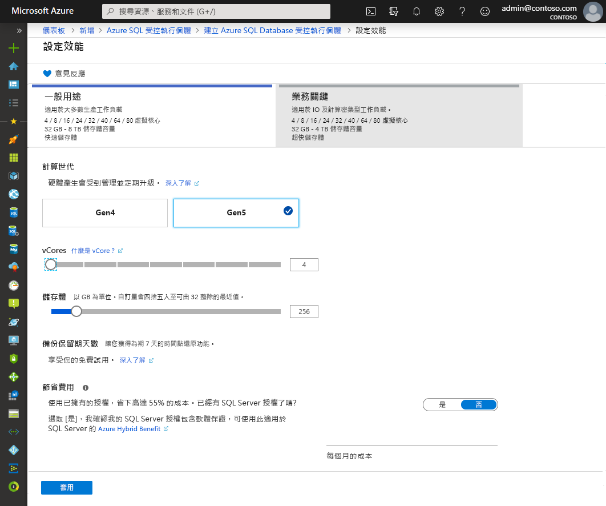
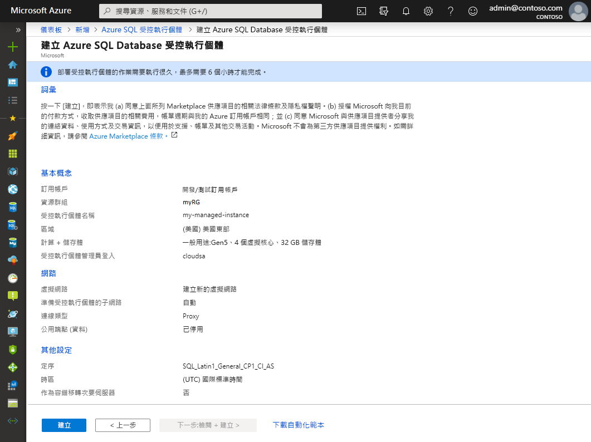
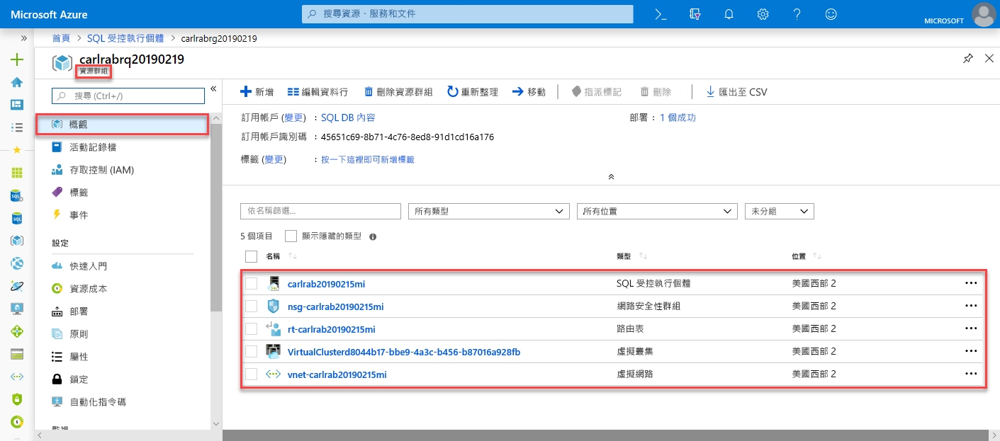
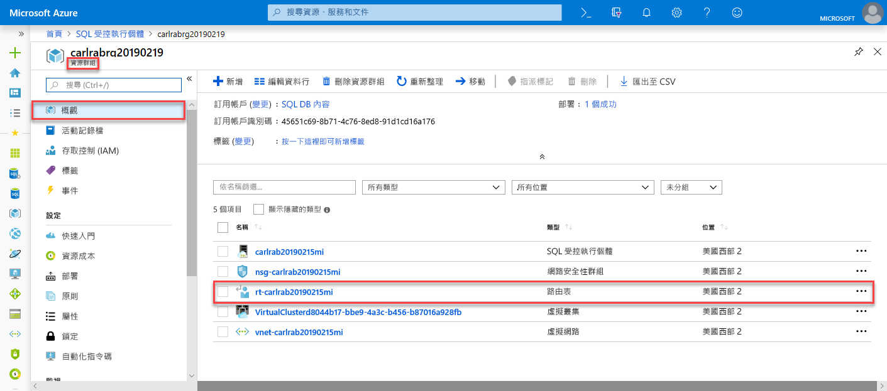
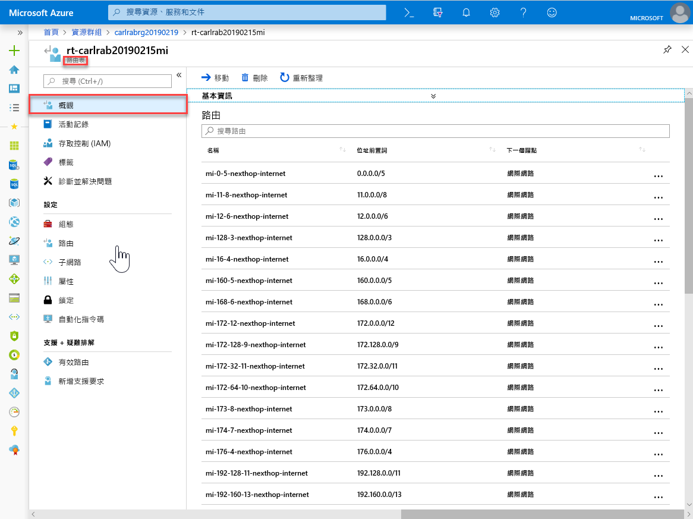
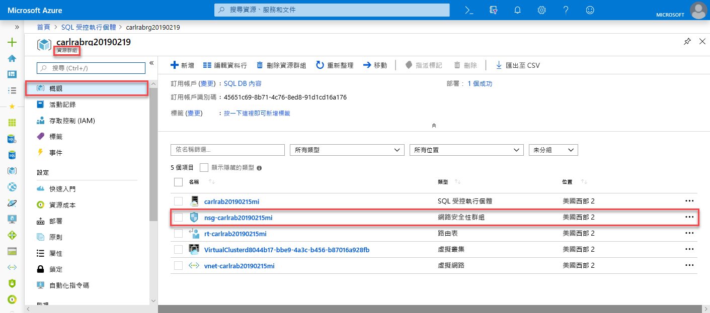
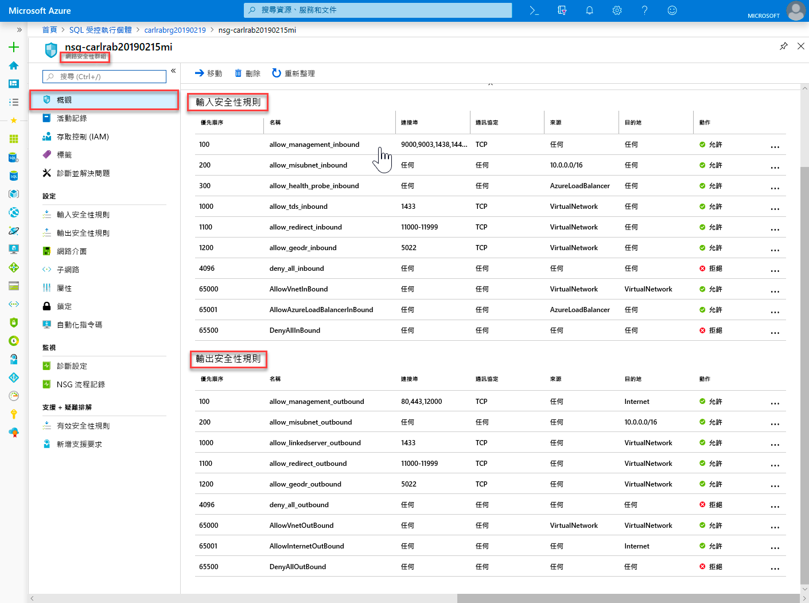
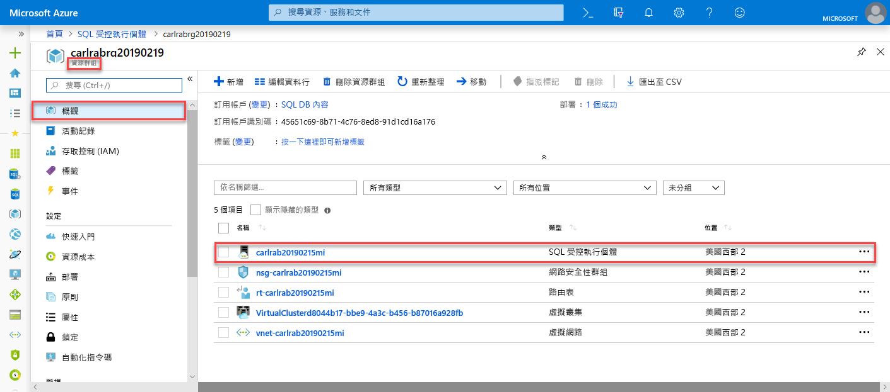

# 快速入門：建立 SQL 受控執行個體的受控執行個體
[!INCLUDE[appliesto-sqlmi](../includes/appliesto-sqlmi.md)]

本快速入門會教您在 Azure 入口網站中建立 [Azure SQL 受控執行個體](sql-managed-instance-paas-overview.md)的受控執行個體。

> [!IMPORTANT]
> 如需了解限制，請參閱[支援的區域](resource-limits.md#supported-regions)和[支援的訂用帳戶類型](resource-limits.md#supported-subscription-types)。

## 建立受控執行個體

若要建立受控執行個體，請遵循下列步驟： 

### 登入 Azure 入口網站

如果您沒有 Azure 訂用帳戶，請[建立免費帳戶](https://azure.microsoft.com/free/)。

1. 登入 [Azure 入口網站](https://portal.azure.com/)。
1. 在 Azure 入口網站的左側功能表上選取 [Azure SQL]。 如果 [Azure SQL] 不在清單中，請選取 [所有服務]，然後在搜尋方塊中輸入 **Azure SQL**。
1. 選取 [+ 新增] 以開啟 [選取 SQL 部署選項] 頁面。 您可以在 [SQL 受控執行個體] 圖格上選取 [顯示詳細資料]，以檢視有關 Azure SQL 受控執行個體的其他資訊。
1. 選取 [建立]。

   

4. 使用 [建立 Azure SQL 受控執行個體] 佈建表單上的索引標籤來新增必要和選用的資訊。 下列幾節會說明這些索引標籤。

### [基本] 索引標籤

- 填寫 [基本] 索引標籤上所需的必要資訊。這是佈建受控執行個體所需的最小一組資訊。

   ![用於建立受控執行個體的 [基本] 索引標籤](./media/instance-create-quickstart/mi-create-tab-basics.png)

   使用下表作為此索引標籤上所需資訊的參考。

   | 設定| 建議的值 | 描述 |
   | ------ | --------------- | ----------- |
   | **訂用帳戶** | 您的訂用帳戶。 | 讓您有權建立新資源的訂用帳戶。 |
   | **資源群組** | 新的或現有的資源群組。|如需有效的資源群組名稱，請參閱[命名規則和限制](/azure/architecture/best-practices/resource-naming)。|
   | **受控執行個體名稱** | 任何有效名稱。|如需有效的名稱，請參閱[命名規則和限制](/azure/architecture/best-practices/resource-naming)。|
   | **區域** |要用來建立受控執行個體的區域。|如需區域的相關資訊，請參閱 [Azure 區域](https://azure.microsoft.com/regions/)。|
   | **受控執行個體系統管理員登入** | 任何有效的使用者名稱。 | 如需有效的名稱，請參閱[命名規則和限制](/azure/architecture/best-practices/resource-naming)。 請勿使用 "serveradmin"，因為這是保留的伺服器層級角色。|
   | **密碼** | 任何有效密碼。| 密碼長度至少必須有 16 個字元，而且符合[定義的複雜度需求](../../virtual-machines/windows/faq.md#what-are-the-password-requirements-when-creating-a-vm)。|

- 選取 [設定受控執行個體] 來調整計算和儲存體資源的大小，以及檢閱定價層。 使用滑桿或文字方塊來指定儲存體容量和虛擬核心數目。 當您完成時，選取 [套用] 來儲存您的選擇。 

   

- 若要在建立 SQL 受控執行個體前檢閱您的選擇，您可以選取 [檢閱 + 建立]。 或者，設定網路選項，做法是選取 [下一步:網路]。

### 網路功能索引標籤

- 在 [網路] 索引標籤上填寫選用資訊。如果您省略此資訊，入口網站將會套用預設設定。

   ![用於建立受控執行個體的 [網路] 索引標籤](./media/instance-create-quickstart/mi-create-tab-networking.png)

   使用下表作為此索引標籤上所需資訊的參考。

   | 設定| 建議的值 | 描述 |
   | ------ | --------------- | ----------- |
   | **虛擬網路** | 選取 [建立新的虛擬網路] 或有效的虛擬網路與子網路。| 如果網路或子網路無法使用，您必須先[修改成符合網路需求](vnet-existing-add-subnet.md)後，才能選取它作為新的受控執行個體目標。 如需關於設定 SQL 受控執行個體網路環境的需求資訊，請參閱[設定 SQL 受控執行個體的虛擬網路](connectivity-architecture-overview.md)。 |
   | **連線類型** | 在 Proxy 和重新導向連線類型之間做選擇。|如需有關連線類型的詳細資訊，請參閱 [Azure SQL 受控執行個體連線類型](../database/connectivity-architecture.md#connection-policy)。|
   | **公用端點**  | 選取 [啟用]。 | 若要讓受控執行個體可透過公用資料端點來存取，您必須啟用此選項。 | 
   | **允許從此存取** (如果已啟用 [公用雲端]) | 選取其中一個選項。   |入口網站體驗可讓您對公用端點設定安全性群組。     根據您的情況，選取下列其中一個選項：   <ul> <li>**Azure 服務**：當您從 Power BI 或其他多租用戶服務進行連線時，建議使用此選項。 </li> <li> **網際網路**：可在您想要快速啟動受控執行個體時用於測試目的。 請勿將其用於生產環境。 </li> <li> **無存取權**：此選項會建立 [拒絕] 安全性規則。 修改這項規則，讓受控執行個體可透過公用端點來存取。 </li> </ul>   如需公用端點安全性的詳細資訊，請參閱[搭配公用端點來安全地使用 Azure SQL 受控執行個體](public-endpoint-overview.md)。|

- 選取 [檢閱 + 建立]，以在建立受控執行個體前檢閱您的選擇。 或者，設定更多自訂設定，做法是選取 [下一步:其他設定]。

### 其他設定

- 在 [其他設定] 索引標籤上填寫選用資訊。如果您省略此資訊，入口網站將會套用預設設定。

   ![用於建立受控執行個體的 [其他設定] 索引標籤](./media/instance-create-quickstart/mi-create-tab-additional-settings.png)

   使用下表作為此索引標籤上所需資訊的參考。

   | 設定| 建議的值 | 描述 |
   | ------ | --------------- | ----------- |
   | **定序** | 選擇您要用於受控執行個體的定序。 如果您從 SQL Server 遷移資料庫，請使用 `SELECT SERVERPROPERTY(N'Collation')` 來檢查來源定序並使用該值。| 如需定序的相關資訊，請參閱[設定或變更伺服器定序](https://docs.microsoft.com/sql/relational-databases/collations/set-or-change-the-server-collation)。|   
   | **時區** | 選取受控執行個體將要觀察的時區。|如需詳細資訊，請參閱[時區](timezones-overview.md)。|
   | **作為次要容錯移轉群組** | 選取 [是]。 | 啟用此選項以使用受控執行個體作為次要容錯移轉群組。|
   | **主要 SQL 受控執行個體** (如果 [作為次要容錯移轉群組] 設定為 [是]) | 選擇現有主要受控執行個體，其將加入與您所建立受控執行個體相同的 DNS 區域中。 | 此步驟會啟用容錯移轉群組的建立後設定。 如需詳細資訊，請參閱[教學課程：將受控執行個體新增到容錯移轉群組](failover-group-add-instance-tutorial.md)。|

## 檢閱 + 建立

1. 選取 [檢閱 + 建立] 索引標籤，以在建立受控執行個體前檢閱您的選擇。

   

1. 選取 [建立] 以開始佈建受控執行個體。

> [!IMPORTANT]
> 部署受控執行個體是長時間執行的作業。 在子網路中部署第一個執行個體，所需時間通常比部署到具有現有受控執行個體的子網路還要久。 如需平均佈建時間，請參閱 [SQL 受控執行個體管理作業](sql-managed-instance-paas-overview.md#management-operations)。

## 監視部署進度

1. 選取 [通知] 圖示以檢視部署的狀態。

   

1. 選取通知中的 [部署正在進行中] 來開啟 SQL 受控執行個體視窗，並進一步監視部署進度。 

> [!TIP]
> 如果您關閉了網頁瀏覽器或移出部署進度畫面，請遵循下列步驟來尋找部署進度畫面：
> 1. 在 Azure 入口網站中，開啟您要在其中部署 SQL 受控執行個體的資源群組 (在 [基本] 索引標籤上)。
> 2. 選取 [部署]。
> 3. 選取進行中的 SQL 受控執行個體部署作業。

> [!IMPORTANT]
> - 建立 SQL 受控執行個體是長時間執行的作業，可能需要幾個小時，視特定的情況而定。 如需一般建立時間的相關資訊，請參閱[管理作業持續時間](management-operations-overview.md#management-operations-duration)。
> - 在有其他受影響的作業 (例如在相同子網路中的其他受控執行個體上長時間執行的還原或調整作業) 時，可能會延遲建立 SQL 受控執行個體的開始時間。 若要深入了解，請參閱[管理作業交互影響](management-operations-overview.md#management-operations-cross-impact)。
> - 為了能夠取得建立受控執行個體時的狀態，您必須具有資源群組的**讀取權限**。 如果您沒有此權限，或在受控執行個體建立過程中將其撤銷，則可能會導致 SQL 受控執行個體不會顯示在資源群組部署清單中。
>

## 檢視已建立的資源

在受控執行個體部署成功時，若要查看所建立的資源：

1. 開啟受控執行個體的資源群組。 

   

## 查看及微調網路設定

若要選擇性地微調網路設定，請檢查下列各項：

1. 選取路由表以檢閱為您建立的使用者定義路由 (UDR)。

   

2. 在路由表中，檢閱要從 SQL 受控執行個體虛擬網路路由傳送流量的項目。 如果您要手動建立或設定路由表，務必在 SQL 受控執行個體路由表中建立這些項目。

   

3. 回到資源群組，然後選取網路安全性群組。

   

4. 檢閱輸入和輸出安全性規則。 

   

> [!IMPORTANT]
> 如果您已經為 SQL 受控執行個體設定了公用端點，則需要開啟連接埠，以允許從公用網際網路連線到 SQL 受控執行個體的網路流量。 如需詳細資訊，請參閱[設定 SQL 受控執行個體的公用端點](public-endpoint-configure.md#allow-public-endpoint-traffic-on-the-network-security-group)。
>

## 擷取 SQL 受控執行個體的連線詳細資料

若要連線到 SQL 受控執行個體，請遵循下列步驟來擷取主機名稱和完整網域名稱 (FQDN)：

1. 回到資源群組，然後選取您的受控執行個體。

   

2. 在 [概觀] 索引標籤上，找出 [主機] 屬性。 複製受控執行個體的主機名稱，以便在下一個快速入門中使用。

   

   所複製的值代表可用於連線至 SQL 受控執行個體的完整網域名稱 (FQDN)。 其類似於下列位址範例：*your_host_name.a1b2c3d4e5f6.database.windows.net*。

## 後續步驟

若要了解如何連線至 SQL 受控執行個體：
- 如需有關應用程式連線選項的概觀，請參閱[將您的應用程式連線至 SQL 受控執行個體](connect-application-instance.md)。
- 如需說明如何從 Azure 虛擬機器連線至 SQL 受控執行個體的快速入門，請參閱[設定 Azure 虛擬機器連線](connect-vm-instance-configure.md)。
- 如需說明如何使用點對站連線從內部部署用戶端電腦連線至 SQL 受控執行個體的快速入門，請參閱[設定點對站連線](point-to-site-p2s-configure.md)。

若要將現有 SQL Server 資料庫從內部部署環境還原至 SQL 受控執行個體： 
- 使用[用於移轉的 Azure 資料庫移轉服務](../../dms/tutorial-sql-server-to-managed-instance.md)來從資料庫備份檔案還原。 
- 使用 [T-SQL RESTORE 命令](restore-sample-database-quickstart.md)來從資料庫備份檔案還原。

若要使用內建的疑難排解智慧對 SQL 受控執行個體的資料庫效能進行進階監視，請參閱[使用 Azure SQL 分析監視 Azure SQL 受控執行個體](../../azure-monitor/insights/azure-sql.md)。
