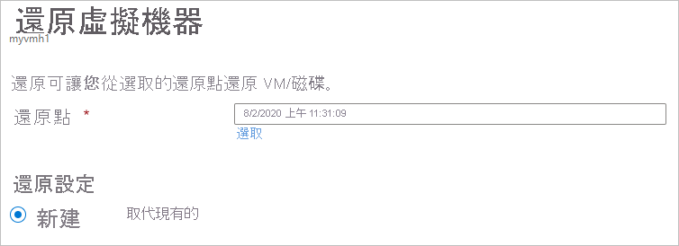
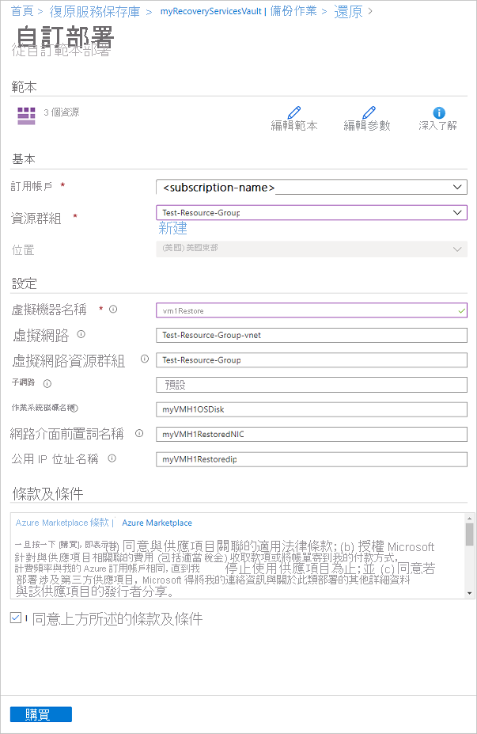

# <a name="how-to-restore-azure-vm-data-in-azure-portal"></a>如何在 Azure 門戶中還原 Azure VM 資料

本文說明如何從儲存在 [Azure 備份](backup-overview.md)復原服務保存庫的復原點還原 Azure VM 資料。

## <a name="restore-options"></a>還原選項

Azure 備份提供數種方法來還原 VM。

**還原選項** | **詳細資料**
--- | ---
**建立新的 VM** | 從還原點快速建立及啟動基本 VM 並加以執行。<br/><br/> 您可以為 VM 指定名稱,選擇要放置該 VM 的資源組和虛擬網路 (VNet),並為還原的 VM 指定儲存帳戶。 必須在與源 VM 相同的區域中創建新 VM。
**還原磁碟** | 還原 VM 磁碟,然後可用於創建新 VM。<br/><br/> Azure 備份提供一個範本，協助您自訂和建立 VM。 <br/><br> 還原作業會產生範本，您可以下載並使用該範本來指定自訂 VM 設定，並建立 VM。<br/><br/> 磁碟將複製到指定的資源群組。<br/><br/> 或者，您可以將磁碟連結至現有 VM，或使用 PowerShell 建立新的 VM。<br/><br/> 此選項十分適用於自訂 VM、新增備份時沒有的組態設定，或新增必須使用範本或 PowerShell 來配置的設定。
**取代現有的** | 您可以還原磁碟，然後使用該磁碟來取代現有 VM 上的磁碟。<br/><br/> 目前的 VM 必須存在。 如果已刪除此選項,則無法使用此選項。<br/><br/> Azure 備份在替換磁碟之前獲取現有 VM 的快照,並將其存儲在指定的暫存位置。 連接到 VM 的現有磁碟將替換為選定的還原點。<br/><br/> 快照將複製到保管庫,並根據保留策略保留。 <br/><br/> 更換磁碟操作后,原始磁碟將保留在資源組中。 如果不需要原始磁碟,可以選擇手動刪除它們。 <br/><br/>針對未加密的受控 VM 支援取代現有的項目。 不支援非受控磁碟、[一般化的 VM](https://docs.microsoft.com/azure/virtual-machines/windows/capture-image-resource) 或[使用自訂映像建立的](https://azure.microsoft.com/resources/videos/create-a-custom-virtual-machine-image-in-azure-resource-manager-with-powershell/) \(英文\) VM。<br/><br/> 如果還原點中的磁碟數目多於或少於目前的 VM，則還原點中的磁碟數目只會反映該 VM 組態。<br><br> 對於連結資源(如[使用者分配的託管標識](https://docs.microsoft.com/azure/active-directory/managed-identities-azure-resources/overview)或[密鑰保管庫](https://docs.microsoft.com/azure/key-vault/key-vault-overview)),VM 不支援替換現有資源,因為在執行還原時,備份用戶端應用對這些資源沒有許可權。<br/><br/>不支援傳統 VM。
**跨區域(次要區域)** | 跨區域還原可用於還原輔助區域中的 Azure VM,輔助區域是 Azure[配對區域](https://docs.microsoft.com/azure/best-practices-availability-paired-regions#what-are-paired-regions)。<br><br> 如果備份是在輔助區域中完成的,則可以還原所選恢復點的所有 Azure VM。<br><br> 此功能可用於以下選項:<br> * [建立 VM](https://docs.microsoft.com/azure/backup/backup-azure-arm-restore-vms#create-a-vm) <br> * [復原磁碟](https://docs.microsoft.com/azure/backup/backup-azure-arm-restore-vms#restore-disks) <br><br> 我們目前不支援[「替換現有磁碟」](https://docs.microsoft.com/azure/backup/backup-azure-arm-restore-vms#replace-existing-disks)選項。<br><br> 權限<br> 備份管理員和應用程式管理員可以對輔助區域執行還原操作。

> [!NOTE]
> 您也可以復原 Azure VM 上的特定檔案和資料夾。 [深入了解](backup-azure-restore-files-from-vm.md)。
>
> 如果您執行[最新版](backup-instant-restore-capability.md)適用於 Azure VM 的 Azure 備份 (又稱為立即還原)，則快照集可保留最多七天，而且您可以在備份資料傳送至保存庫之前，從快照集還原 VM。 如果您想要從過去七天的備份還原 VM，從快照集還原會比從保存庫還原還快。

## <a name="storage-accounts"></a>儲存體帳戶

有關儲存帳戶的一些詳細資訊:

- **創建 VM:** 創建新 VM 時,VM 將放置在指定的儲存帳戶中。
- **還原磁碟**:還原磁碟時,磁碟將複製到指定的存儲帳戶。 還原作業生成一個範本,您可以下載該範本並用於指定自訂 VM 設定。 此範本放置在指定的儲存帳戶中。
- **替換磁碟**:替換現有 VM 上的磁碟時,Azure 備份在替換磁碟之前獲取現有 VM 的快照。 快照存儲在指定的暫存位置(存儲帳戶)中。 此存儲帳戶用於在還原過程中臨時存儲快照,我們建議您創建一個新帳戶來執行此操作,以後可以輕鬆地刪除該帳戶。
- **存儲帳戶位置**:存儲帳戶必須與保管庫位於同一區域。 僅顯示這些帳戶。 如果位置中沒有存儲帳戶,則需要創建一個存儲帳戶。
- **儲存類型**:不支援 Blob 儲存。
- **存儲冗餘**:不支援區域冗餘存儲 (ZRS)。 帳戶的複製和冗餘信息顯示在帳戶名稱之後的括弧中。
- **進階儲存**:
  - 還原非高級 VM 時,不支援高級存儲帳戶。
  - 還原託管 VM 時,不支援配置網路規則的高級存儲帳戶。

## <a name="before-you-start"></a>開始之前

要回復 VM(建立新 VM),請確保具有回復 VM 操作的正確基於角色的存取控制 (RBAC)[許可權](backup-rbac-rs-vault.md#mapping-backup-built-in-roles-to-backup-management-actions)。

如果沒有許可權,則可以[還原磁碟](#restore-disks),然後在磁碟還原後,可以使用作為還原操作的一部分生成的[範本](#use-templates-to-customize-a-restored-vm)創建新的 VM。

## <a name="select-a-restore-point"></a>選取還原點

1. 在與要還原的 VM 關聯的保管庫中,按下 **「備份項** > **Azure 虛擬機器**」。
2. 建立 VM。 根據預設，VM 儀表板上會顯示過去 30 天內的復原點。 您可以根據日期、時間範圍和不同類型的快照集一致性來顯示或篩選出超過 30 天的復原點。
3. 若要還原 VM，請按一下 [還原 VM]****。

    

4. 選取要用於復原的還原點。

## <a name="choose-a-vm-restore-configuration"></a>選擇 VM 還原組態

1. 在 [還原設定]**** 中，選取還原選項：
    - **建立新**:如果要建立新 VM,請使用此選項。 您可以使用簡單的設定來建立 VM，或還原磁碟並建立自訂 VM。
    - **替換現有**:如果要替換現有 VM 上的磁碟,請使用此選項。

        

2. 為您所選的還原選項指定設定。

## <a name="create-a-vm"></a>建立 VM

其中一個[還原選項](#restore-options)可讓您從還原點快速建立具有基本設定的 VM。

1. 在**還原配置** > **創建新** > **還原類型**中,選擇 **「創建虛擬機**」。
2. 在**虛擬機名稱**中,指定訂閱中不存在的 VM。
3. 在 [資源群組]**** 中，選取新 VM 的現有資源群組，或使用全域的唯一名稱來建立新的資源群組。 如果您指派已經存在的名稱，Azure 就會為群組指派與 VM 相同的名稱。
4. 在 [虛擬網路]**** 中，選取將放置 VM 的 VNet。 與訂用帳戶相關聯的所有 VNet 均會顯示。 選取子網路。 預設會選取第一個子網路。
5. 在**儲存位置**中,指定 VM 的儲存帳戶。 [深入了解](#storage-accounts)。

    

6. 在 [還原設定]**** 中，選取 [確定]****。 在 [還原]**** 中，按一下 [還原]**** 以觸發還原作業。

## <a name="restore-disks"></a>還原磁碟

其中一個[還原選項](#restore-options)可讓您從還原點建立磁碟。 然後，您可以使用該磁碟來執行下列其中一項操作：

- 使用還原作業期間所產生的範本來自訂設定，並觸發 VM 部署。 您會編輯預設範本設定，並提交範本以進行 VM 部署。
- [將還原的磁碟](https://docs.microsoft.com/azure/virtual-machines/windows/attach-managed-disk-portal)連結至現有 VM。
- 使用 PowerShell 從還原的磁碟[創建新 VM。](https://docs.microsoft.com/azure/backup/backup-azure-vms-automation#create-a-vm-from-restored-disks)

1. 在**回復設定** > **中 建立新** > **的回復類型**,選擇**回復磁碟**。
2. 在 [資源群組]**** 中，選取已還原磁碟的現有資源群組，或使用全域的唯一名稱來建立新的資源群組。
3. 在 [儲存體帳戶]**** 中，指定要將 VHD 複製到其中的帳戶。 [深入了解](#storage-accounts)。

    

4. 在 [還原設定]**** 中，選取 [確定]****。 在 [還原]**** 中，按一下 [還原]**** 以觸發還原作業。

當虛擬機使用託管磁碟並選擇「**創建虛擬機器**」選項時,Azure 備份不使用指定的儲存帳戶。 在**還原磁碟**和**即時還原**的情況下,存儲帳戶僅用於存儲範本。 託管磁碟在指定的資源組中創建。
當虛擬機使用非託管磁碟時,它們將作為 blob 還原到存儲帳戶。

### <a name="use-templates-to-customize-a-restored-vm"></a>使用範本自訂還原的 VM

還原磁碟後，使用還原作業期間所產生的範本來自訂和建立新 VM：

1. 開啟相關作業的**還原作業詳細資料**。

2. 在 [還原作業詳細資料]**** 中，選取 [部署範本]**** 來起始範本部署。

    

3. 若要自訂範本中提供的 VM 設定，請按一下 [編輯範本]****。 如果您想要新增更多自訂，請按一下 [編輯參數]****。
    - [深入了解](../azure-resource-manager/templates/deploy-portal.md#deploy-resources-from-custom-template)自訂範本中的部署資源。
    - [深入了解](../azure-resource-manager/templates/template-syntax.md)編寫範本。

   

4. 輸入 VM 的自訂值，接受 [條款和條件]****，然後按一下 [購買]****。

   

## <a name="replace-existing-disks"></a>取代現有的磁碟

其中一個[還原選項](#restore-options)可讓您使用選取的還原點取代現有 VM 磁碟。 [檢閱](#restore-options)所有還原選項。

1. 在 [還原設定]**** 中，按一下 [取代現有的]****。
2. 在 [還原類型]**** 中，選取 [取代磁碟]****。 這是將用來取代現有 VM 磁碟的還原點。
3. 在**暫存位置**中,指定在還原過程中應保存當前託管磁碟的快照的位置。 [深入了解](#storage-accounts)。

   

## <a name="cross-region-restore"></a>跨區域復原

作為[還原選項](https://docs.microsoft.com/azure/backup/backup-azure-arm-restore-vms#restore-options)之一,跨區域還原 (CRR) 允許您在輔助區域(即 Azure 配對區域)中還原 Azure VM。

要加入此功能,請閱讀[「開始之前」 部分](https://docs.microsoft.com/azure/backup/backup-create-rs-vault#set-cross-region-restore)。

要檢視是否啟用 CRR,請按照[設定跨區域還原](backup-create-rs-vault.md#configure-cross-region-restore)中的說明操作

### <a name="view-backup-items-in-secondary-region"></a>檢視區中的備份項目

如果啟用了 CRR,則可以查看輔助區域中的備份項。

1. 從門戶轉到**恢復服務保管庫** > **備份專案**
2. 按下 **「輔助區域**」以查看輔助區域中的項。


### <a name="restore-in-secondary-region"></a>在輔助區域中還原

輔助區域還原用戶體驗將類似於主區域還原用戶體驗。 在「還原設定」邊欄選項卡中設定詳細資訊以配置還原時,系統將提示您僅提供輔助區域參數。


- 要回復及建立 VM,請參考[VM](https://docs.microsoft.com/azure/backup/backup-azure-arm-restore-vms#create-a-vm)。
- 要還原為磁碟,請參閱[還原磁碟](https://docs.microsoft.com/azure/backup/backup-azure-arm-restore-vms#restore-disks)。

>[!NOTE]
>觸發還原並在數據傳輸階段后,無法取消還原作業。

### <a name="monitoring-secondary-region-restore-jobs"></a>監視輔助區域還原作業

1. 從門戶轉到**恢復服務保管庫** > **備份作業**
2. 按下 **「輔助區域**」以查看輔助區域中的項。


## <a name="restore-vms-with-special-configurations"></a>使用特殊設定還原 VM

有幾個可能需要還原 VM 的常見案例。

**案例** | **指引**
--- | ---
**使用 Hybrid Use Benefit 還原 VM** | 如果 Windows VM 使用 [Hybrid Use Benefit (HUB) 授權](../virtual-machines/windows/hybrid-use-benefit-licensing.md)，請使用提供的範本 (將**授權類型**設定為 **Windows_Server**) 或 PowerShell 來還原磁碟並建立新 VM。  此設定也可以在建立 VM 之後套用。
**在 Azure 資料中心發生災害時還原 VM** | 如果保存庫使用 GRS 和主要資料中心來因應 VM 的停機狀況，則 Azure 備份可支援將備份的 VM 還原至配對的資料中心。 您可以在配對的資料中心內選取儲存體帳戶，然後依正常程序進行還原。 Azure 備份使用配對區域中的計算服務來創建還原的 VM。 [深入了解](../resiliency/resiliency-technical-guidance-recovery-loss-azure-region.md)資料中心復原。
**還原單一網域中的單一網域控制站 VM** | 像任何其他 VM 一樣地還原 VM。 請注意：<br/><br/> 從活動目錄的角度來看,Azure VM 與任何其他 VM 一樣。<br/><br/> 我們也提供了目錄服務還原模式 (DSRM)，因此，您可以進行所有的 Active Directory 復原案例。 [深入了解](https://docs.microsoft.com/azure/backup/backup-azure-arm-restore-vms#post-restore-steps)虛擬化網域控制站的備份與還原考量。
**還原單一網域中的多個網域控制站 VM** | 如果可以通過網路到達同一域中的其他域控制器,則可以像任何 VM 一樣還原域控制器。 如果該網域控制站是網域內剩餘的最後一個網域控制站，或者您是在隔離的網路中進行復原，請使用[樹系復原](https://docs.microsoft.com/windows-server/identity/ad-ds/manage/ad-forest-recovery-single-domain-in-multidomain-recovery)。
**還原單一樹系中的多個網域** | 我們建議使用[樹系復原](https://docs.microsoft.com/windows-server/identity/ad-ds/manage/ad-forest-recovery-single-domain-in-multidomain-recovery)。
**裸機還原** | Azure VM 與內部部署 Hypervisor 的主要差異是，Azure 沒有提供 VM 主控台。 在某些情況下，您必須使用主控台，例如使用裸機復原 (BMR) 類型的備份進行復原。 不過，從保存庫來還原 VM 可完整取代 BMR。
**還原具有特殊網路組態的 VM** | 特殊網路組態包含使用內部或外部負載平衡、使用多個 NIC 或多個保留 IP 位址的 VM。 您可以使用[還原磁碟選項](#restore-disks)來還原這些 VM。 這個選項將 VHD 的複本複製到指定的儲存帳戶中,然後您可以根據您的設定建立具有[內部](https://azure.microsoft.com/documentation/articles/load-balancer-internal-getstarted/)或[外部](/azure/load-balancer/quickstart-create-standard-load-balancer-powershell)負載均衡器、[多個 NICS](../virtual-machines/windows/multiple-nics.md)或[多個保留 IP 位址的](../virtual-network/virtual-network-multiple-ip-addresses-powershell.md)VM。
**NIC/子網上的網路安全群組 (NSG)** | Azure VM 備份支援在 vnet、子網和 NIC 級別備份和恢復 NSG 資訊。
**地區固定 VM** | Azure 備份支援區域固定 VM 的備份和還原。 [深入了解](https://azure.microsoft.com/global-infrastructure/availability-zones/)

## <a name="track-the-restore-operation"></a>追蹤還原作業

在觸發還原作業之後，備份服務會建立用於追蹤的作業。 Azure 備份會在入口網站中顯示作業的相關通知。 如果它們不可見,請選擇**通知**符號,然後選擇 **「查看所有作業**以查看還原過程狀態」。


 透過以下方式來追蹤還原：

1. 若要檢視作業的運作，請按一下 [通知] 超連結。 或者，在保存庫中按一下 [備份作業]****，然後按一下相關的 VM。

    

2. 若要監視還原進度，請按一下狀態為 [進行中]**** 的任何還原作業。 這將顯示進度列,該條顯示有關還原進度的資訊:

    - **估計還原時間**:最初提供完成還原操作所需要時間。 作業進行時，所花費的時間會減少，並在還原作業完成時到達零。
    - **還原的百分比**。 顯示已完成的還原作業百分比。
    - **傳輸的位元組數**:如果您通過創建新 VM 進行還原,則顯示根據要傳輸的位元組總數傳輸的位元組數。

## <a name="post-restore-steps"></a>還原後的步驟

還原 VM 之後有些要注意的事項：

- 系統會安裝出現在備份組態期間的擴充功能，但不會加以啟用。 如果您發現問題，請重新安裝擴充功能。
- 如果備份的 VM 具有靜態 IP 位址，則還原的 VM 會有動態 IP 位址，這是為了避免發生衝突。 您可以[將靜態 IP 位址新增至已還原的 VM](https://docs.microsoft.com/powershell/module/az.network/set-aznetworkinterfaceipconfig?view=azps-3.5.0#description)。
- 還原的 VM 不會有可用性設定值組。 如果使用回復磁碟選項,可以使用提供的樣本或 PowerShell 從磁碟建立 VM 時[指定可用性集](../virtual-machines/windows/tutorial-availability-sets.md)。
- 如果您使用 cloud-init 型 Linux 散發套件 (例如 Ubuntu)，基於安全理由，還原後會封鎖密碼。 請在還原的 VM 上使用 VMAccess 擴充功能[重設密碼](../virtual-machines/linux/reset-password.md)。 我們建議您在這些散發套件中使用 SSH 金鑰，如此一來，您就不需要在還原後重設密碼。
- 如果由於 VM 與域控制器的關係斷開而無法訪問 VM,請按照以下步驟啟動 VM:
  - 將 OS 磁碟作為數據磁碟附加到恢復的 VM。
  - 如果發現 Azure 代理透過遵循此[連結](https://docs.microsoft.com/azure/virtual-machines/troubleshooting/install-vm-agent-offline)無回應,則手動安裝 VM 代理。
  - 在 VM 上啟用串列主控台存取,以允許命令列存取 VM

  ```cmd
    bcdedit /store <drive letter>:\boot\bcd /enum
    bcdedit /store <VOLUME LETTER WHERE THE BCD FOLDER IS>:\boot\bcd /set {bootmgr} displaybootmenu yes
    bcdedit /store <VOLUME LETTER WHERE THE BCD FOLDER IS>:\boot\bcd /set {bootmgr} timeout 5
    bcdedit /store <VOLUME LETTER WHERE THE BCD FOLDER IS>:\boot\bcd /set {bootmgr} bootems yes
    bcdedit /store <VOLUME LETTER WHERE THE BCD FOLDER IS>:\boot\bcd /ems {<<BOOT LOADER IDENTIFIER>>} ON
    bcdedit /store <VOLUME LETTER WHERE THE BCD FOLDER IS>:\boot\bcd /emssettings EMSPORT:1 EMSBAUDRATE:115200
    ```

  - 重建 VM 時,使用 Azure 門戶重置本地管理員帳戶和密碼
  - 使用串列主控台存取與 CMD 將 VM 與網域隔離

    ```cmd
    cmd /c "netdom remove <<MachineName>> /domain:<<DomainName>> /userD:<<DomainAdminhere>> /passwordD:<<PasswordHere>> /reboot:10 /Force"
    ```

- 一旦 VM 分離並重新啟動,您將能夠使用本地管理員認證成功地將 RDP 重新加入 VM,並成功將 VM 重新加入網域。

## <a name="backing-up-restored-vms"></a>備份已還原的 VM

- 如果您將 VM 還原至相同的資源群組，並使用與原始備份 VM 相同的名稱，則會在還原後於 VM 上繼續進行備份。
- 如果您將 VM 還原到不同的資源群組，或為還原的 VM 指定了不同的名稱，則您必須為還原的 VM 設定備份。

## <a name="next-steps"></a>後續步驟

- 如果您在還原過程中遇到困難，[請檢閱](backup-azure-vms-troubleshoot.md#restore)常見問題和錯誤。
- 還原 VM 之後，深入了解[管理虛擬機器](backup-azure-manage-vms.md)
