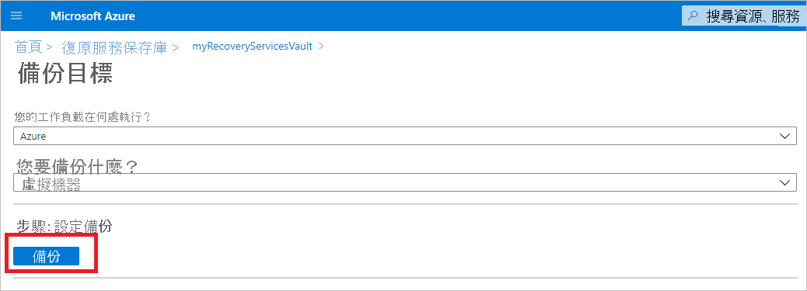
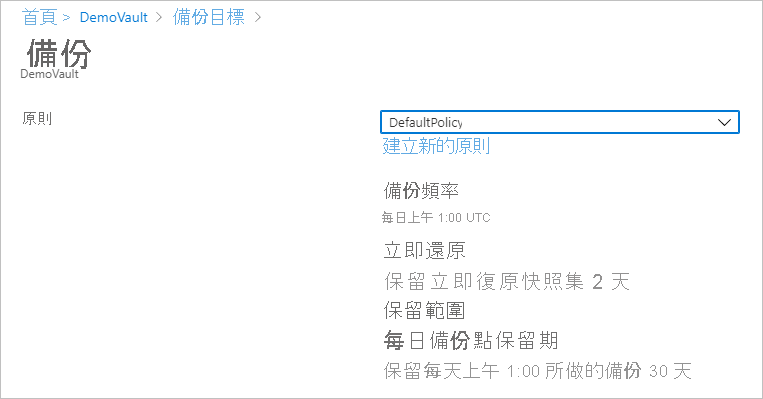
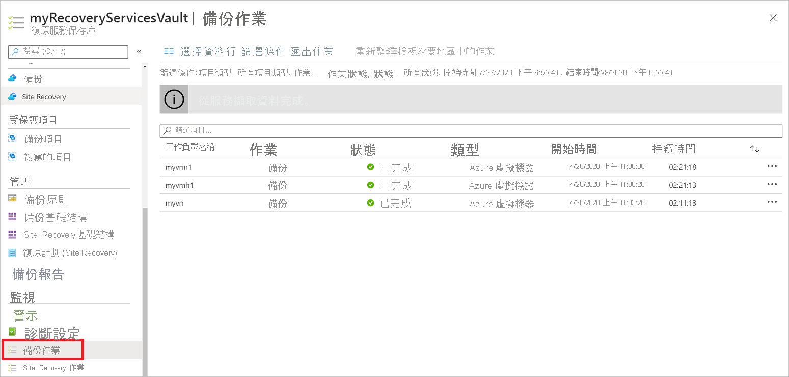
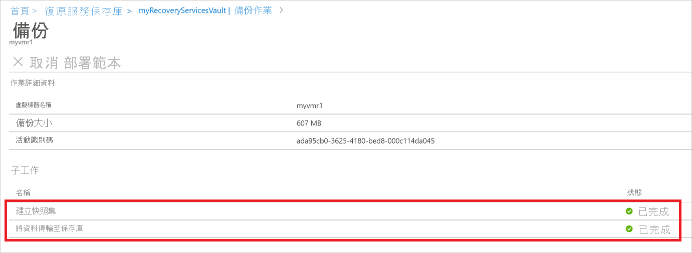

# 備份復原服務保存庫中的 Azure VM

本文介紹如何使用[Azure 備份](backup-overview.md)服務在恢復服務保存庫中備份 Azure VM。

在本文中，您將學會如何：

> [!div class="checklist"]
>
> * 準備 Azure VM。
> * 建立保存庫。
> * 發現 VM 並配置備份策略。
> * 為 Azure VM 啟用備份。
> * 執行初始備份。

> [!NOTE]
> 本文介紹如何設置保存庫並選擇要備份的 VM。 這有助於您備份多個 VM。 或者，可以直接從 VM 設置[備份單個 Azure VM。](backup-azure-vms-first-look-arm.md)

## 開始之前

* [查看](backup-architecture.md#architecture-built-in-azure-vm-backup)Azure VM 備份體系結構。
* [深入了解](backup-azure-vms-introduction.md) Azure VM 備份和備份擴充功能。
* 在配置備份之前[，請查看支援矩陣](backup-support-matrix-iaas.md)。

此外，在某些情況下，您可能需要執行幾項操作：

* **在 VM 上安裝 VM 代理**：Azure 備份通過安裝電腦上運行的 Azure VM 代理的擴展來備份 Azure VM。 如果 VM 是從 Azure 應用商店映射創建的，則代理將安裝並運行。 如果創建自訂 VM 或遷移本地電腦，則可能需要[手動安裝代理](#install-the-vm-agent)。

## 建立保存庫

 保存庫會儲存在一段時間內建立的備份和復原點，並儲存與備份的機器相關聯的備份原則。 請依照下列方式建立保存庫：

1. 登錄到 Azure[門戶](https://portal.azure.com/)。
2. 在搜索中，鍵入**恢復服務**。 在 **"服務**"下，按一下 **"恢復服務"保存庫**。

     

3. 在**恢復服務保存庫功能表中**，按一下 **"添加**"。

     

4. 在**恢復服務保存庫**中，鍵入易記名稱以標識保存庫。
    * 必須是 Azure 訂用帳戶中唯一的名稱。
    * 它可以包含 2 到 50 個字元。
    * 該名稱必須以字母開頭，而且只可以包含字母、數字和連字號。
5. 選擇應在其中創建保存庫的 Azure 訂閱、資源組和地理區域。 然後，按一下 [建立]****。
    * 建立保存庫可能需要一些時間。
    * 請監視入口網站右上方區域中的狀態通知。

創建保存庫後，它將顯示在恢復服務保存庫清單中。 如果您沒有看到保存庫，請選取 [重新整理]****。

>[!NOTE]
> Azure 備份現在允許自訂由 Azure 備份服務創建的資源組名稱。 有關詳細資訊，請參閱[虛擬機器的 Azure 備份資源組](backup-during-vm-creation.md#azure-backup-resource-group-for-virtual-machines)。

### 修改存儲複製

預設情況下，保存庫使用[異地冗余存儲 （GRS）。](https://docs.microsoft.com/azure/storage/common/storage-redundancy-grs)

* 如果保存庫是您的主要備份機制，我們建議您使用 GRS。
* 您可以使用[本地冗余存儲 （LRS）](https://docs.microsoft.com/azure/storage/common/storage-redundancy-lrs?toc=%2fazure%2fstorage%2fblobs%2ftoc.json)獲得更便宜的選項。

修改存儲複製類型，如下所示：

1. 在新保存庫中，按一下"**設置"** 部分中的 **"屬性**"。
2. 在**屬性**中，在 **"備份配置"** 下，按一下 **"更新**"。
3. 選擇存儲複製類型，然後按一下 **"保存**"。

      

> [!NOTE]
   > 設置保存庫並包含備份項後，無法修改存儲複製類型。 如果要執行此操作，則需要重新創建保存庫。

## 應用備份策略

為保存庫配置備份策略。

1. 在保存庫中，按一下 **"概述**"部分中的 **"+備份**"。

   

2. 在 **"備份目標** > "**中，工作負荷在何處運行？** 選擇**Azure**。 在"**要備份什麼"中？** 選擇 **"虛擬機器** >  **確定**"。 這會在保存庫中註冊 VM 擴充功能。

   

3. 在 [備份原則]**** 中，選取要與保存庫產生關聯的原則。
    * 預設策略每天備份 VM 一次。 每日備份將保留 30 天。 即時恢復快照將保留兩天。
    * 如果不想使用預設策略，請選擇 **"新建**"並創建自訂策略，如下一步所述。

      

4. 在 **"選擇虛擬機器"** 中，選擇要使用策略備份的 VM。 然後按一下 **[確定]**。

   * 將驗證所選 VM。
   * 您只能選取與保存庫位於相同區域中的 VM。
   * VM 只能在單一保存庫中備份。

     ![[選取虛擬機器] 窗格](./media/backup-azure-arm-vms-prepare/select-vms-to-backup.png)

5. 在 **"備份**"中，按一下 **"啟用備份**"。 這會將原則部署到保存庫和 VM，並在執行於 Azure VM 的 VM 代理程式上安裝備份擴充功能。

     ![[啟用備份] 按鈕](./media/backup-azure-arm-vms-prepare/vm-validated-click-enable.png)

啟用備份後：

* 無論 VM 是否在執行，備份服務都會安裝備份擴充功能。
* 初始備份將按照您的備份計畫運行。
* 備份運行時，請注意：
  * 正在運行的 VM 最有可能捕獲應用程式一致的復原點。
  * 但是，即使關閉 VM，也會將其備份。 此類 VM 稱為離線 VM。 在這種情況下，復原點將崩潰一致。
* 允許備份 Azure VM 不需要顯式出站連接。

### 建立自訂原則

如果選擇創建新的備份策略，請填寫策略設置。

1. 在**策略名稱**中，指定有意義的名稱。
2. 在**備份計畫中**，指定何時應執行備份。 您可以為 Azure VM 執行每日或每週備份。
3. 在 **"即時還原"** 中，指定要在本地保留快照以進行即時還原的時間。
    * 還原時，備份的 VM 磁片會通過網路從存儲複製到恢復存儲位置。 通過即時還原，您可以利用備份作業期間拍攝的本機存放區快照，而無需等待將備份資料傳輸到保存庫。
    * 您可以保留快照，以便立即還原 1 到 5 天。 兩天是預設設置。
4. 在**保留範圍內**，指定要保留每日或每週備份點的時間。
5. 在**保留每月備份點**中，指定是要保留每日備份的每月備份還是每週備份。
6. 按一下 [確定]**** 以儲存原則。

    

> [!NOTE]
   > Azure 備份在進行 Azure VM 備份時不支援依據日光節約變更而自動調整時鐘。 隨著時間的變化，根據需要手動修改備份策略。

## 觸發初始備份

初始備份將按照計畫運行，但您可以立即按如下方式運行它：

1. 在保存庫功能表中，按一下 [備份項目]****。
2. 在**備份項**中，按一下**Azure 虛擬機器**。
3. 在 **"備份專案"** 清單中，按一下省略號 （...）。
4. 按一下 [立即備份]****。
5. 在 **"立即備份"** 中，使用日曆控制項選擇應保留復原點的最後一天。 然後按一下 **[確定]**。
6. 監視入口網站通知。 您可以在保存庫儀表板>**正在進行的備份作業** > **中**監視作業進度。 根據您的 VM 大小，建立初始備份可能需要花一點時間。

## 驗證備份作業狀態

每個 VM 備份的備份作業詳細資訊由兩個階段組成，**快照**階段後跟**將資料傳輸到保存庫**階段。 
快照階段可確保與磁片一起存儲的**恢復**點的可用性，並且最多可用五天，具體取決於使用者配置的快照保留。 將資料傳輸到保存庫會在保存庫中創建一個復原點，以便長期保留。 僅在快照階段完成後開始將資料傳輸到保存庫。

  

後端運行兩個**子任務**，一個用於前端備份作業，可以從"**備份作業**詳細資訊"邊欄選項卡中檢查，如下所示：

  

**將資料傳輸到保存庫**階段可能需要數天時間才能完成，具體取決於磁片的大小、每個磁片的改動以及幾個其他因素。

作業狀態可能因以下情況而異：

**快照** | **將資料傳輸至保存庫** | **作業狀態**
--- | --- | ---
Completed | 進行中 | 進行中
Completed | 已略過 | Completed
Completed | Completed | Completed
Completed | 失敗 | 已完成警告
失敗 | 失敗 | 失敗

現在，有了此功能，對於同一 VM，兩個備份可以並行運行，但在任一階段（快照、將資料傳輸到保存庫）中，只能運行一個子任務。 因此，在這種情況下，備份作業在進行中導致第二天的備份失敗將避免與這種分離功能。 如果前一天的備份作業處於正在進行狀態，則後續一天的備份可以完成快照，而**將資料傳輸到保存庫**時可以跳過快照。
在保存庫中創建的增量復原點將捕獲在保存庫中創建的最後一個復原點中的所有改動。 對使用者沒有成本影響。

## 選擇性步驟

### 安裝 VM 代理程式

為機器上執行的 Azure VM 代理程式安裝擴充功能，以 Azure 備份來備份 Azure VM。 如果 VM 是從 Azure 應用商店映射創建的，則代理將安裝並運行。 如果創建自訂 VM 或遷移本地電腦，則可能需要手動安裝代理，如表中的總結。

**Vm** | **詳細資料**
--- | ---
**Windows** | 1.[下載並安裝](https://go.microsoft.com/fwlink/?LinkID=394789&clcid=0x409)代理 MSI 檔。   2. 在電腦上安裝具有管理員許可權。   3. 驗證安裝。 在*C：\WindowsAzure_VM*上的包中，按右鍵**WaAppAgent.exe** > **屬性**。 在 **"詳細資訊"** 選項卡上，**產品版本**應為 2.6.1198.718 或更高版本。   如果要更新代理，請確保沒有運行備份操作，然後[重新安裝代理](https://go.microsoft.com/fwlink/?LinkID=394789&clcid=0x409)。
**Linux** | 使用分發的包存儲庫的 RPM 或 DEB 包進行安裝。 這是安裝和升級 Azure Linux 代理的首選方法。 所有[認可的散發套件提供者](https://docs.microsoft.com/azure/virtual-machines/linux/endorsed-distros)都會將 Azure Linux 代理程式套件整合於本身的映像和儲存機制中。 代理程式可從 [GitHub](https://github.com/Azure/WALinuxAgent) 取得，但不建議從該處安裝。   如果要更新代理，請確保沒有運行備份操作，並更新二進位檔案。

>[!NOTE]
> **Azure 備份現在支援使用 Azure 虛擬機器備份解決方案進行選擇性磁片備份和還原。**
>
>如今，Azure 備份支援使用虛擬機器備份解決方案一起備份 VM 中的所有磁片（作業系統和資料）。 使用排除磁片功能，您可以選擇從 VM 中的許多資料磁片備份一個或多個資料磁片。 這為備份和恢復需求提供了高效且經濟高效的解決方案。 每個復原點都包含備份操作中包含的磁片的資料，這進一步允許您在還原操作期間從給定復原點復原磁碟子集。 這適用于從快照和保存庫還原。
>
>**要註冊預覽版，請寫信給我們：AskAzureBackupTeam@microsoft.com**

## 後續步驟

* 解決 Azure [VM 代理](backup-azure-troubleshoot-vm-backup-fails-snapshot-timeout.md)或[Azure VM 備份](backup-azure-vms-troubleshoot.md)的任何問題。
* [恢復](backup-azure-arm-restore-vms.md)Azure VM。
