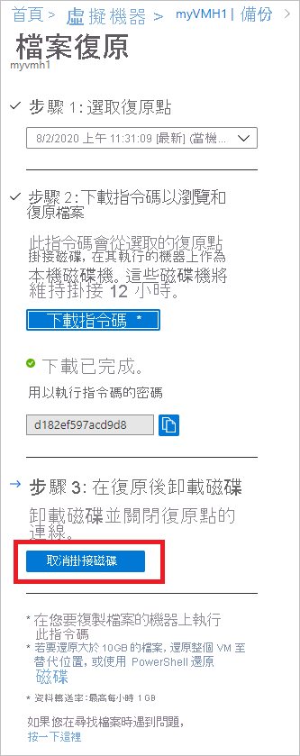

# <a name="recover-files-from-azure-virtual-machine-backup"></a>從 Azure 虛擬機器備份復原檔案

Azure 備份可從 Azure 虛擬機器 (VM) 備份 (又稱復原點) 還原 [Azure VM 和磁碟](./backup-azure-arm-restore-vms.md)。 本文說明如何從 Azure VM 備份來復原檔案和資料夾。 只有使用 Resource Manager 模型部署且受復原服務保存庫保護的 Azure VM，才能還原檔案和資料夾。

> [!NOTE]
> 這項功能適用於使用 Resource Manager 模型部署且受復原服務保存庫保護的 Azure VM。
> 不支援從加密 VM 備份的檔案復原。
>

## <a name="mount-the-volume-and-copy-files"></a>掛接磁碟區和複製檔案

若要從復原點還原檔案或資料夾，請移至虛擬機器，然後選擇所需的復原點。

1. 登入 [Azure 入口網站](https://portal.Azure.com)，按一下左窗格中的 [虛擬機器]****。 從虛擬機器的清單中，選取虛擬機器以開啟該虛擬機器的儀表板。

2. 在虛擬機器的功能表中，按一下 [備份]**** 來開啟 [備份] 儀表板。

    

3. 在 [備份] 儀表板功能表中，按一下 [檔案復原]****。

    ![[檔案復原] 按鈕](./media/backup-azure-restore-files-from-vm/vm-backup-menu-file-recovery-button.png)

    [檔案復原]**** 功能表隨即開啟。

    ![[檔案復原] 功能表](./media/backup-azure-restore-files-from-vm/file-recovery-blade.png)

4. 從 [選取復原點]**** 下拉式選單中，選取包含您所需檔案的復原點。 根據預設，已選取最近的復原點。

5. 要從復原點下載用於複製檔的軟體，請按一下 **"下載可執行檔**"（適用于 Windows Azure VM）或 **"下載腳本**"（對於 Linux Azure VM，將生成 python 腳本）。

    

    Azure 會將可執行檔或指令碼下載到本機電腦。

    

    要以管理員身份運行可執行檔或腳本，建議您將下載的檔保存到電腦。

6. 可執行檔或指令碼受到密碼保護，因此需輸入密碼。 在 [檔案復原]**** 功能表上，按一下 [複製] 按鈕以將密碼載入記憶體中。

    

7. 於下載位置中 (通常是 [下載] 資料夾)，在可執行檔或指令碼上按一下滑鼠右鍵，並以系統管理員認證來執行。 出現提示時，鍵入密碼或從記憶體中粘貼密碼，然後按**Enter**。 輸入有效的密碼後，指令碼會連線至復原點。

    ![[檔案復原] 功能表](./media/backup-azure-restore-files-from-vm/executable-output.png)

8. 對於 Linux 電腦，將生成 python 腳本。 需要下載腳本並將其複製到相關/相容的 Linux 伺服器。 您可能需要修改許可權才能使用```chmod +x <python file name>```執行它。 然後使用```./<python file name>```運行 python 檔。

請參閱[訪問要求](#access-requirements)部分以確保腳本成功運行。

### <a name="identifying-volumes"></a>識別卷

#### <a name="for-windows"></a>若為 Windows

當您執行可執行檔時，作業系統會掛接新磁碟區並指派磁碟機代號。 您可以使用 Windows 檔案總管或檔案總管來瀏覽這些磁碟機。 分配給卷的磁碟機號可能與原始虛擬機器不同。 但是，將保留卷名稱。 例如，如果原始虛擬機器上的卷是"資料磁片 （E：`\`）"，則該卷可以附加在本地電腦上為"資料磁片（"任何字母"）：`\` 流覽腳本輸出中提及的所有卷，直到找到檔或資料夾。  

   ![[檔案復原] 功能表](./media/backup-azure-restore-files-from-vm/volumes-attached.png)

#### <a name="for-linux"></a>若為 Linux

在 Linux 中，復原點的磁碟區會掛接到執行指令碼的資料夾。 連結的磁碟、磁碟區和對應的掛接路徑會相應顯示。 具有根層級存取權的使用者都看得到這些掛接路徑。 在指令碼輸出中瀏覽所述的磁碟區。

  ![Linux [檔案復原] 功能表](./media/backup-azure-restore-files-from-vm/linux-mount-paths.png)

## <a name="closing-the-connection"></a>關閉連線

在識別檔案並將它們複製到本機儲存體位置之後，移除 (或卸載) 其他磁碟機。 若要卸載磁碟機，請在 Azure 入口網站的 [檔案復原]**** 功能表中，按一下 [卸載磁碟]****。



一旦卸載磁碟後，您會收到一則訊息。 連線可能需要幾分鐘重新整理，以讓您可以移除磁碟。

在 Linux 中，復原點的連線嚴重損毀之後，作業系統並不會自動移除對應的掛接路徑。 裝載路徑作為"孤立"卷存在，並且可見，但在訪問/寫入檔時會引發錯誤。 可以手動移除它們。 指令碼執行時，會從任何先前的復原點識別任何這類現有的磁碟區，並在同意下將它們清除。

## <a name="special-configurations"></a>特殊的組態

### <a name="dynamic-disks"></a>動態磁碟

如果受保護 Azure VM 具有下列之一或兩者特性的磁碟區，則您無法在同一部 VM 上執行可執行的指令碼。

- 跨多個磁碟的磁碟區 (合併或等量磁碟區)
- 動態磁碟上的容錯磁碟區 (鏡像與 RAID-5 磁碟區)

請改為在其他具有相容作業系統的電腦上執行可執行的指令碼。

### <a name="windows-storage-spaces"></a>Windows 儲存空間

Windows 儲存空間是一種可將儲存體虛擬化的 Windows 技術。 您可以透過 Windows 儲存空間，集合一組符合業界標準的磁碟成為儲存體集區。 然後使用儲存體集區中的可用空間來建立虛擬磁碟 (稱為儲存空間)。

如果受保護 Azure VM 使用 Windows 儲存空間，則無法在同一部虛擬機器上執行可執行的指令碼。 相反地，在任何其他具有相容作業系統上的電腦執行可執行的指令碼。

### <a name="lvmraid-arrays"></a>LVM/RAID 陣列

在 Linux 中，邏輯磁碟區管理員 (LVM) 和/或軟體 RAID 陣列會用來管理多個磁碟的邏輯磁碟區。 如果受保護 Linux VM 使用 LVM 和/或 RAID 陣列，則無法在同一部虛擬機器上執行指令碼。 請改為在其他具有相容作業系統且支援受保護 VM 之檔案系統的電腦上執行指令碼。

下列指令碼輸出會顯示 LVM 和/或 RAID 陣列磁碟與磁碟區及其磁碟分割類型。

   

若要讓這些磁碟分割上線，請執行以下小節中的命令。

#### <a name="for-lvm-partitions"></a>對於 LVM 分區

要在物理卷下列出卷組名稱，可以：

```bash
#!/bin/bash
pvs <volume name as shown above in the script output>
```

要在卷組中列出所有邏輯卷、名稱及其路徑，

```bash
#!/bin/bash
lvdisplay <volume-group-name from the pvs command's results>
```

要將邏輯卷裝載到您選擇的路徑：

```bash
#!/bin/bash
mount <LV path> </mountpath>
```

#### <a name="for-raid-arrays"></a>對於 RAID 陣列

以下命令顯示有關所有突襲磁片的詳細資訊：

```bash
#!/bin/bash
mdadm –detail –scan
```

 相關的 RAID 磁碟將顯示為 `/dev/mdm/<RAID array name in the protected VM>`

如果 RAID 磁片具有物理卷，請使用裝載命令：

```bash
#!/bin/bash
mount [RAID Disk Path] [/mountpath]
```

如果 RAID 磁片配置了另一個 LVM，則對 LVM 分區使用上述過程，但使用卷名稱代替 RAID 磁片名稱。

## <a name="system-requirements"></a>系統需求

### <a name="for-windows-os"></a>若為 Windows OS

下表顯示伺服器和電腦作業系統之間的相容性。 復原檔案時，無法將檔案還原至之前或之後的作業系統版本。 例如，您無法將 Windows Server 2016 虛擬機器的檔案還原至 Windows Server 2012 或 Windows 8 電腦。 您可以將 VM 的檔案還原至相同的伺服器作業系統，或相容的用戶端作業系統。

|伺服器作業系統 | 相容的用戶端作業系統  |
| --------------- | ---- |
| Windows Server 2019    | Windows 10 |
| Windows Server 2016    | Windows 10 |
| Windows Server 2012 R2 | Windows 8.1 |
| Windows Server 2012    | Windows 8  |
| Windows Server 2008 R2 | Windows 7   |

### <a name="for-linux-os"></a>若為 Linux 作業系統

在 Linux 中，用來還原檔案的電腦作業系統必須支援受保護虛擬機器的檔案系統。 選取要執行指令碼的電腦時，請確認該電腦具有相容的作業系統，且使用下表中列出的其中一個版本：

|Linux 作業系統 | 版本  |
| --------------- | ---- |
| Ubuntu | 12.04 和更新版本 |
| CentOS | 6.5 和更新版本  |
| RHEL | 6.7 和更新版本 |
| Debian | 7 和更新版本 |
| Oracle Linux | 6.4 和更新版本 |
| SLES | 12 以上 (含) |
| openSUSE | 42.2 和更新版本 |

> [!NOTE]
> 我們發現在具有 SLES 12 SP4 作業系統的電腦上運行檔案修復腳本時存在一些問題，我們正在與 SLES 團隊一起進行調查。
> 目前，運行檔案修復腳本正在具有 SLES 12 SP2 和 SP3 作業系統版本的電腦上工作。
>

指令碼也需要 Python 和 Bash 元件，才能夠執行並安全地連線至復原點。

|元件 | 版本  |
| --------------- | ---- |
| Bash | 4 和更新版本 |
| Python | 2.6.6 和更新版本  |
| TLS | 應支援 1.2  |

## <a name="access-requirements"></a>存取需求

如果您在具有限制存取的電腦上執行指令碼，請確定可存取︰

- `download.microsoft.com`
- 復原服務 URL (geo-name 是指復原服務保存庫所在的區域)
  - `https://pod01-rec2.geo-name.backup.windowsazure.com` (適用於 Azure 公用地區)
  - `https://pod01-rec2.geo-name.backup.windowsazure.cn`（對於 Azure 中國 21Vianet）
  - `https://pod01-rec2.geo-name.backup.windowsazure.us` (適用於 Azure US Government)
  - `https://pod01-rec2.geo-name.backup.windowsazure.de` (適用於 Azure 德國)
- 出站埠 53 （DNS）， 443， 3260

> [!NOTE]
>
> - 下載的指令檔名將在 URL 中填寫**地理名**。 對於\'考試：下載的腳本名稱以 VMname\'\_\'地理名稱\'+\'GUID\'開頭，如*ContosoVM_wcus_12345678*
> - URL 將是<https://pod01-rec2.wcus.backup.windowsazure.com>"
>

若為 Linux，指令碼需要 'open-iscsi' 和 'lshw' 元件來連接到復原點。 如果運行腳本的電腦上不存在元件，則腳本請求安裝元件的許可權。 同意安裝必要的元件。

需要訪問以`download.microsoft.com`下載用於在運行腳本的電腦和復原點中的資料之間建立安全通道的元件。

您可以在任何具有與備份 VM 相的 (或相容) 作業系統的電腦上執行指令碼。 請參閱[相容作業系統資料表](backup-azure-restore-files-from-vm.md#system-requirements)以查看相容的作業系統。 如果受保護的 Azure 虛擬機器使用 Windows 儲存空間 (適用於 Windows Azure 虛擬機器) 或 LVM/RAID 陣列 (適用於 Linux 虛擬機器)，則您無法在同一部虛擬機器上執行可執行檔或指令碼。 請改為在其他具有相容作業系統的電腦上執行可執行或指令碼。

## <a name="file-recovery-from-virtual-machine-backups-having-large-disks"></a>具有大型磁片的虛擬機器備份的檔案修復

本節介紹如何從具有 16 個以上磁片的 Azure 虛擬機器的備份中執行檔案修復，並且每個磁片大小大於 32 TB。

由於檔案修復過程從備份中附加所有磁片，因此當使用大量磁片（>16）或大型磁片（每個磁片> 32 TB）時，建議執行以下操作點：

- 保留單獨的還原伺服器（Azure VM D2v3 VM）以進行檔案修復。 只能將其用於檔案修復，然後在不需要時將其關閉。 不建議在原始電腦上還原，因為它將對 VM 本身產生重大影響。
- 然後運行腳本一次，檢查檔案修復操作是否成功。
- 如果檔案修復過程掛起（磁片從未裝載或已裝載，但卷未顯示），則執行以下步驟。
  - 如果還原伺服器是 Windows VM：
    - 確保作業系統為 WS 2012 或更高版本。
    - 確保登錄機碼在還原伺服器中按以下建議設置，並確保重新開機伺服器。 GUID 旁邊的數位範圍為 0001-0005。 在下面的示例中，它是 0004。 導航註冊表鍵路徑，直到參數部分。

    

```registry
- HKEY_LOCAL_MACHINE\SYSTEM\CurrentControlSet\Services\Disk\TimeOutValue – change this from 60 to 1200
- HKEY_LOCAL_MACHINE\SYSTEM\ControlSet001\Control\Class\{4d36e97b-e325-11ce-bfc1-08002be10318}\0003\Parameters\SrbTimeoutDelta – change this from 15 to 1200
- HKEY_LOCAL_MACHINE\SYSTEM\ControlSet001\Control\Class\{4d36e97b-e325-11ce-bfc1-08002be10318}\0003\Parameters\EnableNOPOut – change this from 0 to 1
- HKEY_LOCAL_MACHINE\SYSTEM\ControlSet001\Control\Class\{4d36e97b-e325-11ce-bfc1-08002be10318}\0003\Parameters\MaxRequestHoldTime - change this from 60 to 1200
```

- 如果還原伺服器是 Linux VM：
  - 在檔 /etc/iscsi/iscsi/iscsid.conf 中，從以下更改設置：
    - 節點.conn_0_timeo.noop_out_timeout = 5 到節點.conn_0_timeo.noop_out_timeout = 30
- 進行上述更改後，再次運行腳本。 通過這些更改，檔案修復很有可能成功。
- 每次使用者下載腳本時，Azure 備份都會啟動準備下載復原點的過程。 使用大型磁片，此過程將需要相當長的時間。 如果連續出現突發請求，目標準備將進入下載螺旋。 因此，建議從門戶/Powershell/CLI 下載腳本，等待 20-30 分鐘（啟發式），然後運行它。 此時，目標應準備好從腳本進行連接。
- 檔案修復後，請確保返回門戶，然後按一下 **"卸載磁片**"，查看無法裝載卷的復原點。 從本質上講，此步驟將清除任何現有進程/會話，並增加恢復的機會。

## <a name="troubleshooting"></a>疑難排解

如果您從虛擬機器復原檔案時遇到問題，請檢查下表中的其他資訊。

| 錯誤訊息 / 案例 | 可能的原因 | 建議的動作 |
| ------------------------ | -------------- | ------------------ |
| Exe 輸出：*連接到目標時捕獲異常* | 腳本無法訪問復原點    | 檢查電腦是否滿足[以前的訪問要求](#access-requirements)。 |  
| Exe 輸出︰目標已透過 iSCSI 工作階段登入。** | 指令碼已在相同電腦上執行，並已附加磁碟機 | 復原點磁碟區已連接。 它們可能未使用原始 VM 的相同磁碟機代號裝載。 流覽檔資源管理器中的所有可用卷。 |
| Exe 輸出：*此腳本無效，因為磁片已通過門戶卸載/超過 12 小時限制。從門戶下載新腳本。* |    磁片已從門戶卸載或超過 12 小時限制 | 此特定 exe 現在無效，無法運行。 如果要訪問該復原點的檔，請訪問門戶獲取新的 exe。|
| 在運行 exe 的電腦上：按一下卸載按鈕後，新卷不會卸載 | 電腦上的 iSCSI 創建器未回應/刷新其與目標的連接並維護緩存。 |  按一下 [卸載]**** 後，請稍候幾分鐘。 如果未卸載新卷，請流覽所有卷。 流覽所有卷會強制發起器刷新連接，並且卷將卸載，並顯示磁片不可用的錯誤訊息。|
| Exe 輸出：腳本成功運行，但腳本輸出上未顯示"附加的新卷" |    這是暫時性的錯誤    | 卷已附加。 開啟檔案總管以瀏覽。 如果每次都使用同一台電腦運行腳本，請考慮重新開機電腦，並且清單應在後續的 exe 運行中顯示。 |
| Linux 特定︰無法檢視所需的磁碟區 | 執行指令碼所在電腦的作業系統可能無法辨識受保護 VM 的底層檔案系統 | 檢查復原點是崩潰一致性還是檔一致性。 如果檔一致，則在另一台電腦上運行腳本，其作業系統可識別受保護的 VM 檔案系統。 |
| Windows 特定︰無法檢視所需的磁碟區 | 磁片可能已連接，但未配置卷 | 從 [磁碟管理] 畫面上，找出與復原點相關的其他磁碟。 如果這些磁片中的任何一個處於離線狀態，請嘗試通過按右鍵磁片將其連線，然後按一下"**連線**"。|

## <a name="security"></a>安全性

本節討論為實現 Azure VM 備份的檔案修復而採取的各種安全措施。

### <a name="feature-flow"></a>功能流

此功能旨在訪問 VM 資料，而無需還原整個 VM 或 VM 磁片，並且步驟數最少。 對 VM 資料的訪問由腳本提供（腳本在運行時裝載恢復卷，如下所示），它是所有安全實現的基石：

  

### <a name="security-implementations"></a>安全實現

#### <a name="select-recovery-point-who-can-generate-script"></a>選擇復原點（誰可以生成腳本）

該腳本提供對 VM 資料的訪問，因此首先規範誰可以生成 VM 資料非常重要。 您需要登錄到 Azure 門戶，並[授權 RBAC](backup-rbac-rs-vault.md#mapping-backup-built-in-roles-to-backup-management-actions)生成腳本。

檔案修復需要與 VM 還原和磁片還原相同的授權級別。 換句話說，只有經過授權的使用者才能查看 VM 資料才能生成腳本。

生成的腳本使用 Azure 備份服務的官方 Microsoft 證書進行簽名。 對腳本的任何篡改都意味著簽名被損壞，作業系統將突出顯示任何運行腳本的嘗試都是一個潛在風險。

#### <a name="mount-recovery-volume-who-can-run-script"></a>裝載恢復卷（誰可以運行腳本）

只有管理員才能運行該腳本，並且它應該在提升模式下運行。 腳本僅運行一組預先生成的步驟，不接受來自任何外部源的輸入。

要運行腳本，需要一個密碼，該密碼僅在在 Azure 門戶或 PowerShell/CLI 生成腳本時向授權使用者顯示。 這是為了確保下載腳本的授權使用者也負責運行腳本。

#### <a name="browse-files-and-folders"></a>流覽檔和資料夾

要流覽檔和資料夾，腳本使用電腦中的 iSCSI 開始器，並連接到配置為 iSCSI 目標的復原點。 在這裡，你可以想像一個人試圖模仿/欺騙任一/所有元件的情況。

我們使用相互 CHAP 身份驗證機制，以便每個元件對另一個元件進行身份驗證。 這意味著，假開始器很難連接到 iSCSI 目標，並且假目標連接到運行腳本的電腦。

通過通過 TCP 構建安全的 TLS 隧道（運行腳本的電腦[應支援 TLS 1.2），](#system-requirements)保護恢復服務和電腦之間的資料流程。

父/備份 VM 中存在的任何檔存取控制清單 （ACL） 也保存在裝載的檔案系統中。

該腳本提供對復原點的唯讀訪問，並且僅有效 12 小時。 如果要提前刪除存取權限，請登錄到 Azure 門戶/PowerShell/CLI，並針對該特定復原點執行**卸載磁片**。 腳本將立即失效。

## <a name="next-steps"></a>後續步驟

- 有關還原檔時的任何問題，請參閱[故障排除](#troubleshooting)部分
- 瞭解如何通過[Powershell 還原檔](https://docs.microsoft.com/azure/backup/backup-azure-vms-automation#restore-files-from-an-azure-vm-backup)
- 瞭解如何通過[Azure CLI 還原檔](https://docs.microsoft.com/azure/backup/tutorial-restore-files)
- 還原 VM 後，瞭解如何[管理備份](https://docs.microsoft.com/azure/backup/backup-azure-manage-vms)
