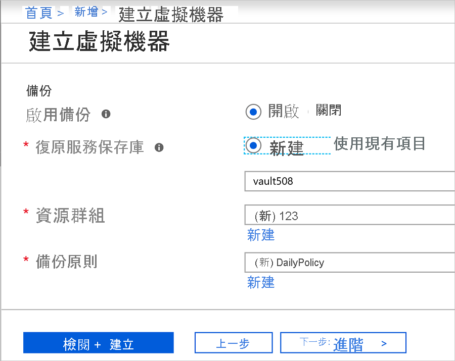
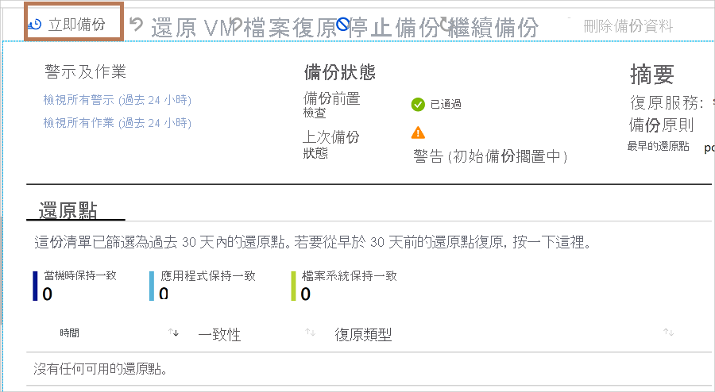

# 建立 Azure VM 時啟用備份

使用 Azure 備份服務來備份 Azure 虛擬機器（Vm）。 Vm 會根據備份原則中指定的排程進行備份，並從備份建立復原點。 復原點會儲存在復原服務保存庫中。

本文詳細說明當您在 Azure 入口網站中建立虛擬機器（VM）時，如何啟用備份。  

## 在您開始使用 Intune 之前

- 如果您在建立 VM 時啟用備份，[請檢查](backup-support-matrix-iaas.md#supported-backup-actions)支援的作業系統。

## 登入 Azure

若您尚未登入您的帳戶，請登入[Azure 入口網站](https://portal.azure.com)。

## 建立已設定備份的 VM

1. 在 Azure 入口網站中，按一下 [**建立資源**]。

2. 在 [Azure Marketplace 中，按一下 [**計算**]，然後選取 VM 映射。

3. 根據[Windows](https://docs.microsoft.com/azure/virtual-machines/windows/quick-create-portal)或[LINUX](https://docs.microsoft.com/azure/virtual-machines/linux/quick-create-portal)指示設定 VM。

4. 在 [**管理**] 索引標籤的 [**啟用備份**] 中，按一下 [**開啟**]。
5. Azure 備份復原服務保存庫的備份。 如果您沒有現有的保存庫，請按一下 [**建立新**的]。
6. 接受建議的保存庫名稱，或指定您自己的名稱。
7. 指定或建立將會在其中尋找保存庫的資源群組。 資源群組保存庫可以與 VM 資源群組不同。

    

8. 接受預設備份原則，或修改設定。
    - 備份原則會指定制作 VM 備份快照集的頻率，以及保留這些備份複本的時間長度。
    - 預設原則會每天備份一次 VM。
    - 您可以自訂您自己的備份原則，讓 Azure VM 每日或每週進行備份。
    - [深入瞭解](backup-azure-vms-introduction.md#backup-and-restore-considerations)Azure vm 的備份考慮。
    - [深入瞭解](backup-instant-restore-capability.md)立即還原功能。

      

## 虛擬機器的 Azure 備份資源群組

備份服務會建立個別的資源群組（RG），與用來儲存還原點集合（RPC）的 VM 資源群組不同。 RPC 會裝載受管理 Vm 的立即復原點。 備份服務所建立之資源群組的預設命名格式為： `AzureBackupRG_<Geo>_<number>`。 例如： *AzureBackupRG_northeurope_1*。 您現在可以自訂 Azure 備份所建立的資源組名。

注意事項：

1. 您可以使用 RG 的預設名稱，或根據您的公司需求進行編輯。
2. 在建立 VM 備份原則時，您會提供 RG 名稱模式做為輸入。 RG 名稱的格式應該如下： `<alpha-numeric string>* n <alpha-numeric string>`。 ' n ' 已取代為整數（從1開始），而且在第一個 RG 已滿時用於相應放大。 一個 RG 目前最多可以有600個 Rpc。
              
3. 此模式應遵循下列 RG 命名規則，而總長度不應超過允許的 RG 名稱長度上限。
    1. 資源組名只允許英數位元、句號、底線、連字號和括弧。 它們不能以句點結尾。
    2. 資源組名最多可以包含74個字元，包括 RG 的名稱和尾碼。
4. 第一個`<alpha-numeric-string>`是必要項，而第二個在 ' n ' 之後是選擇性的。 只有當您提供自訂名稱時，才適用這種情況。 如果您未在任一文字方塊中輸入任何內容，則會使用預設名稱。
5. 如果需要，您可以修改原則來編輯 RG 的名稱。 如果名稱模式有所變更，新的 RG 就會建立新的 RPs。 不過，舊的 RPs 仍然會位於舊的 RG 中，而且不會移動，因為 RP 集合不支援資源移動。 最後，RPs 會在點過期時進行垃圾收集。

6. 建議不要鎖定為備份服務所建立的資源群組。

若要使用 PowerShell 設定虛擬機器的 Azure 備份資源群組，請參閱[在快照集保留期間建立 Azure 備份資源群組](backup-azure-vms-automation.md#creating-azure-backup-resource-group-during-snapshot-retention)。

## 建立 VM 之後啟動備份

您的 VM 備份將會根據您的備份原則來執行。 不過，我們建議您執行初始備份。

建立 VM 之後，請執行下列動作：

1. 在 VM 屬性中，按一下 [**備份**]。 VM 狀態是初始備份擱置中，直到初始備份執行為止
2. 按一下 [**立即備份**] 以執行隨選備份。

    

## 使用 Resource Manager 範本部署受保護的 VM

先前的步驟說明如何使用 Azure 入口網站來建立虛擬機器，並在復原服務保存庫中加以保護。 若要快速部署一或多個 Vm，並在復原服務保存庫中加以保護，請參閱[部署 WINDOWS VM 和啟用備份](https://azure.microsoft.com/resources/templates/101-recovery-services-create-vm-and-configure-backup/)的範本。

## 後續步驟

既然您已保護您的 VM，請瞭解如何管理和還原它。

- [管理和監視 VM](backup-azure-manage-vms.md)
- [還原 VM](backup-azure-arm-restore-vms.md)

如果您遇到任何問題，請[參閱](backup-azure-vms-troubleshoot.md)疑難排解指南。
