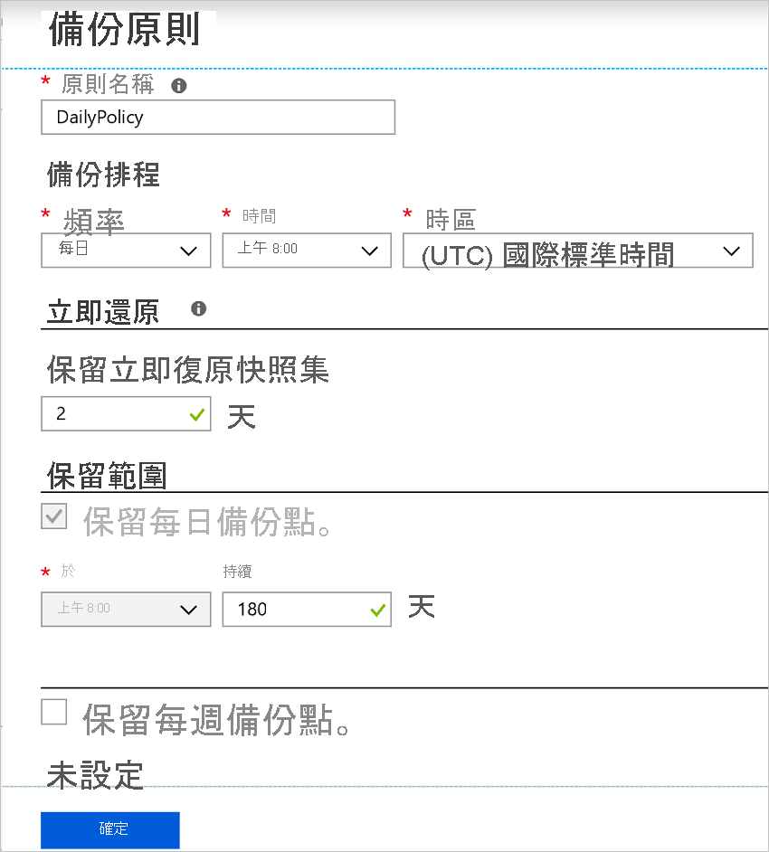
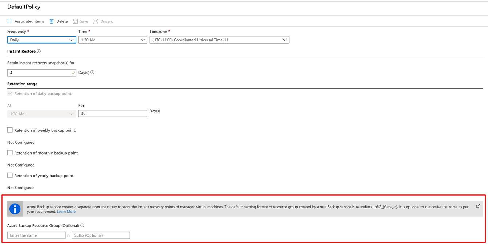

# 建立 Azure VM 時啟用備份

使用 Azure 備份服務備份 Azure 虛擬機器 （VM）。 VM 將根據備份策略中指定的計畫進行備份，並且從備份創建復原點。 復原點存儲在恢復服務保存庫中。

本文詳細介紹了在 Azure 門戶中創建虛擬機器 （VM） 時如何啟用備份。  

## 開始之前

- [如果在](backup-support-matrix-iaas.md#supported-backup-actions)創建 VM 時啟用備份，請檢查支援哪些作業系統。

## 登入 Azure

如果尚未登錄到您的帳戶，請登錄到[Azure 門戶](https://portal.azure.com)。

## 創建配置備份的 VM

1. 在 Azure 門戶中，按一下"**創建資源**"。

2. 在 Azure 應用商店中，按一下 **"計算**"，然後選擇 VM 映射。

3. 根據[Windows](https://docs.microsoft.com/azure/virtual-machines/windows/quick-create-portal)或[Linux](https://docs.microsoft.com/azure/virtual-machines/linux/quick-create-portal)說明設置 VM。

4. 在 **"管理**"選項卡上，在**啟用備份**中，按一下 **"打開**"。
5. Azure 備份到恢復服務保存庫。 如果沒有現有保存庫，請按一下"**新建**"。
6. 接受建議的保存庫名稱或指定您自己的保存庫名稱。
7. 指定或創建保存庫所在的資源組。 資源組保存庫可以不同于 VM 資源組。

    

8. 接受預設備份策略，或修改設置。
    - 備份策略指定獲取 VM 的備份快照的頻率，以及保留這些備份副本的時間。
    - 預設策略每天備份 VM 一次。
    - 您可以為 Azure VM 自訂自己的備份策略，以便每天或每週進行備份。
    - [詳細瞭解](backup-azure-vms-introduction.md#backup-and-restore-considerations)Azure VM 的備份注意事項。
    - [瞭解有關](backup-instant-restore-capability.md)即時還原功能的更多詳細資訊。

      

## 虛擬機器的 Azure 備份資源組

備份服務創建一個單獨的資源組 （RG），與 VM 的資源組不同，用於存儲還原點集合 （RPC）。 RPC 存放託管 VM 的即時復原點。 備份服務創建的資源組的預設命名格式為： `AzureBackupRG_<Geo>_<number>`。 例如 *：AzureBackupRG_northeurope_1*。 現在，您可以自訂 Azure 備份創建的資源組名稱。

注意事項：

1. 您可以使用 RG 的預設名稱，也可以根據公司要求對其進行編輯。
2. 在 VM 備份策略創建期間，您將 RG 名稱模式作為輸入提供。 RG 名稱應為以下格式： `<alpha-numeric string>* n <alpha-numeric string>`。 "n"替換為整數（從 1 開始），如果第一個 RG 已滿，則用於向外擴展。 一個 RG 目前最多可具有 600 個 RPC。
              
3. 模式應遵循下面的 RG 命名規則，總長度不應超過允許的最大 RG 名稱長度。
    1. 資源組名稱僅允許字母數位字元、句點、底線、連字號和括弧。 它們不能在一個時期結束。
    2. 資源組名稱最多可以包含 74 個字元，包括 RG 的名稱和尾碼。
4. 第一`<alpha-numeric-string>`個是強制性的，而第二個在"n"之後是可選的。 這僅適用于您提供自訂名稱時。 如果未在任一文字方塊中輸入任何內容，則使用預設名稱。
5. 如果需要，可以通過修改策略來編輯 RG 的名稱。 如果更改名稱模式，將在新的 RG 中創建新的 RP。 但是，舊的 RP 仍將駐留在舊的 RG 中，並且不會移動，因為 RP 集合不支援資源移動。 最終，AP 將在積分過期時收集垃圾。

6. 建議不要鎖定為備份服務創建的資源組。

## 創建 VM 後啟動備份

您的 VM 備份將按照備份策略運行。 但是，我們建議您運行初始備份。

創建 VM 後，執行以下操作：

1. 在 VM 屬性中，按一下 **"備份**"。 在初始備份運行之前，VM 狀態為初始備份掛起狀態
2. 按一下"**立即備份**"以運行按需備份。

    

## 使用資源管理器範本部署受保護的 VM

前面的步驟說明了如何使用 Azure 門戶創建虛擬機器並在恢復服務保存庫中保護它。 要快速部署一個或多個 VM 並在恢復服務保存庫中保護它們，請參閱[範本"部署 Windows VM 並啟用備份](https://azure.microsoft.com/resources/templates/101-recovery-services-create-vm-and-configure-backup/)"。

## 後續步驟

現在，您已經保護了 VM，請瞭解如何管理和還原它們。

- [管理和監視 VM](backup-azure-manage-vms.md)
- [還原 VM](backup-azure-arm-restore-vms.md)

如果遇到任何問題，[請查看](backup-azure-vms-troubleshoot.md)故障排除指南。
