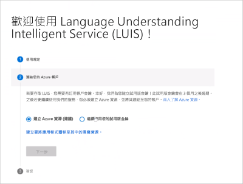

# <a name="using-authoring-and-runtime-resource-keys"></a>使用創作和運行時資源鍵

創作和運行時資源為 LUIS 應用和預測終結點提供身份驗證。

<a name="create-luis-service"></a>
<a name="create-language-understanding-endpoint-key-in-the-azure-portal"></a>

當您登錄到 LUIS 門戶時，您可以選擇繼續：

* 免費[試用金鑰](#trial-key)- 提供創作和幾個預測終結點查詢。
* Azure [LUIS 創作](https://ms.portal.azure.com/#create/Microsoft.CognitiveServicesLUISAllInOne)資源。 


<a name="starter-key"></a>

## <a name="sign-in-to-luis-portal-and-begin-authoring"></a>登錄到 LUIS 門戶並開始創作

1. 登錄到[LUIS 門戶](https://www.luis.ai)並同意使用條款。
1. 通過選擇要使用的 LUIS 創作金鑰類型：免費試用金鑰或新的 Azure LUIS 創作金鑰來開始您的 LUIS 應用。 

    

1. 完成資源選擇過程後，[創建新應用](luis-how-to-start-new-app.md#create-new-app-in-luis)。 

## <a name="trial-key"></a>試用金鑰

試用（啟動器）金鑰是為您提供的。 它用作身份驗證金鑰來查詢預測終結點運行時，每月最多 1000 個查詢。 

它在 LUIS 門戶中的 **"使用者設置"** 頁和管理 **-> Azure 資源**頁上都可見。 

準備好發佈預測終結點時，請創建和分配創作和預測運行時鍵，以替換啟動鍵功能。 

## <a name="create-resources-in-the-azure-portal"></a>在 Azure 門戶中創建資源

1. [使用此連結](https://ms.portal.azure.com/#create/Microsoft.CognitiveServicesLUISAllInOne)可以打開 Azure 門戶以進行資源創建。
1. 選擇 **"兩者"** 可創建創作和預測終結點運行時金鑰。 
1. 輸入創建資源所需的資訊，然後選擇 **"創建**"以完成該過程。

    

    |名稱|目的|
    |--|--|
    |資源名稱| 您選擇的自訂名稱，用作創作和預測終結點查詢 URL 的一部分。|
    |訂閱名稱| 將為資源計費的訂閱。|
    |資源群組| 您選擇的自訂資源組名稱。 資源組允許您對 Azure 資源進行分組，以便在同一區域中進行訪問和管理。|
    |製作位置|與您的模型關聯的區域。|
    |製作定價層|定價層確定每秒和每月的最大交易記錄。|
    |執行階段位置|與已發佈預測終結點運行時關聯的區域。|
    |執行階段定價層|定價層確定每秒和每月的最大交易記錄。|

    創建兩個資源後，在 LUIS 門戶中分配資源。

## <a name="create-resources-in-azure-cli"></a>在 Azure CLI 中創建資源

使用[Azure CLI](https://docs.microsoft.com/cli/azure/install-azure-cli?view=azure-cli-latest)單獨創建每個資源。 

資源`kind`：

* 創作：`LUIS.Authoring`
* 預測：`LUIS` 

1. 登錄到 Azure CLI：

    ```azurecli
    az login
    ```

    這將打開一個瀏覽器，允許您選擇正確的帳戶並提供身份驗證。

1. 創建一個**LUIS 創作資源** `LUIS.Authoring`，類型`my-luis-authoring-resource`，在為`westus`區域命名的`my-resource-group`_現有資源_組中命名。 

    ```azurecli
    az cognitiveservices account create -n my-luis-authoring-resource -g my-resource-group --kind LUIS.Authoring --sku F0 -l westus --yes
    ```

1. 創建一個**LUIS 預測終結點資源**，類型`LUIS`，在為`my-luis-prediction-resource``westus`區域命名的`my-resource-group`_現有資源_組中命名。 如果希望輸送量高於可用層，請改為`F0`。 `S0` 詳細瞭解[定價層和輸送量](luis-boundaries.md#key-limits)。

    ```azurecli
    az cognitiveservices account create -n my-luis-prediction-resource -g my-resource-group --kind LUIS --sku F0 -l westus --yes
    ```

    > [!Note] 
    > 在**管理-> Azure 資源的**LUIS 門戶中分配這些金鑰之前，LUIS 門戶**不會**使用此金鑰。

## <a name="assign-an-authoring-resource-in-the-luis-portal-for-all-apps"></a>為所有應用在 LUIS 門戶中分配創作資源

您可以為單個應用或 LUIS 中的所有應用分配創作資源。 以下過程將所有應用分配給單個創作資源。

1. 登入 [LUIS 入口網站](https://www.luis.ai)。
1. 在頂部巡覽列，在最右邊，選擇您的使用者帳戶，然後選擇 **"設置**"。
1. 在"**使用者設置"** 頁上，選擇 **"添加創作資源"，** 然後選擇現有的創作資源。 選取 [儲存]****。 

## <a name="assign-a-resource-to-an-app"></a>將資源配置給應用

您可以將單個資源（創作或預測終結點運行時）分配給具有以下過程的應用。

1. 登錄到 LUIS[門戶](https://www.luis.ai)，然後從 **"我的應用"** 清單中選擇一個應用。
1. 導航到 **"管理-> Azure 資源**"頁。

    

1. 選擇"預測或創作資源"選項卡，然後選擇"**添加預測資源**"或 **"添加創作資源**"按鈕。 
1. 選擇表單中的欄位以查找正確的資源，然後選擇 **"保存**"。  

### <a name="assign-runtime-resource-without-using-luis-portal"></a>無需使用 LUIS 門戶即可分配運行時資源

出於自動化目的（如 CI/CD 管道），您可能希望自動將 LUIS 運行時資源配置給 LUIS 應用。 為此，您必須執行下列步驟：

1. 從這個[網站](https://resources.azure.com/api/token?plaintext=true)取得 Azure Resource Manager 權杖。 此權杖有使用期限，因此請立即使用。 要求會傳回 Azure Resource Manager 權杖。

    

1. 使用權杖從使用者帳戶有權訪問的[獲取 LUIS Azure 帳戶 API](https://westus.dev.cognitive.microsoft.com/docs/services/5890b47c39e2bb17b84a55ff/operations/5be313cec181ae720aa2b26c)請求跨訂閱的 LUIS 運行時資源。 

    此 POST API 需要下列設定︰

    |頁首|值|
    |--|--|
    |`Authorization`|`Authorization` 的值為 `Bearer {token}`。 請注意，權杖值的開頭必須加上 `Bearer` 一字和空格。| 
    |`Ocp-Apim-Subscription-Key`|您的撰寫金鑰。|

    此 API 會傳回您 LUIS 訂用帳戶的 JSON 物件陣列，其中包含訂用帳戶識別碼、資源群組和資源名稱 (傳回作為帳戶名稱)。 請在此陣列中找出要指派給 LUIS 應用程式的 LUIS 資源項目。 

1. 使用[將 LUIS Azure 帳戶指派給應用程式](https://westus.dev.cognitive.microsoft.com/docs/services/5890b47c39e2bb17b84a55ff/operations/5be32228e8473de116325515) API，將權杖指派給 LUIS 資源。 

    此 POST API 需要下列設定︰

    |類型|設定|值|
    |--|--|--|
    |頁首|`Authorization`|`Authorization` 的值為 `Bearer {token}`。 請注意，權杖值的開頭必須加上 `Bearer` 一字和空格。|
    |頁首|`Ocp-Apim-Subscription-Key`|您的撰寫金鑰。|
    |頁首|`Content-type`|`application/json`|
    |Querystring|`appid`|LUIS 應用程式識別碼。 
    |body||{"AzureSubscriptionId":"ddda2925-af7f-4b05-9ba1-2155c5fe8a8e",<br>"ResourceGroup": "resourcegroup-2",<br>"AccountName": "luis-uswest-S0-2"}|

    此 API 成功執行時，會傳回「201 - 已建立」狀態。 

## <a name="unassign-resource"></a>取消指派資源

1. 登錄到 LUIS[門戶](https://www.luis.ai)，然後從 **"我的應用"** 清單中選擇一個應用。
1. 導航到 **"管理-> Azure 資源**"頁。
1. 選擇"預測或創作資源"選項卡，然後為資源選擇 **"取消分配資源**"按鈕。 

取消分配資源時，不會從 Azure 中刪除它。 只會從 LUIS 取消連結。 

## <a name="reset-authoring-key"></a>重設撰寫金鑰

**對於[創作資源遷移](luis-migration-authoring.md)的應用**：如果創作金鑰被洩露，請重置該創作資源的 **"金鑰"** 頁上的 Azure 門戶中的金鑰。 

**對於尚未遷移的應用**：在 LUIS 門戶中的所有應用上重置金鑰。 如果通過創作 API 創作應用，則需要將 Ocp-Apim-訂閱金鑰的值更改為新金鑰。

## <a name="regenerate-azure-key"></a>重新生成 Azure 鍵

從"**金鑰"** 頁上的 Azure 門戶重新生成 Azure 鍵。

## <a name="delete-account"></a>刪除帳戶

如需刪除帳戶時會刪除哪些資料的相關資訊，請參閱[資料儲存和移除](luis-concept-data-storage.md#accounts)。

## <a name="change-pricing-tier"></a>變更定價層

1.  在 [Azure](https://portal.azure.com) 中，尋找您的 LUIS 訂用帳戶。 選取 LUIS 訂用帳戶。
    
1.  選取 [定價層]**** 以查看可用的定價層。 
    
1.  選取定價層，然後選取 [選取]**** 以儲存變更。 
    
1.  定價變更完成時，快顯視窗會確認新的定價層。 
    
1. 請記得在 [發佈]**** 頁面上[指派此端點金鑰](#assign-a-resource-to-an-app)，然後將它使用於所有端點查詢。 

## <a name="viewing-azure-resource-metrics"></a>查看 Azure 資源指標

### <a name="viewing-azure-resource-summary-usage"></a>查看 Azure 資源摘要使用方式
您可以在 Azure 中檢視 LUIS 使用量資訊。 [概觀]**** 頁面會顯示近期摘要資訊，包括呼叫和錯誤。 如果您提出 LUIS 端點要求，然後立即觀看 [概觀] 頁面****，允許使用量最多在五分鐘內出現。


### <a name="customizing-azure-resource-usage-charts"></a>自訂 Azure 資源使用方式圖表
計量會提供資料的更詳細檢視。


您可以設定時間週期和計量類型的計量圖表。 


### <a name="total-transactions-threshold-alert"></a>交易總數閾值警示
如果您想要知道何時達到特定交易閾值 (例如 10,000 筆交易) 時，可以建立警示。 


為一段時間的**呼叫總數**計量新增計量警示。 新增應收到警示的所有人員電子郵件地址。 為應收到警示的所有系統新增 Webhook。 您也可以在警示觸發時執行邏輯應用程式。 

## <a name="next-steps"></a>後續步驟

* [瞭解如何使用版本](luis-how-to-manage-versions.md)來控制應用生命週期。
* 瞭解包括編寫[資源](luis-concept-keys.md#authoring-key)以及[該資源貢獻者在內的](luis-concept-keys.md#contributions-from-other-authors)概念。
* [瞭解如何創建](luis-how-to-azure-subscription.md)創作和運行時資源
* 遷移到新的[創作資源](luis-migration-authoring.md) 
